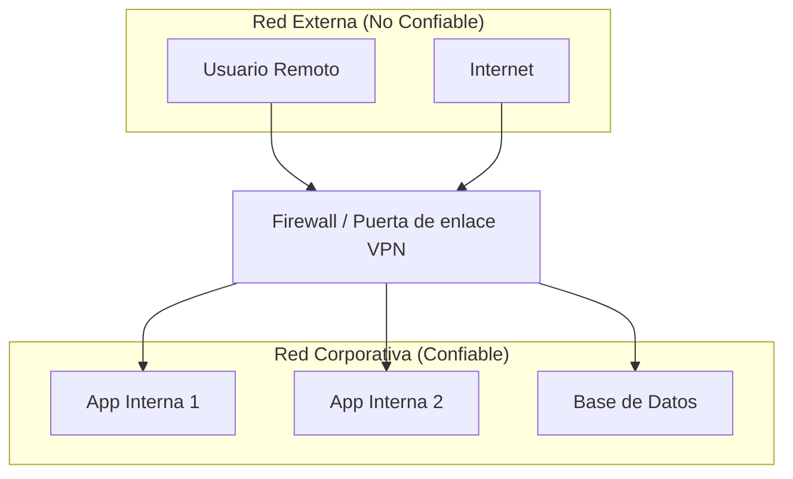
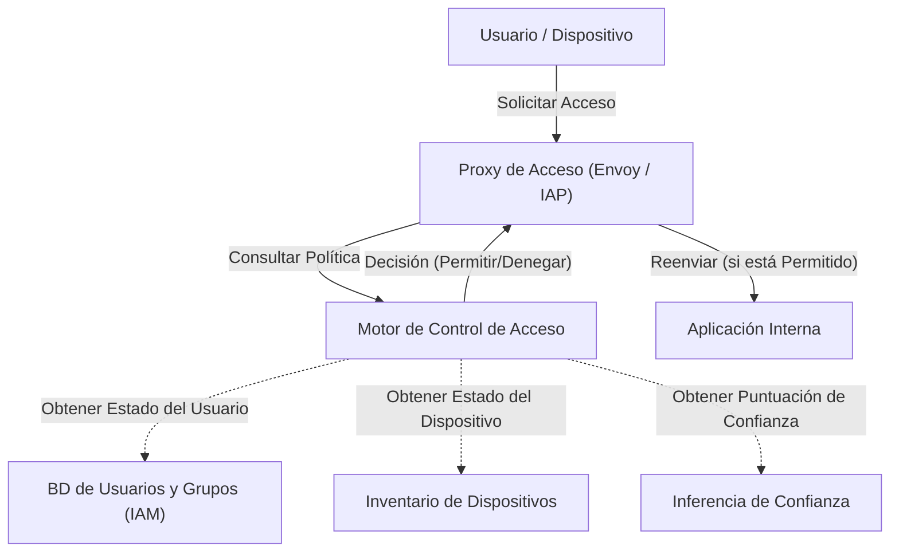

En las redes empresariales modernas, el concepto de ciberseguridad está experimentando un punto de inflexión dramático. En este artículo, utilizando la iniciativa **BeyondCorp** de Google como ejemplo, explicaremos con gran detalle la esencia de escapar de la defensa perimetral y la **arquitectura de red Zero Trust**.

## 1. Los límites y el colapso de la defensa perimetral tradicional

En el pasado, la infraestructura de TI corporativa se diseñaba basándose en el simple dualismo de "adentro" y "afuera". Esto es la **defensa perimetral** (Perimeter Security).

### 1.1 Modelo básico de la defensa perimetral
En la defensa perimetral, se construye un muro sólido entre la red interna (adentro seguro) e Internet (afuera peligroso) utilizando equipos de seguridad como firewalls, VPNs, e IPS/IDS. En principio, los usuarios y dispositivos que pueden atravesar este muro se consideran "confiables" y se les permite el acceso a diversos recursos dentro de la red corporativa.



### 1.2 El contexto detrás de llegar al límite
Sin embargo, con la popularización de la computación en la nube, la normalización del trabajo remoto y la expansión del uso de aplicaciones SaaS, este modelo se está desmoronando.

1. **Desdibujamiento del perímetro**: Los datos y las aplicaciones ya no se ubican únicamente en los centros de datos locales, sino que ahora se distribuyen en múltiples entornos en la nube. Se ha vuelto difícil definir claramente dónde está el "perímetro" que debe ser protegido.
2. **Agravamiento de las amenazas internas**: Es ineficaz contra atacantes (malware o empleados malintencionados) que ya se han infiltrado en el interior. Existe el riesgo de que el daño se vuelva inmenso debido al movimiento lateral (expansión lateral).
3. **Problemas de rendimiento y seguridad de las VPN**: El método de enrutar todo el tráfico hacia la red interna a través de una VPN causa cuellos de botella en el ancho de banda y latencia, deteriorando significativamente la experiencia del usuario.

## 2. Definición de Zero Trust (NIST SP 800-207)

Zero Trust no es simplemente un producto o tecnología, sino un concepto de seguridad y un marco arquitectónico. La publicación **NIST SP 800-207**, emitida por el Instituto Nacional de Estándares y Tecnología de EE. UU. (NIST), proporciona una definición estándar de Zero Trust.

El principio básico de Zero Trust es "**Never Trust, Always Verify**" (Nunca confíes, verifica siempre). Independientemente de la ubicación en la red (interna o externa), no se confía en nada por defecto.

### Los 7 principios básicos en NIST SP 800-207
1. **Considerar todas las fuentes de datos y servicios de computación como recursos.**
2. **Proteger toda comunicación independientemente de la ubicación de la red.**
3. **El acceso a los recursos empresariales individuales se otorga por sesión.**
4. **El acceso a los recursos se determina mediante una política dinámica, la cual incluye la identidad del cliente, la aplicación, el estado del activo solicitado y otros atributos ambientales y de comportamiento.**
5. **Monitorear y medir la integridad y el estado de seguridad de todos los activos propios y asociados.**
6. **La autenticación y autorización de todos los recursos se realiza dinámicamente y se aplica estrictamente antes de permitir el acceso.**
7. **Recopilar la mayor cantidad de información posible sobre el estado actual de los activos, la infraestructura de red y las comunicaciones para mejorar las medidas de seguridad.**

## 3. Google BeyondCorp: La materialización de Zero Trust

Google revisó fundamentalmente la arquitectura de su red interna después de un ciberataque a gran escala en 2009 llamado Operation Aurora. El resultado de esto fue la creación de **BeyondCorp**.

BeyondCorp abolió la red corporativa privilegiada y trasladó el control de acceso del "perímetro de la red" a los "usuarios y dispositivos individuales".

### 3.1 Arquitectura de BeyondCorp

El siguiente diagrama de Mermaid muestra el flujo básico de control de acceso en BeyondCorp.



### 3.2 Detalles de los componentes

* **Access Proxy**: Es el proxy inverso que actúa como puerta de entrada a todas las aplicaciones. Realiza la terminación TLS, el balanceo de carga y, lo más importante, la aplicación (Enforcement) del control de acceso.
* **Device Inventory**: Es una base de datos de todos los dispositivos administrados por la empresa. Recopila y administra continuamente información como certificados, versiones del sistema operativo, estado de la aplicación de parches y presencia de cifrado de disco.
* **User and Group Database (IAM)**: Administra información como identidades de usuarios, grupos a los que pertenecen y roles. Proporciona una autenticación sólida (como MFA) utilizando SAML u [OIDC](https://kenji.blog/es/p/oauth2-oidc-authentication-authorization-difference/).
* **Trust Inferer**: Analiza en tiempo real los datos del inventario del dispositivo y la información de contexto del usuario para calcular la "puntuación de confianza" actual.
* **Access Control Engine**: Es un motor de políticas que recibe solicitudes del Access Proxy y decide si permite o deniega el acceso comparando al usuario solicitante, el nivel de confianza del dispositivo y los requisitos de recursos de la aplicación de destino.

## 4. Evaluación de confianza y modelo de cálculo de la puntuación de riesgo

En Zero Trust, la decisión de permitir el acceso no se basa en reglas estáticas, sino en puntuaciones de riesgo dinámicas.

La puntuación de riesgo general $Risk(U, D, R)$ cuando el usuario $U$ y el dispositivo $D$ acceden al recurso $R$ se puede definir como una función de varios factores.

$ Risk(U, D, R) = w_1 \cdot P_{user}(U) + w_2 \cdot P_{device}(D) + w_3 \cdot P_{context}(C) $

Donde:
* $P_{user}(U)$ es el perfil de riesgo del usuario (fuerza de autenticación, presencia de MFA, comportamientos sospechosos pasados, etc.).
* $P_{device}(D)$ es el perfil de riesgo del dispositivo (vulnerabilidades del SO, sospecha de infección por malware, validez de certificados, etc.).
* $P_{context}(C)$ es el riesgo de contexto (dirección IP de origen, zona horaria, geolocalización, etc.).
* $w_i$ son los coeficientes de ponderación de cada factor ($\sum w_i = 1$).

La confianza $Trust$ se expresa como el inverso del riesgo, o un valor obtenido al restar el riesgo de un umbral determinado.
Por ejemplo, la condición para permitir el acceso puede formularse de la siguiente manera:

$ Trust(U, D, R) = 1 - Risk(U, D, R) \geq Threshold(R) $

Aquí, $Threshold(R)$ es el nivel de confianza requerido establecido en función de la sensibilidad del recurso de destino $R$. Se establece un umbral más alto para el acceso a datos financieros altamente confidenciales.

## 5. El papel de la microsegmentación

Otro elemento indispensable en la construcción de una red Zero Trust es la **microsegmentación**.

Controla la comunicación de forma mucho más detallada que la segmentación de red tradicional basada en VLAN, ya sea por carga de trabajo, por aplicación o por proceso. De esta manera, incluso si un componente se ve comprometido, el movimiento lateral hacia otros componentes se puede minimizar.

Utilizando redes definidas por software (SDN) o firewalls basados en identidad, define estrictamente las políticas de comunicación (quién puede comunicarse con quién, y en qué puerto/protocolo) entre cada componente, bloqueando completamente las rutas de comunicación innecesarias.

## 6. Ejemplo de implementación: Políticas IAM y configuración del proxy

Aquí mostramos ejemplos específicos de conceptos de configuración para implementar una arquitectura Zero Trust.

### 6.1 Ejemplo JSON de política IAM (Estilo AWS IAM)

El siguiente JSON es un ejemplo de política que permite el acceso a un recurso específico solo a los usuarios que acceden desde un rango de direcciones IP específico y están autenticados con MFA. En Zero Trust, estas condiciones basadas en el contexto se configuran minuciosamente.

```json
{
  "Version": "2012-10-17",
  "Statement": [
    {
      "Sid": "ZeroTrustAccessPolicyExample",
      "Effect": "Allow",
      "Action": [
        "s3:GetObject",
        "s3:ListBucket"
      ],
      "Resource": [
        "arn:aws:s3:::corporate-confidential-data",
        "arn:aws:s3:::corporate-confidential-data/*"
      ],
      "Condition": {
        "IpAddress": {
          "aws:SourceIp": "192.0.2.0/24"
        },
        "Bool": {
          "aws:MultiFactorAuthPresent": "true"
        },
        "NumericGreaterThan": {
          "custom:DeviceTrustScore": "80"
        }
      }
    }
  ]
}
```
*(Nota: `custom:DeviceTrustScore` es una clave de condición personalizada conceptual.)*

### 6.2 Ejemplo conceptual de control de acceso usando el proxy Envoy

Envoy, que funciona como Access Proxy, implementa el control de acceso en coordinación con un servicio externo de autenticación y autorización (ExtAuthz).

```yaml
# Ejemplo de fragmento de configuración de la cadena de filtros de Envoy
filters:
  - name: envoy.filters.network.http_connection_manager
    typed_config:
      "@type": type.googleapis.com/envoy.extensions.filters.network.http_connection_manager.v3.HttpConnectionManager
      route_config:
        name: local_route
        virtual_hosts:
          - name: backend_service
            domains: ["*"]
            routes:
              - match: { prefix: "/" }
                route: { cluster: backend_app_cluster }
      http_filters:
        - name: envoy.filters.http.ext_authz
          typed_config:
            "@type": type.googleapis.com/envoy.extensions.filters.http.ext_authz.v3.ExtAuthz
            grpc_service:
              envoy_grpc:
                cluster_name: access_control_engine_cluster
              timeout: 0.5s
            transport_api_version: V3
            metadata_context_namespaces:
              - "envoy.filters.http.jwt_authn"
        - name: envoy.filters.http.router
```

Con esta configuración, antes de enrutar cualquier solicitud HTTP, Envoy envía los metadatos de la solicitud a `access_control_engine_cluster` (motor de control de acceso) para consultar si se autoriza o no.

## Conclusión

La transición a una arquitectura de red Zero Trust no es algo que se complete de la noche a la mañana. Es un esfuerzo a largo plazo que requiere integración con sistemas heredados existentes, transformación de la cultura organizacional y monitoreo y ajuste continuos.

Sin embargo, como demuestra **BeyondCorp** de Google, al implementar un control de acceso basado en "identidad y contexto" en lugar de "ubicación de la red", se hace posible construir una base de seguridad más resiliente y flexible contra las amenazas diversificadas en la era de la nube.
