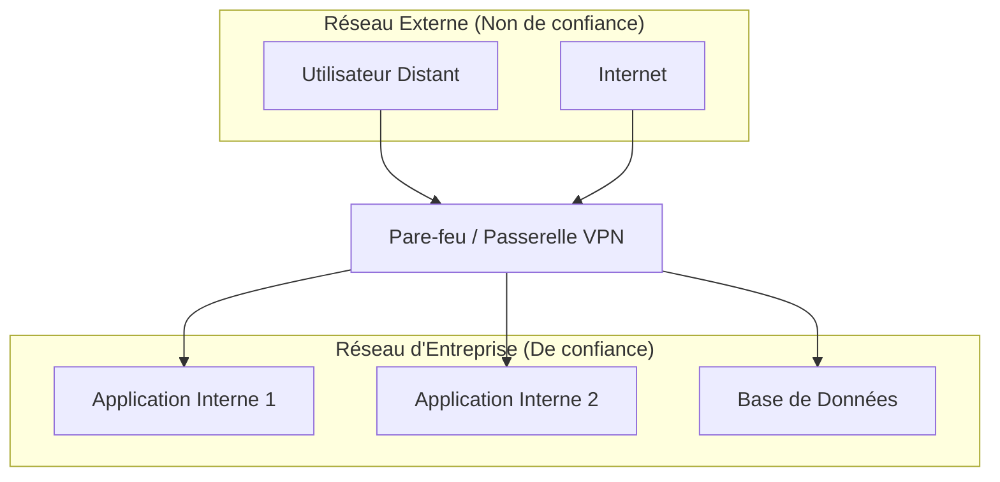
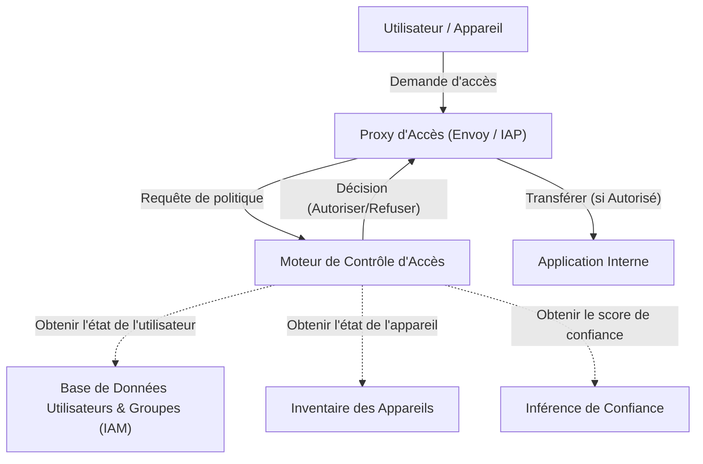

Dans les réseaux d'entreprise modernes, le concept de cybersécurité connaît un tournant majeur. Cet article explique en détail l'essence de l' **architecture réseau Zero Trust** et comment s'affranchir de la défense périmétrique, en prenant comme exemple l'initiative **BeyondCorp** de Google.

## 1. Les limites et l'effondrement de la défense périmétrique traditionnelle

Autrefois, l'infrastructure informatique des entreprises était conçue selon une simple dichotomie entre l'« intérieur » et l'« extérieur ». C'est ce qu'on appelle la **défense périmétrique** (Perimeter Security).

### 1.1 Le modèle de base de la défense périmétrique
Dans la défense périmétrique, des équipements de sécurité tels que des pare-feu, des VPN et des IPS/IDS sont utilisés pour construire un mur solide entre le réseau de l'entreprise (l'intérieur sûr) et Internet (l'extérieur dangereux). Les utilisateurs et les appareils qui parviennent à franchir ce mur sont, en principe, considérés comme « dignes de confiance » et sont autorisés à accéder à diverses ressources au sein du réseau de l'entreprise.



### 1.2 Le contexte ayant mené à ces limites
Cependant, avec la démocratisation du cloud computing, la normalisation du télétravail et l'utilisation croissante des applications SaaS, ce modèle est en train de s'effondrer.

1. **Flou des frontières** : Les données et les applications ne sont plus seulement hébergées dans des centres de données sur site, mais sont réparties sur plusieurs environnements cloud. Il devient difficile de définir clairement où se trouve la « frontière » à protéger.
2. **Aggravation des menaces internes** : Ce modèle est impuissant face aux attaquants (logiciels malveillants ou acteurs internes malveillants) qui ont déjà pénétré à l'intérieur. Le mouvement latéral augmente le risque de dégâts considérables.
3. **Problèmes de performance et de sécurité des VPN** : La méthode consistant à acheminer tout le trafic vers le réseau d'entreprise via un VPN entraîne une congestion de la bande passante et des latences, détériorant considérablement l'expérience utilisateur.

## 2. Définition du Zero Trust (NIST SP 800-207)

Le Zero Trust n'est pas simplement un produit ou une technologie, mais un concept de sécurité et un cadre d'architecture. Le **NIST SP 800-207**, publié par le National Institute of Standards and Technology (NIST) des États-Unis, fournit une définition standard du Zero Trust.

Le principe fondamental du Zero Trust est « **Never Trust, Always Verify** » (Ne jamais faire confiance, toujours vérifier). Quel que soit l'emplacement sur le réseau (interne ou externe), aucune confiance n'est accordée par défaut.

### Les 7 principes fondamentaux du NIST SP 800-207
1. **Considérer toutes les sources de données et tous les services informatiques comme des ressources.** 
2. **Sécuriser toutes les communications, indépendamment de l'emplacement sur le réseau.** 
3. **Accorder l'accès aux ressources individuelles de l'entreprise sur la base d'une session.** 
4. **Déterminer l'accès aux ressources par une politique dynamique incluant l'identité du client, l'application, l'état de l'actif demandé, et d'autres attributs comportementaux ou environnementaux.** 
5. **Surveiller et mesurer l'intégrité et l'état de sécurité de tous les actifs détenus et associés.** 
6. **L'authentification et l'autorisation de toutes les ressources se font de manière dynamique et sont strictement appliquées avant que l'accès ne soit accordé.** 
7. **Collecter autant d'informations que possible sur l'état actuel des actifs, de l'infrastructure réseau et des communications, et les utiliser pour améliorer la posture de sécurité.** 

## 3. Google BeyondCorp : La concrétisation du Zero Trust

Suite à une cyberattaque à grande échelle en 2009 appelée Operation Aurora, Google a fondamentalement repensé l'architecture de son réseau interne. Le résultat de cette démarche est **BeyondCorp**.

BeyondCorp a supprimé les privilèges du réseau d'entreprise et a déplacé le contrôle d'accès de la « frontière du réseau » vers « les utilisateurs et les appareils individuels ».

### 3.1 L'architecture de BeyondCorp

Le diagramme Mermaid suivant illustre le flux de contrôle d'accès de base de BeyondCorp.



### 3.2 Détail des composants

* **Proxy d'Accès (Access Proxy)** : C'est le proxy inverse qui sert de point d'entrée pour toutes les applications. Il s'occupe de la terminaison TLS, de l'équilibrage de charge et, plus important encore, de l'application (Enforcement) du contrôle d'accès.
* **Inventaire des Appareils (Device Inventory)** : C'est une base de données de tous les appareils gérés par l'entreprise. Elle collecte en continu des informations telles que les certificats, les versions du système d'exploitation, l'état des correctifs, la présence ou non de chiffrement de disque, et gère leur état.
* **Base de Données Utilisateurs et Groupes (User and Group Database - IAM)** : Gère les informations sur l'identité des utilisateurs, les groupes d'appartenance et les rôles. Elle fournit une authentification forte (comme le MFA) en utilisant SAML ou [OIDC](https://kenji.blog/fr/p/oauth2-oidc-authentication-authorization-difference/).
* **Inférence de Confiance (Trust Inferer)** : Analyse en temps réel les données d'inventaire des appareils et les informations de contexte de l'utilisateur pour calculer un « score de confiance » actuel.
* **Moteur de Contrôle d'Accès (Access Control Engine)** : C'est le moteur de politique qui reçoit la demande du proxy d'accès, croise les informations de l'utilisateur demandeur, le niveau de confiance de l'appareil et les exigences de ressources de l'application cible, et décide d'autoriser ou de refuser l'accès.

## 4. Modèle d'évaluation de la confiance et de calcul du score de risque

Dans le Zero Trust, la décision d'autoriser l'accès n'est pas basée sur des règles statiques, mais sur des scores de risque dynamiques.

Le score de risque global $Risk(U, D, R)$ lorsqu'un utilisateur $U$ et un appareil $D$ accèdent à une ressource $R$ peut être défini comme une fonction de plusieurs éléments.

$ Risk(U, D, R) = w_1 \cdot P_{user}(U) + w_2 \cdot P_{device}(D) + w_3 \cdot P_{context}(C) $

Où :
* $P_{user}(U)$ est le profil de risque de l'utilisateur (force d'authentification, présence de MFA, comportement suspect passé, etc.).
* $P_{device}(D)$ est le profil de risque de l'appareil (vulnérabilités de l'OS, suspicion d'infection par un logiciel malveillant, validité du certificat, etc.).
* $P_{context}(C)$ est le risque contextuel (adresse IP source, heure, géolocalisation, etc.).
* $w_i$ sont les coefficients de pondération de chaque élément ($\sum w_i = 1$).

La confiance $Trust$ est exprimée comme l'inverse du risque, ou comme une valeur obtenue en soustrayant le risque d'un certain seuil.
Par exemple, la condition pour autoriser l'accès peut être formulée comme suit :

$ Trust(U, D, R) = 1 - Risk(U, D, R) \geq Threshold(R) $

Où $Threshold(R)$ est le niveau de confiance requis, défini en fonction de la confidentialité de la ressource cible $R$. Un seuil plus élevé est défini pour l'accès à des données financières hautement confidentielles.

## 5. Le rôle de la micro-segmentation

Un autre élément indispensable à la construction d'un réseau Zero Trust est la **micro-segmentation**.

Elle contrôle les communications à un niveau beaucoup plus fin que la segmentation de réseau classique basée sur les VLAN, en opérant au niveau de la charge de travail, de l'application ou du processus. Ainsi, même si un composant est compromis, le mouvement latéral vers d'autres composants peut être réduit au minimum.

En utilisant les réseaux définis par logiciel (SDN) ou les pare-feu basés sur l'identité, les politiques de communication entre chaque composant (qui peut communiquer avec qui, et sur quel port/protocole) sont strictement définies, et les chemins de communication inutiles sont complètement bloqués.

## 6. Exemple d'implémentation : Politiques IAM et configuration de proxy

Voici des exemples de concepts de configuration concrets pour implémenter une architecture Zero Trust.

### 6.1 Exemple de politique IAM en JSON (style AWS IAM)

Le JSON ci-dessous est un exemple de politique qui autorise l'accès à une ressource spécifique uniquement pour les utilisateurs accédant depuis une plage d'adresses IP spécifique et authentifiés par MFA. Dans le Zero Trust, ces conditions basées sur le contexte sont définies en détail.

```json
{
  "Version": "2012-10-17",
  "Statement": [
    {
      "Sid": "ExemplePolitiqueAccesZeroTrust",
      "Effect": "Allow",
      "Action": [
        "s3:GetObject",
        "s3:ListBucket"
      ],
      "Resource": [
        "arn:aws:s3:::corporate-confidential-data",
        "arn:aws:s3:::corporate-confidential-data/*"
      ],
      "Condition": {
        "IpAddress": {
          "aws:SourceIp": "192.0.2.0/24"
        },
        "Bool": {
          "aws:MultiFactorAuthPresent": "true"
        },
        "NumericGreaterThan": {
          "custom:DeviceTrustScore": "80"
        }
      }
    }
  ]
}
```
*(Remarque : `custom:DeviceTrustScore` est une clé de condition propriétaire conceptuelle.)*

### 6.2 Exemple conceptuel de contrôle d'accès utilisant le proxy Envoy

Avec Envoy fonctionnant comme Proxy d'Accès, le contrôle d'accès est implémenté en collaboration avec un service externe d'authentification et d'autorisation (ExtAuthz).

```yaml
# Exemple d'extrait de configuration de chaîne de filtres Envoy
filters:
  - name: envoy.filters.network.http_connection_manager
    typed_config:
      "@type": type.googleapis.com/envoy.extensions.filters.network.http_connection_manager.v3.HttpConnectionManager
      route_config:
        name: local_route
        virtual_hosts:
          - name: service_backend
            domains: ["*"]
            routes:
              - match: { prefix: "/" }
                route: { cluster: cluster_app_backend }
      http_filters:
        - name: envoy.filters.http.ext_authz
          typed_config:
            "@type": type.googleapis.com/envoy.extensions.filters.http.ext_authz.v3.ExtAuthz
            grpc_service:
              envoy_grpc:
                cluster_name: cluster_moteur_controle_acces
              timeout: 0.5s
            transport_api_version: V3
            metadata_context_namespaces:
              - "envoy.filters.http.jwt_authn"
        - name: envoy.filters.http.router
```

Grâce à cette configuration, avant de router toute requête HTTP, Envoy envoie les métadonnées de la requête au `cluster_moteur_controle_acces` (moteur de contrôle d'accès) pour lui demander s'il doit autoriser l'accès.

## Conclusion

La transition vers une architecture réseau Zero Trust ne s'accomplit pas du jour au lendemain. C'est un effort à long terme qui nécessite l'intégration avec les systèmes hérités existants, la transformation de la culture organisationnelle, ainsi qu'une surveillance et un ajustement continus.

Cependant, comme le démontre **BeyondCorp** de Google, en implémentant un contrôle d'accès basé sur « l'identité et le contexte » plutôt que sur « l'emplacement du réseau », il devient possible de construire une fondation de sécurité plus résiliente et flexible face aux menaces diversifiées de l'ère du cloud.
