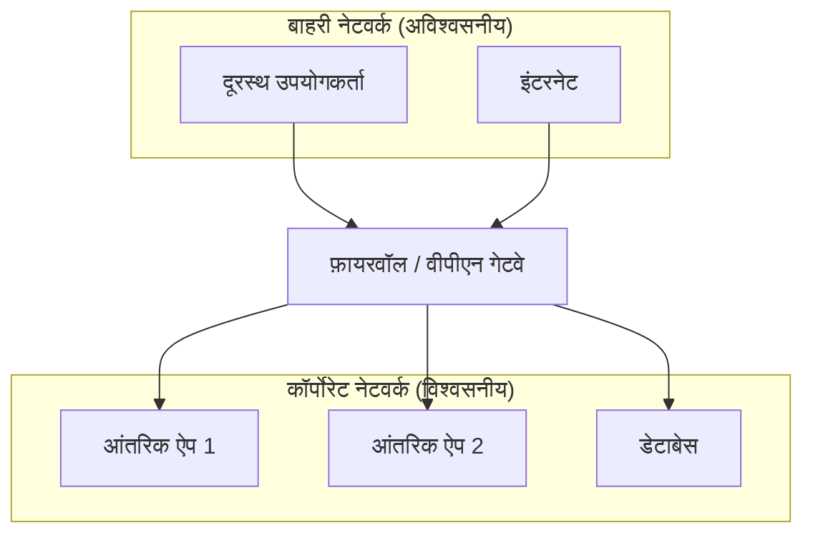
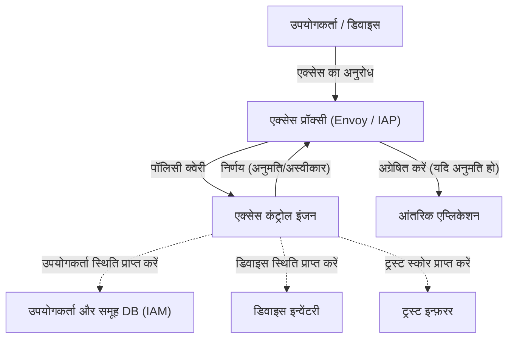

आधुनिक कॉर्पोरेट नेटवर्क में, साइबर सुरक्षा की अवधारणा एक नाटकीय मोड़ का अनुभव कर रही है। इस लेख में, हम Google की  **BeyondCorp**  पहल का उदाहरण देते हुए, परिधि सुरक्षा (Perimeter Security) से हटने और  **ज़ीरो-ट्रस्ट नेटवर्क आर्किटेक्चर**  के सार को विस्तार से समझाएंगे।

## 1. पारंपरिक परिधि सुरक्षा की सीमाएं और पतन

अतीत में, कॉर्पोरेट IT बुनियादी ढांचे को "अंदर" और "बाहर" के एक सरल द्वैतवाद के आधार पर डिज़ाइन किया गया था। इसे  **परिधि सुरक्षा**  (Perimeter Security) कहा जाता है।

### 1.1 परिधि सुरक्षा का मूल मॉडल
परिधि सुरक्षा में, कॉर्पोरेट नेटवर्क (सुरक्षित अंदर) और इंटरनेट (असुरक्षित बाहर) के बीच एक मजबूत दीवार बनाने के लिए फ़ायरवॉल, वीपीएन (VPN) और IPS/IDS जैसे सुरक्षा उपकरणों का उपयोग किया जाता है। जो उपयोगकर्ता या उपकरण इस दीवार को पार कर सकते हैं, उन्हें सिद्धांत रूप में "विश्वसनीय" माना जाता है, और उन्हें कॉर्पोरेट नेटवर्क के भीतर विभिन्न संसाधनों तक पहुंचने की अनुमति दी जाती है।



### 1.2 सीमाएं उभरने की पृष्ठभूमि
हालांकि, क्लाउड कंप्यूटिंग के प्रसार, रिमोट वर्क के सामान्यीकरण और SaaS एप्लिकेशन के बढ़ते उपयोग के कारण यह मॉडल टूट रहा है।

1.  **सीमाओं का धुंधला होना** : डेटा और एप्लिकेशन अब केवल ऑन-प्रिमाइसेस डेटा केंद्रों में नहीं हैं, बल्कि कई क्लाउड वातावरणों में वितरित किए जाते हैं। रक्षा के लिए "परिधि" कहाँ है, इसे स्पष्ट रूप से परिभाषित करना मुश्किल हो गया है।
2.  **आंतरिक खतरों की गंभीरता** : यह उन हमलावरों (मैलवेयर या दुर्भावनापूर्ण अंदरूनी सूत्र) के खिलाफ शक्तिहीन है जो एक बार अंदर प्रवेश कर चुके हैं। लेटरल मूवमेंट (पार्श्व गति) के कारण नुकसान के बहुत बड़े होने का जोखिम होता है।
3.  **वीपीएन प्रदर्शन और सुरक्षा चुनौतियां** : कॉर्पोरेट नेटवर्क पर वीपीएन के माध्यम से सभी ट्रैफ़िक को रूट करने के तरीके से बैंडविड्थ में कमी और देरी होती है, जिससे उपयोगकर्ता अनुभव काफी खराब हो जाता है।

## 2. ज़ीरो-ट्रस्ट की परिभाषा (NIST SP 800-207)

ज़ीरो-ट्रस्ट सिर्फ एक उत्पाद या तकनीक नहीं है, बल्कि सुरक्षा के लिए एक अवधारणा और वास्तुकला का ढांचा है। यूएस नेशनल इंस्टीट्यूट ऑफ स्टैंडर्ड एंड टेक्नोलॉजी (NIST) द्वारा प्रकाशित  **NIST SP 800-207** , ज़ीरो-ट्रस्ट की मानक परिभाषा प्रदान करता है।

ज़ीरो-ट्रस्ट का मूल दर्शन है " **कभी विश्वास न करें, हमेशा सत्यापित करें** " (Never Trust, Always Verify)। नेटवर्क स्थान (आंतरिक या बाहरी) की परवाह किए बिना, डिफ़ॉल्ट रूप से किसी भी चीज़ पर भरोसा नहीं किया जाता है।

### NIST SP 800-207 के 7 मूल सिद्धांत
1.  **सभी डेटा स्रोतों और कंप्यूटिंग सेवाओं को संसाधन माना जाता है।** 
2.  **नेटवर्क स्थान की परवाह किए बिना सभी संचार सुरक्षित हैं।** 
3.  **व्यक्तिगत कॉर्पोरेट संसाधनों तक पहुंच प्रति-सत्र के आधार पर दी जाती है।** 
4.  **संसाधनों तक पहुंच क्लाइंट की पहचान, एप्लिकेशन, अनुरोधित संपत्ति की स्थिति और अन्य व्यवहारिक या पर्यावरणीय विशेषताओं की गतिशील नीतियों द्वारा निर्धारित की जाती है।** 
5.  **सभी स्वामित्व वाली और संबंधित संपत्तियों की अखंडता और सुरक्षा स्थिति की निगरानी और माप की जाती है।** 
6.  **सभी संसाधनों का प्रमाणीकरण और प्राधिकरण गतिशील है और पहुंच प्रदान किए जाने से पहले सख्ती से लागू किया जाता है।** 
7.  **संपत्ति, नेटवर्क इन्फ्रास्ट्रक्चर और संचार की वर्तमान स्थिति के बारे में अधिक से अधिक जानकारी एकत्र की जाती है, और सुरक्षा उपायों को बेहतर बनाने के लिए इसका उपयोग किया जाता है।** 

## 3. Google BeyondCorp: ज़ीरो-ट्रस्ट का कार्यान्वयन

Google ने 2009 में ऑपरेशन ऑरोरा (Operation Aurora) नामक एक बड़े साइबर हमले के बाद, अपने कॉर्पोरेट नेटवर्क के आर्किटेक्चर को पूरी तरह से नया रूप दिया। इसके परिणामस्वरूप  **BeyondCorp**  का जन्म हुआ।

BeyondCorp ने विशेषाधिकार प्राप्त कॉर्पोरेट नेटवर्क को समाप्त कर दिया और एक्सेस कंट्रोल को "नेटवर्क परिधि" से "व्यक्तिगत उपयोगकर्ताओं और उपकरणों" में स्थानांतरित कर दिया।

### 3.1 BeyondCorp का आर्किटेक्चर

नीचे दिया गया Mermaid आरेख BeyondCorp के मूल एक्सेस कंट्रोल प्रवाह को दर्शाता है।



### 3.2 घटकों का विवरण

*  **Access Proxy** : यह सभी एप्लिकेशन का प्रवेश द्वार है, जो रिवर्स प्रॉक्सी के रूप में कार्य करता है। यह TLS टर्मिनेशन, लोड बैलेंसिंग, और सबसे महत्वपूर्ण रूप से, एक्सेस कंट्रोल को लागू (Enforcement) करता है।
*  **Device Inventory** : कंपनी द्वारा प्रबंधित सभी उपकरणों का डेटाबेस। यह प्रमाण पत्र, ओएस (OS) संस्करण, पैच स्थिति और डिस्क एन्क्रिप्शन जैसी जानकारी लगातार एकत्र करता है और स्थिति का प्रबंधन करता है।
*  **User and Group Database (IAM)** : उपयोगकर्ता पहचान (ID), समूह सदस्यता और भूमिका (Role) जैसी जानकारी का प्रबंधन करता है। यह मजबूत प्रमाणीकरण (जैसे MFA) प्रदान करने के लिए SAML और [OIDC](https://kenji.blog/hi/p/oauth2-oidc-authentication-authorization-difference/) का उपयोग करता है।
*  **Trust Inferer** : वर्तमान "ट्रस्ट स्कोर" (Trust Score) की गणना करने के लिए डिवाइस इन्वेंटरी डेटा और उपयोगकर्ता के संदर्भ (Context) की जानकारी का वास्तविक समय (Real-time) में विश्लेषण करता है।
*  **Access Control Engine** : यह एक पॉलिसी इंजन है जो Access Proxy से अनुरोध प्राप्त करता है और अनुरोधकर्ता उपयोगकर्ता, डिवाइस के ट्रस्ट स्कोर और लक्षित एप्लिकेशन की संसाधन आवश्यकताओं की तुलना करके एक्सेस को अनुमति देने या अस्वीकार करने का निर्णय लेता है।

## 4. ट्रस्ट मूल्यांकन और जोखिम स्कोर गणना मॉडल

ज़ीरो-ट्रस्ट में, एक्सेस अनुमति का निर्णय स्थिर नियमों के आधार पर नहीं, बल्कि गतिशील जोखिम स्कोर (Risk Score) के आधार पर किया जाता है।

संसाधन $R$ तक पहुँचने वाले उपयोगकर्ता $U$ और उपकरण $D$ के लिए समग्र जोखिम स्कोर $\text{जोखिम}(U, D, R)$ को विभिन्न कारकों के फ़ंक्शन के रूप में परिभाषित किया जा सकता है।

$ \text{जोखिम}(U, D, R) = w_1 \cdot P_{\text{उपयोगकर्ता}}(U) + w_2 \cdot P_{\text{डिवाइस}}(D) + w_3 \cdot P_{\text{संदर्भ}}(C) $

जहाँ:
* $P_{\text{उपयोगकर्ता}}(U)$ उपयोगकर्ता का जोखिम प्रोफ़ाइल है (प्रमाणीकरण शक्ति, MFA की उपस्थिति, अतीत का संदिग्ध व्यवहार आदि)।
* $P_{\text{डिवाइस}}(D)$ डिवाइस का जोखिम प्रोफ़ाइल है (OS भेद्यता, मैलवेयर संक्रमण का संदेह, प्रमाणपत्र की वैधता आदि)।
* $P_{\text{संदर्भ}}(C)$ संदर्भ जोखिम है (एक्सेस करने वाले का IP पता, दिन का समय, भौगोलिक स्थान आदि)।
* $w_i$ प्रत्येक तत्व का भार गुणांक है ($\sum w_i = 1$)।

विश्वास (Trust) को जोखिम के व्युत्क्रम के रूप में, या एक निश्चित सीमा (Threshold) से जोखिम घटाकर प्राप्त मान के रूप में व्यक्त किया जाता है।
उदाहरण के लिए, एक्सेस की अनुमति देने की स्थिति को निम्नानुसार सूत्रबद्ध किया जा सकता है:

$ \text{ट्रस्ट}(U, D, R) = 1 - \text{जोखिम}(U, D, R) \geq \text{थ्रेशोल्ड}(R) $

जहाँ $\text{थ्रेशोल्ड}(R)$ लक्षित संसाधन $R$ की संवेदनशीलता के आधार पर निर्धारित आवश्यक विश्वास स्तर है। उच्च संवेदनशीलता वाले वित्तीय डेटा तक पहुंच के लिए एक उच्च सीमा निर्धारित की जाती है।

## 5. माइक्रो-सेगमेंटेशन की भूमिका

ज़ीरो-ट्रस्ट नेटवर्क बनाने में एक और आवश्यक तत्व  **माइक्रो-सेगमेंटेशन**  (Micro-segmentation) है।

पारंपरिक VLAN-आधारित नेटवर्क सेगमेंटेशन की तुलना में संचार को बहुत अधिक सूक्ष्म स्तर पर, वर्कलोड (Workload) स्तर, एप्लिकेशन स्तर या प्रक्रिया स्तर पर नियंत्रित किया जाता है। इसके परिणामस्वरूप, यदि किसी एक घटक से समझौता किया जाता है, तो भी अन्य घटकों में लेटरल मूवमेंट को कम से कम किया जा सकता है।

सॉफ़्टवेयर-डिफाइंड नेटवर्किंग (SDN) और पहचान-आधारित फ़ायरवॉल (Identity-based firewalls) का उपयोग करके, प्रत्येक घटक के बीच संचार नीतियों (कौन, किसके साथ, किस पोर्ट/प्रोटोकॉल पर संचार कर सकता है) को कड़ाई से परिभाषित किया जाता है और अनावश्यक संचार मार्गों को पूरी तरह से अवरुद्ध कर दिया जाता है।

## 6. कार्यान्वयन उदाहरण: IAM नीतियां और प्रॉक्सी सेटिंग्स

यहाँ ज़ीरो-ट्रस्ट आर्किटेक्चर को लागू करने के लिए विशिष्ट कॉन्फ़िगरेशन अवधारणाओं के उदाहरण दिए गए हैं।

### 6.1 IAM पॉलिसी का JSON उदाहरण (AWS IAM शैली)

निम्नलिखित JSON एक पॉलिसी का उदाहरण है जो किसी विशिष्ट संसाधन तक पहुँच की अनुमति केवल उन उपयोगकर्ताओं को देता है जो किसी विशिष्ट IP पता सीमा से पहुँचते हैं और MFA के साथ प्रमाणित होते हैं। ज़ीरो-ट्रस्ट में, ऐसी संदर्भ-आधारित (Context-based) स्थितियाँ बारीकी से निर्धारित की जाती हैं।

```json
{
  "Version": "2012-10-17",
  "Statement": [
    {
      "Sid": "ZeroTrustAccessPolicyExample",
      "Effect": "Allow",
      "Action": [
        "s3:GetObject",
        "s3:ListBucket"
      ],
      "Resource": [
        "arn:aws:s3:::corporate-confidential-data",
        "arn:aws:s3:::corporate-confidential-data/*"
      ],
      "Condition": {
        "IpAddress": {
          "aws:SourceIp": "192.0.2.0/24"
        },
        "Bool": {
          "aws:MultiFactorAuthPresent": "true"
        },
        "NumericGreaterThan": {
          "custom:DeviceTrustScore": "80"
        }
      }
    }
  ]
}
```
*(नोट: `custom:DeviceTrustScore` एक वैचारिक कस्टम कंडीशन कुंजी है।)*

### 6.2 Envoy प्रॉक्सी का उपयोग करके एक्सेस कंट्रोल की अवधारणा का उदाहरण

Envoy, जो Access Proxy के रूप में कार्य करता है, बाहरी प्रमाणीकरण/प्राधिकरण सेवाओं (ExtAuthz) के संयोजन में एक्सेस कंट्रोल लागू करता है।

```yaml
# Envoy फ़िल्टर चेन कॉन्फ़िगरेशन स्निपेट उदाहरण
filters:
  - name: envoy.filters.network.http_connection_manager
    typed_config:
      "@type": type.googleapis.com/envoy.extensions.filters.network.http_connection_manager.v3.HttpConnectionManager
      route_config:
        name: local_route
        virtual_hosts:
          - name: backend_service
            domains: ["*"]
            routes:
              - match: { prefix: "/" }
                route: { cluster: backend_app_cluster }
      http_filters:
        - name: envoy.filters.http.ext_authz
          typed_config:
            "@type": type.googleapis.com/envoy.extensions.filters.http.ext_authz.v3.ExtAuthz
            grpc_service:
              envoy_grpc:
                cluster_name: access_control_engine_cluster
              timeout: 0.5s
            transport_api_version: V3
            metadata_context_namespaces:
              - "envoy.filters.http.jwt_authn"
        - name: envoy.filters.http.router
```

इस कॉन्फ़िगरेशन के साथ, सभी HTTP अनुरोधों को रूट करने से पहले, Envoy `access_control_engine_cluster` (एक्सेस कंट्रोल इंजन) को अनुरोध का मेटाडेटा भेजता है और प्राधिकरण की अनुमति के बारे में पूछताछ करता है।

## निष्कर्ष

ज़ीरो-ट्रस्ट नेटवर्क आर्किटेक्चर में संक्रमण रातों-रात पूरा होने वाला काम नहीं है। यह एक दीर्घकालिक प्रयास है जिसके लिए मौजूदा विरासत प्रणालियों के साथ एकीकरण, संगठनात्मक संस्कृति में परिवर्तन और निरंतर निगरानी और ट्यूनिंग की आवश्यकता होती है।

हालाँकि, जैसा कि Google के  **BeyondCorp**  ने प्रदर्शित किया है, "नेटवर्क स्थान" के बजाय "पहचान और संदर्भ" के आधार पर एक्सेस कंट्रोल लागू करके, क्लाउड युग में विविध खतरों के खिलाफ अधिक लचीली और मजबूत सुरक्षा नींव बनाना संभव है।
