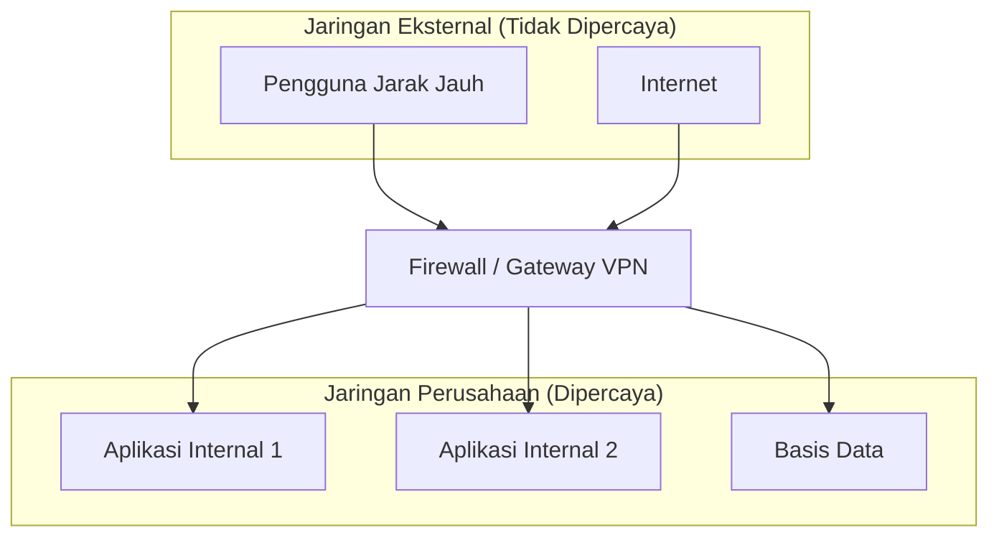
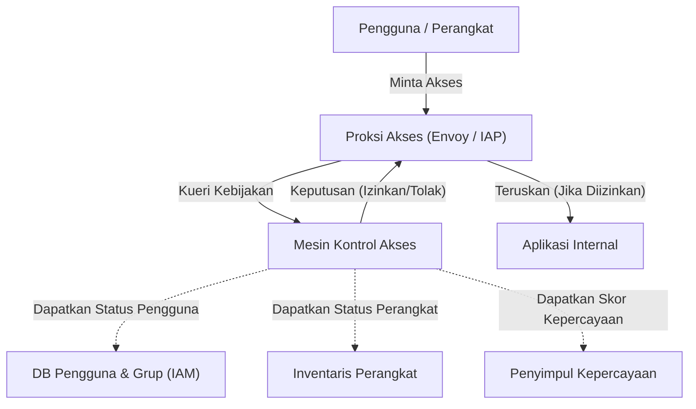

Di jaringan perusahaan modern, konsep keamanan siber sedang mengalami titik balik yang dramatis. Artikel ini akan menjelaskan esensi dari melepaskan pertahanan perimeter dan **Arsitektur Jaringan Zero Trust** secara sangat rinci, dengan mengambil inisiatif **BeyondCorp** dari Google sebagai contoh.

## 1. Batasan dan Keruntuhan Pertahanan Perimeter Tradisional

Di masa lalu, infrastruktur TI perusahaan dirancang berdasarkan dualisme sederhana, yaitu "dalam" dan "luar". Inilah yang disebut **Pertahanan Perimeter** (Perimeter Security).

### 1.1 Model Dasar Pertahanan Perimeter
Dalam pertahanan perimeter, peralatan keamanan seperti firewall, VPN, dan IPS/IDS digunakan untuk membangun dinding yang kuat antara jaringan internal perusahaan (bagian dalam yang aman) dan internet (bagian luar yang berbahaya). Pengguna dan perangkat yang dapat melewati dinding ini, pada prinsipnya, dianggap "dapat dipercaya" dan diberikan akses ke berbagai sumber daya dalam jaringan internal.



### 1.2 Latar Belakang Mencapai Batasnya
Namun, dengan populernya komputasi awan, normalisasi kerja jarak jauh, dan perluasan penggunaan aplikasi SaaS, model ini mulai runtuh.

1. **Pengaburan Perimeter**: Data dan aplikasi tidak lagi hanya ditempatkan di pusat data on-premise, tetapi didistribusikan di berbagai lingkungan cloud. Menjadi sulit untuk mendefinisikan dengan jelas di mana letak "perimeter" yang harus dilindungi.
2. **Semakin Parahnya Ancaman Internal**: Ia tidak berdaya melawan penyerang yang telah berhasil masuk ke dalam (malware atau orang dalam yang berniat jahat). Ada risiko kerusakan menjadi sangat besar akibat pergerakan lateral (penyebaran horizontal).
3. **Tantangan Kinerja dan Keamanan VPN**: Metode merutekan semua lalu lintas ke jaringan internal melalui VPN menyebabkan penyempitan bandwidth dan latensi, yang secara signifikan merusak pengalaman pengguna.

## 2. Definisi Zero Trust (NIST SP 800-207)

Zero trust bukanlah sekadar produk atau teknologi, melainkan sebuah konsep keamanan dan kerangka arsitektur. **NIST SP 800-207** yang diterbitkan oleh Institut Nasional Standar dan Teknologi (NIST) AS memberikan definisi standar untuk zero trust.

Prinsip dasar zero trust adalah "**Never Trust, Always Verify** (Jangan pernah percaya, selalu verifikasi)". Secara default, tidak ada yang dipercaya, terlepas dari lokasi jaringannya (di dalam atau di luar perusahaan).

### 7 Prinsip Dasar dalam NIST SP 800-207
1. **Semua sumber data dan layanan komputasi dianggap sebagai sumber daya.**
2. **Semua komunikasi diamankan terlepas dari lokasi jaringan.**
3. **Akses ke sumber daya perusahaan secara individu diizinkan berdasarkan per sesi.**
4. **Akses ke sumber daya ditentukan oleh kebijakan dinamis, termasuk identitas klien, aplikasi, status aset yang meminta, serta atribut perilaku dan lingkungan lainnya.**
5. **Integritas dan postur keamanan semua aset yang dimiliki dan terkait dipantau dan diukur.**
6. **Semua autentikasi dan otorisasi sumber daya bersifat dinamis dan diterapkan secara ketat sebelum akses diizinkan.**
7. **Mengumpulkan informasi sebanyak mungkin mengenai kondisi terkini dari aset, infrastruktur jaringan, dan komunikasi, serta memanfaatkannya untuk meningkatkan langkah-langkah keamanan.**

## 3. Google BeyondCorp: Perwujudan Zero Trust

Google merombak arsitektur jaringan internalnya secara mendasar, didorong oleh serangan siber berskala besar yang disebut Operation Aurora pada tahun 2009. Hasilnya adalah lahirnya **BeyondCorp**.

BeyondCorp menghapus jaringan perusahaan yang memiliki hak istimewa, dan mengalihkan kontrol akses dari "perimeter jaringan" ke "pengguna dan perangkat secara individu".

### 3.1 Arsitektur BeyondCorp

Diagram Mermaid berikut menunjukkan alur kontrol akses dasar pada BeyondCorp.



### 3.2 Detail Komponen

* **Proksi Akses**: Sebuah proksi terbalik (reverse proxy) yang menjadi pintu masuk ke semua aplikasi. Ini melakukan penghentian TLS (TLS termination), penyeimbangan beban (load balancing), dan yang paling penting adalah penegakan (Enforcement) kontrol akses.
* **Inventaris Perangkat**: Sebuah basis data dari semua perangkat yang dikelola perusahaan. Ini terus mengumpulkan dan mengelola status informasi seperti sertifikat, versi OS, status penerapan patch, dan ada atau tidaknya enkripsi disk.
* **Basis Data Pengguna dan Grup (IAM)**: Mengelola informasi seperti ID pengguna, afiliasi grup, dan peran. Ini menyediakan autentikasi yang kuat (seperti MFA) menggunakan SAML atau [OIDC](https://kenji.blog/id/p/oauth2-oidc-authentication-authorization-difference/).
* **Penyimpul Kepercayaan**: Menganalisis data inventaris perangkat dan informasi konteks pengguna secara real-time untuk menghitung "skor kepercayaan" saat ini.
* **Mesin Kontrol Akses**: Menerima permintaan dari Proksi Akses, kemudian membandingkan pengguna yang meminta, tingkat kepercayaan perangkat, dan persyaratan sumber daya dari aplikasi target untuk memutuskan apakah akan mengizinkan atau menolak akses, yang bertindak sebagai mesin kebijakan.

## 4. Evaluasi Tingkat Kepercayaan dan Model Perhitungan Skor Risiko

Dalam zero trust, keputusan izin akses tidak dilakukan berdasarkan aturan statis, melainkan berdasarkan skor risiko yang dinamis.

Skor risiko keseluruhan $Risk(U, D, R)$ saat pengguna $U$ dan perangkat $D$ mengakses sumber daya $R$ dapat didefinisikan sebagai fungsi dari berbagai faktor.

$ Risk(U, D, R) = w_1 \cdot P_{user}(U) + w_2 \cdot P_{device}(D) + w_3 \cdot P_{context}(C) $

Di mana:
* $P_{user}(U)$ adalah profil risiko pengguna (kekuatan autentikasi, ada tidaknya MFA, perilaku mencurigakan di masa lalu, dll.).
* $P_{device}(D)$ adalah profil risiko perangkat (kerentanan OS, dugaan infeksi malware, validitas sertifikat, dll.).
* $P_{context}(C)$ adalah risiko konteks (alamat IP asal akses, zona waktu, geolokasi, dll.).
* $w_i$ adalah faktor pembobotan setiap elemen ($\sum w_i = 1$).

Tingkat kepercayaan $Trust$ dinyatakan sebagai kebalikan dari risiko, atau nilai yang dikurangi dengan risiko dari ambang batas tertentu.
Misalnya, syarat untuk mengizinkan akses dapat dirumuskan sebagai berikut.

$ Trust(U, D, R) = 1 - Risk(U, D, R) \geq Threshold(R) $

Di mana $Threshold(R)$ adalah tingkat kepercayaan yang diperlukan yang ditetapkan berdasarkan sensitivitas sumber daya $R$ yang dituju. Akses ke data keuangan yang sangat sensitif akan memiliki ambang batas yang lebih tinggi.

## 5. Peran Mikrosegmentasi

Elemen lain yang tidak tergantikan dalam membangun jaringan zero trust adalah **Mikrosegmentasi**.

Ini mengontrol komunikasi dengan tingkat yang lebih halus dibandingkan segmentasi jaringan berbasis VLAN tradisional, yaitu pada tingkat beban kerja (workload), aplikasi, atau bahkan proses. Dengan ini, seandainya ada satu komponen yang diretas, pergerakan lateral ke komponen lain dapat diminimalkan.

Menggunakan Software-Defined Networking (SDN) dan firewall berbasis identitas, kebijakan komunikasi antar setiap komponen (siapa, dengan siapa, dan port/protokol mana yang dapat berkomunikasi) didefinisikan secara ketat, dan jalur komunikasi yang tidak diperlukan diblokir sepenuhnya.

## 6. Contoh Implementasi: Kebijakan IAM dan Konfigurasi Proksi

Di sini, kami akan menunjukkan contoh konsep konfigurasi spesifik untuk mengimplementasikan arsitektur zero trust.

### 6.1 Contoh JSON Kebijakan IAM (Gaya AWS IAM)

JSON berikut adalah contoh kebijakan yang hanya mengizinkan akses ke sumber daya tertentu bagi pengguna yang mengakses dari rentang alamat IP tertentu dan telah diautentikasi dengan MFA. Dalam zero trust, kondisi berbasis konteks semacam ini dikonfigurasi dengan sangat rinci.

```json
{
  "Version": "2012-10-17",
  "Statement": [
    {
      "Sid": "ContohKebijakanAksesZeroTrust",
      "Effect": "Allow",
      "Action": [
        "s3:GetObject",
        "s3:ListBucket"
      ],
      "Resource": [
        "arn:aws:s3:::corporate-confidential-data",
        "arn:aws:s3:::corporate-confidential-data/*"
      ],
      "Condition": {
        "IpAddress": {
          "aws:SourceIp": "192.0.2.0/24"
        },
        "Bool": {
          "aws:MultiFactorAuthPresent": "true"
        },
        "NumericGreaterThan": {
          "custom:DeviceTrustScore": "80"
        }
      }
    }
  ]
}
```
*(Catatan: `custom:DeviceTrustScore` adalah kunci kondisi kustom secara konseptual.)*

### 6.2 Contoh Konsep Kontrol Akses menggunakan Proksi Envoy

Dalam Envoy, yang berfungsi sebagai Proksi Akses, kontrol akses diimplementasikan berkolaborasi dengan layanan autentikasi dan otorisasi eksternal (ExtAuthz).

```yaml
# Contoh snippet konfigurasi rantai filter Envoy
filters:
  - name: envoy.filters.network.http_connection_manager
    typed_config:
      "@type": type.googleapis.com/envoy.extensions.filters.network.http_connection_manager.v3.HttpConnectionManager
      route_config:
        name: rute_lokal
        virtual_hosts:
          - name: layanan_backend
            domains: ["*"]
            routes:
              - match: { prefix: "/" }
                route: { cluster: klaster_aplikasi_backend }
      http_filters:
        - name: envoy.filters.http.ext_authz
          typed_config:
            "@type": type.googleapis.com/envoy.extensions.filters.http.ext_authz.v3.ExtAuthz
            grpc_service:
              envoy_grpc:
                cluster_name: klaster_mesin_kontrol_akses
              timeout: 0.5s
            transport_api_version: V3
            metadata_context_namespaces:
              - "envoy.filters.http.jwt_authn"
        - name: envoy.filters.http.router
```

Melalui konfigurasi ini, sebelum Envoy merutekan semua permintaan HTTP, ia mengirimkan metadata permintaan ke `klaster_mesin_kontrol_akses` (mesin kontrol akses) untuk menanyakan apakah otorisasi disetujui atau ditolak.

## Kesimpulan

Transisi ke arsitektur jaringan zero trust bukanlah sesuatu yang dapat diselesaikan dalam semalam. Ini adalah upaya jangka panjang yang membutuhkan integrasi dengan sistem lama yang ada, perubahan budaya organisasi, serta pemantauan dan penyetelan yang berkelanjutan.

Namun, seperti yang telah dibuktikan oleh **BeyondCorp** milik Google, dengan mengimplementasikan kontrol akses yang didasarkan pada "identitas dan konteks" dan bukan "lokasi jaringan", menjadi mungkin untuk membangun fondasi keamanan yang lebih tangguh dan fleksibel dalam menghadapi ancaman yang semakin beragam di era cloud.
