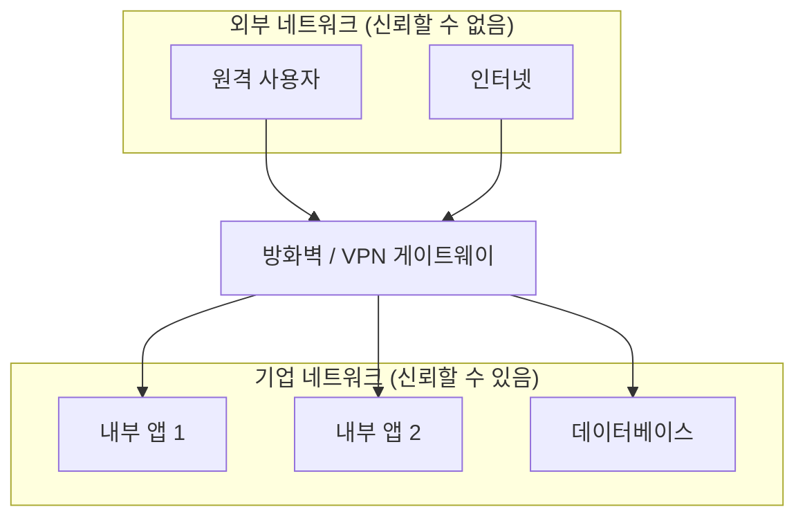
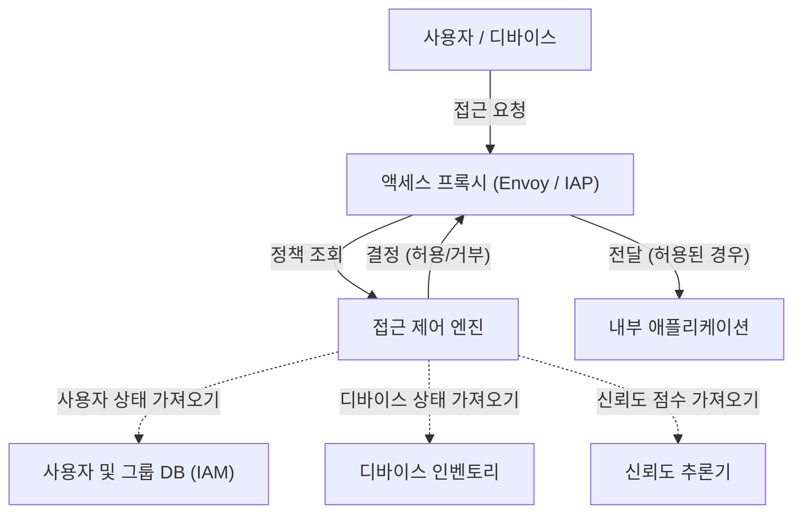

현대 기업 네트워크에서 사이버 보안의 개념은 극적인 전환기를 맞이하고 있습니다. 본 기사에서는 Google의 **BeyondCorp** 이니셔티브를 예로 들며, 경계 방어로부터의 탈피와 **제로 트러스트 네트워크 아키텍처** 의 본질에 대해 매우 상세하게 해설합니다.

## 1. 기존 경계형 방어의 한계와 붕괴

과거 기업의 IT 인프라스트럭처는 "내부"와 "외부"라는 단순한 이분법에 기초하여 설계되었습니다. 이것이 **경계형 방어** (Perimeter Security)입니다.

### 1.1 경계형 방어의 기본 모델
경계형 방어에서는 방화벽, VPN, IPS/IDS 등의 보안 장비를 사용하여 사내 네트워크(안전한 내부)와 인터넷(위험한 외부) 사이에 강력한 벽을 구축합니다. 이 벽을 통과한 사용자나 디바이스는 원칙적으로 "신뢰할 수 있다"고 간주되어 사내 네트워크 내의 다양한 리소스에 대한 접근이 허용됩니다.



### 1.2 한계에 직면한 배경
그러나 클라우드 컴퓨팅의 보급, 원격 근무의 일상화, SaaS 애플리케이션의 이용 확대로 인해 이 모델은 파탄 나고 있습니다.

1. **경계의 모호화** : 데이터와 애플리케이션이 온프레미스 데이터 센터뿐만 아니라 여러 클라우드 환경에 분산되어 배치되기 시작했습니다. 보호해야 할 "경계"가 어디에 있는지 명확하게 정의하기가 어려워지고 있습니다.
2. **내부 위협의 심각화** : 한 번 내부에 침입한 공격자(멀웨어나 악의적인 내부자)에게는 무력합니다. 래터럴 무브먼트(횡적 이동)로 인해 피해가 커질 위험이 있습니다.
3. **VPN의 성능 및 보안 과제** : 모든 트래픽을 VPN을 통해 사내 네트워크로 라우팅하는 방식은 대역폭 압박이나 지연을 유발하여 사용자 경험을 현저히 저하시킵니다.

## 2. 제로 트러스트의 정의 (NIST SP 800-207)

제로 트러스트는 단순한 제품이나 기술이 아니라 보안에 대한 개념이며 아키텍처의 프레임워크입니다. 미국 국립표준기술연구소(NIST)가 발행한 **NIST SP 800-207** 은 제로 트러스트의 표준적인 정의를 제공하고 있습니다.

제로 트러스트의 기본 이념은 " **Never Trust, Always Verify** (결코 신뢰하지 말고, 항상 검증하라)"입니다. 네트워크의 위치(사내인지 사외인지)에 관계없이 기본적으로 아무것도 신뢰하지 않습니다.

### NIST SP 800-207 의 7가지 기본 원칙
1. **모든 데이터 소스와 컴퓨팅 서비스를 리소스로 간주한다.** 
2. **네트워크의 위치에 관계없이 모든 통신을 보호한다.** 
3. **개별 기업 리소스에 대한 접근은 세션 단위로 허용한다.** 
4. **리소스에 대한 접근은 클라이언트의 ID, 애플리케이션, 요청하는 자산의 상태, 기타 행동 속성이나 환경 속성의 동적인 정책에 의해 결정한다.** 
5. **모든 소유 및 관련된 자산의 무결성과 보안 상태를 모니터링하고 측정한다.** 
6. **모든 리소스의 인증 및 인가는 동적으로 이루어지며, 접근이 허용되기 전에 엄격하게 실시된다.** 
7. **자산, 네트워크 인프라, 통신의 현재 상태에 대해 가능한 한 많은 정보를 수집하고 보안 대책 개선에 활용한다.** 

## 3. Google BeyondCorp: 제로 트러스트의 구현

Google은 2009년 Operation Aurora라고 불리는 대규모 사이버 공격을 계기로 사내 네트워크 아키텍처를 근본부터 재검토했습니다. 그 결과 탄생한 것이 **BeyondCorp** 입니다.

BeyondCorp는 특권적인 기업 네트워크를 폐지하고 접근 제어를 "네트워크 경계"에서 "개별 사용자와 디바이스"로 전환했습니다.

### 3.1 BeyondCorp 아키텍처

다음의 Mermaid 다이어그램은 BeyondCorp의 기본적인 접근 제어 흐름을 보여줍니다.



### 3.2 구성 요소 상세

* **Access Proxy** : 모든 애플리케이션으로 들어가는 진입점이 되는 리버스 프록시입니다. TLS 터미네이션, 로드 밸런싱, 그리고 가장 중요한 접근 제어 실행(Enforcement)을 수행합니다.
* **Device Inventory** : 기업이 관리하는 모든 디바이스의 데이터베이스입니다. 인증서, OS 버전, 패치 적용 상태, 디스크 암호화 여부 등의 정보를 지속적으로 수집하고 상태를 관리합니다.
* **User and Group Database (IAM)** : 사용자의 ID, 소속 그룹, 역할 등의 정보를 관리합니다. SAML이나 [OIDC](https://kenji.blog/ko/p/oauth2-oidc-authentication-authorization-difference/)를 이용하여 강력한 인증(MFA 등)을 제공합니다.
* **Trust Inferer** : 디바이스의 인벤토리 데이터나 사용자의 컨텍스트 정보를 실시간으로 분석하여 현재의 "신뢰도 점수"를 산출합니다.
* **Access Control Engine** : Access Proxy로부터 요청을 받아 요청한 사용자, 디바이스의 신뢰도, 대상 애플리케이션의 리소스 요구 사항을 대조하여 접근을 허용할지 거부할지 결정하는 정책 엔진입니다.

## 4. 신뢰도 평가 및 리스크 점수 계산 모델

제로 트러스트에서 접근 허용 판단은 정적인 규칙이 아니라 동적인 리스크 점수에 기반하여 이루어집니다.

사용자 $U$ 와 디바이스 $D$ 가 리소스 $R$ 에 접근할 때의 전체적인 리스크 점수 $Risk(U, D, R)$ 은 다양한 요소의 함수로 정의할 수 있습니다.

$ Risk(U, D, R) = w_1 \cdot P_{user}(U) + w_2 \cdot P_{device}(D) + w_3 \cdot P_{context}(C) $

여기서:
* $P_{user}(U)$ 는 사용자의 리스크 프로파일(인증 강도, MFA 여부, 과거의 의심스러운 행동 등)입니다.
* $P_{device}(D)$ 는 디바이스의 리스크 프로파일(OS 취약성, 멀웨어 감염 의심, 인증서 유효성 등)입니다.
* $P_{context}(C)$ 는 컨텍스트 리스크(접근 소스의 IP 주소, 시간대, 지리적 위치 등)입니다.
* $w_i$ 는 각 요소의 가중치 계수( $\sum w_i = 1$ )입니다.

신뢰도 $Trust$ 는 리스크의 역수, 혹은 일정한 임계값에서 리스크를 뺀 값으로 표현됩니다.
예를 들어, 접근을 허용하기 위한 조건은 다음과 같이 정식화할 수 있습니다.

$ Trust(U, D, R) = 1 - Risk(U, D, R) \geq Threshold(R) $

여기서 $Threshold(R)$ 은 대상 리소스 $R$ 의 기밀성에 기초하여 설정되는 요구 신뢰도 수준입니다. 기밀성이 높은 재무 데이터에 대한 접근에는 더 높은 임계값이 설정됩니다.

## 5. 마이크로 세그멘테이션의 역할

제로 트러스트 네트워크를 구축하는 데 있어 빼놓을 수 없는 또 다른 요소가 **마이크로 세그멘테이션** 입니다.

기존의 VLAN 기반 네트워크 세그멘테이션보다 훨씬 더 세밀하게 워크로드 단위, 애플리케이션 단위, 혹은 프로세스 단위로 통신을 제어합니다. 이를 통해 만에 하나 어떤 컴포넌트가 침해당하더라도 다른 컴포넌트로의 래터럴 무브먼트를 최소화할 수 있습니다.

소프트웨어 정의 네트워크(SDN)나 아이덴티티 기반 방화벽을 사용하여 각 컴포넌트 간의 통신 정책(누가, 누구와, 어떤 포트/프로토콜로 통신할 수 있는지)을 엄격하게 정의하고, 불필요한 통신 경로를 완전히 차단합니다.

## 6. 구현 예시: IAM 정책 및 프록시 설정

여기에서는 제로 트러스트 아키텍처를 구현하기 위한 구체적인 설정 개념의 예시를 보여줍니다.

### 6.1 IAM 정책 JSON 예시 (AWS IAM 방식)

다음의 JSON은 특정 IP 주소 범위에서 접근하고, 동시에 MFA로 인증된 사용자에게만 특정 리소스에 대한 접근을 허용하는 정책의 예시입니다. 제로 트러스트에서는 이러한 컨텍스트 기반 조건을 세밀하게 설정합니다.

```json
{
  "Version": "2012-10-17",
  "Statement": [
    {
      "Sid": "ZeroTrustAccessPolicyExample",
      "Effect": "Allow",
      "Action": [
        "s3:GetObject",
        "s3:ListBucket"
      ],
      "Resource": [
        "arn:aws:s3:::corporate-confidential-data",
        "arn:aws:s3:::corporate-confidential-data/*"
      ],
      "Condition": {
        "IpAddress": {
          "aws:SourceIp": "192.0.2.0/24"
        },
        "Bool": {
          "aws:MultiFactorAuthPresent": "true"
        },
        "NumericGreaterThan": {
          "custom:DeviceTrustScore": "80"
        }
      }
    }
  ]
}
```
*(참고: `custom:DeviceTrustScore` 는 개념상의 독자적인 조건 키입니다.)*

### 6.2 Envoy 프록시를 사용한 접근 제어 개념 예시

Access Proxy로 기능하는 Envoy에서는 외부의 인증 및 인가 서비스(ExtAuthz)와 연계하여 접근 제어를 구현합니다.

```yaml
# Envoy 필터 체인 설정 스니펫 예시
filters:
  - name: envoy.filters.network.http_connection_manager
    typed_config:
      "@type": type.googleapis.com/envoy.extensions.filters.network.http_connection_manager.v3.HttpConnectionManager
      route_config:
        name: local_route
        virtual_hosts:
          - name: backend_service
            domains: ["*"]
            routes:
              - match: { prefix: "/" }
                route: { cluster: backend_app_cluster }
      http_filters:
        - name: envoy.filters.http.ext_authz
          typed_config:
            "@type": type.googleapis.com/envoy.extensions.filters.http.ext_authz.v3.ExtAuthz
            grpc_service:
              envoy_grpc:
                cluster_name: access_control_engine_cluster
              timeout: 0.5s
            transport_api_version: V3
            metadata_context_namespaces:
              - "envoy.filters.http.jwt_authn"
        - name: envoy.filters.http.router
```

이 설정에 따라 Envoy는 모든 HTTP 요청을 라우팅하기 전에 `access_control_engine_cluster` (접근 제어 엔진)에 요청의 메타데이터를 전송하고 인가 여부를 묻습니다.

## 요약

제로 트러스트 네트워크 아키텍처로의 전환은 하루아침에 완료되는 것이 아닙니다. 기존 레거시 시스템과의 통합, 조직 문화의 변혁, 그리고 지속적인 모니터링과 튜닝이 필요한 장기적인 과제입니다.

그러나 Google의 **BeyondCorp** 가 입증하고 있듯이, "네트워크의 위치"가 아닌 "아이덴티티와 컨텍스트"에 기반한 접근 제어를 구현함으로써 클라우드 시대에 다양화되는 위협에 대해 더 강력하고 유연한 보안 기반을 구축할 수 있게 됩니다.
