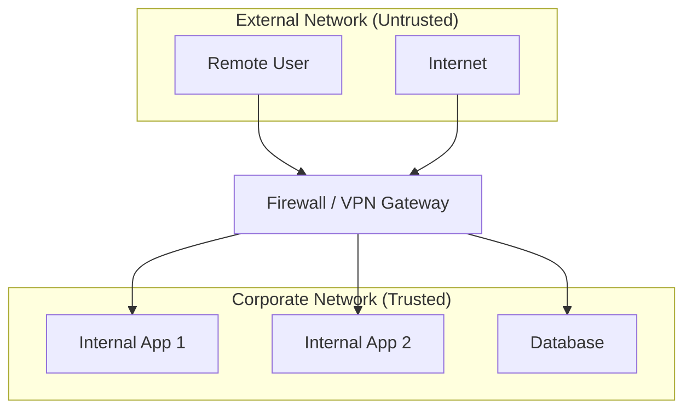
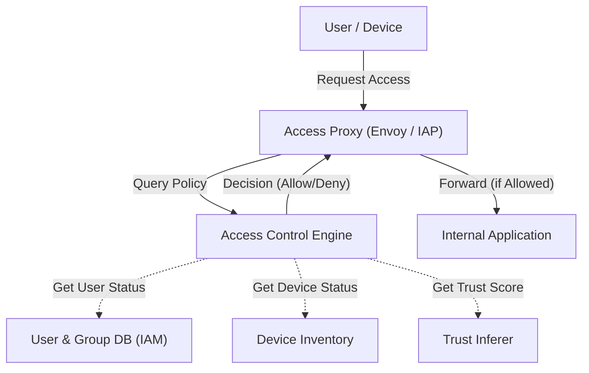

現代の企業ネットワークにおいて、サイバーセキュリティの概念は劇的な転換期を迎えています。本記事では、Googleの **BeyondCorp** イニシアチブを例に挙げながら、境界防御からの脱却と **ゼロトラスト・ネットワークアーキテクチャ** の本質について、非常に詳細に解説します。

## 1. 従来の境界型防御の限界と崩壊

かつて、企業のITインフラストラクチャは「内側」と「外側」という単純な二元論に基づいて設計されていました。これが **境界型防御** （Perimeter Security）です。

### 1.1 境界型防御の基本モデル
境界型防御では、ファイアウォール、VPN、IPS/IDSなどのセキュリティ機器を用いて、社内ネットワーク（安全な内側）とインターネット（危険な外側）の間に強固な壁を構築します。この壁を通過できたユーザーやデバイスは、原則として「信頼できる」とみなされ、社内ネットワーク内のさまざまなリソースへのアクセスが許可されます。



### 1.2 限界を迎えた背景
しかし、クラウドコンピューティングの普及、リモートワークの常態化、SaaSアプリケーションの利用拡大により、このモデルは破綻しつつあります。

1. **境界の曖昧化** : データやアプリケーションがオンプレミスのデータセンターだけでなく、複数のクラウド環境に分散して配置されるようになりました。守るべき「境界」がどこにあるのか、明確に定義することが困難になっています。
2. **内部脅威の深刻化** : 一度内部に侵入した攻撃者（マルウェアや悪意のある内部犯行者）に対しては無力です。ラテラルムーブメント（横展開）により、被害が甚大化するリスクがあります。
3. **VPNのパフォーマンスとセキュリティの課題** : すべてのトラフィックをVPN経由で社内ネットワークにルーティングする方式は、帯域幅の圧迫や遅延を引き起こし、ユーザー体験を著しく損ないます。

## 2. ゼロトラストの定義（NIST SP 800-207）

ゼロトラストは、単なる製品や技術ではなく、セキュリティに対する概念であり、アーキテクチャのフレームワークです。米国国立標準技術研究所（NIST）が発行した **NIST SP 800-207** は、ゼロトラストの標準的な定義を提供しています。

ゼロトラストの基本理念は「 **Never Trust, Always Verify** （決して信頼せず、常に検証せよ）」です。ネットワークの場所（社内か社外か）に関わらず、デフォルトで何も信頼しません。

### NIST SP 800-207 における7つの基本原則
1. **すべてのデータソースとコンピューティングサービスをリソースとみなす。** 
2. **ネットワークの場所に関係なく、すべての通信を保護する。** 
3. **個々の企業リソースへのアクセスは、セッション単位で許可する。** 
4. **リソースへのアクセスは、クライアントのID、アプリケーション、要求する資産の状態、その他の行動属性や環境属性の動的なポリシーによって決定する。** 
5. **すべての所有および関連する資産の整合性とセキュリティ状況を監視し、測定する。** 
6. **すべてのリソースの[認証](https://kenji.blog/p/oauth2-oidc-authentication-authorization-difference/)と[認可](https://kenji.blog/p/oauth2-oidc-authentication-authorization-difference/)は動的に行われ、アクセスが許可される前に厳密に実施される。** 
7. **資産、ネットワークインフラ、通信の現状について可能な限り多くの情報を収集し、セキュリティ対策の改善に活用する。** 

## 3. Google BeyondCorp：ゼロトラストの具現化

Googleは、2009年のOperation Auroraと呼ばれる大規模なサイバー攻撃を契機として、社内ネットワークのアーキテクチャを根本から見直しました。その結果誕生したのが **BeyondCorp** です。

BeyondCorpは、特権的な企業ネットワークを廃止し、アクセス制御を「ネットワークの境界」から「個々のユーザーとデバイス」へと移行させました。

### 3.1 BeyondCorpのアーキテクチャ

以下のMermaid図は、BeyondCorpの基本的なアクセス制御フローを示しています。



### 3.2 構成要素の詳細

* **Access Proxy** : すべてのアプリケーションへの入り口となるリバースプロキシです。TLSターミネーション、ロードバランシング、そして最も重要なアクセス制御の実施（Enforcement）を行います。
* **Device Inventory** : 企業が管理するすべてのデバイスのデータベースです。証明書、OSのバージョン、パッチの適用状況、ディスク[暗号化](https://kenji.blog/p/modern-cryptography-public-key-hash-signature/)の有無などの情報を継続的に収集し、状態を管理します。
* **User and Group Database (IAM)** : ユーザーのID、所属グループ、ロールなどの情報を管理します。SAMLや[OIDC](https://kenji.blog/p/oauth2-oidc-authentication-authorization-difference/)を利用して強力な[認証](https://kenji.blog/p/oauth2-oidc-authentication-authorization-difference/)（MFAなど）を提供します。
* **Trust Inferer** : デバイスのインベントリデータやユーザーのコンテキスト情報をリアルタイムに分析し、現在の「信頼度スコア」を算出します。
* **Access Control Engine** : Access Proxyからのリクエストを受け取り、リクエスト元のユーザー、デバイスの信頼度、対象アプリケーションのリソース要件を照らし合わせて、アクセスを許可するか拒否するかを決定するポリシーエンジンです。

## 4. 信頼度評価とリスクスコア計算モデル

ゼロトラストにおいて、アクセス許可の判断は静的なルールではなく、動的なリスクスコアに基づいて行われます。

ユーザー $U$ とデバイス $D$ がリソース $R$ にアクセスする際の全体的なリスクスコア $Risk(U, D, R)$ は、様々な要素の関数として定義できます。

$$ Risk(U, D, R) = w_1 \cdot P_{user}(U) + w_2 \cdot P_{device}(D) + w_3 \cdot P_{context}(C) $$

ここで：
* $P_{user}(U)$ はユーザーのリスクプロファイル（認証強度、MFAの有無、過去の不審な行動など）。
* $P_{device}(D)$ はデバイスのリスクプロファイル（OSの[脆弱性](https://kenji.blog/p/web-application-vulnerability-owasp-top-10/)、マルウェア感染疑い、証明書の有効性など）。
* $P_{context}(C)$ はコンテキストリスク（アクセス元のIPアドレス、時間帯、ジオロケーションなど）。
* $w_i$ は各要素の重み付け係数（$\sum w_i = 1$）。

信頼度 $Trust$ はリスクの逆数、あるいは一定の閾値からリスクを引いた値として表現されます。
例えば、アクセスを許可するための条件は以下のように定式化できます。

$$ Trust(U, D, R) = 1 - Risk(U, D, R) \geq Threshold(R) $$

ここで $Threshold(R)$ は、対象リソース $R$ の機密性に基づいて設定される要求信頼度レベルです。機密性の高い財務データへのアクセスには、より高い閾値が設定されます。

## 5. マイクロセグメンテーションの役割

ゼロトラストネットワークを構築する上で欠かせないもう一つの要素が **マイクロセグメンテーション** です。

従来のVLANベースのネットワークセグメンテーションよりもさらに細かく、ワークロード単位、アプリケーション単位、あるいはプロセス単位で通信を制御します。これにより、万が一あるコンポーネントが侵害された場合でも、他のコンポーネントへのラテラルムーブメントを最小限に抑えることができます。

ソフトウェア定義型ネットワーク（SDN）やアイデンティティベースのファイアウォールを用いて、各コンポーネント間の通信ポリシー（誰が、誰と、どのポート/プロトコルで通信できるか）を厳密に定義し、不要な通信経路を完全に遮断します。

## 6. 実装例：IAMポリシーとプロキシ設定

ここでは、ゼロトラストアーキテクチャを実装するための具体的な設定概念の例を示します。

### 6.1 IAMポリシーのJSON例（AWS IAM風）

以下のJSONは、特定のIPアドレス範囲からアクセスし、かつMFAで認証されたユーザーに対してのみ、特定のリソースへのアクセスを許可するポリシーの例です。ゼロトラストでは、このようなコンテキストベースの条件を細かく設定します。

```json
{
  "Version": "2012-10-17",
  "Statement": [
    {
      "Sid": "ZeroTrustAccessPolicyExample",
      "Effect": "Allow",
      "Action": [
        "s3:GetObject",
        "s3:ListBucket"
      ],
      "Resource": [
        "arn:aws:s3:::corporate-confidential-data",
        "arn:aws:s3:::corporate-confidential-data/*"
      ],
      "Condition": {
        "IpAddress": {
          "aws:SourceIp": "192.0.2.0/24"
        },
        "Bool": {
          "aws:MultiFactorAuthPresent": "true"
        },
        "NumericGreaterThan": {
          "custom:DeviceTrustScore": "80"
        }
      }
    }
  ]
}
```
*(注: `custom:DeviceTrustScore` は概念上の独自条件キーです。)*

### 6.2 Envoyプロキシを用いたアクセス制御の概念例

Access Proxyとして機能するEnvoyでは、外部の[認証](https://kenji.blog/p/oauth2-oidc-authentication-authorization-difference/)・[認可](https://kenji.blog/p/oauth2-oidc-authentication-authorization-difference/)サービス（ExtAuthz）と連携してアクセス制御を実装します。

```yaml
# Envoyフィルタチェーンの設定スニペット例
filters:
  - name: envoy.filters.network.http_connection_manager
    typed_config:
      "@type": type.googleapis.com/envoy.extensions.filters.network.http_connection_manager.v3.HttpConnectionManager
      route_config:
        name: local_route
        virtual_hosts:
          - name: backend_service
            domains: ["*"]
            routes:
              - match: { prefix: "/" }
                route: { cluster: backend_app_cluster }
      http_filters:
        - name: envoy.filters.http.ext_authz
          typed_config:
            "@type": type.googleapis.com/envoy.extensions.filters.http.ext_authz.v3.ExtAuthz
            grpc_service:
              envoy_grpc:
                cluster_name: access_control_engine_cluster
              timeout: 0.5s
            transport_api_version: V3
            metadata_context_namespaces:
              - "envoy.filters.http.jwt_authn"
        - name: envoy.filters.http.router
```

この設定により、EnvoyはすべてのHTTPリクエストをルーティングする前に、`access_control_engine_cluster` （アクセス制御エンジン）にリクエストのメタデータを送信し、[認可](https://kenji.blog/p/oauth2-oidc-authentication-authorization-difference/)の可否を問い合わせます。

## まとめ

ゼロトラスト・ネットワークアーキテクチャへの移行は、一朝一夕に完了するものではありません。既存のレガシーシステムとの統合、組織文化の変革、そして継続的な監視とチューニングが必要な長期的な取り組みです。

しかし、Googleの **BeyondCorp** が実証しているように、「ネットワークの場所」ではなく「アイデンティティとコンテキスト」に基づいたアクセス制御を実装することで、クラウド時代における多様化する脅威に対して、より強靭で柔軟なセキュリティ基盤を構築することが可能になります。
