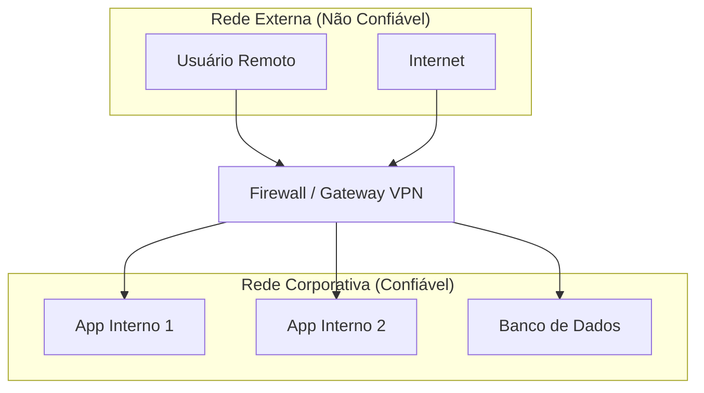
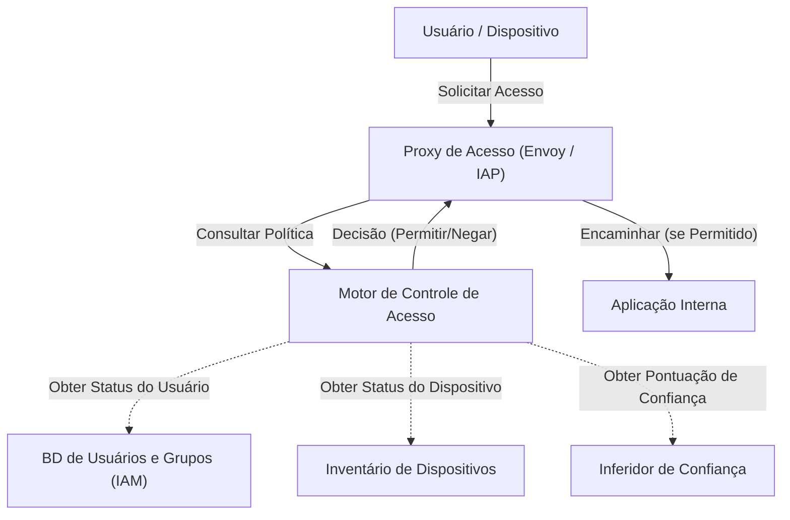

Na infraestrutura de rede corporativa moderna, o conceito de segurança cibernética está passando por um dramático ponto de virada. Neste artigo, usando a iniciativa **BeyondCorp** do Google como exemplo, explicaremos com muitos detalhes o afastamento da defesa de perímetro e a essência da **Arquitetura de Rede Zero Trust** .

## 1. As Limitações e o Colapso da Defesa de Perímetro Tradicional

No passado, a infraestrutura de TI corporativa era projetada em uma dicotomia simples de "interno" e "externo". Isso é a **defesa de perímetro** (Perimeter Security).

### 1.1 Modelo Básico da Defesa de Perímetro
Na defesa de perímetro, dispositivos de segurança como firewalls, VPNs e IPS/IDS são usados para construir uma parede forte entre a rede corporativa (interno seguro) e a Internet (externo perigoso). Usuários e dispositivos que conseguem passar por essa parede são, em princípio, considerados "confiáveis" e recebem permissão para acessar vários recursos dentro da rede corporativa.



### 1.2 O Fundo das Limitações Atingidas
No entanto, com a disseminação da computação em nuvem, a normalização do trabalho remoto e a expansão do uso de aplicativos SaaS, esse modelo está entrando em colapso.

1. **Obscurecimento do Perímetro** : Dados e aplicativos não estão mais localizados apenas em data centers on-premise, mas distribuídos em vários ambientes de nuvem. Tornou-se difícil definir claramente onde está o "perímetro" a ser protegido.
2. **Agravamento de Ameaças Internas** : É impotente contra invasores (malware ou agentes internos mal-intencionados) que já se infiltraram. Há um risco de danos extensos devido a movimentos laterais.
3. **Desafios de Desempenho e Segurança da VPN** : Roteamento de todo o tráfego através de uma VPN para a rede corporativa causa congestionamento de largura de banda e latência, prejudicando significativamente a experiência do usuário.

## 2. A Definição de Zero Trust (NIST SP 800-207)

Zero Trust não é apenas um produto ou tecnologia, mas um conceito e framework de arquitetura para segurança. O **NIST SP 800-207** publicado pelo Instituto Nacional de Padrões e Tecnologia dos EUA (NIST) fornece a definição padrão de Zero Trust.

O princípio básico do Zero Trust é " **Never Trust, Always Verify** " (Nunca confie, sempre verifique). Por padrão, nada é confiável, independentemente do local da rede (interno ou externo).

### Os 7 Princípios Básicos no NIST SP 800-207
1. **Todas as fontes de dados e serviços de computação são considerados recursos.** 
2. **Toda a comunicação é protegida independentemente do local da rede.** 
3. **O acesso aos recursos corporativos individuais é concedido por sessão.** 
4. **O acesso aos recursos é determinado pela política dinâmica de identidade do cliente, aplicativo, estado do ativo solicitado e outros atributos comportamentais e ambientais.** 
5. **A integridade e o estado de segurança de todos os ativos de propriedade e associados são monitorados e medidos.** 
6. **A autenticação e autorização de todos os recursos são dinâmicas e rigorosamente aplicadas antes de o acesso ser concedido.** 
7. **O máximo de informações possível sobre o estado atual dos ativos, infraestrutura de rede e comunicação é coletado e usado para melhorar a postura de segurança.** 

## 3. Google BeyondCorp: A Materialização do Zero Trust

Impulsionado por um ataque cibernético em grande escala chamado Operation Aurora em 2009, o Google reavaliou fundamentalmente a arquitetura de sua rede interna. O resultado disso foi a criação do **BeyondCorp** .

BeyondCorp eliminou redes corporativas privilegiadas e transferiu o controle de acesso do "perímetro da rede" para "usuários e dispositivos individuais".

### 3.1 Arquitetura do BeyondCorp

O diagrama Mermaid a seguir mostra o fluxo básico de controle de acesso do BeyondCorp.



### 3.2 Detalhes dos Componentes

* **Proxy de Acesso** : Um proxy reverso que serve de ponto de entrada para todos os aplicativos. Ele executa terminação TLS, balanceamento de carga e o mais importante, imposição (Enforcement) de controle de acesso.
* **Inventário de Dispositivos** : Um banco de dados de todos os dispositivos gerenciados pela empresa. Ele coleta e gerencia continuamente informações sobre o estado do dispositivo, como certificados, versões do SO, status dos patches e presença de criptografia de disco.
* **Banco de Dados de Usuários e Grupos (IAM)** : Gerencia informações como o ID do usuário, filiação a grupos e funções. Usa SAML ou [OIDC](https://kenji.blog/pt/p/oauth2-oidc-authentication-authorization-difference/) para fornecer forte autenticação (MFA, etc.).
* **Inferidor de Confiança** : Analisa os dados de inventário de dispositivos e as informações de contexto do usuário em tempo real e calcula uma "pontuação de confiança" atual.
* **Motor de Controle de Acesso** : O mecanismo de políticas que recebe solicitações do Proxy de Acesso, compara as solicitações com o usuário solicitante, a confiança do dispositivo e os requisitos de recursos da aplicação de destino, determinando a concessão ou negação do acesso.

## 4. Avaliação de Confiança e Modelo de Cálculo de Pontuação de Risco

No Zero Trust, a decisão de conceder acesso é baseada numa pontuação dinâmica de risco, não numa regra estática.

A pontuação de risco global $Risk(U, D, R)$ quando o utilizador $U$ e o dispositivo $D$ acessam o recurso $R$ pode ser definida como uma função de vários fatores.

$ Risk(U, D, R) = w_1 \cdot P_{user}(U) + w_2 \cdot P_{device}(D) + w_3 \cdot P_{context}(C) $

Onde:
* $P_{user}(U)$ é o perfil de risco do usuário (força da autenticação, uso de MFA, comportamento suspeito no passado, etc.).
* $P_{device}(D)$ é o perfil de risco do dispositivo (vulnerabilidades do SO, suspeita de infecção por malware, validade do certificado, etc.).
* $P_{context}(C)$ é o risco de contexto (endereço IP de origem, hora do dia, geolocalização, etc.).
* $w_i$ são os fatores de peso para cada elemento ($\sum w_i = 1$).

A $Trust$ de confiança é expressa como o inverso do risco, ou como um valor subtraído do risco a partir de um certo limite.
Por exemplo, as condições para conceder acesso podem ser formuladas assim:

$ Trust(U, D, R) = 1 - Risk(U, D, R) \geq Threshold(R) $

Onde o $Threshold(R)$ é o nível de confiança necessário definido com base na confidencialidade do recurso alvo $R$. Limites mais altos são definidos para acesso a dados financeiros altamente sensíveis.

## 5. O Papel da Microssegmentação

A **microssegmentação** é outro elemento essencial na construção de redes Zero Trust.

Ela controla a comunicação num nível ainda mais granular do que a segmentação tradicional de rede baseada em VLAN, em nível de carga de trabalho, aplicação ou processo. Dessa forma, mesmo no caso improvável de comprometimento de um componente, a movimentação lateral para outros componentes pode ser minimizada.

Usando redes definidas por software (SDN) e firewalls baseados em identidade, ela define estritamente as políticas de comunicação entre cada componente (quem pode se comunicar com quem, e sobre qual porta/protocolo) e bloqueia completamente caminhos de comunicação desnecessários.

## 6. Exemplo de Implementação: Políticas IAM e Configuração de Proxy

Aqui está um exemplo específico de conceitos de configuração para implementar a arquitetura Zero Trust.

### 6.1 Exemplo JSON de Política IAM (Estilo AWS IAM)

O seguinte JSON é um exemplo de política que concede acesso a um recurso específico apenas para usuários autenticados via MFA, procedentes de uma faixa de endereços IP específica. Com o Zero Trust, as condições contextuais são configuradas detalhadamente.

```json
{
  "Version": "2012-10-17",
  "Statement": [
    {
      "Sid": "ExemploPoliticaAcessoZeroTrust",
      "Effect": "Allow",
      "Action": [
        "s3:GetObject",
        "s3:ListBucket"
      ],
      "Resource": [
        "arn:aws:s3:::corporate-confidential-data",
        "arn:aws:s3:::corporate-confidential-data/*"
      ],
      "Condition": {
        "IpAddress": {
          "aws:SourceIp": "192.0.2.0/24"
        },
        "Bool": {
          "aws:MultiFactorAuthPresent": "true"
        },
        "NumericGreaterThan": {
          "custom:DeviceTrustScore": "80"
        }
      }
    }
  ]
}
```
*(Nota: `custom:DeviceTrustScore` é uma chave de condição personalizada conceitual.)*

### 6.2 Exemplo de Conceito de Controle de Acesso Usando Envoy Proxy

O Envoy, atuando como Proxy de Acesso, implementa o controle de acesso integrando-se com um serviço externo de autenticação e autorização (ExtAuthz).

```yaml
# Exemplo de snippet de configuração da cadeia de filtros do Envoy
filters:
  - name: envoy.filters.network.http_connection_manager
    typed_config:
      "@type": type.googleapis.com/envoy.extensions.filters.network.http_connection_manager.v3.HttpConnectionManager
      route_config:
        name: local_route
        virtual_hosts:
          - name: backend_service
            domains: ["*"]
            routes:
              - match: { prefix: "/" }
                route: { cluster: backend_app_cluster }
      http_filters:
        - name: envoy.filters.http.ext_authz
          typed_config:
            "@type": type.googleapis.com/envoy.extensions.filters.http.ext_authz.v3.ExtAuthz
            grpc_service:
              envoy_grpc:
                cluster_name: access_control_engine_cluster
              timeout: 0.5s
            transport_api_version: V3
            metadata_context_namespaces:
              - "envoy.filters.http.jwt_authn"
        - name: envoy.filters.http.router
```

Com esta configuração, antes de rotear qualquer solicitação HTTP, o Envoy enviará os metadados da solicitação para o `access_control_engine_cluster` (motor de controle de acesso) para consultar a viabilidade da autorização.

## Conclusão

A transição para a Arquitetura de Rede Zero Trust não é algo que acontece da noite para o dia. É um esforço de longo prazo que requer integração com sistemas legados existentes, transformação da cultura organizacional e monitoramento contínuo e ajuste.

No entanto, como o **BeyondCorp** do Google demonstra, a implementação de controle de acesso baseado em "identidade e contexto" em vez de "localização da rede" possibilita a construção de uma fundação de segurança mais resiliente e flexível para combater as ameaças crescentes na era da nuvem.
