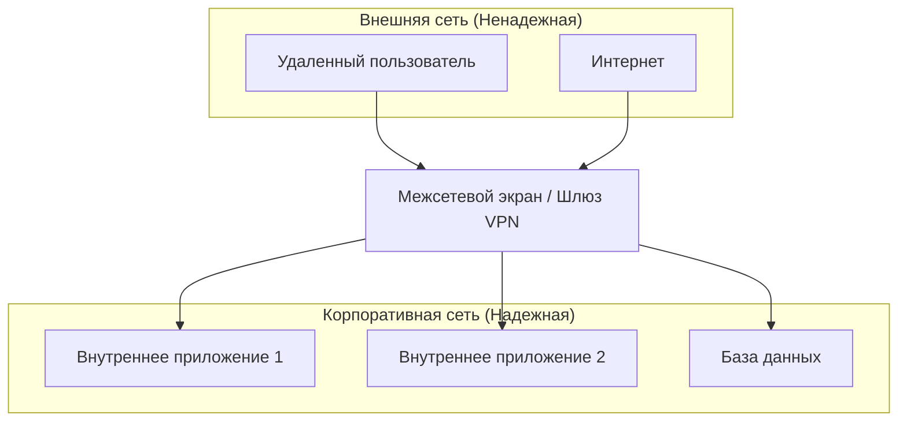
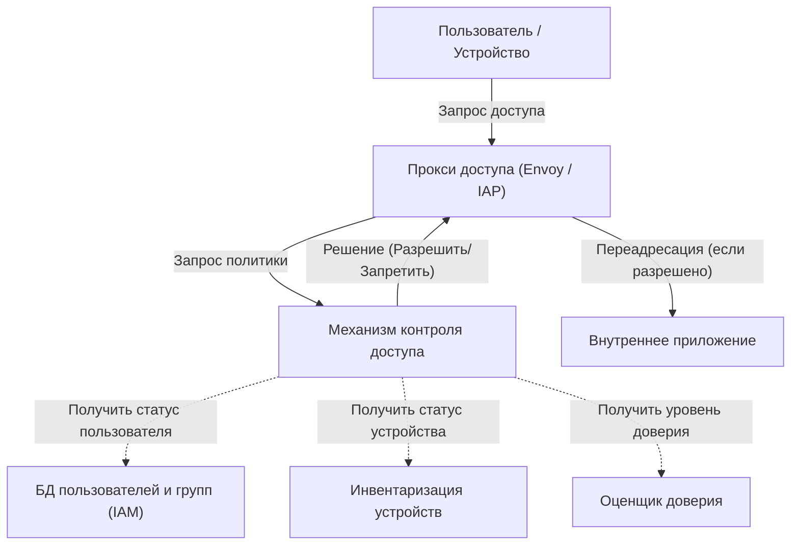

В современных корпоративных сетях концепция кибербезопасности переживает период кардинальных изменений. В этой статье мы подробно рассмотрим суть **архитектуры сети нулевого доверия** и отход от защиты периметра на примере инициативы Google **BeyondCorp** .

## 1. Ограничения и крах традиционной защиты периметра

В прошлом ИТ-инфраструктура компаний проектировалась на основе простого дуализма «внутри» и «снаружи». Это называется **защитой периметра** (Perimeter Security).

### 1.1 Базовая модель защиты периметра
При защите периметра используется оборудование безопасности, такое как межсетевые экраны, VPN, IPS/IDS, для создания прочной стены между внутренней сетью (безопасной внутри) и Интернетом (опасным снаружи). Пользователи и устройства, которым удалось преодолеть эту стену, как правило, считаются «надежными», и им предоставляется доступ к различным ресурсам внутри корпоративной сети.



### 1.2 Причины достижения предела
Однако с распространением облачных вычислений, нормализацией удаленной работы и расширением использования SaaS-приложений эта модель постепенно терпит крах.

1. **Размытие границ** : Данные и приложения теперь размещаются не только в локальных центрах обработки данных, но и распределяются по множеству облачных сред. Стало трудно четко определить, где находится «граница», которую необходимо защищать.
2. **Усиление внутренних угроз** : Модель бессильна против злоумышленников (вредоносных программ или злонамеренных инсайдеров), которые уже проникли внутрь. Существует риск того, что ущерб станет колоссальным из-за латерального движения (бокового перемещения).
3. **Проблемы с производительностью и безопасностью VPN** : Метод маршрутизации всего трафика через VPN во внутреннюю сеть приводит к нехватке пропускной способности и задержкам, что значительно ухудшает пользовательский опыт.

## 2. Определение нулевого доверия (NIST SP 800-207)

Нулевое доверие — это не просто продукт или технология, а концепция безопасности и архитектурный фреймворк. **NIST SP 800-207** , выпущенный Национальным институтом стандартов и технологий США (NIST), предоставляет стандартное определение нулевого доверия.

Основная философия нулевого доверия — « **Никогда не доверяй, всегда проверяй** » (Never Trust, Always Verify). По умолчанию доверие не оказывается ничему, независимо от расположения в сети (внутри или снаружи).

### 7 основных принципов согласно NIST SP 800-207
1. **Все источники данных и вычислительные сервисы рассматриваются как ресурсы.** 
2. **Вся связь защищена независимо от расположения в сети.** 
3. **Доступ к отдельным корпоративным ресурсам предоставляется для каждого сеанса в отдельности.** 
4. **Доступ к ресурсам определяется динамической политикой, учитывающей идентификатор клиента, приложение, состояние запрашиваемого актива, а также другие поведенческие и средовые атрибуты.** 
5. **Целостность и состояние безопасности всех собственных и связанных активов отслеживаются и измеряются.** 
6. **Аутентификация и авторизация всех ресурсов выполняются динамически и строго применяются перед предоставлением доступа.** 
7. **Собирается как можно больше информации о текущем состоянии активов, сетевой инфраструктуры и связи для использования в улучшении мер безопасности.** 

## 3. Google BeyondCorp: воплощение нулевого доверия

Google в корне пересмотрела архитектуру своей внутренней сети после масштабной кибератаки в 2009 году, известной как Operation Aurora. В результате этого появилась концепция **BeyondCorp** .

BeyondCorp устраняет привилегированные корпоративные сети и переносит контроль доступа с «границы сети» на «отдельных пользователей и устройства».

### 3.1 Архитектура BeyondCorp

Следующая диаграмма Mermaid показывает базовый поток контроля доступа BeyondCorp.



### 3.2 Детали компонентов

* **Прокси доступа (Access Proxy)** : Обратный прокси-сервер, который служит точкой входа для всех приложений. Он выполняет терминацию TLS, балансировку нагрузки и, что наиболее важно, обеспечение контроля доступа (Enforcement).
* **Инвентаризация устройств (Device Inventory)** : База данных всех устройств, управляемых компанией. Она постоянно собирает информацию, такую как сертификаты, версии ОС, статус установки исправлений и наличие шифрования дисков, для управления их состоянием.
* **База данных пользователей и групп (IAM)** : Управляет информацией, такой как идентификаторы пользователей, группы и роли. Использует SAML и [OIDC](https://kenji.blog/ru/p/oauth2-oidc-authentication-authorization-difference/) для обеспечения строгой аутентификации (например, MFA).
* **Оценщик доверия (Trust Inferer)** : В реальном времени анализирует данные инвентаризации устройств и контекстную информацию пользователей для расчета текущей «оценки доверия».
* **Механизм контроля доступа (Access Control Engine)** : Механизм политик, который получает запросы от прокси доступа и решает, разрешить или запретить доступ, сравнивая запрашивающего пользователя, уровень доверия устройства и требования к ресурсам целевого приложения.

## 4. Оценка доверия и модель расчета оценки риска

В модели нулевого доверия решения о предоставлении доступа принимаются не на основе статических правил, а на основе динамических оценок риска.

Общая оценка риска $Risk(U, D, R)$ , когда пользователь $U$ и устройство $D$ получают доступ к ресурсу $R$ , может быть определена как функция различных факторов.

$ Risk(U, D, R) = w_1 \cdot P_{user}(U) + w_2 \cdot P_{device}(D) + w_3 \cdot P_{context}(C) $

Где:
* $P_{user}(U)$ — профиль риска пользователя (надежность аутентификации, наличие MFA, подозрительное поведение в прошлом и т.д.).
* $P_{device}(D)$ — профиль риска устройства (уязвимости ОС, подозрения на заражение вредоносным ПО, срок действия сертификата и т.д.).
* $P_{context}(C)$ — контекстный риск (исходный IP-адрес, время, геолокация и т.д.).
* $w_i$ — весовые коэффициенты каждого фактора ($\sum w_i = 1$).

Доверие $Trust$ выражается как величина, обратная риску, или как значение, полученное путем вычитания риска из определенного порога.
Например, условия для предоставления доступа могут быть сформулированы следующим образом:

$ Trust(U, D, R) = 1 - Risk(U, D, R) \geq Threshold(R) $

Где $Threshold(R)$ — это требуемый уровень доверия, установленный на основе конфиденциальности целевого ресурса $R$ . Для доступа к высококонфиденциальным финансовым данным устанавливается более высокий порог.

## 5. Роль микросегментации

Еще одним важным элементом построения сети с нулевым доверием является **микросегментация** .

Она обеспечивает еще более детальный контроль связи — на уровне рабочей нагрузки, приложения или даже процесса — по сравнению с традиционной сегментацией сети на основе VLAN. Это позволяет свести к минимуму латеральное движение к другим компонентам в случае компрометации одного из них.

Используя программно-определяемые сети (SDN) и межсетевые экраны на основе идентификации, можно строго определить политики связи между компонентами (кто, с кем и по каким портам/протоколам может взаимодействовать) и полностью заблокировать ненужные пути связи.

## 6. Пример реализации: политики IAM и настройки прокси

Здесь показан пример конкретных концепций конфигурации для реализации архитектуры нулевого доверия.

### 6.1 Пример JSON-политики IAM (в стиле AWS IAM)

Следующий JSON-код — это пример политики, которая разрешает доступ к определенным ресурсам только тем пользователям, которые осуществляют доступ из определенного диапазона IP-адресов и прошли аутентификацию с помощью MFA. В архитектуре нулевого доверия подобные контекстные условия настраиваются очень детально.

```json
{
  "Version": "2012-10-17",
  "Statement": [
    {
      "Sid": "ZeroTrustAccessPolicyExample",
      "Effect": "Allow",
      "Action": [
        "s3:GetObject",
        "s3:ListBucket"
      ],
      "Resource": [
        "arn:aws:s3:::corporate-confidential-data",
        "arn:aws:s3:::corporate-confidential-data/*"
      ],
      "Condition": {
        "IpAddress": {
          "aws:SourceIp": "192.0.2.0/24"
        },
        "Bool": {
          "aws:MultiFactorAuthPresent": "true"
        },
        "NumericGreaterThan": {
          "custom:DeviceTrustScore": "80"
        }
      }
    }
  ]
}
```
*(Примечание: `custom:DeviceTrustScore` — это концептуальный пользовательский ключ условия.)*

### 6.2 Пример концепции контроля доступа с использованием прокси-сервера Envoy

В Envoy, который выступает в качестве прокси-сервера доступа, контроль доступа реализуется путем интеграции с внешней службой аутентификации и авторизации (ExtAuthz).

```yaml
# Пример фрагмента конфигурации цепочки фильтров Envoy
filters:
  - name: envoy.filters.network.http_connection_manager
    typed_config:
      "@type": type.googleapis.com/envoy.extensions.filters.network.http_connection_manager.v3.HttpConnectionManager
      route_config:
        name: local_route
        virtual_hosts:
          - name: backend_service
            domains: ["*"]
            routes:
              - match: { prefix: "/" }
                route: { cluster: backend_app_cluster }
      http_filters:
        - name: envoy.filters.http.ext_authz
          typed_config:
            "@type": type.googleapis.com/envoy.extensions.filters.http.ext_authz.v3.ExtAuthz
            grpc_service:
              envoy_grpc:
                cluster_name: access_control_engine_cluster
              timeout: 0.5s
            transport_api_version: V3
            metadata_context_namespaces:
              - "envoy.filters.http.jwt_authn"
        - name: envoy.filters.http.router
```

Благодаря этой конфигурации Envoy перед маршрутизацией любого HTTP-запроса отправляет метаданные запроса в `access_control_engine_cluster` (механизм контроля доступа) для запроса разрешения на авторизацию.

## Заключение

Переход к архитектуре сети нулевого доверия не происходит в одночасье. Это долгосрочная инициатива, требующая интеграции с существующими устаревшими системами, изменения организационной культуры, а также постоянного мониторинга и настройки.

Однако, как демонстрирует **BeyondCorp** от Google, внедрение контроля доступа, основанного на «идентификации и контексте», а не на «местоположении в сети», позволяет создать более надежную и гибкую основу безопасности против разнообразных угроз в эпоху облачных технологий.
