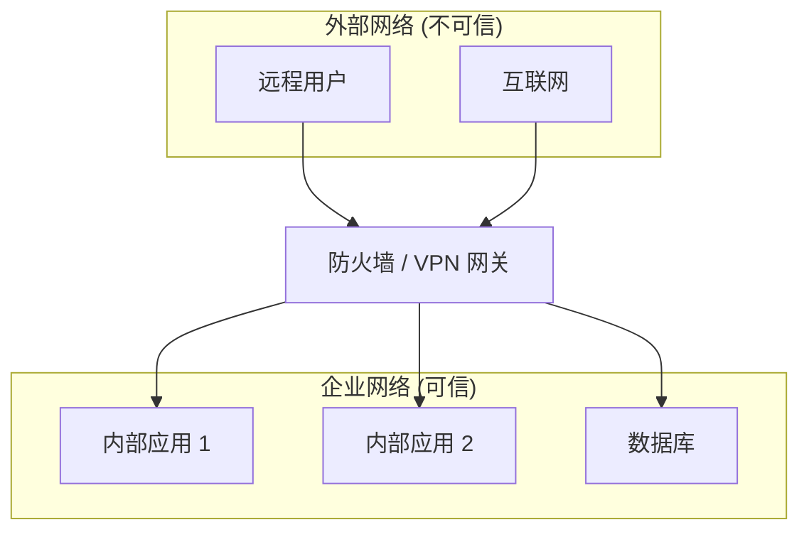
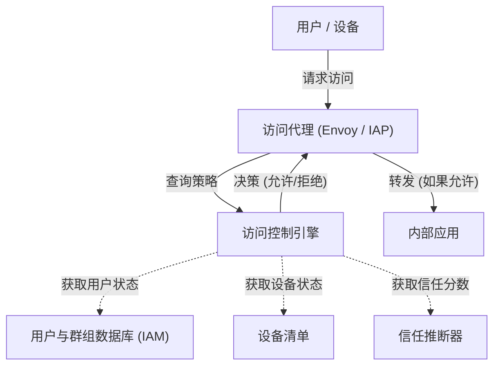

现代企业网络中，网络安全的概念正迎来一个剧烈的转折点。本文将以 Google 的 **BeyondCorp** 倡议为例，非常详细地解说摆脱边界防御与 **零信任网络架构** 的本质。

## 1. 传统边界型防御的局限性与崩溃

过去，企业的 IT 基础设施是基于“内侧”与“外侧”这种简单的二元论来设计的。这就是 **边界型防御** （Perimeter Security）。

### 1.1 边界型防御的基本模型
在边界型防御中，利用防火墙、VPN、IPS/IDS 等安全设备，在公司内部网络（安全的内侧）与互联网（危险的外侧）之间建立坚固的墙壁。能够穿过这堵墙的用户或设备原则上被视为“可信”，并被允许访问公司网络内的各种资源。



### 1.2 迎来局限的背景
然而，随着云计算的普及、远程办公的常态化以及 SaaS 应用的广泛使用，这种模型正在走向崩溃。

1. **边界的模糊化** ：数据和应用不再仅仅部署在本地数据中心，而是分散在多个云环境中。要明确界定需要保护的“边界”在哪里变得非常困难。
2. **内部威胁的严重化** ：对于一旦潜入内部的攻击者（恶意软件或恶意的内部人员）毫无防备。通过横向移动（Lateral Movement），存在损失严重扩大的风险。
3. **VPN 的性能与安全问题** ：将所有流量通过 VPN 路由回公司内部网络的方式，会导致带宽受限和延迟增加，从而严重损害用户体验。

## 2. 零信任的定义（NIST SP 800-207）

零信任不仅仅是产品或技术，而是一种对安全的理念，也是架构的框架。美国国家标准与技术研究院（NIST）发布的 **NIST SP 800-207** 提供了零信任的标准定义。

零信任的基本理念是“ **Never Trust, Always Verify** （从不信任，始终验证）”。无论网络位置（公司内部还是外部），默认情况下都不信任任何东西。

### NIST SP 800-207 中的 7 个基本原则
1. **将所有数据源和计算服务视为资源。** 
2. **无论网络位置如何，保护所有通信的安全。** 
3. **对各个企业资源的访问，均以会话为单位进行授权。** 
4. **对资源的访问由客户端的身份、应用程序、所请求资产的状态以及其他行为属性和环境属性的动态策略来决定。** 
5. **监控并测量所有拥有的和关联的资产的完整性与安全状态。** 
6. **所有资源的身份验证和授权都是动态进行的，并在允许访问之前严格执行。** 
7. **尽可能多地收集有关资产、网络基础设施和通信现状的信息，并利用它们来改善安全措施。** 

## 3. Google BeyondCorp：零信任的具体体现

Google 以 2009 年被称为 Operation Aurora 的大规模网络攻击为契机，从根本上重新审视了内部网络的架构。其结果就是诞生了 **BeyondCorp** 。

BeyondCorp 废除了具有特权的企业网络，将访问控制从“网络边界”转移到了“各个用户和设备”。

### 3.1 BeyondCorp 的架构

以下的 Mermaid 图展示了 BeyondCorp 的基本访问控制流程。



### 3.2 组成要素详解

* **Access Proxy** ：作为进入所有应用程序入口的反向代理。它执行 TLS 终止、负载均衡，以及最重要的访问控制执行（Enforcement）。
* **Device Inventory** ：企业管理的所有设备的数据库。它持续收集证书、操作系统版本、补丁应用情况、磁盘是否加密等信息，以管理状态。
* **User and Group Database (IAM)** ：管理用户的 ID、所属群组、角色等信息。利用 SAML 或 [OIDC](https://kenji.blog/zh-cn/p/oauth2-oidc-authentication-authorization-difference/) 提供强大的身份验证（如 MFA）。
* **Trust Inferer** ：实时分析设备清单数据和用户的上下文信息，计算出当前的“信任分数”。
* **Access Control Engine** ：接收来自 Access Proxy 的请求，结合发起请求的用户、设备的信任度以及目标应用的资源要求进行对照，从而决定允许或拒绝访问的策略引擎。

## 4. 信任度评估与风险分数计算模型

在零信任中，访问许可的判断并非基于静态规则，而是基于动态的风险分数。

用户 $U$ 与设备 $D$ 在访问资源 $R$ 时的整体风险分数 $Risk(U, D, R)$ 可以定义为各个要素的函数。

$ Risk(U, D, R) = w_1 \cdot P_{user}(U) + w_2 \cdot P_{device}(D) + w_3 \cdot P_{context}(C) $

这里：
* $P_{user}(U)$ 是用户的风险分布（身份验证强度、是否有 MFA、过去的可疑行为等）。
* $P_{device}(D)$ 是设备的风险分布（操作系统的漏洞、疑似感染恶意软件、证书的有效性等）。
* $P_{context}(C)$ 是上下文风险（访问来源的 IP 地址、时间段、地理位置等）。
* $w_i$ 是各要素的权重系数（$\sum w_i = 1$）。

信任度 $Trust$ 表现为风险的倒数，或者从某个阈值中减去风险后的值。
例如，允许访问的条件可以如下公式化。

$ Trust(U, D, R) = 1 - Risk(U, D, R) \geq Threshold(R) $

这里 $Threshold(R)$ 是基于目标资源 $R$ 的机密性而设定的所需信任度级别。对于高机密性的财务数据的访问，会设置更高的阈值。

## 5. 微隔离的作用

构建零信任网络不可或缺的另一个要素是 **微隔离** （Microsegmentation）。

它比传统的基于 VLAN 的网络分段更加精细，以工作负载、应用程序或进程为单位来控制通信。由此，即使万一某个组件遭到入侵，也能将对其他组件的横向移动降至最低。

利用软件定义网络（SDN）或基于身份的防火墙，严格定义各组件之间的通信策略（谁可以和谁通过哪个端口/协议进行通信），并完全阻断不必要的通信路径。

## 6. 实现示例：IAM 策略与代理配置

这里展示用于实现零信任架构的具体配置概念示例。

### 6.1 IAM 策略的 JSON 示例（类 AWS IAM）

以下的 JSON 是一个仅允许来自特定 IP 地址范围且通过 MFA 认证的用户访问特定资源的策略示例。在零信任中，会细致地设置这种基于上下文的条件。

```json
{
  "Version": "2012-10-17",
  "Statement": [
    {
      "Sid": "ZeroTrustAccessPolicyExample",
      "Effect": "Allow",
      "Action": [
        "s3:GetObject",
        "s3:ListBucket"
      ],
      "Resource": [
        "arn:aws:s3:::corporate-confidential-data",
        "arn:aws:s3:::corporate-confidential-data/*"
      ],
      "Condition": {
        "IpAddress": {
          "aws:SourceIp": "192.0.2.0/24"
        },
        "Bool": {
          "aws:MultiFactorAuthPresent": "true"
        },
        "NumericGreaterThan": {
          "custom:DeviceTrustScore": "80"
        }
      }
    }
  ]
}
```
*(注: `custom:DeviceTrustScore` 是概念上的自定义条件键。)*

### 6.2 使用 Envoy 代理的访问控制概念示例

在作为 Access Proxy 运行的 Envoy 中，通过与外部的身份验证和授权服务（ExtAuthz）协作来实现访问控制。

```yaml
# Envoy 过滤器链的配置代码片段示例
filters:
  - name: envoy.filters.network.http_connection_manager
    typed_config:
      "@type": type.googleapis.com/envoy.extensions.filters.network.http_connection_manager.v3.HttpConnectionManager
      route_config:
        name: local_route
        virtual_hosts:
          - name: backend_service
            domains: ["*"]
            routes:
              - match: { prefix: "/" }
                route: { cluster: backend_app_cluster }
      http_filters:
        - name: envoy.filters.http.ext_authz
          typed_config:
            "@type": type.googleapis.com/envoy.extensions.filters.http.ext_authz.v3.ExtAuthz
            grpc_service:
              envoy_grpc:
                cluster_name: access_control_engine_cluster
              timeout: 0.5s
            transport_api_version: V3
            metadata_context_namespaces:
              - "envoy.filters.http.jwt_authn"
        - name: envoy.filters.http.router
```

通过此配置，Envoy 在路由所有 HTTP 请求之前，会将请求的元数据发送到 `access_control_engine_cluster` （访问控制引擎），以查询是否允许授权。

## 总结

向零信任网络架构的转型并非一朝一夕就能完成。这是一项需要与现有遗留系统集成、进行组织文化变革以及持续监控和调整的长期工作。

然而，正如 Google 的 **BeyondCorp** 所证明的那样，通过实现基于“身份与上下文”而非“网络位置”的访问控制，可以在云时代面对日益多样化的威胁时，构建出更加坚韧且灵活的安全基础。
