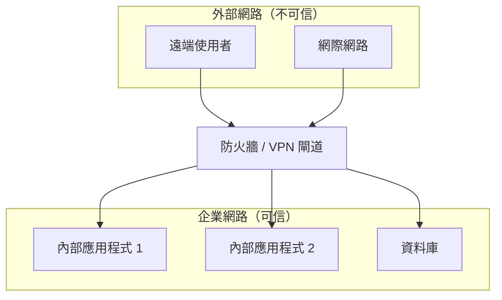
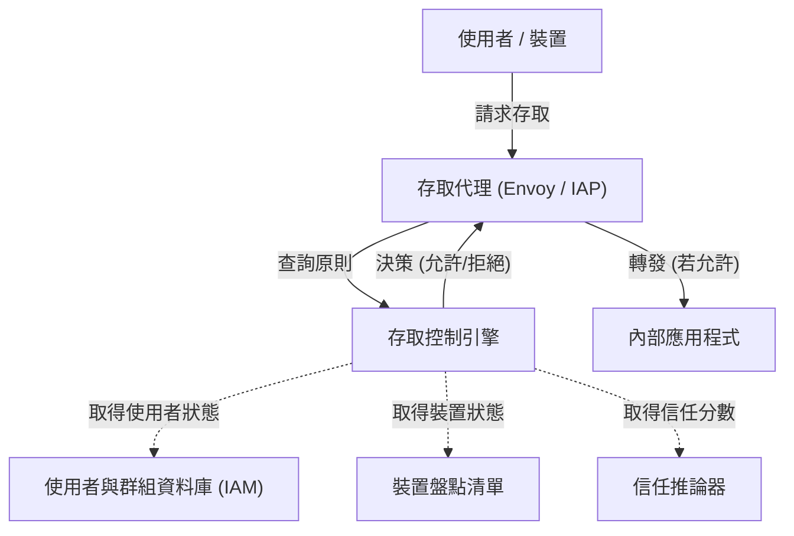

現代企業網路中，網路安全的概念正迎來劇烈的轉捩點。本篇文章將以Google的 **BeyondCorp** 計畫為例，針對擺脫邊界防禦與 **零信任網路架構** 的本質，進行非常詳細的解說。

## 1. 傳統邊界型防禦的極限與崩壞

過去，企業的IT基礎設施是基於「內部」與「外部」這種簡單的二元論來設計的。這就是 **邊界型防禦** （Perimeter Security）。

### 1.1 邊界型防禦的基本模型
在邊界型防禦中，會使用防火牆、VPN、IPS/IDS等安全設備，在公司內部網路（安全的內部）與網際網路（危險的外部）之間建立起堅固的牆。原則上，能夠通過這道牆的使用者與裝置會被視為「可信任的」，並被允許存取公司內部網路中的各種資源。



### 1.2 迎來極限的背景
然而，隨著雲端運算的普及、遠端工作的常態化以及SaaS應用程式的擴大使用，這個模型正逐漸瓦解。

1. **邊界的模糊化** ：資料與應用程式不再只配置於地端的資料中心，而是分散於多個雲端環境中。要明確定義應該守護的「邊界」在何處，已經變得十分困難。
2. **內部威脅的嚴重化** ：對於一旦入侵到內部的攻擊者（惡意軟體或惡意內部人員）毫無防備能力。由於橫向移動（Lateral Movement），存在著損害擴大的風險。
3. **VPN的效能與安全課題** ：將所有流量透過VPN路由至公司內部網路的方式，會導致頻寬受到擠壓與延遲，顯著損害使用者體驗。

## 2. 零信任的定義（NIST SP 800-207）

零信任不僅僅是產品或技術，而是對安全的全新概念與架構框架。美國國家標準暨技術研究院（NIST）發布的 **NIST SP 800-207** ，提供了零信任的標準定義。

零信任的基本理念是「 **Never Trust, Always Verify** （永不信任，始終驗證）」。無論網路位置（公司內或公司外）為何，預設不信任任何事物。

### NIST SP 800-207 中的7個基本原則
1. **將所有資料來源與運算服務視為資源。** 
2. **無論網路位置為何，保護所有的通訊。** 
3. **對個別企業資源的存取，是以工作階段為單位進行允許。** 
4. **對資源的存取，由客戶端的身分識別、應用程式、要求的資產狀態，以及其他行為屬性或環境屬性的動態原則來決定。** 
5. **監控並測量所有擁有及相關資產的完整性與安全狀態。** 
6. **所有資源的驗證與授權皆為動態進行，並在允許存取前嚴格執行。** 
7. **盡可能收集有關資產、網路基礎設施與通訊現狀的資訊，並活用於改善安全措施。** 

## 3. Google BeyondCorp：零信任的具體實現

Google以2009年被稱為極光行動的大規模網路攻擊為契機，從根本重新審視了公司內部網路的架構。其結果誕生的就是 **BeyondCorp** 。

BeyondCorp廢除了特權性的企業網路，將存取控制從「網路的邊界」轉移至「個別的使用者與裝置」。

### 3.1 BeyondCorp的架構

以下的Mermaid圖表顯示了BeyondCorp的基本存取控制流程。



### 3.2 構成要素的詳細說明

* **Access Proxy** ：作為所有應用程式入口的反向代理。負責執行TLS終止、負載平衡，以及最重要的存取控制執行（Enforcement）。
* **Device Inventory** ：企業管理的全部裝置資料庫。持續收集憑證、OS版本、修補程式套用狀況、磁碟加密狀態等資訊，並管理其狀態。
* **User and Group Database (IAM)** ：管理使用者的身分識別、所屬群組、角色等資訊。利用SAML或[OIDC](https://kenji.blog/zh-tw/p/oauth2-oidc-authentication-authorization-difference/)提供強大的驗證（如MFA）。
* **Trust Inferer** ：即時分析裝置的盤點資料與使用者的情境資訊，算出目前的「信任度分數」。
* **Access Control Engine** ：接收來自Access Proxy的請求，對照發出請求的使用者、裝置的信任度，以及目標應用程式的資源需求，決定允許或拒絕存取的原則引擎。

## 4. 信任度評估與風險分數計算模型

在零信任中，允許存取的判斷並非基於靜態規則，而是基於動態的風險分數來進行。

使用者 $U$ 與裝置 $D$ 在存取資源 $R$ 時的整體風險分數 $Risk(U, D, R)$ ，可定義為各種要素的函數。

$ Risk(U, D, R) = w_1 \cdot P_{user}(U) + w_2 \cdot P_{device}(D) + w_3 \cdot P_{context}(C) $

這裡：
* $P_{user}(U)$ 是使用者的風險設定檔（驗證強度、MFA狀態、過去的可疑行為等）。
* $P_{device}(D)$ 是裝置的風險設定檔（OS漏洞、疑似感染惡意軟體、憑證有效性等）。
* $P_{context}(C)$ 是情境風險（來源IP位址、時間帶、地理位置等）。
* $w_i$ 是各要素的權重係數（$\sum w_i = 1$）。

信任度 $Trust$ 表現為風險的倒數，或者是從一定閾值減去風險後的值。
例如，允許存取的條件可公式化如下。

$ Trust(U, D, R) = 1 - Risk(U, D, R) \geq Threshold(R) $

這裡 $Threshold(R)$ 是根據目標資源 $R$ 的機密性所設定的要求信任度等級。對機密性較高的財務資料進行存取時，會設定較高的閾值。

## 5. 微切分（Microsegmentation）的角色

在建構零信任網路時不可或缺的另一個要素是 **微切分** （Microsegmentation）。

它比傳統基於VLAN的網路區段劃分更加精細，以工作負載、應用程式為單位，或是程序（Process）為單位來控制通訊。藉此，即使萬一某個元件遭到入侵，也能將對其他元件的橫向移動（Lateral Movement）抑制在最小限度。

利用軟體定義網路（SDN）或基於身分的防火牆，嚴格定義各元件間的通訊原則（誰可以和誰通訊，以及使用哪個連接埠/協定），並完全阻斷不必要的通訊路徑。

## 6. 實作範例：IAM原則與代理設定

在這裡，我們展示用來實作零信任架構的具體設定概念範例。

### 6.1 IAM原則的JSON範例（類似AWS IAM）

以下的JSON是一個原則範例，僅允許來自特定IP位址範圍且經過MFA驗證的使用者，存取特定資源。在零信任中，會像這樣精細地設定基於情境的條件。

```json
{
  "Version": "2012-10-17",
  "Statement": [
    {
      "Sid": "ZeroTrustAccessPolicyExample",
      "Effect": "Allow",
      "Action": [
        "s3:GetObject",
        "s3:ListBucket"
      ],
      "Resource": [
        "arn:aws:s3:::corporate-confidential-data",
        "arn:aws:s3:::corporate-confidential-data/*"
      ],
      "Condition": {
        "IpAddress": {
          "aws:SourceIp": "192.0.2.0/24"
        },
        "Bool": {
          "aws:MultiFactorAuthPresent": "true"
        },
        "NumericGreaterThan": {
          "custom:DeviceTrustScore": "80"
        }
      }
    }
  ]
}
```
*(註: `custom:DeviceTrustScore` 是一個概念上的自訂條件金鑰。)*

### 6.2 使用Envoy代理的存取控制概念範例

在作為Access Proxy運作的Envoy中，會與外部的驗證・授權服務（ExtAuthz）整合來實作存取控制。

```yaml
# Envoy過濾器鏈的設定片段範例
filters:
  - name: envoy.filters.network.http_connection_manager
    typed_config:
      "@type": type.googleapis.com/envoy.extensions.filters.network.http_connection_manager.v3.HttpConnectionManager
      route_config:
        name: local_route
        virtual_hosts:
          - name: backend_service
            domains: ["*"]
            routes:
              - match: { prefix: "/" }
                route: { cluster: backend_app_cluster }
      http_filters:
        - name: envoy.filters.http.ext_authz
          typed_config:
            "@type": type.googleapis.com/envoy.extensions.filters.http.ext_authz.v3.ExtAuthz
            grpc_service:
              envoy_grpc:
                cluster_name: access_control_engine_cluster
              timeout: 0.5s
            transport_api_version: V3
            metadata_context_namespaces:
              - "envoy.filters.http.jwt_authn"
        - name: envoy.filters.http.router
```

透過此設定，Envoy在路由所有HTTP請求前，會將請求的詮釋資料發送給 `access_control_engine_cluster` （存取控制引擎），以查詢是否允許授權。

## 總結

轉移至零信任網路架構絕非一朝一夕能完成。這是一項長期的工作，需要與現有的傳統系統整合、組織文化的變革，以及持續的監控與調整。

然而，正如Google的 **BeyondCorp** 所證明的，透過實作基於「身分與情境」而非「網路位置」的存取控制，在雲端時代面對日益多樣化的威脅時，將能夠建構出更具韌性與彈性的安全基礎。
