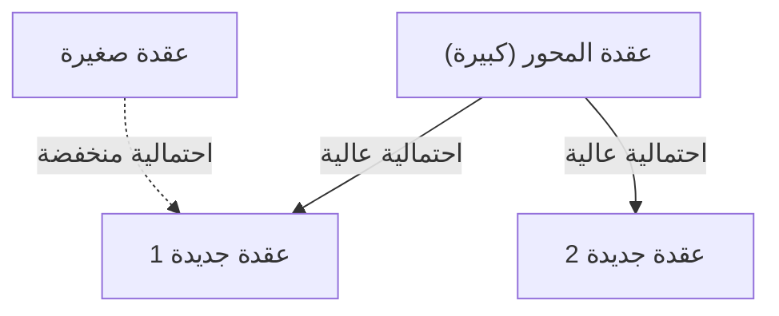

# 1. مقدمة: النظام الخفي الكامن في العالم

في الطبيعة والمجتمع البشري، وراء الظواهر التي تبدو فوضوية للوهلة الأولى، غالبًا ما يكمن انتظام رياضي جميل بشكل مذهل. الكلمات التي نستخدمها بشكل عابر كل يوم، وحجم المدن التي نعيش فيها، وعدد الزيارات إلى مواقع الويب، وحتى حجم الزلازل - ماذا لو كانت كل هذه الظواهر غير المترابطة على ما يبدو تتبع في الواقع قانونًا رياضيًا مشتركًا واحدًا؟

هذا القانون المذهل هو **قانون زيف** (Zipf's Law). هذا القانون هو قاعدة تجريبية تنص على أنه في مجموعة بيانات معينة، يتناسب تكرار أحد العناصر عكسياً مع رتبته. العنصر الذي يظهر بشكل متكرر يظهر بضعف عدد مرات ظهور العنصر الثاني الأكثر تكرارًا، وحوالي ثلاثة أضعاف العنصر الثالث.

في هذه المقالة، سوف نتعمق للغاية في **قانون زيف** ، من خلفيته التاريخية إلى صياغته الرياضية، والأمثلة المذهلة في العالم الحقيقي، ولماذا ينشأ مثل هذا القانون عالميًا في النظم الطبيعية والاجتماعية، باستخدام الصيغ، وأكواد المحاكاة، والمخططات. نهدف إلى تقديم محتوى يمكن استخدامه ليس فقط كقراءة ممتعة، ولكن أيضًا كمعرفة أساسية لعلوم البيانات ومعالجة اللغات الطبيعية.

# 2. اكتشاف قانون زيف والخلفية التاريخية

تم نشر **قانون زيف** على نطاق واسع في ثلاثينيات القرن العشرين بواسطة عالم اللغويات الأمريكي جورج كينجسلي زيف. ومع ذلك، لم يكن هو المكتشف الوحيد لهذا القانون. لاحظ كاتب الاختزال الفرنسي جان بابتيست إستوب والفيزيائي فيليكس أورباخ أيضًا ظواهر مماثلة قبل زيف.

قام زيف بتحليل تكرار الكلمات في الجمل الإنجليزية بالتفصيل. ونتيجة لإحصاء بيانات نصية واسعة النطاق يدويًا، مثل رواية جيمس جويس "عوليس"، اكتشف انتظامًا مفاجئًا. كانت حقيقة أن الكلمة الأكثر استخدامًا (في اللغة الإنجليزية، "the") تظهر بضعف عدد مرات ظهور الكلمة الثانية الأكثر استخدامًا ("of")، وحوالي ثلاث مرات أكثر من الكلمة الثالثة ("and").

ادعى زيف أن هذا الظاهرة تعود إلى **مبدأ الجهد الأقل** (Principle of Least Effort)، وهو مبدأ أساسي للسلوك البشري. بعبارة أخرى، في التواصل، يحاول البشر نقل المعلومات بأقل جهد ممكن، لذلك يستخدمون في كثير من الأحيان بضع كلمات بسيطة ونادرًا ما يستخدمون الكلمات المعقدة. هذا التفسير الفلسفي سيتم دعمه لاحقًا من منظور نظرية المعلومات والميكانيكا الإحصائية.

# 3. الصياغة الرياضية: قاعدة الرتبة-الحجم

هنا، دعونا نصيغ **قانون زيف** رياضيًا بشكل صارم. نقوم بترتيب العناصر في مجموعة البيانات (على سبيل المثال، الكلمات) بترتيب تنازلي حسب تكرارها.

ليكن رتبة (Rank) العنصر الأكثر تكرارًا $r = 1$، والثاني $r = 2$. إذا كان التكرار (Frequency) لعنصر من الرتبة $r$ هو $f(r)$، يتم التعبير عن قانون زيف على النحو التالي:

$$
f(r) \propto \frac{1}{r^\alpha}
$$

هنا، $\alpha$ هو ثابت يعتمد على مجموعة البيانات، وعادة ما يكون $\alpha \approx 1$. في هذه الحالة، يتناسب التكرار عكسياً تمامًا مع الرتبة.

للتعبير عنها كمعادلة، عن طريق تعيين ثابت التناسب كـ $C$:

$$
f(r) = \frac{C}{r^\alpha}
$$

يعتمد الثابت $C$ على العدد الإجمالي للعناصر في مجموعة البيانات بأكملها (مثل العدد الإجمالي للكلمات). من حيث نظرية الاحتمالات، فإن الاحتمال $P(r)$ لحدوث عنصر من الرتبة $r$ هو كما يلي:

$$
P(r) = \frac{\frac{1}{r^\alpha}}{\sum_{n=1}^{N} \frac{1}{n^\alpha}}
$$

هنا، $N$ هو تنوع العناصر (مثل حجم المفردات). تتقارب السلسلة في المقام نحو دالة زيتا لريمان $\zeta(\alpha)$ في النهاية $\alpha > 1$. لذلك، يُشار إلى **قانون زيف** أحيانًا باسم توزيع زيتا.

من خلال أخذ اللوغاريتم، يمكن تصور هذه العلاقة بشكل أكثر وضوحًا.

$$
\log f(r) = \log C - \alpha \log r
$$

هذا يعني أنه عند رسمه على رسم بياني لوغاريتمي-لوغاريتمي (Log-Log Plot)، يصبح خطًا مستقيمًا بميل $-\alpha$. أسهل طريقة للتحقق مما إذا كانت مجموعة البيانات تتبع **قانون زيف** هي رسم رسم بياني لوغاريتمي-لوغاريتمي ومعرفة ما إذا كان يشكل خطًا مستقيمًا. إذا كان خطًا مستقيمًا، فيمكن القول أن هناك **قانون القوة** (Power Law) وراء تلك الظاهرة.

# 4. أمثلة مذهلة من العالم الحقيقي

يتجاوز **قانون زيف** مجرد حدود علم اللغويات وينطبق على مجموعة متنوعة بشكل مدهش من الظواهر. هنا، دعونا نلقي نظرة مفصلة على أمثلة من 5 مجالات مختلفة.

## 4.1. اللغويات ومعالجة اللغات الطبيعية (NLP)

المثال الكلاسيكي هو تكرار الكلمات في المدونات النصية. عند تحليل مدونة باللغة الإنجليزية (على سبيل المثال، النص الكامل لويكيبيديا)، يكون تكرار الكلمات القليلة الأولى على النحو التالي:

1. **the**: حوالي 7٪ احتمال الظهور
2. **of**: حوالي 3.5٪ احتمال الظهور
3. **and**: حوالي 2.8٪ احتمال الظهور
4. **to**: حوالي 2.6٪ احتمال الظهور

وبالتالي، في حين أن بضع عشرات فقط من الكلمات المتكررة تمثل ما يقرب من نصف النص بأكمله، فإن مئات الآلاف من الكلمات الأخرى نادرًا ما تظهر. ظاهرة "الذيل الطويل" (Long Tail) هذه مهمة للغاية في بناء فهارس محركات البحث وتصميم المفردات لنماذج اللغات الكبيرة (LLMs). في مجال معالجة اللغات الطبيعية، تحمل الكلمات التي تظهر بشكل متكرر (كلمات التوقف) معلومات قليلة، لذلك يتم استخدام تقنيات مثل TF-IDF لخفض وزنها.

## 4.2. التوزيع السكاني للمدن

ليس فقط في علم اللغويات، ولكن يُلاحظ **قانون زيف** أيضًا في الجغرافيا والهندسة الحضرية. عند ترتيب سكان المدن في بلد معين، تُظهر العلاقة أن ثاني أكبر مدينة بها نصف عدد سكان المدينة الأولى، وثالث مدينة بها ثلث العدد.

على سبيل المثال، بالنظر إلى بيانات سكان مدن الولايات المتحدة (الأرقام تقريبية):
- الأول نيويورك: حوالي 8.4 مليون
- الثاني لوس أنجلوس: حوالي 4 مليون (نصف نيويورك تقريبًا)
- الثالث شيكاغو: حوالي 2.7 مليون (ثلث نيويورك تقريبًا)

بالطبع، اعتمادًا على البلد، يمكن أن يؤدي التركيز الشديد في العاصمة (مثل طوكيو في اليابان، وباريس في فرنسا) إلى "ظاهرة المدينة المهيمنة" التي تنحرف عن القانون، لكن الاتجاه العام يتبع **قانون القوة** بشكل ملحوظ.

## 4.3. حركة مرور مواقع الويب

عدد الزيارات إلى مواقع الويب على الإنترنت وعدد المتابعين على الشبكات الاجتماعية تتبع أيضًا **قانون زيف**. تحتكر نسبة ضئيلة من المواقع الضخمة مثل جوجل ويوتيوب وفيسبوك الغالبية العظمى من حركة المرور، بينما يحظى عدد لا يحصى من المواقع الأخرى بزيارات قليلة جدًا. ويرجع ذلك إلى أن بنية الروابط في شبكات المعلومات تتشكل من خلال "الارتباط التفضيلي"، والذي سيتم مناقشته لاحقًا.

## 4.4. حجم الشركات وتوزيع الدخل (مبدأ باريتو)

مبيعات الشركات، وعدد الموظفين، وتوزيع الدخل الفردي تتبع أيضًا **قانون القوة**. تمت تسمية القانون المتعلق بتوزيع الدخل باسم **مبدأ باريتو** تيمناً بالاقتصادي الإيطالي فيلفريدو باريتو. يُعرف أيضًا باسم قاعدة "80:20"، والتي تنص على أن "80٪ من الثروة الإجمالية يملكها 20٪ من الناس". من الناحية الرياضية، ينظر **قانون زيف** و **مبدأ باريتو** ببساطة إلى نفس الظاهرة من زوايا مختلفة (الرتبة مقابل الحجم).

## 4.5. مقياس الزلازل (قانون جوتنبرج-ريختر)

توجد قوانين مماثلة في الفيزياء وعلوم الأرض. يوضح **قانون جوتنبرج-ريختر** العلاقة بين قوة الزلزال وتكرار حدوثه. مع زيادة القوة بمقدار 1، ينخفض تكرار الزلازل من هذا المقياس إلى حوالي عُشر. هنا أيضًا، يمكننا ملاحظة بنية كسيرية (Fractal) حيث تقع الأحداث العملاقة نادرًا للغاية، بينما تقع الأحداث الصغيرة مرات لا تحصى.

# 5. لماذا يحدث قانون زيف؟ (آلية التوليد)

لماذا تظهر نفس البنية الرياضية في مجالات مختلفة تمامًا مثل اللغة والمدن والاقتصاد والظواهر الفيزيائية؟ اقترح باحثون في علم الأنظمة المعقدة العديد من آليات التوليد.

## 5.1. الارتباط التفضيلي (Preferential Attachment)

النموذج الأكثر شهرة في علم الشبكات هو نموذج **الارتباط التفضيلي**، الذي اقترحه ألبرت لازلو باراباسي وآخرون. يُعرف بشكل شائع باسم ظاهرة "الأغنياء يزدادون ثراءً" (Rich-get-richer).

عندما يضيف موقع ويب جديد رابطًا، فمن المحتمل جدًا أن يرتبط بموقع شهير يحتوي بالفعل على العديد من الروابط. عندما ينتقل مقيم جديد، فمن المحتمل جدًا أن يختار مدينة كبيرة بها بنية تحتية راسخة بالفعل. مع إضافة عملية ديناميكية لعناصر جديدة تتناسب مع الحجم الحالي (عدد الروابط، وعدد السكان، وما إلى ذلك)، يؤدي التوزيع الإجمالي إلى قانون قوة يتبع **قانون زيف** .

يوجد أدناه رسم تخطيطي مفاهيمي لهذه العملية.



## 5.2. مبدأ الجهد الأقل

هذه هي الفرضية التي اقترحها زيف نفسه. في نظام الاتصال، هناك رغبات متضاربة بين المتحدث والمستمع.
- **رغبة المتحدث**: يريد التعبير عن كل شيء بمفردات صغيرة (تعيين معاني كثيرة لكلمة واحدة).
- **رغبة المستمع**: يريد تعيين كلمات مختلفة لكل مفهوم للقضاء على الغموض الدلالي (تتطلب مفردات متنوعة).

كحل وسط بين هذين "الجهدين" المتضاربين، يُفسَّر توزيع بضع كلمات متكررة متعددة المعاني والعديد من الكلمات النادرة التي لا لبس فيها، أي **قانون زيف** ، على أنه ينشأ بشكل طبيعي.

## 5.3. نموذج الكتابة العشوائية (قردة تضرب على آلات كاتبة)

من المثير للدهشة أن علماء رياضيات مثل بينويت ماندلبروت قد أظهروا أن التوزيعات المشابهة لـ **قانون زيف** يمكن أن تنشأ حتى من عمليات عشوائية تمامًا.
على سبيل المثال، افترض أن قردة تضغط على مفاتيح الآلة الكاتبة (26 حرفًا من الأبجدية ومسافة فارغة) بشكل عشوائي تمامًا لإنشاء "كلمات". ليكن $p$ هو احتمال ظهور مسافة؛ كلما كانت الكلمة أقصر، زاد احتمال توليدها. ترتيبها حسب الرتبة يعطي توزيع قانون القوة تمامًا مثل اللغة الطبيعية. يشير هذا إلى إمكانية أن **قانون زيف** لا ينبع فقط من النشاط الفكري البشري المعقد، ولكن من الخصائص الإحصائية للنظام نفسه.

# 6. المحاكاة وكود بايثون (Python)

دعونا نستخدم Python فعليًا لكتابة كود يتحقق من **قانون زيف** من البيانات النصية. يقوم الكود التالي بحساب ترددات الكلمات باستخدام نص تم إنشاؤه عشوائيًا أو مدونة موجودة، ورسمها على رسم بياني لوغاريتمي-لوغاريتمي.

```python
import matplotlib.pyplot as plt
from collections import Counter
import re
import numpy as np

def plot_zipf_law(text):
    # تحويل النص إلى أحرف صغيرة وتقسيمه إلى كلمات
    words = re.findall(r'\b\w+\b', text.lower())
    
    # حساب تكرار ظهور الكلمات
    word_counts = Counter(words)
    
    # الفرز بترتيب تنازلي للتكرار
    sorted_counts = sorted(word_counts.values(), reverse=True)
    ranks = np.arange(1, len(sorted_counts) + 1)
    
    # الرسم على رسم بياني لوغاريتمي-لوغاريتمي
    plt.figure(figsize=(10, 6))
    plt.loglog(ranks, sorted_counts, marker='o', linestyle='none', color='cyan', alpha=0.7)
    
    # خط قانون زيف المثالي للمقارنة (alpha=1)
    expected_counts = [sorted_counts[0] / r for r in ranks]
    plt.loglog(ranks, expected_counts, color='red', linestyle='--', label="Ideal Zipf's Law (alpha=1)")
    
    plt.title("Zipf's Law Verification")
    plt.xlabel("Rank (log scale)")
    plt.ylabel("Frequency (log scale)")
    plt.legend()
    plt.grid(True, which="both", ls="--", alpha=0.5)
    plt.show()

# استخدام نص وهمي طويل جدا كعينة
# في مشاريع علم البيانات الحقيقية، يتم استخدام NLTK أو مدونة جوتنبرج
dummy_text = "the and of to a in that is was he for it with as his on be at by i this had not are but from or have an they which one you were all her she there would their we him been has when who will no more if out so up said what its about than into them can only other new some could time these two may then do first any my now such like our over man me even most made after also did many before must through back years where much your way well down should because each just those people mr how too little state good very make world still own see men work long get here between both life being under never day same another know while last might great old year off come since against go came right used take three states himself few house use during without again place american around however home small found thought went say part once general high upon school every don't does got united left number course war until always away something fact water though less public put think almost hand enough far took head yet better display modern history area completely specific significant process" * 100

# plot_zipf_law(dummy_text)
```

يؤكد تشغيل هذا الكود أن الترددات الفعلية للكلمات تتوزع على طول الخط المنقط الأحمر (قانون زيف المثالي). في ممارسة علم البيانات، يمكن اكتشاف التحيز في البيانات أو الحالات الشاذة من خلال تحليل التردد هذا.

# 7. التطبيق في علوم الكمبيوتر

يلعب **قانون زيف** دورًا مهمًا ليس فقط لاهتمامه النظري ولكن أيضًا في الخوارزميات العملية لعلوم الكمبيوتر.

## 7.1. تحسين خوارزمية التخزين المؤقت (Caching)

في استراتيجيات التخزين المؤقت لخوادم الويب وقواعد البيانات، يعتبر **قانون زيف** بالغ الأهمية. نظرًا لأن كمية صغيرة من المحتوى الشائع (مثل مقاطع الفيديو واسعة الانتشار أو أهم الأخبار) تمثل الغالبية العظمى من الوصول الإجمالي، فإن تخزينها في ذاكرة تخزين مؤقت سريعة مثل الذاكرة (RAM) يمكن أن يحسن أداء النظام بأكمله بشكل كبير. تم تصميم خوارزميات مثل LFU (الأقل استخدامًا بشكل متكرر) و LRU (الأقل استخدامًا مؤخرًا) على وجه التحديد للاستفادة من تحيز البيانات (قانون القوة).

## 7.2. ضغط البيانات

في التشفير الإنتروبي مثل تشفير هوفمان (Huffman Coding)، يتم تخصيص سلاسل بت قصيرة لأنماط البيانات التي تحدث بشكل متكرر، بينما يتم تخصيص سلاسل بت طويلة للأنماط التي تحدث نادرًا. إذا كانت ترددات حدوث البيانات منحرفة للغاية كما هو الحال في **قانون زيف** ، فإن استخدام مثل هذا التشفير متغير الطول يسمح بضغط حجم البيانات بشكل كبير. يعتمد أساس تقنيات الضغط مثل ملفات ZIP وصور JPEG أيضًا على هذه الخصائص الإحصائية.

# 8. الخلاصة: المفتاح لفهم الأنظمة المعقدة

في هذه المقالة، قمنا بتفصيل **قانون زيف** ، من تعريفه إلى خلفيته الرياضية، والأمثلة المتنوعة في العالم الحقيقي، وآليات التوليد.

تردد الكلمات، وعدد سكان المدن، ونطاق الشركات، وحركة مرور الويب. يبدو أن هذه تعمل وفقًا لآليات مختلفة تمامًا، ولكن عند النظر إليها من منظور كلي، فإنها تحكمها نفس **قانون القوة**. وهذا يدل على أن عالمنا ليس مجرد مجموعة من الظواهر العشوائية، بل يحافظ على نظام رياضي في بُعد أعمق، مثل التنظيم الذاتي والهياكل الكسيرية.

بالنسبة لعلماء ومهندسي البيانات، فإن فهم ما إذا كانت مجموعة البيانات تتبع التوزيع الطبيعي (منحنى الجرس) أو قانون القوة مثل **قانون زيف** (الذي له ذيل طويل) يحدث فرقًا حاسمًا في تصميم النظام وبناء النموذج. يرجى وضع **قانون زيف** في الاعتبار كعدسة قوية لفك تشفير النظام الخفي للعالم.

---
*كُتبت هذه المقالة لغرض استكشاف علم البيانات وعلم الأنظمة المعقدة. للحصول على الصيغ والنظريات الرياضية التفصيلية، نوصي بالرجوع إلى الكتب المتخصصة حول الفيزياء الإحصائية ومعالجة اللغات الطبيعية.*
