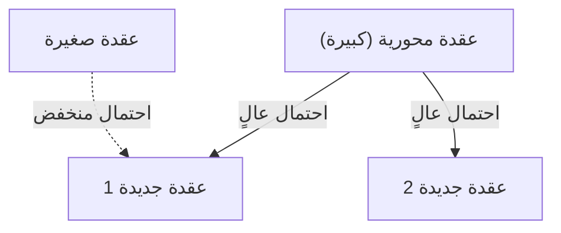

# 1. مقدمة: النظام الخفي في العالم

في الطبيعة والمجتمع البشري، غالبًا ما تكمن انتظامات رياضية جميلة بشكل مذهل خلف ظواهر تبدو فوضوية للوهلة الأولى. الكلمات التي نستخدمها بشكل عرضي يوميًا، وأحجام المدن التي نعيش فيها، وعدد زيارات المواقع الإلكترونية، وحتى شدة الزلازل - ماذا لو كانت كل هذه الظواهر التي تبدو غير مترابطة تتبع في الواقع قانونًا رياضيًا مشتركًا واحدًا؟

هذا القانون المذهل هو **قانون زيف** (Zipf's Law). ينص هذا القانون على أن تكرار ظهور العناصر في مجموعة بيانات معينة يتناسب عكسيًا مع ترتيبها. فالعنصر الأكثر تكرارًا يظهر بمعدل ضعف العنصر الثاني تقريبًا، وثلاثة أضعاف العنصر الثالث تقريبًا.

في هذه المقالة، سنتعمق في **قانون زيف** - من خلفيته التاريخية وصياغته الرياضية إلى أمثلة مذهلة من العالم الحقيقي، ولماذا ينشأ هذا القانون بشكل عالمي في الأنظمة الطبيعية والاجتماعية - باستخدام الصيغ الرياضية وأكواد المحاكاة والرسوم التوضيحية. هدفنا هو تقديم محتوى يمكن أن يكون ليس فقط قراءة ممتعة ولكن أيضًا معرفة أساسية في علم البيانات ومعالجة اللغة الطبيعية.

# 2. اكتشاف قانون زيف وخلفيته التاريخية

تم نشر **قانون زيف** على نطاق واسع في ثلاثينيات القرن العشرين بواسطة عالم اللغويات الأمريكي جورج كينغسلي زيف. ومع ذلك، لم يكن هو المكتشف الوحيد لهذا القانون. فقد لاحظ المختزل الفرنسي جان باتيست إستو والفيزيائي فيليكس أويرباخ، من بين آخرين، ظواهر مماثلة قبل زيف.

قام زيف بتحليل تكرار ظهور الكلمات في النصوص الإنجليزية بشكل دقيق. بعد عد يدوي شاق لبيانات نصية واسعة النطاق مثل رواية جيمس جويس *يوليسيس*، اكتشف انتظامًا مذهلاً: تكرار الكلمة الأكثر استخدامًا في الإنجليزية ("the") كان تقريبًا ضعف تكرار ثاني أكثر كلمة استخدامًا ("of")، وثلاثة أضعاف الثالثة ("and") تقريبًا.

عزا زيف هذه الظاهرة إلى **مبدأ أقل جهد** (Principle of Least Effort)، وهو مبدأ أساسي في السلوك البشري. بمعنى آخر، يميل البشر إلى استخدام عدد قليل من الكلمات البسيطة بشكل متكرر ونادرًا ما يستخدمون الكلمات المعقدة لأنهم يحاولون نقل المعلومات بأقل جهد ممكن في التواصل. تم دعم هذا التفسير الفلسفي لاحقًا من منظور نظرية المعلومات والميكانيكا الإحصائية أيضًا.

# 3. الصياغة الرياضية: قانون الرتبة والحجم

دعونا الآن نصوغ **قانون زيف** رياضيًا بشكل صارم. نرتب العناصر (مثل الكلمات) في مجموعة البيانات بترتيب تنازلي حسب تكرار ظهورها.

رتبة العنصر الأكثر تكرارًا هي $r = 1$، والثاني الأكثر تكرارًا هو $r = 2$، وهكذا. إذا كان $f(r)$ يمثل تكرار ظهور عنصر ذي رتبة $r$، فإن قانون زيف يُعبر عنه كما يلي:

$$
f(r) \propto \frac{1}{r^\alpha}
$$

حيث $\alpha$ ثابت يعتمد على مجموعة البيانات وعادة ما يكون $\alpha \approx 1$. في هذه الحالة، يتناسب التكرار عكسيًا بشكل دقيق مع الرتبة.

للتعبير عنه كمعادلة، لنفرض أن ثابت التناسب هو $C$:

$$
f(r) = \frac{C}{r^\alpha}
$$

يعتمد الثابت $C$ على العدد الإجمالي للعناصر في مجموعة البيانات (مثل العدد الإجمالي للكلمات). من الناحية الاحتمالية، فإن احتمال ظهور عنصر ذي رتبة $r$ هو $P(r)$:

$$
P(r) = \frac{\frac{1}{r^\alpha}}{\sum_{n=1}^{N} \frac{1}{n^\alpha}}
$$

حيث $N$ هو عدد أنواع العناصر المميزة (مثل حجم المفردات). في الحد حيث $\alpha > 1$، تتقارب السلسلة في المقام إلى دالة ريمان زيتا $\zeta(\alpha)$. لهذا السبب، يُسمى **قانون زيف** أحيانًا بتوزيع زيتا.

بأخذ اللوغاريتم، يمكن تصور هذه العلاقة بشكل أوضح:

$$
\log f(r) = \log C - \alpha \log r
$$

هذا يعني أنه عند رسمه على مخطط لوغاريتمي مزدوج (Log-Log Plot)، يصبح خطًا مستقيمًا بميل $-\alpha$. أبسط طريقة للتحقق مما إذا كانت مجموعة البيانات تتبع **قانون زيف** هي رسم مخطط لوغاريتمي مزدوج ومعرفة ما إذا كان يشكل خطًا مستقيمًا. إذا كان كذلك، فهذا يعني وجود **قانون القوة** (Power Law) خلف هذه الظاهرة.

# 4. أمثلة مذهلة من العالم الحقيقي

يمتد **قانون زيف** إلى ما هو أبعد بكثير من نطاق اللسانيات وينطبق على مجموعة متنوعة بشكل مذهل من الظواهر. دعونا نفحص أمثلة من خمسة مجالات مختلفة بالتفصيل.

## 4.1. اللسانيات ومعالجة اللغة الطبيعية (NLP)

المثال الأكثر كلاسيكية هو تكرار الكلمات في المتون النصية. عند تحليل متن إنجليزي (مثل النص الكامل لويكيبيديا)، تكون تكرارات الكلمات الأعلى كما يلي:

1. **the**: احتمال ظهور حوالي 7%
2. **of**: احتمال ظهور حوالي 3.5%
3. **and**: احتمال ظهور حوالي 2.8%
4. **to**: احتمال ظهور حوالي 2.6%

بهذه الطريقة، تشكل بضع عشرات فقط من الكلمات عالية التكرار ما يقرب من نصف النص بأكمله، بينما مئات الآلاف من الكلمات المتبقية نادرًا ما تظهر. ظاهرة "الذيل الطويل" (Long Tail) هذه مهمة للغاية في بناء فهارس محركات البحث وتصميم مفردات نماذج اللغة الكبيرة (LLMs). في مجال معالجة اللغة الطبيعية، الكلمات التي تظهر بتكرار مفرط (كلمات التوقف) تحمل معلومات قليلة، لذلك تُستخدم تقنيات مثل TF-IDF لتقليل وزنها.

## 4.2. التوزيع السكاني للمدن

يُلاحظ **قانون زيف** ليس فقط في اللغة ولكن أيضًا في مجالات الجغرافيا والهندسة الحضرية. عند ترتيب سكان المدن في بلد ما بترتيب تنازلي، يكون سكان المدينة الثانية في الترتيب نصف سكان المدينة الأولى، والمدينة الثالثة ثلث ذلك.

على سبيل المثال، لننظر إلى بيانات سكان المدن الأمريكية (الأرقام تقريبية):
- المركز الأول نيويورك: حوالي 8.4 مليون نسمة
- المركز الثاني لوس أنجلوس: حوالي 4 ملايين نسمة (حوالي نصف نيويورك)
- المركز الثالث شيكاغو: حوالي 2.7 مليون نسمة (حوالي ثلث نيويورك)

بالطبع، في بعض البلدان، التركز الشديد في العاصمة (مثل طوكيو في اليابان، وباريس في فرنسا) ينحرف عن القانون، وهي ظاهرة تُعرف بظاهرة "المدينة الرئيسية" (Primate City). ومع ذلك، فإن الاتجاه العام يتبع بشكل رائع **قانون القوة**.

## 4.3. حركة مرور المواقع الإلكترونية

يتبع عدد زيارات المواقع الإلكترونية على الإنترنت وعدد المتابعين على وسائل التواصل الاجتماعي أيضًا **قانون زيف**. حفنة من المواقع العملاقة مثل جوجل ويوتيوب وفيسبوك تحتكر غالبية حركة المرور، بينما عدد لا يحصى من المواقع الأخرى لا يتلقى سوى قدر ضئيل. وذلك لأن بنية الروابط في شبكات المعلومات تتشكل من خلال "الارتباط التفضيلي" الذي سيُناقش لاحقًا.

## 4.4. حجم الشركات وتوزيع الدخل (قانون باريتو)

تتبع إيرادات الشركات وعدد الموظفين وحتى توزيع الدخل الشخصي **قانون القوة**. القانون المتعلق بتوزيع الدخل يُسمى **قانون باريتو** (Pareto Principle)، نسبة إلى الاقتصادي الإيطالي فيلفريدو باريتو. يُعرف أيضًا بـ "قاعدة 80:20" - "80% من الثروة الإجمالية يمتلكها 20% من الناس". رياضيًا، **قانون زيف** و **قانون باريتو** هما مجرد نظرة إلى نفس الظاهرة من زوايا مختلفة (الرتبة مقابل الحجم).

## 4.5. شدة الزلازل (قانون غوتنبرغ-ريختر)

يوجد قانون مماثل في مجالات الفيزياء وعلوم الأرض. يصف **قانون غوتنبرغ-ريختر** (Gutenberg-Richter Law) العلاقة بين شدة الزلازل وتكرار حدوثها. عندما تزداد الشدة بمقدار 1، ينخفض تكرار الزلازل بتلك الشدة إلى عُشر تقريبًا. هنا أيضًا، يمكننا رؤية بنية فراكتالية حيث الأحداث الضخمة نادرة للغاية، بينما الأحداث الصغيرة لا تُعد ولا تُحصى.

# 5. لماذا ينشأ قانون زيف؟ (آليات التوليد)

لماذا تظهر نفس البنية الرياضية عبر مجالات مختلفة تمامًا مثل اللغة والمدن والاقتصاد والظواهر الفيزيائية؟ اقترح الباحثون في علم الأنظمة المعقدة عدة آليات توليدية.

## 5.1. الارتباط التفضيلي (Preferential Attachment)

النموذج الأكثر شهرة في علم الشبكات هو نموذج **الارتباط التفضيلي** (Preferential Attachment)، الذي اقترحه ألبرت لازلو باراباسي وآخرون. يُعرف عاميًا بظاهرة "الغني يزداد غنى" (Rich-get-richer).

عندما ينشئ موقع إلكتروني جديد روابط، فمن المرجح أن يربط بمواقع معروفة لديها بالفعل العديد من الروابط. عندما ينتقل سكان جدد، فمن المرجح أن يختاروا مدنًا كبيرة ذات بنية تحتية راسخة. من خلال هذه العملية الديناميكية حيث تُضاف عناصر جديدة بما يتناسب مع الحجم الحالي (عدد الروابط، السكان، إلخ)، يصبح التوزيع الناتج قانون قوة يتبع **قانون زيف**.

فيما يلي رسم تخطيطي مفاهيمي لهذه العملية:



## 5.2. مبدأ أقل جهد (Principle of Least Effort)

هذه هي الفرضية التي اقترحها زيف نفسه. في أنظمة التواصل، هناك رغبات متعارضة بين المتحدث والمستمع:
- **رغبة المتحدث**: التعبير عن كل شيء بمفردات قليلة (تعيين معانٍ كثيرة لكلمة واحدة).
- **رغبة المستمع**: تعيين كلمات منفصلة لكل مفهوم لإزالة الغموض (البحث عن مفردات متنوعة).

ينشأ التوافق بين هاتين "الجهدين" المتعارضتين بشكل طبيعي توزيعًا من كلمات متعددة المعاني عالية التكرار وكلمات نادرة أحادية المعنى - أي **قانون زيف**.

## 5.3. نموذج الكتابة العشوائية (القرود على الآلة الكاتبة)

من المدهش أن عالم الرياضيات بنوا ماندلبرو وآخرين أظهروا أن توزيعات مشابهة لـ **قانون زيف** يمكن أن تنشأ من عمليات عشوائية تمامًا. على سبيل المثال، لنفترض أن قردًا يضغط بشكل عشوائي على مفاتيح الآلة الكاتبة (26 حرفًا أبجديًا ومسافة) لإنشاء "كلمات". إذا كان احتمال الضغط على المسافة هو $p$، فإن الكلمات الأقصر تُولد باحتمال أعلى. عند ترتيبها حسب الرتبة، ينتج هذا توزيع قانون قوة يشبه اللغة الطبيعية. يشير هذا إلى أن **قانون زيف** قد لا ينشأ فقط من النشاط الفكري البشري المتطور ولكن أيضًا من الخصائص الإحصائية المتأصلة في النظام نفسه.

# 6. المحاكاة وكود Python

لنكتب فعليًا كود Python للتحقق من **قانون زيف** من بيانات نصية. الكود التالي يحسب تكرارات الكلمات من نص مولّد عشوائيًا أو متن موجود ويرسمها على مخطط لوغاريتمي مزدوج.

```python
import matplotlib.pyplot as plt
from collections import Counter
import re
import numpy as np

def plot_zipf_law(text):
    # تحويل النص إلى أحرف صغيرة وتقسيمه إلى كلمات
    words = re.findall(r'\b\w+\b', text.lower())
    
    # حساب تكرارات الكلمات
    word_counts = Counter(words)
    
    # ترتيب حسب التكرار بترتيب تنازلي
    sorted_counts = sorted(word_counts.values(), reverse=True)
    ranks = np.arange(1, len(sorted_counts) + 1)
    
    # الرسم على مخطط لوغاريتمي مزدوج
    plt.figure(figsize=(10, 6))
    plt.loglog(ranks, sorted_counts, marker='o', linestyle='none', color='cyan', alpha=0.7)
    
    # خط قانون زيف المثالي للمقارنة (alpha=1)
    expected_counts = [sorted_counts[0] / r for r in ranks]
    plt.loglog(ranks, expected_counts, color='red', linestyle='--', label="Ideal Zipf's Law (alpha=1)")
    
    plt.title("Zipf's Law Verification")
    plt.xlabel("Rank (log scale)")
    plt.ylabel("Frequency (log scale)")
    plt.legend()
    plt.grid(True, which="both", ls="--", alpha=0.5)
    plt.show()

# استخدام نص وهمي طويل جدًا كعينة
# في مشاريع علم البيانات الفعلية، استخدم NLTK أو متن غوتنبرغ
dummy_text = "the and of to a in that is was he for it with as his on be at by i this had not are but from or have an they which one you were all her she there would their we him been has when who will no more if out so up said what its about than into them can only other new some could time these two may then do first any my now such like our over man me even most made after also did many before must through back years where much your way well down should because each just those people mr how too little state good very make world still own see men work long get here between both life being under never day same another know while last might great old year off come since against go came right used take three states himself few house use during without again place american around however home small found thought went say part once general high upon school every don't does got united left number course war until always away something fact water though less public put think almost hand enough far took head yet better display modern history area completely specific significant process" * 100

# plot_zipf_law(dummy_text)
```

عند تشغيل هذا الكود، يمكنك التأكد من أن تكرارات الكلمات الفعلية تتوزع على طول الخط المتقطع الأحمر (قانون زيف المثالي). في ممارسة علم البيانات، يمكن استخدام تحليل التكرار هذا للكشف عن التحيزات والقيم الشاذة في البيانات.

# 7. التطبيقات في علوم الحاسوب

يلعب **قانون زيف** دورًا مهمًا ليس فقط كفضول نظري ولكن أيضًا في خوارزميات علوم الحاسوب العملية.

## 7.1. تحسين خوارزميات التخزين المؤقت

**قانون زيف** مهم للغاية في استراتيجيات التخزين المؤقت لخوادم الويب وقواعد البيانات. نظرًا لأن عددًا قليلاً من المحتويات الشائعة (مثل مقاطع الفيديو الرائجة أو الأخبار الرئيسية) يمثل غالبية عمليات الوصول، فإن تخزينها في ذاكرة تخزين مؤقت سريعة مثل الذاكرة (RAM) يمكن أن يحسن بشكل كبير أداء النظام الكلي. خوارزميات مثل LFU (الأقل استخدامًا) وLRU (الأقل استخدامًا مؤخرًا) مصممة تحديدًا لاستغلال هذا الانحراف في البيانات (قانون القوة).

## 7.2. ضغط البيانات

في تقنيات الترميز الإنتروبي مثل ترميز هافمان (Huffman Coding)، تُخصص سلاسل بت قصيرة لأنماط البيانات المتكررة، وسلاسل بت طويلة للأنماط النادرة. عندما يتبع تكرار البيانات توزيعًا منحرفًا بشكل شديد مثل **قانون زيف**، فإن استخدام هذا الترميز متغير الطول يتيح ضغطًا كبيرًا لحجم البيانات. تستند تقنيات الضغط مثل ملفات ZIP وصور JPEG إلى هذه الخاصية الإحصائية.

# 8. الخاتمة: مفتاح فهم الأنظمة المعقدة

في هذه المقالة، قدمنا شرحًا تفصيليًا لـ **قانون زيف** (Zipf's Law)، من تعريفه وخلفيته الرياضية إلى أمثلة متنوعة وآليات التوليد.

تكرارات الكلمات، وسكان المدن، وأحجام الشركات، وحركة مرور الويب. تبدو هذه وكأنها تعمل بآليات مختلفة تمامًا، لكن من منظور كلي، جميعها محكومة بنفس **قانون القوة**. يوضح هذا أن عالمنا ليس مجرد مجموعة من الظواهر العشوائية بل يمتلك نظامًا رياضيًا على مستوى أعمق، مثل التنظيم الذاتي والبنى الفراكتالية.

بالنسبة لعلماء البيانات والمهندسين، فإن فهم ما إذا كانت مجموعة البيانات تتبع توزيعًا طبيعيًا (منحنى الجرس) أو قانون قوة مثل **قانون زيف** (ما إذا كان لها ذيل طويل) يُحدث فرقًا حاسمًا في تصميم الأنظمة وبناء النماذج. يرجى الاحتفاظ بـ **قانون زيف** في ذهنك كعدسة قوية لفك شفرة النظام الخفي في العالم.

---
*كُتبت هذه المقالة بهدف استكشاف علم البيانات وعلم الأنظمة المعقدة. للحصول على اشتقاقات رياضية مفصلة ونظريات، نوصي بالرجوع إلى الكتب المتخصصة في الفيزياء الإحصائية ومعالجة اللغة الطبيعية.*
