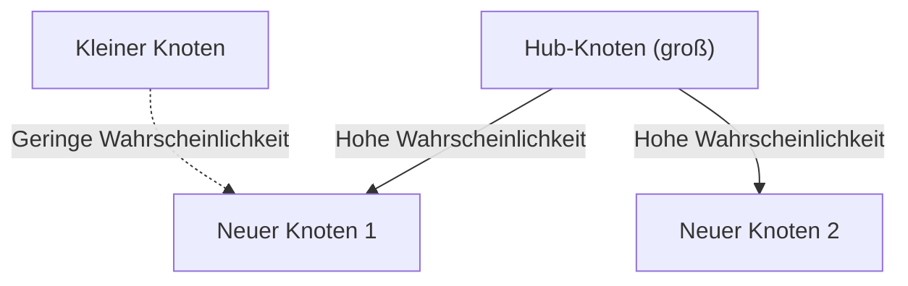

# 1. Einleitung: Die verborgene Ordnung in der Welt

In der Natur und der menschlichen Gesellschaft verbergen sich hinter Phänomenen, die auf den ersten Blick ungeordnet erscheinen, oft erstaunlich schöne mathematische Regelmäßigkeiten. Die Wörter, die wir täglich beiläufig verwenden, die Größe der Städte, in denen wir leben, die Anzahl der Website-Besuche und sogar die Stärke von Erdbeben – was wäre, wenn all diese scheinbar unzusammenhängenden Phänomene tatsächlich einem einzigen gemeinsamen mathematischen Gesetz folgen würden?

Dieses bemerkenswerte Gesetz ist das **Zipfsche Gesetz** (Zipf's Law). Es ist eine empirische Regel, die besagt, dass die Häufigkeit des Auftretens von Elementen in einem bestimmten Datensatz umgekehrt proportional zu ihrem Rang ist. Das am häufigsten auftretende Element erscheint etwa doppelt so häufig wie das zweithäufigste und etwa dreimal so häufig wie das dritthäufigste.

In diesem Artikel werden wir uns eingehend mit dem **Zipfschen Gesetz** befassen – von seinem historischen Hintergrund und seiner mathematischen Formulierung über erstaunliche Beispiele aus der realen Welt bis hin zur Frage, warum ein solches Gesetz universell in natürlichen und sozialen Systemen auftritt – unter Verwendung von Formeln, Simulationscode und Illustrationen. Unser Ziel ist es, Inhalte zu liefern, die nicht nur als ansprechende Lektüre dienen, sondern auch als Grundlagenwissen für Data Science und natürliche Sprachverarbeitung.

# 2. Entdeckung und historischer Hintergrund des Zipfschen Gesetzes

Das **Zipfsche Gesetz** wurde in den 1930er Jahren durch den amerikanischen Linguisten George Kingsley Zipf weit verbreitet. Er war jedoch nicht der einzige Entdecker dieses Gesetzes. Der französische Stenograf Jean-Baptiste Estoup und der Physiker Felix Auerbach, unter anderem, hatten ähnliche Phänomene vor Zipf bemerkt.

Zipf analysierte sorgfältig die Häufigkeit des Vorkommens von Wörtern in englischen Texten. Nachdem er große Textdatenmengen wie James Joyces Roman *Ulysses* mühsam von Hand ausgezählt hatte, entdeckte er eine bemerkenswerte Regelmäßigkeit: Die Häufigkeit des am häufigsten verwendeten Wortes im Englischen („the") war etwa doppelt so hoch wie die des zweithäufigsten Wortes („of") und etwa dreimal so hoch wie die des dritten („and").

Zipf führte dieses Phänomen auf das **Prinzip des geringsten Aufwands** (Principle of Least Effort) zurück, ein grundlegendes Prinzip menschlichen Verhaltens. Mit anderen Worten: Menschen neigen dazu, eine kleine Anzahl einfacher Wörter häufig zu verwenden und komplexe Wörter selten, weil sie in der Kommunikation versuchen, Informationen mit möglichst geringem Aufwand zu übermitteln. Diese philosophische Interpretation wurde später auch aus der Perspektive der Informationstheorie und der statistischen Mechanik bestätigt.

# 3. Mathematische Formulierung: Das Rang-Größen-Gesetz

Formulieren wir das **Zipfsche Gesetz** nun mathematisch streng. Wir ordnen die Elemente (z. B. Wörter) in einem Datensatz in absteigender Reihenfolge ihrer Auftrittshäufigkeit.

Der Rang des häufigsten Elements ist $r = 1$, der des zweithäufigsten $r = 2$ usw. Wenn $f(r)$ die Auftrittshäufigkeit eines Elements mit Rang $r$ bezeichnet, wird das Zipfsche Gesetz wie folgt ausgedrückt:

$$
f(r) \propto \frac{1}{r^\alpha}
$$

Dabei ist $\alpha$ eine vom Datensatz abhängige Konstante und beträgt normalerweise $\alpha \approx 1$. In diesem Fall ist die Häufigkeit genau umgekehrt proportional zum Rang.

Um es als Gleichung auszudrücken, setzen wir die Proportionalitätskonstante als $C$:

$$
f(r) = \frac{C}{r^\alpha}
$$

Die Konstante $C$ hängt von der Gesamtzahl der Elemente im Datensatz ab (z. B. der Gesamtzahl der Wörter). In wahrscheinlichkeitstheoretischer Sprache ist die Wahrscheinlichkeit $P(r)$, dass ein Element mit Rang $r$ auftritt:

$$
P(r) = \frac{\frac{1}{r^\alpha}}{\sum_{n=1}^{N} \frac{1}{n^\alpha}}
$$

Dabei ist $N$ die Anzahl der verschiedenen Elementtypen (z. B. die Vokabulargröße). Im Grenzfall $\alpha > 1$ konvergiert die Reihe im Nenner gegen die Riemannsche Zetafunktion $\zeta(\alpha)$. Aus diesem Grund wird das **Zipfsche Gesetz** manchmal auch als Zeta-Verteilung bezeichnet.

Durch Logarithmierung lässt sich diese Beziehung deutlicher visualisieren:

$$
\log f(r) = \log C - \alpha \log r
$$

Dies bedeutet, dass die Darstellung in einem doppelt-logarithmischen Diagramm (Log-Log-Plot) eine Gerade mit der Steigung $-\alpha$ ergibt. Die einfachste Methode zu prüfen, ob ein Datensatz dem **Zipfschen Gesetz** folgt, besteht darin, ein doppelt-logarithmisches Diagramm zu zeichnen und zu sehen, ob es eine Gerade bildet. Ist dies der Fall, liegt dem Phänomen ein **Potenzgesetz** (Power Law) zugrunde.

# 4. Erstaunliche Beispiele aus der realen Welt

Das **Zipfsche Gesetz** geht weit über den Bereich der Linguistik hinaus und gilt für eine erstaunlich vielfältige Palette von Phänomenen. Betrachten wir Beispiele aus fünf verschiedenen Bereichen im Detail.

## 4.1. Linguistik und natürliche Sprachverarbeitung (NLP)

Das klassischste Beispiel ist die Worthäufigkeit in Textkorpora. Bei der Analyse eines englischen Korpus (z. B. des gesamten Wikipedia-Textes) sind die Häufigkeiten der häufigsten Wörter wie folgt:

1. **the**: ca. 7 % Auftrittswahrscheinlichkeit
2. **of**: ca. 3,5 % Auftrittswahrscheinlichkeit
3. **and**: ca. 2,8 % Auftrittswahrscheinlichkeit
4. **to**: ca. 2,6 % Auftrittswahrscheinlichkeit

So machen nur wenige Dutzend hochfrequente Wörter fast die Hälfte des gesamten Textes aus, während Hunderttausende der verbleibenden Wörter selten auftreten. Dieses „Long-Tail"-Phänomen ist äußerst wichtig beim Aufbau von Suchmaschinen-Indizes und bei der Gestaltung des Vokabulars großer Sprachmodelle (LLMs). Im Bereich der natürlichen Sprachverarbeitung tragen Wörter, die zu häufig auftreten (Stoppwörter), wenig Information, weshalb Techniken wie TF-IDF eingesetzt werden, um ihre Gewichtung zu reduzieren.

## 4.2. Städtische Bevölkerungsverteilung

Das **Zipfsche Gesetz** wird nicht nur in der Sprache, sondern auch in den Bereichen Geografie und Stadtplanung beobachtet. Wenn die Bevölkerungszahlen der Städte eines Landes in absteigender Reihenfolge aufgelistet werden, ist die Bevölkerung der zweitgrößten Stadt halb so groß wie die der größten, und die der drittgrößten ein Drittel.

Betrachten wir zum Beispiel die Bevölkerungsdaten US-amerikanischer Städte (Zahlen sind Schätzungen):
- 1. Platz New York: ca. 8,4 Millionen Einwohner
- 2. Platz Los Angeles: ca. 4 Millionen Einwohner (etwa die Hälfte von New York)
- 3. Platz Chicago: ca. 2,7 Millionen Einwohner (etwa ein Drittel von New York)

Natürlich weicht in einigen Ländern die extreme Konzentration auf die Hauptstadt (z. B. Tokio in Japan, Paris in Frankreich) vom Gesetz ab, ein Phänomen, das als „Primatstadt"-Effekt bekannt ist. Der allgemeine Trend folgt jedoch eindrucksvoll dem **Potenzgesetz**.

## 4.3. Website-Traffic

Die Anzahl der Besuche auf Websites im Internet und die Anzahl der Follower in sozialen Medien folgen ebenfalls dem **Zipfschen Gesetz**. Eine Handvoll riesiger Websites wie Google, YouTube und Facebook monopolisieren den Großteil des Traffics, während unzählige andere Websites nur einen winzigen Anteil erhalten. Dies liegt daran, dass die Linkstruktur in Informationsnetzwerken durch „preferential attachment" gebildet wird, worauf später eingegangen wird.

## 4.4. Unternehmensgröße und Einkommensverteilung (Pareto-Gesetz)

Unternehmensumsätze, Mitarbeiterzahlen und sogar die persönliche Einkommensverteilung folgen dem **Potenzgesetz**. Das Gesetz zur Einkommensverteilung wird nach dem italienischen Ökonomen Vilfredo Pareto als **Pareto-Gesetz** (Pareto-Prinzip) bezeichnet. Es ist auch als die „80:20-Regel" bekannt – „80 % des gesamten Reichtums gehören 20 % der Menschen." Mathematisch betrachtet sind das **Zipfsche Gesetz** und das **Pareto-Gesetz** lediglich unterschiedliche Blickwinkel auf dasselbe Phänomen (Rang vs. Größe).

## 4.5. Erdbebenstärke (Gutenberg-Richter-Gesetz)

In den Bereichen Physik und Geowissenschaften existiert ein ähnliches Gesetz. Das **Gutenberg-Richter-Gesetz** beschreibt die Beziehung zwischen Erdbebenstärke und Auftrittshäufigkeit. Wenn die Magnitude um 1 zunimmt, sinkt die Häufigkeit von Erdbeben dieser Stärke auf etwa ein Zehntel. Auch hier zeigt sich eine fraktalartige Struktur, bei der enorme Ereignisse extrem selten sind, während kleine Ereignisse unzählig oft vorkommen.

# 5. Warum entsteht das Zipfsche Gesetz? (Erzeugungsmechanismen)

Warum tritt dieselbe mathematische Struktur in völlig unterschiedlichen Bereichen wie Sprache, Städten, Wirtschaft und physikalischen Phänomenen auf? Forscher der Komplexitätswissenschaft haben mehrere Erzeugungsmechanismen vorgeschlagen.

## 5.1. Preferential Attachment (Bevorzugte Verbindung)

Das berühmteste Modell in der Netzwerkwissenschaft ist das Modell der **bevorzugten Verbindung** (Preferential Attachment), vorgeschlagen von Albert-László Barabási und anderen. Es wird umgangssprachlich als das „Wer hat, dem wird gegeben"-Phänomen (Rich-get-richer) bezeichnet.

Wenn eine neue Website Links erstellt, ist es wahrscheinlicher, dass sie auf bekannte Websites verlinkt, die bereits viele Links haben. Wenn neue Einwohner umziehen, wählen sie eher große Städte mit etablierter Infrastruktur. Durch diesen dynamischen Prozess, bei dem neue Elemente proportional zur bestehenden Größe (Anzahl der Links, Bevölkerung usw.) hinzugefügt werden, wird die resultierende Gesamtverteilung zu einem Potenzgesetz gemäß dem **Zipfschen Gesetz**.

Nachfolgend ein konzeptionelles Diagramm dieses Prozesses:



## 5.2. Prinzip des geringsten Aufwands (Principle of Least Effort)

Dies ist die von Zipf selbst vorgeschlagene Hypothese. In Kommunikationssystemen gibt es widersprüchliche Wünsche zwischen Sprecher und Zuhörer:
- **Wunsch des Sprechers**: Alles mit einem kleinen Wortschatz ausdrücken (einem einzelnen Wort viele Bedeutungen zuweisen).
- **Wunsch des Zuhörers**: Jedem Konzept separate Wörter zuweisen, um Mehrdeutigkeit zu beseitigen (vielfältigen Wortschatz anstreben).

Der Kompromiss zwischen diesen beiden widersprüchlichen „Aufwänden" erzeugt natürlich eine Verteilung aus wenigen polysemen hochfrequenten Wörtern und vielen monosemen seltenen Wörtern – nämlich das **Zipfsche Gesetz**.

## 5.3. Zufälliges Tippmodell (Affen an der Schreibmaschine)

Bemerkenswerterweise wurde von Mathematikern wie Benoît Mandelbrot gezeigt, dass Verteilungen, die dem **Zipfschen Gesetz** ähneln, aus völlig zufälligen Prozessen entstehen können. Angenommen, ein Affe drückt zufällig Tasten auf einer Schreibmaschine (26 Buchstaben und eine Leertaste), um „Wörter" zu erzeugen. Wenn die Wahrscheinlichkeit, die Leertaste zu drücken, $p$ beträgt, werden kürzere Wörter mit höherer Wahrscheinlichkeit erzeugt. Bei Rangordnung ergibt sich eine Potenzgesetz-Verteilung, die natürlicher Sprache ähnelt. Dies deutet darauf hin, dass das **Zipfsche Gesetz** möglicherweise nicht nur aus hoch entwickelter menschlicher intellektueller Aktivität stammt, sondern auch aus inhärenten statistischen Eigenschaften des Systems selbst.

# 6. Simulation und Python-Code

Schreiben wir tatsächlich Python-Code, um das **Zipfsche Gesetz** anhand von Textdaten zu überprüfen. Der folgende Code zählt Worthäufigkeiten aus zufällig generiertem Text oder einem vorhandenen Korpus und stellt sie in einem doppelt-logarithmischen Diagramm dar.

```python
import matplotlib.pyplot as plt
from collections import Counter
import re
import numpy as np

def plot_zipf_law(text):
    # Text in Kleinbuchstaben umwandeln und in Wörter aufteilen
    words = re.findall(r'\b\w+\b', text.lower())
    
    # Worthäufigkeiten zählen
    word_counts = Counter(words)
    
    # Nach Häufigkeit in absteigender Reihenfolge sortieren
    sorted_counts = sorted(word_counts.values(), reverse=True)
    ranks = np.arange(1, len(sorted_counts) + 1)
    
    # In doppelt-logarithmischem Diagramm darstellen
    plt.figure(figsize=(10, 6))
    plt.loglog(ranks, sorted_counts, marker='o', linestyle='none', color='cyan', alpha=0.7)
    
    # Ideale Zipf-Gesetz-Linie zum Vergleich (alpha=1)
    expected_counts = [sorted_counts[0] / r for r in ranks]
    plt.loglog(ranks, expected_counts, color='red', linestyle='--', label="Ideales Zipfsches Gesetz (alpha=1)")
    
    plt.title("Überprüfung des Zipfschen Gesetzes")
    plt.xlabel("Rang (logarithmische Skala)")
    plt.ylabel("Häufigkeit (logarithmische Skala)")
    plt.legend()
    plt.grid(True, which="both", ls="--", alpha=0.5)
    plt.show()

# Verwendung eines sehr langen Dummy-Textes als Beispiel
# In tatsächlichen Data-Science-Projekten verwenden Sie NLTK oder den Gutenberg-Korpus
dummy_text = "the and of to a in that is was he for it with as his on be at by i this had not are but from or have an they which one you were all her she there would their we him been has when who will no more if out so up said what its about than into them can only other new some could time these two may then do first any my now such like our over man me even most made after also did many before must through back years where much your way well down should because each just those people mr how too little state good very make world still own see men work long get here between both life being under never day same another know while last might great old year off come since against go came right used take three states himself few house use during without again place american around however home small found thought went say part once general high upon school every don't does got united left number course war until always away something fact water though less public put think almost hand enough far took head yet better display modern history area completely specific significant process" * 100

# plot_zipf_law(dummy_text)
```

Wenn Sie diesen Code ausführen, können Sie bestätigen, dass die tatsächlichen Worthäufigkeiten entlang der roten gestrichelten Linie (das ideale Zipfsche Gesetz) verteilt sind. In der Data-Science-Praxis kann eine solche Häufigkeitsanalyse verwendet werden, um Verzerrungen und Ausreißer in Daten zu erkennen.

# 7. Anwendungen in der Informatik

Das **Zipfsche Gesetz** spielt nicht nur als theoretische Kuriosität eine wichtige Rolle, sondern auch in praktischen Algorithmen der Informatik.

## 7.1. Optimierung von Cache-Algorithmen

Das **Zipfsche Gesetz** ist äußerst wichtig für Cache-Strategien bei Webservern und Datenbanken. Da eine kleine Anzahl beliebter Inhalte (z. B. virale Videos oder Top-Nachrichten) den Großteil der Zugriffe ausmacht, kann deren Speicherung in schnellen Caches wie dem Arbeitsspeicher (RAM) die Gesamtleistung des Systems dramatisch verbessern. Algorithmen wie LFU (Least Frequently Used) und LRU (Least Recently Used) sind genau darauf ausgelegt, diese Datenschiefe (Potenzgesetz) auszunutzen.

## 7.2. Datenkompression

Bei Entropiecodierungsverfahren wie der Huffman-Codierung werden häufig auftretenden Datenmustern kurze Bitfolgen und selten auftretenden Mustern lange Bitfolgen zugewiesen. Wenn die Datenhäufigkeit einer extrem schiefen Verteilung wie dem **Zipfschen Gesetz** folgt, ermöglicht die Verwendung einer solchen variablen Längencodierung eine dramatische Kompression der Datengröße. Diese statistische Eigenschaft liegt Kompressionstechnologien wie ZIP-Dateien und JPEG-Bildern zugrunde.

# 8. Fazit: Ein Schlüssel zum Verständnis komplexer Systeme

In diesem Artikel haben wir eine detaillierte Erklärung des **Zipfschen Gesetzes** (Zipf's Law) geliefert – von seiner Definition und seinem mathematischen Hintergrund über vielfältige Beispiele bis hin zu Erzeugungsmechanismen.

Worthäufigkeiten, Stadtbevölkerungen, Unternehmensgrößen und Web-Traffic. Diese scheinen durch völlig unterschiedliche Mechanismen zu funktionieren, aber aus einer makroskopischen Perspektive werden sie alle vom selben **Potenzgesetz** beherrscht. Dies zeigt, dass unsere Welt nicht nur eine Ansammlung zufälliger Phänomene ist, sondern auf einer tieferen Ebene mathematische Ordnung besitzt, wie Selbstorganisation und fraktale Strukturen.

Für Datenwissenschaftler und Ingenieure macht es einen entscheidenden Unterschied beim Systemdesign und Modellaufbau, ob ein Datensatz einer Normalverteilung (Glockenkurve) oder einem Potenzgesetz wie dem **Zipfschen Gesetz** folgt (ob er einen langen Schwanz hat). Behalten Sie das **Zipfsche Gesetz** als leistungsfähige Linse zur Entschlüsselung der verborgenen Ordnung der Welt im Gedächtnis.

---
*Dieser Artikel wurde zum Zweck der Erforschung von Data Science und Komplexitätswissenschaft verfasst. Für detaillierte mathematische Ableitungen und Theorien empfehlen wir die Lektüre von Fachbüchern zur statistischen Physik und natürlichen Sprachverarbeitung.*
