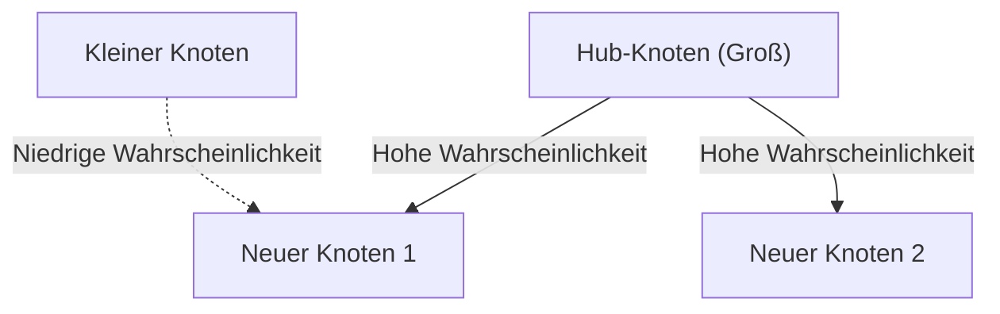

# 1. Einleitung: Die verborgene Ordnung der Welt

In der Natur und der menschlichen Gesellschaft verbirgt sich hinter Phänomenen, die auf den ersten Blick chaotisch erscheinen, oft eine erstaunlich schöne mathematische Regelmäßigkeit. Die Wörter, die wir jeden Tag beiläufig verwenden, die Größe der Städte, in denen wir leben, die Anzahl der Besuche auf Websites und sogar die Stärke von Erdbeben – was wäre, wenn all diese scheinbar unzusammenhängenden Phänomene tatsächlich einem einzigen gemeinsamen mathematischen Gesetz folgen würden?

Dieses erstaunliche Gesetz ist das **Zipfsche Gesetz**. Dieses Gesetz ist eine empirische Regel, die besagt, dass in einem bestimmten Datensatz die Häufigkeit eines Elements umgekehrt proportional zu seinem Rang ist. Das am häufigsten vorkommende Element tritt etwa doppelt so häufig auf wie das am zweithäufigsten vorkommende Element und etwa dreimal so häufig wie das dritte.

In diesem Artikel werden wir uns anhand von Formeln, Simulationscodes und Diagrammen extrem detailliert mit dem **Zipfschen Gesetz** befassen, von seinem historischen Hintergrund über seine mathematische Formulierung und erstaunliche Beispiele aus der realen Welt bis hin zu der Frage, warum ein solches Gesetz in natürlichen und sozialen Systemen universell auftritt. Wir zielen darauf ab, Inhalte bereitzustellen, die nicht nur als unterhaltsame Lektüre, sondern auch als Grundlagenwissen für Data Science und die Verarbeitung natürlicher Sprache genutzt werden können.

# 2. Entdeckung des Zipfschen Gesetzes und historischer Hintergrund

Das **Zipfsche Gesetz** wurde in den 1930er Jahren durch den amerikanischen Linguisten George Kingsley Zipf weithin bekannt gemacht. Er war jedoch nicht der einzige Entdecker dieses Gesetzes. Auch der französische Stenograf Jean-Baptiste Estoup und der Physiker Felix Auerbach bemerkten bereits vor Zipf ähnliche Phänomene.

Zipf analysierte detailliert die Häufigkeit von Wörtern in englischen Sätzen. Als Ergebnis des manuellen Zählens groß angelegter Textdaten, wie etwa James Joyces Roman „Ulysses“, entdeckte er eine überraschende Regelmäßigkeit. Es war die Tatsache, dass das am häufigsten verwendete Wort (im Englischen „the“) etwa doppelt so oft vorkommt wie das am zweithäufigsten verwendete Wort („of“) und etwa dreimal so oft wie das dritte („and“).

Zipf behauptete, dass dieses Phänomen auf das **Prinzip des geringsten Aufwands** (Principle of Least Effort) hinausläuft, ein Grundprinzip des menschlichen Verhaltens. Mit anderen Worten: Bei der Kommunikation versuchen Menschen, Informationen mit so wenig Aufwand wie möglich zu vermitteln, weshalb sie häufig einige wenige einfache Wörter und selten komplexe Wörter verwenden. Diese philosophische Interpretation wurde später auch aus der Perspektive der Informationstheorie und der statistischen Mechanik untermauert.

# 3. Mathematische Formulierung: Rang-Größen-Regel

Lassen Sie uns hier das **Zipfsche Gesetz** mathematisch streng formulieren. Wir ordnen die Elemente in einem Datensatz (z. B. Wörter) in absteigender Reihenfolge ihrer Häufigkeit.

Sei der Rang des häufigsten Elements $r = 1$ und des zweiten $r = 2$. Wenn die Häufigkeit für ein Element des Rangs $r$ $f(r)$ ist, wird das Zipfsche Gesetz wie folgt ausgedrückt:

$$
f(r) \propto \frac{1}{r^\alpha}
$$

Hierbei ist $\alpha$ eine Konstante, die vom Datensatz abhängt, und normalerweise gilt $\alpha \approx 1$. In diesem Fall ist die Häufigkeit exakt umgekehrt proportional zum Rang.

Um dies als Gleichung auszudrücken, wobei die Proportionalitätskonstante als $C$ festgelegt wird:

$$
f(r) = \frac{C}{r^\alpha}
$$

Die Konstante $C$ hängt von der Gesamtzahl der Elemente im gesamten Datensatz ab (z. B. der Gesamtzahl der Wörter). In den Begriffen der Wahrscheinlichkeitstheorie ist die Wahrscheinlichkeit $P(r)$, dass ein Element des Rangs $r$ auftritt, wie folgt:

$$
P(r) = \frac{\frac{1}{r^\alpha}}{\sum_{n=1}^{N} \frac{1}{n^\alpha}}
$$

Hierbei ist $N$ die Vielfalt der Elemente (z. B. die Vokabulargröße). Die Reihe im Nenner konvergiert im Grenzwert $\alpha > 1$ gegen die riemannsche Zeta-Funktion $\zeta(\alpha)$. Daher wird das **Zipfsche Gesetz** manchmal auch als Zeta-Verteilung bezeichnet.

Durch Logarithmieren kann diese Beziehung noch deutlicher visualisiert werden.

$$
\log f(r) = \log C - \alpha \log r
$$

Das bedeutet, dass es in einem Log-Log-Diagramm aufgetragen zu einer geraden Linie mit der Steigung $-\alpha$ wird. Der einfachste Weg, um zu überprüfen, ob ein Datensatz dem **Zipfschen Gesetz** folgt, besteht darin, ein Log-Log-Diagramm zu zeichnen und zu sehen, ob es eine gerade Linie bildet. Wenn es eine gerade Linie ist, kann man sagen, dass hinter diesem Phänomen ein **Potenzgesetz** (Power Law) steht.

# 4. Erstaunliche Beispiele aus der realen Welt

Das **Zipfsche Gesetz** geht über die bloßen Grenzen der Linguistik hinaus und gilt für eine erstaunlich große Vielfalt von Phänomenen. Lassen Sie uns hier Beispiele aus 5 verschiedenen Bereichen genauer betrachten.

## 4.1. Linguistik und Verarbeitung natürlicher Sprache (NLP)

Das klassischste Beispiel ist die Worthäufigkeit in Textkorpora. Bei der Analyse eines englischen Korpus (z. B. des gesamten Textes von Wikipedia) ergibt sich für die häufigsten Wörter folgende Häufigkeit:

1. **the**: ca. 7 % Auftrittswahrscheinlichkeit
2. **of**: ca. 3,5 % Auftrittswahrscheinlichkeit
3. **and**: ca. 2,8 % Auftrittswahrscheinlichkeit
4. **to**: ca. 2,6 % Auftrittswahrscheinlichkeit

Während also nur ein paar Dutzend häufige Wörter fast die Hälfte des gesamten Textes ausmachen, tauchen Hunderttausende anderer Wörter fast nie auf. Dieses „Long Tail“-Phänomen ist beim Aufbau von Suchmaschinen-Indizes und bei der Gestaltung von Vokabularen für Large Language Models (LLMs) von enormer Bedeutung. Im Bereich der Verarbeitung natürlicher Sprache tragen zu häufig vorkommende Wörter (Stoppwörter) nur sehr wenige Informationen, weshalb Techniken wie TF-IDF verwendet werden, um deren Gewichtung zu verringern.

## 4.2. Städtische Bevölkerungsverteilung

Nicht nur in der Linguistik, auch in der Geographie und Stadtplanung lässt sich das **Zipfsche Gesetz** beobachten. Wenn man die Bevölkerung der Städte eines bestimmten Landes der Größe nach ordnet, zeigt die Beziehung, dass die zweitgrößte Stadt die Hälfte der Bevölkerung der ersten hat und die drittgrößte ein Drittel.

Betrachten wir zum Beispiel die Bevölkerungsdaten von US-Städten (Zahlen sind Schätzungen):
- 1. New York: ca. 8,4 Millionen
- 2. Los Angeles: ca. 4 Millionen (etwa die Hälfte von New York)
- 3. Chicago: ca. 2,7 Millionen (etwa ein Drittel von New York)

Natürlich kann es je nach Land durch eine extreme Konzentration auf die Hauptstadt (wie Tokio in Japan, Paris in Frankreich) zu einem „Primatstadt-Phänomen“ kommen, das vom Gesetz abweicht, aber der allgemeine Trend folgt bemerkenswert genau dem **Potenzgesetz**.

## 4.3. Website-Traffic

Die Anzahl der Zugriffe auf Websites im Internet und die Anzahl der Follower in sozialen Netzwerken folgen ebenfalls dem **Zipfschen Gesetz**. Ein winziger Bruchteil riesiger Seiten wie Google, YouTube und Facebook monopolisiert den Großteil des Traffics, während unzählige andere Seiten nur sehr wenige Zugriffe verzeichnen. Dies liegt daran, dass die Linkstruktur in Informationsnetzwerken durch „präferenzielle Anlagerung“ gebildet wird, die später besprochen wird.

## 4.4. Unternehmensgröße und Einkommensverteilung (Paretoprinzip)

Unternehmensumsätze, Mitarbeiterzahlen und individuelle Einkommensverteilungen folgen ebenfalls dem **Potenzgesetz**. Das Gesetz bezüglich der Einkommensverteilung ist nach dem italienischen Ökonomen Vilfredo Pareto als **Paretoprinzip** benannt. Es ist auch als „80:20-Regel“ bekannt und besagt, dass „80 % des Gesamtvermögens im Besitz von 20 % der Menschen sind“. Mathematisch gesehen betrachten das **Zipfsche Gesetz** und das **Paretoprinzip** lediglich dasselbe Phänomen aus verschiedenen Blickwinkeln (Rang vs. Größe).

## 4.5. Erdbebenskala (Gutenberg-Richter-Gesetz)

Ähnliche Gesetze gibt es in der Physik und den Geowissenschaften. Das **Gutenberg-Richter-Gesetz** zeigt die Beziehung zwischen Erdbebenstärke und Auftrittshäufigkeit. Wenn die Magnitude um 1 zunimmt, sinkt die Häufigkeit von Erdbeben dieser Stärke auf etwa ein Zehntel. Auch hier lässt sich eine fraktale Struktur beobachten, bei der gigantische Ereignisse extrem selten und winzige Ereignisse unzählige Male auftreten.

# 5. Warum tritt das Zipfsche Gesetz auf? (Entstehungsmechanismus)

Warum taucht dieselbe mathematische Struktur in völlig unterschiedlichen Bereichen wie Sprache, Städten, Wirtschaft und physikalischen Phänomenen auf? Forscher im Bereich der komplexen Systeme haben verschiedene Entstehungsmechanismen vorgeschlagen.

## 5.1. Präferenzielle Anlagerung (Preferential Attachment)

Das berühmteste Modell in der Netzwerkforschung ist das Modell der **präferenziellen Anlagerung**, das von Albert-László Barabási und anderen vorgeschlagen wurde. Es ist gemeinhin als das Phänomen „die Reichen werden reicher“ (Rich-get-richer) bekannt.

Wenn eine neue Website einen Link hinzufügt, ist die Wahrscheinlichkeit hoch, dass sie auf eine berühmte Seite verlinkt, die bereits viele Links hat. Wenn ein neuer Einwohner umzieht, ist die Wahrscheinlichkeit hoch, dass er eine große Stadt mit bereits ausgebauter Infrastruktur wählt. Da ein dynamischer Prozess neue Elemente proportional zur vorhandenen Größe (Anzahl der Links, Bevölkerung usw.) hinzufügt, führt die Gesamtverteilung im Ergebnis zu einem Potenzgesetz, das dem **Zipfschen Gesetz** folgt.

Nachfolgend ein Konzeptdiagramm dieses Prozesses.



## 5.2. Prinzip des geringsten Aufwands

Dies ist die Hypothese, die von Zipf selbst aufgestellt wurde. In einem Kommunikationssystem gibt es widersprüchliche Wünsche zwischen Sprecher und Zuhörer.
- **Wunsch des Sprechers**: Möchte alles mit einem kleinen Vokabular ausdrücken (einem einzelnen Wort viele Bedeutungen zuweisen).
- **Wunsch des Zuhörers**: Möchte jedem Konzept unterschiedliche Wörter zuweisen, um semantische Mehrdeutigkeiten zu beseitigen (erfordert ein vielfältiges Vokabular).

Als Kompromiss zwischen diesen beiden gegensätzlichen „Bemühungen“ entsteht auf natürliche Weise eine Verteilung aus wenigen polysemen häufigen Wörtern und vielen eindeutigen seltenen Wörtern, sprich das **Zipfsche Gesetz**.

## 5.3. Random Typing Model (Affen tippen auf Schreibmaschinen)

Erstaunlicherweise haben Mathematiker wie Benoît Mandelbrot gezeigt, dass Verteilungen, die dem **Zipfschen Gesetz** ähneln, selbst aus völlig zufälligen Prozessen entstehen können.
Angenommen, Affen schlagen völlig zufällig auf die Tasten einer Schreibmaschine (26 Buchstaben des Alphabets und ein Leerzeichen), um „Wörter“ zu bilden. Sei $p$ die Wahrscheinlichkeit, dass ein Leerzeichen auftritt; je kürzer das Wort, desto höher ist die Wahrscheinlichkeit, dass es generiert wird. Ordnet man diese nach dem Rang, erhält man eine Potenzgesetz-Verteilung genau wie bei natürlicher Sprache. Dies deutet auf die Möglichkeit hin, dass das **Zipfsche Gesetz** nicht nur aus komplexer menschlicher intellektueller Aktivität stammt, sondern aus den statistischen Eigenschaften des Systems selbst.

# 6. Simulation und Python-Code

Lassen Sie uns tatsächlich Python verwenden, um einen Code zu schreiben, der das **Zipfsche Gesetz** anhand von Textdaten verifiziert. Der folgende Code zählt Worthäufigkeiten mithilfe von zufällig generiertem Text oder einem vorhandenen Korpus und trägt sie in ein Log-Log-Diagramm ein.

```python
import matplotlib.pyplot as plt
from collections import Counter
import re
import numpy as np

def plot_zipf_law(text):
    # Text in Kleinbuchstaben umwandeln und in Wörter aufteilen
    words = re.findall(r'\b\w+\b', text.lower())
    
    # Häufigkeit des Auftretens der Wörter zählen
    word_counts = Counter(words)
    
    # Absteigend nach Häufigkeit sortieren
    sorted_counts = sorted(word_counts.values(), reverse=True)
    ranks = np.arange(1, len(sorted_counts) + 1)
    
    # In einem Log-Log-Diagramm zeichnen
    plt.figure(figsize=(10, 6))
    plt.loglog(ranks, sorted_counts, marker='o', linestyle='none', color='cyan', alpha=0.7)
    
    # Ideale Zipfsche Gesetz-Gerade zum Vergleich (alpha=1)
    expected_counts = [sorted_counts[0] / r for r in ranks]
    plt.loglog(ranks, expected_counts, color='red', linestyle='--', label="Ideal Zipf's Law (alpha=1)")
    
    plt.title("Zipf's Law Verification")
    plt.xlabel("Rank (log scale)")
    plt.ylabel("Frequency (log scale)")
    plt.legend()
    plt.grid(True, which="both", ls="--", alpha=0.5)
    plt.show()

# Einen sehr langen Dummy-Text als Beispiel verwenden
# In echten Data-Science-Projekten werden NLTK oder das Gutenberg-Korpus verwendet
dummy_text = "the and of to a in that is was he for it with as his on be at by i this had not are but from or have an they which one you were all her she there would their we him been has when who will no more if out so up said what its about than into them can only other new some could time these two may then do first any my now such like our over man me even most made after also did many before must through back years where much your way well down should because each just those people mr how too little state good very make world still own see men work long get here between both life being under never day same another know while last might great old year off come since against go came right used take three states himself few house use during without again place american around however home small found thought went say part once general high upon school every don't does got united left number course war until always away something fact water though less public put think almost hand enough far took head yet better display modern history area completely specific significant process" * 100

# plot_zipf_law(dummy_text)
```

Das Ausführen dieses Codes bestätigt, dass die tatsächlichen Worthäufigkeiten entlang der roten gepunkteten Linie (dem idealen Zipfschen Gesetz) verteilt sind. In der Praxis der Data Science können Verzerrungen in Daten oder Anomalien durch eine solche Häufigkeitsanalyse aufgedeckt werden.

# 7. Anwendung in der Informatik

Das **Zipfsche Gesetz** spielt nicht nur wegen seines theoretischen Interesses eine wichtige Rolle, sondern auch in praktischen Informatik-Algorithmen.

## 7.1. Optimierung von Caching-Algorithmen

In Caching-Strategien für Webserver und Datenbanken ist das **Zipfsche Gesetz** von entscheidender Bedeutung. Da eine kleine Menge populärer Inhalte (wie virale Videos oder Top-Nachrichten) den überwiegenden Teil der Gesamtzugriffe ausmacht, kann deren Speicherung in einem schnellen Cache wie dem Arbeitsspeicher (RAM) die Leistung des gesamten Systems drastisch verbessern. Algorithmen wie LFU (Least Frequently Used) und LRU (Least Recently Used) wurden genau dafür entwickelt, um diesen Daten-Bias (Potenzgesetz) auszunutzen.

## 7.2. Datenkompression

Bei der Entropiekodierung wie der Huffman-Kodierung (Huffman Coding) werden häufig auftretenden Datenmustern kurze Bitfolgen zugewiesen, während selten auftretenden Mustern lange Bitfolgen zugewiesen werden. Wenn die Datenhäufigkeiten extrem verzerrt sind wie beim **Zipfschen Gesetz**, ermöglicht die Verwendung einer solchen Kodierung mit variabler Länge eine drastische Komprimierung der Datengröße. Die Grundlage von Kompressionstechnologien wie ZIP-Dateien und JPEG-Bildern nutzt ebenfalls diese statistischen Eigenschaften.

# 8. Fazit: Der Schlüssel zum Verständnis komplexer Systeme

In diesem Artikel haben wir das **Zipfsche Gesetz** detailliert beschrieben, von seiner Definition über seinen mathematischen Hintergrund bis hin zu verschiedenen Beispielen aus der realen Welt und seinen Entstehungsmechanismen.

Worthäufigkeit, Stadtbevölkerung, Unternehmensgröße, Web-Traffic. Diese scheinen unter völlig unterschiedlichen Mechanismen zu funktionieren, aber aus einer Makroperspektive betrachtet, werden sie vom selben **Potenzgesetz** regiert. Dies zeigt, dass unsere Welt nicht nur eine Ansammlung zufälliger Phänomene ist, sondern in einer tieferen Dimension eine mathematische Ordnung wie Selbstorganisation und fraktale Strukturen aufweist.

Für Datenwissenschaftler und Ingenieure macht es einen entscheidenden Unterschied beim Systemdesign und der Modellbildung, wenn sie verstehen, ob ein Datensatz einer Normalverteilung (Glockenkurve) oder einem Potenzgesetz wie dem **Zipfschen Gesetz** (mit einem Long Tail) folgt. Bitte behalten Sie das **Zipfsche Gesetz** als eine mächtige Linse zur Entschlüsselung der verborgenen Ordnung der Welt im Hinterkopf.

---
*Dieser Artikel wurde mit dem Ziel geschrieben, Data Science und die Wissenschaft komplexer Systeme zu erforschen. Für detaillierte mathematische Formulierungen und Theorien empfehlen wir die Konsultation spezialisierter Literatur zur statistischen Physik und zur Verarbeitung natürlicher Sprache.*
