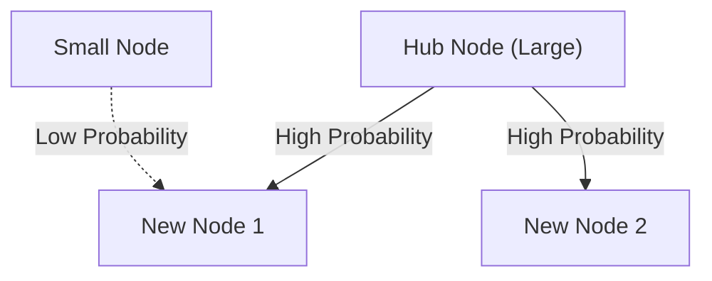

# 1. Introduction: The Hidden Order Lurking in the World

In nature and human society, behind phenomena that seem chaotic at first glance, there often lies surprisingly beautiful mathematical regularity. The words we casually use every day, the size of the cities we live in, the number of visits to websites, and even the scale of earthquakes—what if all these seemingly unrelated phenomena actually followed a single common mathematical law?

That astonishing law is **[Zipf's Law](https://kenji.blog/p/zipfs-law/)**. This law is an empirical rule stating that in a specific dataset, the frequency of an element is inversely proportional to its rank. The most frequently occurring element appears about twice as often as the second most frequent element, and about three times as often as the third.

In this article, we will delve extremely deeply into **[Zipf's Law](https://kenji.blog/p/zipfs-law/)**, from its historical background to its mathematical formulation, amazing real-world examples, and why such a law universally arises in natural and social systems, using formulas, simulation codes, and diagrams. We aim to provide content that can be utilized not just as casual reading, but also as foundational knowledge for data science and natural language processing.

# 2. Discovery of [Zipf's Law](https://kenji.blog/p/zipfs-law/) and Historical Background

**[Zipf's Law](https://kenji.blog/p/zipfs-law/)** was widely popularized in the 1930s by the American linguist George Kingsley Zipf. However, he was not the only discoverer of this law. The French stenographer Jean-Baptiste Estoup and the physicist Felix Auerbach also noticed similar phenomena before Zipf.

Zipf detailedly analyzed the frequency of words in English sentences. As a result of manually counting large-scale text data, such as James Joyce's novel 'Ulysses', he discovered a surprising regularity. It was the fact that the most frequently used word (in English, 'the') occurs about twice as often as the second most used word ('of'), and about three times as often as the third ('and').

Zipf claimed that this phenomenon boils down to the **Principle of Least Effort**, a basic principle of human behavior. In other words, in communication, humans try to convey information with as little effort as possible, so they frequently use a few simple words and rarely use complex words. This philosophical interpretation would later be supported from the perspectives of information theory and statistical mechanics.

# 3. Mathematical Formulation: Rank-Size Rule

Here, let's strictly formulate **[Zipf's Law](https://kenji.blog/p/zipfs-law/)** mathematically. We arrange the elements in a dataset (e.g., words) in descending order of their frequency.

Let the rank of the most frequent element be $r = 1$, and the second be $r = 2$. If the frequency for an element of rank $r$ is $f(r)$, [Zipf's Law](https://kenji.blog/p/zipfs-law/) is expressed as follows:

$$
f(r) \propto \frac{1}{r^\alpha}
$$

Here, $\alpha$ is a constant that depends on the dataset, and usually $\alpha \approx 1$. At this time, frequency is exactly inversely proportional to rank.

To express it as an equation, setting the proportionality constant as $C$,

$$
f(r) = \frac{C}{r^\alpha}
$$

The constant $C$ depends on the total number of elements in the entire dataset (such as the total number of words). In terms of probability theory, the probability $P(r)$ of an element of rank $r$ occurring is as follows:

$$
P(r) = \frac{\frac{1}{r^\alpha}}{\sum_{n=1}^{N} \frac{1}{n^\alpha}}
$$

Here, $N$ is the variety of elements (such as vocabulary size). The series in the denominator converges to the Riemann zeta function $\zeta(\alpha)$ in the limit $\alpha > 1$. Therefore, **[Zipf's Law](https://kenji.blog/p/zipfs-law/)** is sometimes referred to as the zeta distribution.

By taking the logarithm, this relationship can be visualized more clearly.

$$
\log f(r) = \log C - \alpha \log r
$$

This means that when plotted on a log-log graph, it becomes a straight line with a slope of $-\alpha$. The easiest way to check if a dataset follows **[Zipf's Law](https://kenji.blog/p/zipfs-law/)** is to draw a log-log graph and see if it forms a straight line. If it is a straight line, it can be said that a **Power Law** exists behind that phenomenon.

# 4. Amazing Real-World Examples

**[Zipf's Law](https://kenji.blog/p/zipfs-law/)** goes beyond the mere bounds of linguistics and applies to a surprisingly wide variety of phenomena. Here, let's take a detailed look at examples from 5 different fields.

## 4.1. Linguistics and Natural Language Processing (NLP)

The most classic example is word frequency in text corpora. When analyzing an English corpus (e.g., the entire text of Wikipedia), the frequency of the top few words is as follows:

1. **the**: about 7% probability of occurrence
2. **of**: about 3.5% probability of occurrence
3. **and**: about 2.8% probability of occurrence
4. **to**: about 2.6% probability of occurrence

Thus, while just a few dozen frequent words account for nearly half of the entire text, hundreds of thousands of other words rarely appear. This "Long Tail" phenomenon is extremely important in building search engine indexes and designing vocabularies for Large Language Models (LLMs). In the field of natural language processing, words that appear far too frequently (stop words) carry little information, so techniques like TF-IDF are used to lower their weight.

## 4.2. City Population Distribution

Not only in linguistics, but **[Zipf's Law](https://kenji.blog/p/zipfs-law/)** is also observed in geography and urban engineering. When ordering the population of cities in a certain country, the relationship shows that the second largest city has half the population of the first, and the third has a third.

For example, looking at the city population data of the United States (figures are approximate):
- 1st New York: about 8.4 million
- 2nd Los Angeles: about 4 million (about half of New York)
- 3rd Chicago: about 2.7 million (about a third of New York)

Of course, depending on the country, extreme concentration in the capital (such as Tokyo in Japan, Paris in France) can lead to a "primate city phenomenon" deviating from the law, but the overall trend remarkably follows the **Power Law**.

## 4.3. Website Traffic

The number of accesses to websites on the internet and the number of followers on SNS also follow **[Zipf's Law](https://kenji.blog/p/zipfs-law/)**. A tiny fraction of massive sites like Google, YouTube, and Facebook monopolize most of the traffic, while countless other sites have very little access. This is because the link structure in information networks is formed by "preferential attachment," which will be discussed later.

## 4.4. Corporate Size and Income Distribution (Pareto Principle)

Corporate sales, number of employees, and individual income distributions also follow the **Power Law**. The law regarding income distribution is named the **Pareto Principle** after the Italian economist Vilfredo Pareto. It is also known as the "80:20 rule," stating that "80% of the overall wealth is owned by 20% of the people." Mathematically, **[Zipf's Law](https://kenji.blog/p/zipfs-law/)** and the **Pareto Principle** are simply viewing the same phenomenon from different angles (rank vs. scale).

## 4.5. Earthquake Scale (Gutenberg-Richter Law)

Similar laws exist in physics and earth sciences. The **Gutenberg-Richter Law** shows the relationship between earthquake magnitude and occurrence frequency. As the magnitude increases by 1, the frequency of earthquakes of that scale decreases to about a tenth. Here, too, we can observe a fractal structure where gigantic events occur extremely rarely, while tiny events happen countlessly.

# 5. Why Does [Zipf's Law](https://kenji.blog/p/zipfs-law/) Occur? (Generation Mechanism)

Why does the same mathematical structure appear in entirely different fields such as language, cities, economics, and physical phenomena? Researchers in complex systems science have proposed several generation mechanisms.

## 5.1. Preferential Attachment

The most famous model in network science is the **Preferential Attachment** model, proposed by Albert-László Barabási and others. It is commonly known as the "Rich-get-richer" phenomenon.

When a new website adds a link, it is highly probable to link to a famous site that already has many links. When a new resident moves, it is highly probable they choose a large city with already established infrastructure. As a dynamic process adds new elements in proportion to existing scale (number of links, population, etc.), the overall distribution results in a power law following **[Zipf's Law](https://kenji.blog/p/zipfs-law/)**.

Below is a conceptual diagram of this process.



## 5.2. Principle of Least Effort

This is the hypothesis proposed by Zipf himself. In a communication system, there are conflicting desires between the speaker and the listener.
- **Speaker's desire**: Wants to express everything with a small vocabulary (assigning many meanings to a single word).
- **Listener's desire**: Wants to assign different words to each concept to eliminate semantic ambiguity (demanding a diverse vocabulary).

As a compromise between these two conflicting "efforts", a distribution of a few polysemous frequent words and many unambiguous rare words, namely **[Zipf's Law](https://kenji.blog/p/zipfs-law/)**, is explained to naturally arise.

## 5.3. Random Typing Model (Monkeys Hitting Typewriters)

Surprisingly, mathematicians like Benoit Mandelbrot have shown that distributions similar to **[Zipf's Law](https://kenji.blog/p/zipfs-law/)** can arise even from completely random processes.
For instance, suppose monkeys hit typewriter keys (26 alphabet letters and a blank space) completely at random to create "words". Let $p$ be the probability of a space occurring; the shorter the word, the higher the probability of it being generated. Ordering these by rank yields a power law distribution just like natural language. This suggests the possibility that **[Zipf's Law](https://kenji.blog/p/zipfs-law/)** originates not just from complex human intellectual activity, but from the statistical properties of the system itself.

# 6. Simulation and Python Code

Let's actually use Python to write code that verifies **[Zipf's Law](https://kenji.blog/p/zipfs-law/)** from text data. The following code counts word frequencies using randomly generated text or an existing corpus, and plots them on a log-log graph.

```python
import matplotlib.pyplot as plt
from collections import Counter
import re
import numpy as np

def plot_zipf_law(text):
    # Convert text to lowercase and split into words
    words = re.findall(r'\b\w+\b', text.lower())
    
    # Count the frequency of word occurrences
    word_counts = Counter(words)
    
    # Sort in descending order of frequency
    sorted_counts = sorted(word_counts.values(), reverse=True)
    ranks = np.arange(1, len(sorted_counts) + 1)
    
    # Plot on a log-log graph
    plt.figure(figsize=(10, 6))
    plt.loglog(ranks, sorted_counts, marker='o', linestyle='none', color='cyan', alpha=0.7)
    
    # Ideal Zipf's law straight line for comparison (alpha=1)
    expected_counts = [sorted_counts[0] / r for r in ranks]
    plt.loglog(ranks, expected_counts, color='red', linestyle='--', label="Ideal Zipf's Law (alpha=1)")
    
    plt.title("Zipf's Law Verification")
    plt.xlabel("Rank (log scale)")
    plt.ylabel("Frequency (log scale)")
    plt.legend()
    plt.grid(True, which="both", ls="--", alpha=0.5)
    plt.show()

# Use a very long dummy text as a sample
# In real data science projects, NLTK or Gutenberg corpus are used
dummy_text = "the and of to a in that is was he for it with as his on be at by i this had not are but from or have an they which one you were all her she there would their we him been has when who will no more if out so up said what its about than into them can only other new some could time these two may then do first any my now such like our over man me even most made after also did many before must through back years where much your way well down should because each just those people mr how too little state good very make world still own see men work long get here between both life being under never day same another know while last might great old year off come since against go came right used take three states himself few house use during without again place american around however home small found thought went say part once general high upon school every don't does got united left number course war until always away something fact water though less public put think almost hand enough far took head yet better display modern history area completely specific significant process" * 100

# plot_zipf_law(dummy_text)
```

Running this code confirms that actual word frequencies are distributed along the red dotted line (ideal Zipf's law). In data science practice, bias in data and anomalies can be detected through such frequency analysis.

# 7. Application in Computer Science

**[Zipf's Law](https://kenji.blog/p/zipfs-law/)** plays an important role not only for its theoretical interest but also in practical computer science algorithms.

## 7.1. Caching Algorithm Optimization

In caching strategies for web servers and databases, **[Zipf's Law](https://kenji.blog/p/zipfs-law/)** is extremely crucial. Because a small amount of popular content (like viral videos or top news) accounts for the vast majority of overall access, storing these in fast caching like memory (RAM) can drastically improve the performance of the entire system. Algorithms like LFU (Least Frequently Used) and LRU (Least Recently Used) are precisely designed to take advantage of this data bias (power law).

## 7.2. Data Compression

In entropy coding such as Huffman Coding, short bit strings are assigned to frequently occurring data patterns, while long bit strings are assigned to rarely occurring patterns. If data occurrence frequencies are extremely skewed like in **[Zipf's Law](https://kenji.blog/p/zipfs-law/)**, using such variable-length coding allows data size to be drastically compressed. The foundation of compression technologies like ZIP files and JPEG images also utilizes these statistical properties.

# 8. Conclusion: The Key to Understanding Complex Systems

In this article, we detailed **[Zipf's Law](https://kenji.blog/p/zipfs-law/)**, from its definition to mathematical background, diverse real-world examples, and generation mechanisms.

Word frequency, city population, corporate scale, web traffic. These seem to operate under completely different mechanisms, but viewed from a macro perspective, they are governed by the same **Power Law**. This shows that our world is not merely a collection of random phenomena, but holds mathematical order at a deeper dimension, such as self-organization and fractal structures.

For data scientists and engineers, understanding whether a dataset follows a normal distribution (bell curve) or a power law like **[Zipf's Law](https://kenji.blog/p/zipfs-law/)** (having a long tail) makes a critical difference in system design and model building. Please keep **[Zipf's Law](https://kenji.blog/p/zipfs-law/)** in mind as a powerful lens for deciphering the hidden order of the world.

---
*This article was written for the purpose of exploring data science and complex systems science. For detailed mathematical formulations and theories, we recommend referring to specialized books on statistical physics and natural language processing.*
