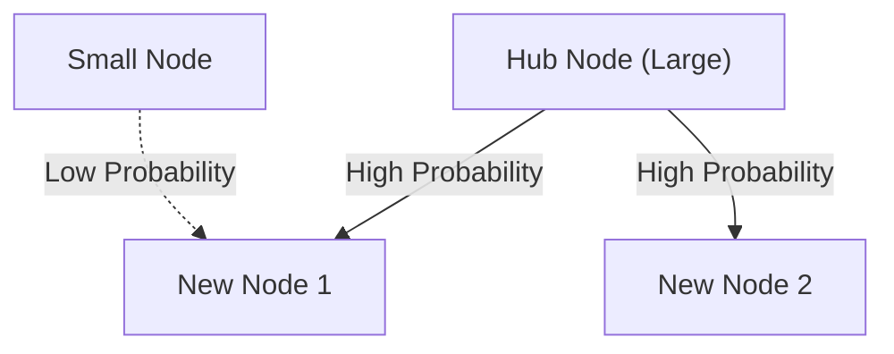

# 1. Introduction: The Hidden Order in the World

In nature and human society, remarkably beautiful mathematical regularities often lurk behind phenomena that appear disorderly at first glance. The words we use casually every day, the sizes of the cities we live in, the number of visits to websites, and even the magnitude of earthquakes—what if all these seemingly unrelated phenomena actually follow a single common mathematical law?

That remarkable law is **Zipf's Law**. This law is an empirical rule stating that the frequency of occurrence of elements in a particular dataset is inversely proportional to their rank. The most frequently occurring element appears roughly twice as often as the second most frequent, and roughly three times as often as the third.

In this article, we will delve deeply into **Zipf's Law**—from its historical background and mathematical formulation to astonishing real-world examples, and why such a law universally arises in natural and social systems—using formulas, simulation code, and illustrations. Our goal is to provide content that can serve not only as an engaging read but also as foundational knowledge for data science and natural language processing.

# 2. Discovery and Historical Background of Zipf's Law

**Zipf's Law** was widely popularized in the 1930s by the American linguist George Kingsley Zipf. However, he was not the sole discoverer of this law. The French stenographer Jean-Baptiste Estoup and the physicist Felix Auerbach, among others, had noticed similar phenomena before Zipf.

Zipf meticulously analyzed the frequency of word occurrences in English texts. After painstakingly counting by hand through large-scale text data such as James Joyce's novel *Ulysses*, he discovered a remarkable regularity: the frequency of the most commonly used word in English ("the") was roughly twice that of the second most commonly used word ("of"), and roughly three times that of the third ("and").

Zipf attributed this phenomenon to the **Principle of Least Effort**, a fundamental principle of human behavior. In other words, humans tend to use a small number of simple words frequently and rarely use complex words because they try to convey information with as little effort as possible in communication. This philosophical interpretation was later supported from the perspectives of information theory and statistical mechanics as well.

# 3. Mathematical Formulation: The Rank-Size Law

Let us now mathematically formalize **Zipf's Law**. We arrange the elements (e.g., words) in a dataset in descending order of their frequency of occurrence.

The rank of the most frequent element is $r = 1$, the second most frequent is $r = 2$, and so on. If $f(r)$ denotes the frequency of occurrence for an element with rank $r$, Zipf's Law is expressed as follows:

$$
f(r) \propto \frac{1}{r^\alpha}
$$

Here, $\alpha$ is a constant that depends on the dataset and is usually $\alpha \approx 1$. In this case, frequency is exactly inversely proportional to rank.

To express it as an equation, let the proportionality constant be $C$:

$$
f(r) = \frac{C}{r^\alpha}
$$

The constant $C$ depends on the total number of elements in the dataset (e.g., the total number of words). In probabilistic terms, the probability $P(r)$ that an element of rank $r$ appears is:

$$
P(r) = \frac{\frac{1}{r^\alpha}}{\sum_{n=1}^{N} \frac{1}{n^\alpha}}
$$

Here, $N$ is the number of distinct element types (e.g., vocabulary size). In the limit where $\alpha > 1$, the series in the denominator converges to the Riemann zeta function $\zeta(\alpha)$. For this reason, **Zipf's Law** is sometimes called the zeta distribution.

By taking logarithms, this relationship can be visualized more clearly:

$$
\log f(r) = \log C - \alpha \log r
$$

This means that when plotted on a log-log plot, it becomes a straight line with slope $-\alpha$. The simplest way to check whether a dataset follows **Zipf's Law** is to draw a log-log plot and see if it forms a straight line. If it does, then a **power law** exists behind the phenomenon.

# 4. Astonishing Real-World Examples

**Zipf's Law** extends far beyond the realm of linguistics and applies to an astonishingly diverse range of phenomena. Let us examine examples from five different fields in detail.

## 4.1. Linguistics and Natural Language Processing (NLP)

The most classical example is word frequency in text corpora. When analyzing an English corpus (such as the entire text of Wikipedia), the frequencies of the top words are as follows:

1. **the**: approximately 7% occurrence probability
2. **of**: approximately 3.5% occurrence probability
3. **and**: approximately 2.8% occurrence probability
4. **to**: approximately 2.6% occurrence probability

In this way, just a few dozen high-frequency words account for nearly half of the entire text, while hundreds of thousands of remaining words rarely appear. This "Long Tail" phenomenon is extremely important in building search engine indexes and designing the vocabulary of large language models (LLMs). In the field of natural language processing, words that appear too frequently (stop words) carry little information, so techniques like TF-IDF are used to reduce their weight.

## 4.2. Urban Population Distribution

**Zipf's Law** is observed not only in language but also in the fields of geography and urban engineering. When the populations of cities in a country are listed in descending order, the population of the second-ranked city is half that of the first-ranked city, and the third-ranked city is one-third.

For example, let us look at U.S. city population data (figures are approximate):
- 1st New York: approximately 8.4 million
- 2nd Los Angeles: approximately 4 million (about half of New York)
- 3rd Chicago: approximately 2.7 million (about one-third of New York)

Of course, in some countries, extreme concentration in the capital (e.g., Tokyo in Japan, Paris in France) deviates from the law, a phenomenon known as the "primate city" effect. However, the overall trend beautifully follows the **power law**.

## 4.3. Website Traffic

The number of visits to websites on the internet and the number of followers on social media also follow **Zipf's Law**. A handful of giant sites like Google, YouTube, and Facebook monopolize the majority of traffic, while countless other sites receive only a tiny amount. This is because the link structure in information networks is formed through "preferential attachment," which is discussed later.

## 4.4. Firm Size and Income Distribution (Pareto's Law)

Corporate revenues, number of employees, and even personal income distributions follow the **power law**. The law regarding income distribution is called **Pareto's Law** (Pareto Principle), named after the Italian economist Vilfredo Pareto. It is also known as the "80:20 rule"—"80% of total wealth is owned by 20% of people." Mathematically, **Zipf's Law** and **Pareto's Law** are merely viewing the same phenomenon from different angles (rank vs. size).

## 4.5. Earthquake Magnitude (Gutenberg-Richter Law)

A similar law exists in the fields of physics and earth sciences. The **Gutenberg-Richter Law** describes the relationship between earthquake magnitude and frequency of occurrence. When the magnitude increases by 1, the frequency of earthquakes of that magnitude decreases to about one-tenth. Here too, we can see a fractal-like structure where enormous events are extremely rare, while small events are countless.

# 5. Why Does Zipf's Law Arise? (Generative Mechanisms)

Why does the same mathematical structure appear across entirely different fields such as language, cities, economics, and physical phenomena? Researchers in complex systems science have proposed several generative mechanisms.

## 5.1. Preferential Attachment

The most famous model in network science is the **Preferential Attachment** model, proposed by Albert-László Barabási and others. It is colloquially known as the "Rich-get-richer" phenomenon.

When a new website creates links, it is more likely to link to well-known sites that already have many links. When new residents move, they are more likely to choose large cities with established infrastructure. Through such a dynamic process where new elements are added in proportion to existing size (number of links, population, etc.), the resulting overall distribution becomes a power law following **Zipf's Law**.

Below is a conceptual diagram of this process:



## 5.2. Principle of Least Effort

This is the hypothesis proposed by Zipf himself. In communication systems, there are conflicting desires between the speaker and the listener:
- **Speaker's desire**: To express everything with a small vocabulary (assigning many meanings to a single word).
- **Listener's desire**: To assign separate words to each concept to eliminate ambiguity (seeking diverse vocabulary).

The compromise between these two conflicting "efforts" naturally gives rise to a distribution of a few polysemous high-frequency words and many monosemous rare words—namely, **Zipf's Law**.

## 5.3. Random Typing Model (Monkeys at Typewriters)

Remarkably, it has been shown by mathematicians such as Benoît Mandelbrot that distributions resembling **Zipf's Law** can arise from completely random processes. For example, suppose a monkey randomly presses keys on a typewriter (26 alphabet letters and a space bar) to create "words." If the probability of hitting a space is $p$, shorter words are generated with higher probability. When arranged by rank, this produces a power-law distribution that resembles natural language. This suggests that **Zipf's Law** may originate not only from sophisticated human intellectual activity but also from inherent statistical properties of the system itself.

# 6. Simulation and Python Code

Let us actually write Python code to verify **Zipf's Law** from text data. The following code counts word frequencies from randomly generated text or an existing corpus and plots them on a log-log graph.

```python
import matplotlib.pyplot as plt
from collections import Counter
import re
import numpy as np

def plot_zipf_law(text):
    # Convert text to lowercase and split into words
    words = re.findall(r'\b\w+\b', text.lower())
    
    # Count word frequencies
    word_counts = Counter(words)
    
    # Sort by frequency in descending order
    sorted_counts = sorted(word_counts.values(), reverse=True)
    ranks = np.arange(1, len(sorted_counts) + 1)
    
    # Plot on a log-log graph
    plt.figure(figsize=(10, 6))
    plt.loglog(ranks, sorted_counts, marker='o', linestyle='none', color='cyan', alpha=0.7)
    
    # Ideal Zipf's Law line for comparison (alpha=1)
    expected_counts = [sorted_counts[0] / r for r in ranks]
    plt.loglog(ranks, expected_counts, color='red', linestyle='--', label="Ideal Zipf's Law (alpha=1)")
    
    plt.title("Zipf's Law Verification")
    plt.xlabel("Rank (log scale)")
    plt.ylabel("Frequency (log scale)")
    plt.legend()
    plt.grid(True, which="both", ls="--", alpha=0.5)
    plt.show()

# Using a very long dummy text as a sample
# In actual data science projects, use NLTK or Gutenberg corpus
dummy_text = "the and of to a in that is was he for it with as his on be at by i this had not are but from or have an they which one you were all her she there would their we him been has when who will no more if out so up said what its about than into them can only other new some could time these two may then do first any my now such like our over man me even most made after also did many before must through back years where much your way well down should because each just those people mr how too little state good very make world still own see men work long get here between both life being under never day same another know while last might great old year off come since against go came right used take three states himself few house use during without again place american around however home small found thought went say part once general high upon school every don't does got united left number course war until always away something fact water though less public put think almost hand enough far took head yet better display modern history area completely specific significant process" * 100

# plot_zipf_law(dummy_text)
```

When you run this code, you can confirm that the actual word frequencies are distributed along the red dashed line (the ideal Zipf's Law). In data science practice, such frequency analysis can be used to detect biases and outliers in data.

# 7. Applications in Computer Science

**Zipf's Law** plays an important role not only as a theoretical curiosity but also in practical computer science algorithms.

## 7.1. Cache Algorithm Optimization

**Zipf's Law** is extremely important in caching strategies for web servers and databases. Since a small number of popular content items (e.g., viral videos or top news) account for the majority of accesses, storing them in fast caches such as memory (RAM) can dramatically improve overall system performance. Algorithms like LFU (Least Frequently Used) and LRU (Least Recently Used) are designed precisely to exploit this data skew (power law).

## 7.2. Data Compression

In entropy coding techniques such as Huffman Coding, short bit strings are assigned to frequently occurring data patterns, and long bit strings are assigned to rare patterns. When data frequency follows an extremely skewed distribution like **Zipf's Law**, using such variable-length coding enables dramatic compression of data size. This statistical property underlies compression technologies such as ZIP files and JPEG images.

# 8. Conclusion: A Key to Understanding Complex Systems

In this article, we have provided a detailed explanation of **Zipf's Law** (Zipf's Law), from its definition and mathematical background to diverse examples and generative mechanisms.

Word frequencies, city populations, firm sizes, and web traffic. These appear to operate through entirely different mechanisms, but from a macro perspective, they are all governed by the same **power law**. This shows that our world is not merely a collection of random phenomena but possesses mathematical order at a deeper level, such as self-organization and fractal structures.

For data scientists and engineers, understanding whether a dataset follows a normal distribution (bell curve) or a power law like **Zipf's Law** (whether it has a long tail) makes a critical difference in system design and model construction. Please keep **Zipf's Law** in mind as a powerful lens for deciphering the hidden order of the world.

---
*This article was written for the purpose of exploring data science and complex systems science. For detailed mathematical derivations and theories, we recommend referring to specialized texts on statistical physics and natural language processing.*
