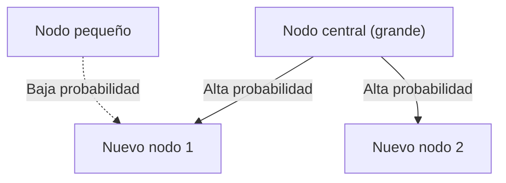

# 1. Introducción: El orden oculto en el mundo

En la naturaleza y la sociedad humana, a menudo se ocultan regularidades matemáticas asombrosamente bellas detrás de fenómenos que a primera vista parecen desordenados. Las palabras que usamos casualmente todos los días, el tamaño de las ciudades donde vivimos, el número de visitas a sitios web e incluso la magnitud de los terremotos: ¿qué pasaría si todos estos fenómenos aparentemente no relacionados siguieran en realidad una única ley matemática común?

Esa notable ley es la **ley de Zipf** (Zipf's Law). Esta ley es una regla empírica que establece que la frecuencia de aparición de los elementos en un conjunto de datos particular es inversamente proporcional a su rango. El elemento más frecuente aparece aproximadamente el doble de veces que el segundo más frecuente, y aproximadamente tres veces más que el tercero.

En este artículo, profundizaremos en la **ley de Zipf**, desde su contexto histórico y formulación matemática hasta asombrosos ejemplos del mundo real y por qué esta ley surge universalmente en los sistemas naturales y sociales, utilizando fórmulas, código de simulación e ilustraciones. Nuestro objetivo es proporcionar contenido que sirva no solo como una lectura atractiva, sino también como conocimiento fundamental para la ciencia de datos y el procesamiento del lenguaje natural.

# 2. Descubrimiento y contexto histórico de la ley de Zipf

La **ley de Zipf** fue ampliamente popularizada en la década de 1930 por el lingüista estadounidense George Kingsley Zipf. Sin embargo, él no fue el único descubridor de esta ley. El taquígrafo francés Jean-Baptiste Estoup y el físico Felix Auerbach, entre otros, habían notado fenómenos similares antes que Zipf.

Zipf analizó meticulosamente la frecuencia de aparición de palabras en textos en inglés. Después de contar laboriosamente a mano datos textuales a gran escala como la novela *Ulises* de James Joyce, descubrió una regularidad notable: la frecuencia de la palabra más utilizada en inglés ("the") era aproximadamente el doble de la segunda más utilizada ("of"), y aproximadamente tres veces la de la tercera ("and").

Zipf atribuyó este fenómeno al **principio del mínimo esfuerzo** (Principle of Least Effort), un principio fundamental del comportamiento humano. En otras palabras, los humanos tienden a usar un pequeño número de palabras simples con frecuencia y rara vez usan palabras complejas porque intentan transmitir información con el menor esfuerzo posible en la comunicación. Esta interpretación filosófica fue posteriormente respaldada desde las perspectivas de la teoría de la información y la mecánica estadística.

# 3. Formulación matemática: La ley rango-tamaño

Formalicemos ahora matemáticamente la **ley de Zipf** de manera rigurosa. Ordenamos los elementos (por ejemplo, palabras) de un conjunto de datos en orden descendente según su frecuencia de aparición.

El rango del elemento más frecuente es $r = 1$, el segundo más frecuente es $r = 2$, y así sucesivamente. Si $f(r)$ denota la frecuencia de aparición de un elemento con rango $r$, la ley de Zipf se expresa de la siguiente manera:

$$
f(r) \propto \frac{1}{r^\alpha}
$$

Aquí, $\alpha$ es una constante que depende del conjunto de datos y normalmente es $\alpha \approx 1$. En este caso, la frecuencia es exactamente inversamente proporcional al rango.

Para expresarlo como ecuación, sea la constante de proporcionalidad $C$:

$$
f(r) = \frac{C}{r^\alpha}
$$

La constante $C$ depende del número total de elementos en el conjunto de datos (por ejemplo, el número total de palabras). En términos probabilísticos, la probabilidad $P(r)$ de que aparezca un elemento de rango $r$ es:

$$
P(r) = \frac{\frac{1}{r^\alpha}}{\sum_{n=1}^{N} \frac{1}{n^\alpha}}
$$

Aquí, $N$ es el número de tipos de elementos distintos (por ejemplo, el tamaño del vocabulario). En el límite donde $\alpha > 1$, la serie del denominador converge a la función zeta de Riemann $\zeta(\alpha)$. Por esta razón, la **ley de Zipf** a veces se denomina distribución zeta.

Al tomar logaritmos, esta relación se puede visualizar más claramente:

$$
\log f(r) = \log C - \alpha \log r
$$

Esto significa que, al representarlo en un gráfico log-log (Log-Log Plot), se convierte en una línea recta con pendiente $-\alpha$. La forma más sencilla de comprobar si un conjunto de datos sigue la **ley de Zipf** es dibujar un gráfico log-log y ver si forma una línea recta. Si lo hace, entonces existe una **ley de potencias** (Power Law) detrás del fenómeno.

# 4. Asombrosos ejemplos del mundo real

La **ley de Zipf** se extiende mucho más allá del ámbito de la lingüística y se aplica a una gama asombrosamente diversa de fenómenos. Examinemos ejemplos de cinco campos diferentes en detalle.

## 4.1. Lingüística y procesamiento del lenguaje natural (PLN)

El ejemplo más clásico es la frecuencia de palabras en corpus textuales. Al analizar un corpus en inglés (como el texto completo de Wikipedia), las frecuencias de las palabras más comunes son las siguientes:

1. **the**: probabilidad de aparición de aproximadamente 7%
2. **of**: probabilidad de aparición de aproximadamente 3,5%
3. **and**: probabilidad de aparición de aproximadamente 2,8%
4. **to**: probabilidad de aparición de aproximadamente 2,6%

De esta manera, apenas unas pocas docenas de palabras de alta frecuencia representan casi la mitad del texto completo, mientras que cientos de miles de palabras restantes rara vez aparecen. Este fenómeno de "larga cola" (Long Tail) es extremadamente importante en la construcción de índices de motores de búsqueda y el diseño del vocabulario de grandes modelos de lenguaje (LLMs). En el campo del procesamiento del lenguaje natural, las palabras que aparecen con demasiada frecuencia (palabras vacías) contienen poca información, por lo que se utilizan técnicas como TF-IDF para reducir su peso.

## 4.2. Distribución de la población urbana

La **ley de Zipf** se observa no solo en el lenguaje sino también en los campos de la geografía y la ingeniería urbana. Cuando las poblaciones de las ciudades de un país se enumeran en orden descendente, la población de la segunda ciudad es la mitad de la primera, y la tercera es un tercio.

Por ejemplo, veamos los datos de población de ciudades estadounidenses (las cifras son aproximadas):
- 1.ª Nueva York: aproximadamente 8,4 millones de habitantes
- 2.ª Los Ángeles: aproximadamente 4 millones de habitantes (aproximadamente la mitad de Nueva York)
- 3.ª Chicago: aproximadamente 2,7 millones de habitantes (aproximadamente un tercio de Nueva York)

Por supuesto, en algunos países la concentración extrema en la capital (por ejemplo, Tokio en Japón, París en Francia) se desvía de la ley, un fenómeno conocido como efecto de "ciudad primada". Sin embargo, la tendencia general sigue hermosamente la **ley de potencias**.

## 4.3. Tráfico de sitios web

El número de visitas a sitios web en internet y el número de seguidores en redes sociales también siguen la **ley de Zipf**. Un puñado de sitios gigantes como Google, YouTube y Facebook monopolizan la mayor parte del tráfico, mientras que innumerables otros sitios reciben solo una cantidad minúscula. Esto se debe a que la estructura de enlaces en las redes de información se forma a través de la "vinculación preferencial", que se analiza más adelante.

## 4.4. Tamaño de empresas y distribución del ingreso (ley de Pareto)

Los ingresos corporativos, el número de empleados e incluso la distribución del ingreso personal siguen la **ley de potencias**. La ley relativa a la distribución del ingreso se llama **ley de Pareto** (Principio de Pareto), en honor al economista italiano Vilfredo Pareto. También se conoce como la "regla 80:20": "el 80% de la riqueza total es propiedad del 20% de las personas". Matemáticamente, la **ley de Zipf** y la **ley de Pareto** son simplemente el mismo fenómeno visto desde diferentes ángulos (rango vs. tamaño).

## 4.5. Magnitud de los terremotos (ley de Gutenberg-Richter)

Un ley similar existe en los campos de la física y las ciencias de la Tierra. La **ley de Gutenberg-Richter** describe la relación entre la magnitud de los terremotos y la frecuencia de ocurrencia. Cuando la magnitud aumenta en 1, la frecuencia de terremotos de esa magnitud disminuye a aproximadamente una décima parte. Aquí también podemos ver una estructura fractal donde los eventos enormes son extremadamente raros, mientras que los pequeños son innumerables.

# 5. ¿Por qué surge la ley de Zipf? (Mecanismos generativos)

¿Por qué aparece la misma estructura matemática en campos completamente diferentes como el lenguaje, las ciudades, la economía y los fenómenos físicos? Los investigadores en ciencia de sistemas complejos han propuesto varios mecanismos generativos.

## 5.1. Vinculación preferencial (Preferential Attachment)

El modelo más famoso en la ciencia de redes es el modelo de **vinculación preferencial** (Preferential Attachment), propuesto por Albert-László Barabási y otros. Se conoce coloquialmente como el fenómeno de "el rico se hace más rico" (Rich-get-richer).

Cuando un nuevo sitio web crea enlaces, es más probable que enlace a sitios conocidos que ya tienen muchos enlaces. Cuando nuevos residentes se mudan, es más probable que elijan grandes ciudades con infraestructura establecida. A través de un proceso dinámico donde se añaden nuevos elementos en proporción al tamaño existente (número de enlaces, población, etc.), la distribución resultante se convierte en una ley de potencias que sigue la **ley de Zipf**.

A continuación se muestra un diagrama conceptual de este proceso:



## 5.2. Principio del mínimo esfuerzo (Principle of Least Effort)

Esta es la hipótesis propuesta por el propio Zipf. En los sistemas de comunicación, existen deseos conflictivos entre el hablante y el oyente:
- **Deseo del hablante**: Expresar todo con un vocabulario reducido (asignar muchos significados a una sola palabra).
- **Deseo del oyente**: Asignar palabras separadas a cada concepto para eliminar la ambigüedad (buscar un vocabulario diverso).

El compromiso entre estos dos "esfuerzos" conflictivos da lugar naturalmente a una distribución de pocas palabras polisémicas de alta frecuencia y muchas palabras monosémicas raras, es decir, la **ley de Zipf**.

## 5.3. Modelo de escritura aleatoria (monos con máquinas de escribir)

Notablemente, matemáticos como Benoît Mandelbrot han demostrado que distribuciones similares a la **ley de Zipf** pueden surgir de procesos completamente aleatorios. Por ejemplo, supongamos que un mono presiona teclas al azar en una máquina de escribir (26 letras del alfabeto y una barra espaciadora) para crear "palabras". Si la probabilidad de presionar el espacio es $p$, las palabras más cortas se generan con mayor probabilidad. Al ordenarlas por rango, esto produce una distribución de ley de potencias que se asemeja al lenguaje natural. Esto sugiere que la **ley de Zipf** puede originarse no solo de la sofisticada actividad intelectual humana, sino también de las propiedades estadísticas inherentes del sistema mismo.

# 6. Simulación y código Python

Escribamos código Python para verificar la **ley de Zipf** a partir de datos textuales. El siguiente código cuenta las frecuencias de palabras a partir de texto generado aleatoriamente o un corpus existente y las grafica en un gráfico log-log.

```python
import matplotlib.pyplot as plt
from collections import Counter
import re
import numpy as np

def plot_zipf_law(text):
    # Convertir texto a minúsculas y dividir en palabras
    words = re.findall(r'\b\w+\b', text.lower())
    
    # Contar frecuencias de palabras
    word_counts = Counter(words)
    
    # Ordenar por frecuencia en orden descendente
    sorted_counts = sorted(word_counts.values(), reverse=True)
    ranks = np.arange(1, len(sorted_counts) + 1)
    
    # Graficar en gráfico log-log
    plt.figure(figsize=(10, 6))
    plt.loglog(ranks, sorted_counts, marker='o', linestyle='none', color='cyan', alpha=0.7)
    
    # Línea ideal de la ley de Zipf para comparación (alpha=1)
    expected_counts = [sorted_counts[0] / r for r in ranks]
    plt.loglog(ranks, expected_counts, color='red', linestyle='--', label="Ley de Zipf ideal (alpha=1)")
    
    plt.title("Verificación de la ley de Zipf")
    plt.xlabel("Rango (escala logarítmica)")
    plt.ylabel("Frecuencia (escala logarítmica)")
    plt.legend()
    plt.grid(True, which="both", ls="--", alpha=0.5)
    plt.show()

# Usando un texto ficticio muy largo como muestra
# En proyectos reales de ciencia de datos, use NLTK o el corpus de Gutenberg
dummy_text = "the and of to a in that is was he for it with as his on be at by i this had not are but from or have an they which one you were all her she there would their we him been has when who will no more if out so up said what its about than into them can only other new some could time these two may then do first any my now such like our over man me even most made after also did many before must through back years where much your way well down should because each just those people mr how too little state good very make world still own see men work long get here between both life being under never day same another know while last might great old year off come since against go came right used take three states himself few house use during without again place american around however home small found thought went say part once general high upon school every don't does got united left number course war until always away something fact water though less public put think almost hand enough far took head yet better display modern history area completely specific significant process" * 100

# plot_zipf_law(dummy_text)
```

Al ejecutar este código, puede confirmar que las frecuencias reales de palabras se distribuyen a lo largo de la línea discontinua roja (la ley de Zipf ideal). En la práctica de ciencia de datos, este tipo de análisis de frecuencia puede utilizarse para detectar sesgos y valores atípicos en los datos.

# 7. Aplicaciones en informática

La **ley de Zipf** desempeña un papel importante no solo como curiosidad teórica, sino también en algoritmos prácticos de informática.

## 7.1. Optimización de algoritmos de caché

La **ley de Zipf** es extremadamente importante en las estrategias de almacenamiento en caché para servidores web y bases de datos. Dado que un pequeño número de contenidos populares (por ejemplo, vídeos virales o noticias principales) representan la mayoría de los accesos, almacenarlos en cachés rápidas como la memoria (RAM) puede mejorar drásticamente el rendimiento general del sistema. Algoritmos como LFU (Least Frequently Used) y LRU (Least Recently Used) están diseñados precisamente para aprovechar esta asimetría de datos (ley de potencias).

## 7.2. Compresión de datos

En técnicas de codificación de entropía como la codificación de Huffman, se asignan cadenas de bits cortas a los patrones de datos que ocurren con frecuencia, y cadenas de bits largas a los patrones raros. Cuando la frecuencia de los datos sigue una distribución extremadamente sesgada como la **ley de Zipf**, el uso de dicha codificación de longitud variable permite una compresión drástica del tamaño de los datos. Esta propiedad estadística subyace a tecnologías de compresión como los archivos ZIP y las imágenes JPEG.

# 8. Conclusión: Una clave para comprender los sistemas complejos

En este artículo, hemos proporcionado una explicación detallada de la **ley de Zipf** (Zipf's Law), desde su definición y contexto matemático hasta ejemplos diversos y mecanismos generativos.

Frecuencias de palabras, poblaciones de ciudades, tamaños de empresas y tráfico web. Estos parecen operar a través de mecanismos completamente diferentes, pero desde una perspectiva macro, todos están gobernados por la misma **ley de potencias**. Esto demuestra que nuestro mundo no es simplemente una colección de fenómenos aleatorios, sino que posee un orden matemático a un nivel más profundo, como la autoorganización y las estructuras fractales.

Para científicos de datos e ingenieros, comprender si un conjunto de datos sigue una distribución normal (curva de campana) o una ley de potencias como la **ley de Zipf** (si tiene una cola larga) marca una diferencia crítica en el diseño de sistemas y la construcción de modelos. Tenga presente la **ley de Zipf** como una lente poderosa para descifrar el orden oculto del mundo.

---
*Este artículo fue escrito con el propósito de explorar la ciencia de datos y la ciencia de sistemas complejos. Para derivaciones matemáticas detalladas y teorías, recomendamos consultar textos especializados en física estadística y procesamiento del lenguaje natural.*
