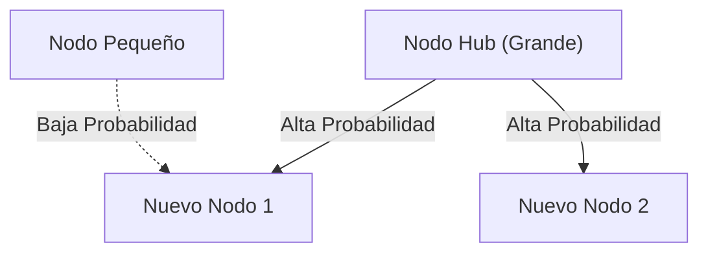

# 1. Introducción: El orden oculto que acecha en el mundo

En la naturaleza y en la sociedad humana, detrás de fenómenos que a primera vista parecen caóticos, a menudo se esconde una regularidad matemática sorprendentemente hermosa. Las palabras que usamos casualmente todos los días, el tamaño de las ciudades en las que vivimos, la cantidad de visitas a los sitios web e incluso la escala de los terremotos... ¿Qué pasaría si todos estos fenómenos aparentemente no relacionados siguieran una única regla matemática común?

Esa asombrosa ley es la **Ley de Zipf**. Esta ley es una regla empírica que establece que en un conjunto de datos específico, la frecuencia de un elemento es inversamente proporcional a su rango. El elemento más frecuente aparece aproximadamente el doble de veces que el segundo elemento más frecuente, y aproximadamente el triple que el tercero.

En este artículo profundizaremos de forma extremadamente detallada en la **Ley de Zipf**, desde sus antecedentes históricos hasta su formulación matemática, ejemplos asombrosos del mundo real y por qué surge universalmente en sistemas naturales y sociales, empleando fórmulas, código de simulación y diagramas. Nuestro objetivo es brindar contenido que pueda usarse no solo como lectura amena, sino también como conocimiento fundamental para la ciencia de datos y el procesamiento del lenguaje natural.

# 2. Descubrimiento de la Ley de Zipf y antecedentes históricos

La **Ley de Zipf** fue popularizada en la década de 1930 por el lingüista estadounidense George Kingsley Zipf. Sin embargo, no fue el único descubridor de esta ley. El taquígrafo francés Jean-Baptiste Estoup y el físico Felix Auerbach también notaron fenómenos similares antes que Zipf.

Zipf analizó en detalle la frecuencia de las palabras en oraciones en inglés. Como resultado de contar manualmente datos de texto a gran escala, como la novela "Ulises" de James Joyce, descubrió una regularidad sorprendente. Era el hecho de que la palabra más utilizada (en inglés, "the") ocurre aproximadamente el doble de veces que la segunda palabra más utilizada ("of"), y aproximadamente tres veces más a menudo que la tercera ("and").

Zipf afirmó que este fenómeno se reduce al **Principio del menor esfuerzo**, un principio básico del comportamiento humano. En otras palabras, en la comunicación, los humanos intentan transmitir información con el menor esfuerzo posible, por lo que utilizan con frecuencia unas pocas palabras sencillas y rara vez utilizan palabras complejas. Esta interpretación filosófica sería apoyada más tarde desde las perspectivas de la teoría de la información y la mecánica estadística.

# 3. Formulación matemática: Regla de rango-tamaño

Aquí, formulemos estrictamente la **Ley de Zipf** matemáticamente. Ordenamos los elementos de un conjunto de datos (por ejemplo, palabras) en orden descendente de su frecuencia.

Sea el rango del elemento más frecuente $r = 1$, y el segundo $r = 2$. Si la frecuencia para un elemento de rango $r$ es $f(r)$, la Ley de Zipf se expresa de la siguiente manera:

$$
f(r) \propto \frac{1}{r^\alpha}
$$

Aquí, $\alpha$ es una constante que depende del conjunto de datos y normalmente $\alpha \approx 1$. En este caso, la frecuencia es exactamente inversamente proporcional al rango.

Para expresarlo como una ecuación, estableciendo la constante de proporcionalidad como $C$,

$$
f(r) = \frac{C}{r^\alpha}
$$

La constante $C$ depende del número total de elementos en todo el conjunto de datos (como el número total de palabras). En términos de teoría de la probabilidad, la probabilidad $P(r)$ de que ocurra un elemento de rango $r$ es la siguiente:

$$
P(r) = \frac{\frac{1}{r^\alpha}}{\sum_{n=1}^{N} \frac{1}{n^\alpha}}
$$

Aquí, $N$ es la variedad de elementos (como el tamaño del vocabulario). La serie del denominador converge a la función zeta de [Riemann](https://kenji.blog/es/p/riemann/) $\zeta(\alpha)$ en el límite $\alpha > 1$. Por lo tanto, la **Ley de Zipf** a veces se denomina distribución zeta.

Al tomar el logaritmo, esta relación se puede visualizar más claramente.

$$
\log f(r) = \log C - \alpha \log r
$$

Esto significa que cuando se traza en un gráfico log-log, se convierte en una línea recta con una pendiente de $-\alpha$. La forma más sencilla de comprobar si un conjunto de datos sigue la **Ley de Zipf** es dibujar un gráfico log-log y ver si forma una línea recta. Si es una línea recta, se puede decir que existe una **Ley de potencias** detrás de ese fenómeno.

# 4. Asombrosos ejemplos del mundo real

La **Ley de Zipf** va más allá de los meros límites de la lingüística y se aplica a una variedad de fenómenos sorprendentemente amplia. Aquí veremos en detalle ejemplos de 5 campos diferentes.

## 4.1. Lingüística y Procesamiento del Lenguaje Natural (PLN)

El ejemplo más clásico es la frecuencia de palabras en los corpus de texto. Al analizar un corpus en inglés (por ejemplo, el texto completo de Wikipedia), la frecuencia de las palabras principales es la siguiente:

1. **the**: aproximadamente el 7% de probabilidad de aparición
2. **of**: aproximadamente el 3.5% de probabilidad de aparición
3. **and**: aproximadamente el 2.8% de probabilidad de aparición
4. **to**: aproximadamente el 2.6% de probabilidad de aparición

Por lo tanto, mientras que sólo unas pocas docenas de palabras frecuentes representan casi la mitad de todo el texto, cientos de miles de otras palabras rara vez aparecen. Este fenómeno de "Larga cola" es de extrema importancia en la construcción de índices de motores de búsqueda y el diseño de vocabularios para Grandes Modelos de Lenguaje ([LLM](https://kenji.blog/es/p/large-language-models-llm-transformer-prompt-engineering/)). En el campo del procesamiento del lenguaje natural, las palabras que aparecen con demasiada frecuencia (palabras vacías) contienen muy poca información, por lo que se utilizan técnicas como TF-IDF para reducir su peso.

## 4.2. Distribución de la población urbana

No solo en lingüística, la **Ley de Zipf** también se observa en geografía e ingeniería urbana. Al ordenar la población de las ciudades de un país determinado, la relación muestra que la segunda ciudad más grande tiene la mitad de la población de la primera y la tercera tiene un tercio.

Por ejemplo, analizando los datos de población de las ciudades de Estados Unidos (las cifras son aproximadas):
- 1º Nueva York: alrededor de 8,4 millones
- 2º Los Ángeles: alrededor de 4 millones (aproximadamente la mitad de Nueva York)
- 3º Chicago: alrededor de 2,7 millones (aproximadamente un tercio de Nueva York)

Por supuesto, dependiendo del país, la concentración extrema en la capital (como Tokio en Japón, París en Francia) puede llevar a un "fenómeno de la ciudad primada" que se desvía de la ley, pero la tendencia general sigue notablemente la **Ley de potencias**.

## 4.3. Tráfico de sitios web

El número de accesos a sitios web en Internet y el número de seguidores en redes sociales también siguen la **Ley de Zipf**. Una pequeña fracción de sitios masivos como Google, YouTube y Facebook monopoliza la mayor parte del tráfico, mientras que muchos otros sitios innumerables tienen muy poco acceso. Esto se debe a que la estructura de los enlaces en las redes de información está formada por un "enlace preferencial", que se discutirá más adelante.

## 4.4. Tamaño corporativo y distribución de ingresos (Principio de Pareto)

Las ventas corporativas, el número de empleados y la distribución de ingresos individuales también siguen la **Ley de potencias**. La ley con respecto a la distribución del ingreso lleva el nombre de **Principio de Pareto** en honor al economista italiano Vilfredo Pareto. También se la conoce como la "regla 80:20", que establece que "el 80% de la riqueza total es propiedad del 20% de las personas". Matemáticamente, la **Ley de Zipf** y el **Principio de Pareto** simplemente ven el mismo fenómeno desde diferentes ángulos (rango versus escala).

## 4.5. Escala de terremotos (Ley de Gutenberg-Richter)

Leyes similares existen en física y ciencias de la tierra. La **Ley de Gutenberg-Richter** muestra la relación entre la magnitud del terremoto y la frecuencia de ocurrencia. A medida que la magnitud aumenta en 1, la frecuencia de los terremotos de esa escala disminuye a aproximadamente una décima parte. Aquí también se observa una estructura fractal en la que eventos gigantes ocurren con extrema rareza, mientras que los eventos minúsculos ocurren en innumerables ocasiones.

# 5. ¿Por qué ocurre la Ley de Zipf? (Mecanismo de generación)

¿Por qué aparece la misma estructura matemática en campos completamente diferentes como el lenguaje, las ciudades, la economía y los fenómenos físicos? Los investigadores en ciencia de sistemas complejos han propuesto varios mecanismos de generación.

## 5.1. Conexión Preferencial (Preferential Attachment)

El modelo más famoso en la ciencia de redes es el modelo de **Conexión Preferencial**, propuesto por Albert-László Barabási y otros. Se le conoce comúnmente como el fenómeno de "los ricos se hacen más ricos".

Cuando un nuevo sitio web agrega un enlace, es muy probable que lo haga hacia un sitio famoso que ya tiene muchos enlaces. Cuando un nuevo residente se muda, es muy probable que elija una gran ciudad con infraestructura ya establecida. A medida que un proceso dinámico agrega nuevos elementos en proporción a la escala existente (número de enlaces, población, etc.), la distribución general resulta en una ley de potencias que sigue la **Ley de Zipf**.

A continuación se muestra un diagrama conceptual de este proceso.



## 5.2. Principio del Menor Esfuerzo

Esta es la hipótesis propuesta por el propio Zipf. En un sistema de comunicación, hay deseos conflictivos entre el hablante y el oyente.
- **Deseo del hablante**: Quiere expresarlo todo con un vocabulario reducido (asignar muchos significados a una sola palabra).
- **Deseo del oyente**: Quiere asignar diferentes palabras a cada concepto para eliminar la ambigüedad semántica (exigiendo un vocabulario diverso).

Como compromiso entre estos dos "esfuerzos" conflictivos, se explica que surge naturalmente una distribución de unas pocas palabras frecuentes polisémicas y muchas palabras raras inequívocas, es decir, la **Ley de Zipf**.

## 5.3. Modelo de escritura aleatoria (Monos golpeando máquinas de escribir)

Sorprendentemente, matemáticos como Benoit Mandelbrot han demostrado que distribuciones similares a la **Ley de Zipf** pueden surgir incluso de procesos completamente aleatorios.
Por ejemplo, supongamos que unos monos presionan las teclas de la máquina de escribir (26 letras del alfabeto y un espacio en blanco) al azar para crear "palabras". Sea $p$ la probabilidad de que ocurra un espacio; cuanto más corta sea la palabra, mayor será la probabilidad de que sea generada. Ordenarlas por rango produce una distribución de la ley de potencias al igual que el lenguaje natural. Esto sugiere la posibilidad de que la **Ley de Zipf** no provenga sólo de la compleja actividad intelectual humana, sino de las propiedades estadísticas del sistema en sí.

# 6. Simulación y código en Python

Escribamos código en Python para verificar la **Ley de Zipf** a partir de datos de texto reales. El siguiente código cuenta las frecuencias de las palabras utilizando un texto generado aleatoriamente o un corpus existente y las traza en un gráfico log-log.

```python
import matplotlib.pyplot as plt
from collections import Counter
import re
import numpy as np

def plot_zipf_law(text):
    # Convertir texto a minúsculas y dividirlo en palabras
    words = re.findall(r'\b\w+\b', text.lower())
    
    # Contar la frecuencia de aparición de las palabras
    word_counts = Counter(words)
    
    # Ordenar en orden descendente de frecuencia
    sorted_counts = sorted(word_counts.values(), reverse=True)
    ranks = np.arange(1, len(sorted_counts) + 1)
    
    # Trazar en un gráfico log-log
    plt.figure(figsize=(10, 6))
    plt.loglog(ranks, sorted_counts, marker='o', linestyle='none', color='cyan', alpha=0.7)
    
    # Línea recta ideal de la ley de Zipf para comparación (alpha=1)
    expected_counts = [sorted_counts[0] / r for r in ranks]
    plt.loglog(ranks, expected_counts, color='red', linestyle='--', label="Ideal Zipf's Law (alpha=1)")
    
    plt.title("Zipf's Law Verification")
    plt.xlabel("Rank (log scale)")
    plt.ylabel("Frequency (log scale)")
    plt.legend()
    plt.grid(True, which="both", ls="--", alpha=0.5)
    plt.show()

# Usar un texto simulado muy largo como muestra
# En un proyecto de ciencia de datos real, se usaría NLTK o el corpus de Gutenberg
dummy_text = "the and of to a in that is was he for it with as his on be at by i this had not are but from or have an they which one you were all her she there would their we him been has when who will no more if out so up said what its about than into them can only other new some could time these two may then do first any my now such like our over man me even most made after also did many before must through back years where much your way well down should because each just those people mr how too little state good very make world still own see men work long get here between both life being under never day same another know while last might great old year off come since against go came right used take three states himself few house use during without again place american around however home small found thought went say part once general high upon school every don't does got united left number course war until always away something fact water though less public put think almost hand enough far took head yet better display modern history area completely specific significant process" * 100

# plot_zipf_law(dummy_text)
```

Al ejecutar este código, se confirma que las frecuencias de las palabras reales se distribuyen a lo largo de la línea punteada roja (la ley de Zipf ideal). En la práctica de la ciencia de datos, a través de este tipo de análisis de frecuencias, se pueden detectar sesgos en los datos o anomalías.

# 7. Aplicación en Ciencias de la Computación

La **Ley de Zipf** juega un papel importante no sólo por su interés teórico sino también en algoritmos prácticos de ciencias de la computación.

## 7.1. Optimización del algoritmo de caché

En las estrategias de almacenamiento en caché para servidores web y bases de datos, la **Ley de Zipf** es extremadamente crucial. Debido a que una pequeña cantidad de contenido popular (como videos virales o noticias destacadas) representa la gran mayoría del acceso total, almacenarlos en una memoria caché rápida como la memoria (RAM) puede mejorar drásticamente el rendimiento de todo el sistema. Algoritmos como LFU (Menos frecuentemente usado) y LRU (Usado menos recientemente) están diseñados precisamente para aprovechar este sesgo de datos (ley de potencias).

## 7.2. Compresión de datos

En la codificación entrópica, como la Codificación Huffman, se asignan cadenas de bits cortas a patrones de datos que ocurren con frecuencia, mientras que se asignan cadenas de bits largas a patrones que ocurren raramente. Si las frecuencias de aparición de datos están extremadamente sesgadas como en la **Ley de Zipf**, el uso de una codificación de longitud variable permite comprimir drásticamente el tamaño de los datos. La base de las tecnologías de compresión, como los archivos ZIP y las imágenes JPEG, también utiliza estas propiedades estadísticas.

# 8. Conclusión: La clave para entender los sistemas complejos

En este artículo, hemos detallado la **Ley de Zipf**, desde su definición hasta sus antecedentes matemáticos, pasando por diversos ejemplos del mundo real y sus mecanismos de generación.

Frecuencia de palabras, población de las ciudades, tamaño de las empresas, tráfico web. Estos fenómenos parecen operar bajo mecanismos completamente diferentes, pero, desde una perspectiva macroscópica, están regidos por la misma **Ley de potencias**. Esto demuestra que nuestro mundo no es meramente una colección de fenómenos aleatorios, sino que mantiene un orden matemático a una dimensión más profunda, como la autoorganización y las estructuras fractales.

Para los científicos de datos e ingenieros, comprender si un conjunto de datos sigue una distribución normal (curva de campana) o una ley de potencias como la **Ley de Zipf** (con una larga cola) marca una diferencia crítica en el diseño del sistema y la construcción del modelo. Por favor, tenga presente la **Ley de Zipf** como una poderosa lente para descifrar el orden oculto del mundo.

---
*Este artículo fue escrito con el propósito de explorar la ciencia de datos y la ciencia de sistemas complejos. Para conocer en detalle las formulaciones y teorías matemáticas, recomendamos consultar libros especializados sobre física estadística y procesamiento del lenguaje natural.*
