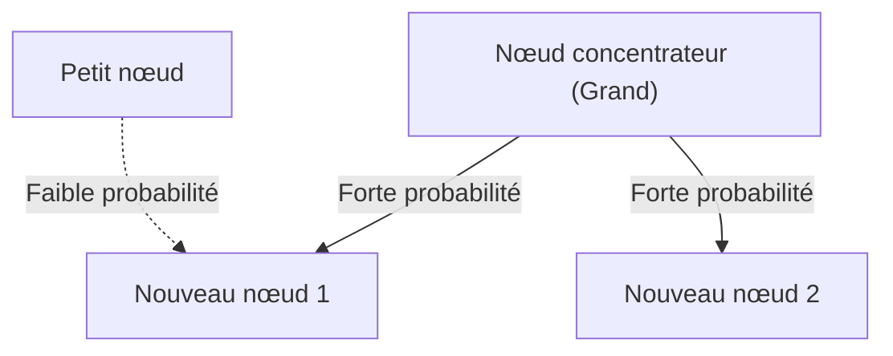

# 1. Introduction : L'ordre caché qui règne dans le monde

Dans la nature et la société humaine, derrière des phénomènes qui semblent chaotiques à première vue, se cache souvent une régularité mathématique d'une beauté surprenante. Les mots que nous utilisons quotidiennement avec désinvolture, la taille des villes dans lesquelles nous vivons, le nombre de visites sur des sites Web et même l'échelle des tremblements de terre... Et si tous ces phénomènes apparemment sans rapport obéissaient en réalité à une seule et même règle mathématique commune ?

Cette loi étonnante est la **[Loi de Zipf](https://kenji.blog/fr/p/zipfs-law/)**. Cette loi est une règle empirique affirmant que dans un ensemble de données spécifique, la fréquence d'un élément est inversement proportionnelle à son rang. L'élément qui apparaît le plus fréquemment se présente environ deux fois plus souvent que le deuxième élément le plus fréquent, et environ trois fois plus souvent que le troisième.

Dans cet article, nous allons explorer en profondeur cette **[Loi de Zipf](https://kenji.blog/fr/p/zipfs-law/)**, de son contexte historique à sa formulation mathématique, en passant par des exemples concrets stupéfiants et les raisons pour lesquelles une telle loi surgit universellement dans les systèmes naturels et sociaux, le tout à l'aide de formules, de codes de simulation et de diagrammes. Notre objectif est de proposer un contenu qui puisse être utilisé non seulement comme une lecture agréable, mais aussi comme des connaissances fondamentales en science des données et en traitement du langage naturel.

# 2. Découverte de la loi de Zipf et contexte historique

La **[Loi de Zipf](https://kenji.blog/fr/p/zipfs-law/)** a été largement popularisée dans les années 1930 par le linguiste américain George Kingsley Zipf. Cependant, il ne fut pas le seul découvreur de cette loi. Le sténographe français Jean-Baptiste Estoup et le physicien Felix Auerbach avaient également remarqué des phénomènes similaires avant Zipf.

Zipf a analysé en détail la fréquence des mots dans des phrases anglaises. En comptant manuellement des données textuelles à grande échelle, telles que le roman « Ulysse » de James Joyce, il a découvert une régularité surprenante. C'était le fait que le mot le plus fréquemment utilisé (en anglais, « the ») apparaît environ deux fois plus souvent que le deuxième mot le plus utilisé (« of »), et environ trois fois plus souvent que le troisième (« and »).

Zipf a affirmé que ce phénomène se résumait au **Principe du moindre effort**, un principe de base du comportement humain. En d'autres termes, lors de la communication, les humains essaient de transmettre des informations avec le moins d'effort possible, c'est pourquoi ils utilisent fréquemment quelques mots simples et utilisent rarement des mots complexes. Cette interprétation philosophique sera plus tard étayée du point de vue de la théorie de l'information et de la mécanique statistique.

# 3. Formulation mathématique : Règle rang-taille

Ici, formulons strictement la **[Loi de Zipf](https://kenji.blog/fr/p/zipfs-law/)** mathématiquement. Nous disposons les éléments d'un ensemble de données (par exemple, des mots) par ordre décroissant de leur fréquence.

Soit le rang de l'élément le plus fréquent $r = 1$, et le deuxième $r = 2$. Si la fréquence d'un élément de rang $r$ est $f(r)$, la loi de Zipf s'exprime comme suit :

$$
f(r) \propto \frac{1}{r^\alpha}
$$

Ici, $\alpha$ est une constante qui dépend de l'ensemble de données, et généralement $\alpha \approx 1$. Dans ce cas, la fréquence est exactement inversement proportionnelle au rang.

Pour l'exprimer sous forme d'équation, en fixant la constante de proportionnalité comme $C$,

$$
f(r) = \frac{C}{r^\alpha}
$$

La constante $C$ dépend du nombre total d'éléments dans l'ensemble de données complet (comme le nombre total de mots). En termes de théorie des probabilités, la probabilité $P(r)$ qu'un élément de rang $r$ se produise est la suivante :

$$
P(r) = \frac{\frac{1}{r^\alpha}}{\sum_{n=1}^{N} \frac{1}{n^\alpha}}
$$

Ici, $N$ est la variété d'éléments (comme la taille du vocabulaire). La série au dénominateur converge vers la fonction zêta de [Riemann](https://kenji.blog/fr/p/riemann/) $\zeta(\alpha)$ dans la limite $\alpha > 1$. C'est pourquoi la **[Loi de Zipf](https://kenji.blog/fr/p/zipfs-law/)** est parfois appelée distribution zêta.

En prenant le logarithme, cette relation peut être visualisée plus clairement.

$$
\log f(r) = \log C - \alpha \log r
$$

Cela signifie que lorsqu'elle est tracée sur un graphique log-log, elle devient une ligne droite avec une pente de $-\alpha$. La façon la plus simple de vérifier si un ensemble de données suit la **[Loi de Zipf](https://kenji.blog/fr/p/zipfs-law/)** est de tracer un graphique log-log et de voir s'il forme une ligne droite. S'il s'agit d'une ligne droite, on peut dire qu'une **Loi de puissance** existe derrière ce phénomène.

# 4. Des exemples concrets stupéfiants

La **[Loi de Zipf](https://kenji.blog/fr/p/zipfs-law/)** dépasse largement le cadre de la linguistique et s'applique à une variété de phénomènes étonnamment divers. Ici, regardons en détail des exemples dans 5 domaines différents.

## 4.1. Linguistique et traitement du langage naturel (TAL)

L'exemple le plus classique est la fréquence des mots dans les corpus de textes. Lors de l'analyse d'un corpus en anglais (par exemple, le texte entier de Wikipédia), la fréquence des mots les plus courants est la suivante :

1. **the** : environ 7 % de probabilité d'apparition
2. **of** : environ 3,5 % de probabilité d'apparition
3. **and** : environ 2,8 % de probabilité d'apparition
4. **to** : environ 2,6 % de probabilité d'apparition

Ainsi, alors que quelques dizaines de mots fréquents représentent près de la moitié de l'ensemble du texte, des centaines de milliers d'autres mots n'apparaissent presque jamais. Ce phénomène de « longue traîne » est extrêmement important pour la création d'index de moteurs de recherche et la conception de vocabulaires pour les grands modèles de langage ([LLM](https://kenji.blog/fr/p/large-language-models-llm-transformer-prompt-engineering/)). Dans le domaine du traitement du langage naturel, les mots qui apparaissent beaucoup trop fréquemment (mots vides) transportent peu d'informations, on utilise donc des techniques comme TF-IDF pour réduire leur poids.

## 4.2. Distribution de la population urbaine

Non seulement en linguistique, mais la **[Loi de Zipf](https://kenji.blog/fr/p/zipfs-law/)** est également observée en géographie et en ingénierie urbaine. Si l'on classe la population des villes d'un pays donné, la relation montre que la deuxième plus grande ville a la moitié de la population de la première, et la troisième en a le tiers.

Par exemple, regardons les données sur la population des villes des États-Unis (les chiffres sont approximatifs) :
- 1er New York : environ 8,4 millions
- 2e Los Angeles : environ 4 millions (environ la moitié de New York)
- 3e Chicago : environ 2,7 millions (environ un tiers de New York)

Bien sûr, selon le pays, une concentration extrême dans la capitale (comme Tokyo au Japon, Paris en France) peut entraîner un « phénomène de ville primatiale » qui s'écarte de la loi, mais la tendance globale suit remarquablement bien la **Loi de puissance**.

## 4.3. Trafic des sites Web

Le nombre d'accès aux sites Web sur Internet et le nombre d'abonnés sur les réseaux sociaux suivent également la **[Loi de Zipf](https://kenji.blog/fr/p/zipfs-law/)**. Une infime fraction de sites massifs comme Google, YouTube et Facebook monopolise la grande majorité du trafic, tandis qu'un nombre incalculable d'autres sites n'ont qu'un accès dérisoire. Cela est dû au fait que la structure des liens dans les réseaux d'information est formée par « l'attachement préférentiel », qui sera abordé plus loin.

## 4.4. Taille des entreprises et répartition des revenus (Principe de Pareto)

Les ventes des entreprises, le nombre d'employés et la répartition des revenus individuels obéissent également à la **Loi de puissance**. La loi concernant la répartition des revenus porte le nom de **Principe de Pareto** d'après l'économiste italien Vilfredo Pareto. Elle est également connue sous le nom de règle des « 80/20 », stipulant que « 80 % de la richesse globale est détenue par 20 % des personnes ». Mathématiquement parlant, la **[Loi de Zipf](https://kenji.blog/fr/p/zipfs-law/)** et le **Principe de Pareto** considèrent simplement le même phénomène sous des angles différents (rang vs échelle).

## 4.5. Échelle des séismes (Loi de Gutenberg-Richter)

Des lois similaires existent en physique et en sciences de la Terre. La **Loi de Gutenberg-Richter** illustre la relation entre la magnitude d'un tremblement de terre et sa fréquence d'occurrence. Lorsque la magnitude augmente de 1, la fréquence des tremblements de terre de cette échelle diminue d'environ un dixième. Ici aussi, on peut observer une structure fractale où des événements gigantesques se produisent très rarement, tandis que des événements minuscules se produisent d'innombrables fois.

# 5. Pourquoi la loi de Zipf se produit-elle ? (Mécanisme de génération)

Pourquoi la même structure mathématique apparaît-elle dans des domaines totalement différents comme le langage, les villes, l'économie et les phénomènes physiques ? Les chercheurs en science des systèmes complexes ont proposé plusieurs mécanismes de génération.

## 5.1. Attachement préférentiel (Preferential Attachment)

Le modèle le plus célèbre dans la science des réseaux est le modèle d'**Attachement préférentiel**, proposé par Albert-László Barabási et d'autres. On l'appelle communément le phénomène où « les riches s'enrichissent » (Rich-get-richer).

Lorsqu'un nouveau site Web ajoute un lien, il est très probable qu'il crée un lien vers un site célèbre qui possède déjà de nombreux liens. Lorsqu'un nouveau résident déménage, il est très probable qu'il choisisse une grande ville dotée d'infrastructures déjà établies. Au fur et à mesure qu'un processus dynamique ajoute de nouveaux éléments proportionnellement à l'échelle existante (nombre de liens, population, etc.), la distribution globale aboutit à une loi de puissance suivant la **[Loi de Zipf](https://kenji.blog/fr/p/zipfs-law/)**.

Voici un diagramme conceptuel de ce processus :



## 5.2. Principe du moindre effort

C'est l'hypothèse proposée par Zipf lui-même. Dans un système de communication, il existe des désirs contradictoires entre le locuteur et l'auditeur.
- **Désir du locuteur** : Souhaite tout exprimer avec un petit vocabulaire (attribuer de nombreuses significations à un seul mot).
- **Désir de l'auditeur** : Souhaite attribuer des mots différents à chaque concept pour éliminer l'ambiguïté sémantique (exigeant un vocabulaire diversifié).

En tant que compromis entre ces deux « efforts » conflictuels, une distribution avec quelques mots fréquents polysémiques et un grand nombre de mots rares sans ambiguïté, c'est-à-dire la **[Loi de Zipf](https://kenji.blog/fr/p/zipfs-law/)**, est expliquée comme apparaissant naturellement.

## 5.3. Modèle de frappe aléatoire (Des singes tapant sur des machines à écrire)

Étonnamment, des mathématiciens comme Benoît Mandelbrot ont démontré que des distributions similaires à la **[Loi de Zipf](https://kenji.blog/fr/p/zipfs-law/)** peuvent émerger même de processus totalement aléatoires.
Par exemple, supposons que des singes frappent sur les touches d'une machine à écrire (les 26 lettres de l'alphabet et un espace) de manière totalement aléatoire pour créer des « mots ». Soit $p$ la probabilité d'obtenir un espace ; plus le mot est court, plus sa probabilité d'être généré est élevée. En les ordonnant par rang, on obtient une distribution en loi de puissance semblable au langage naturel. Cela suggère que la **[Loi de Zipf](https://kenji.blog/fr/p/zipfs-law/)** pourrait ne pas provenir uniquement d'une activité intellectuelle humaine complexe, mais des propriétés statistiques du système lui-même.

# 6. Simulation et code Python

Utilisons concrètement Python pour écrire un code qui vérifie la **[Loi de Zipf](https://kenji.blog/fr/p/zipfs-law/)** à partir de données textuelles. Le code suivant compte la fréquence des mots à l'aide de textes générés aléatoirement ou d'un corpus existant, et les trace sur un graphique log-log.

```python
import matplotlib.pyplot as plt
from collections import Counter
import re
import numpy as np

def plot_zipf_law(text):
    # Convertir le texte en minuscules et le diviser en mots
    words = re.findall(r'\b\w+\b', text.lower())
    
    # Compter la fréquence d'apparition des mots
    word_counts = Counter(words)
    
    # Trier par ordre décroissant de fréquence
    sorted_counts = sorted(word_counts.values(), reverse=True)
    ranks = np.arange(1, len(sorted_counts) + 1)
    
    # Tracer sur un graphique log-log
    plt.figure(figsize=(10, 6))
    plt.loglog(ranks, sorted_counts, marker='o', linestyle='none', color='cyan', alpha=0.7)
    
    # Droite idéale de la loi de Zipf pour comparaison (alpha=1)
    expected_counts = [sorted_counts[0] / r for r in ranks]
    plt.loglog(ranks, expected_counts, color='red', linestyle='--', label="Ideal Zipf's Law (alpha=1)")
    
    plt.title("Zipf's Law Verification")
    plt.xlabel("Rank (log scale)")
    plt.ylabel("Frequency (log scale)")
    plt.legend()
    plt.grid(True, which="both", ls="--", alpha=0.5)
    plt.show()

# Utiliser un texte factice très long comme échantillon
# Dans un vrai projet de science des données, on utilise NLTK ou le corpus Gutenberg
dummy_text = "the and of to a in that is was he for it with as his on be at by i this had not are but from or have an they which one you were all her she there would their we him been has when who will no more if out so up said what its about than into them can only other new some could time these two may then do first any my now such like our over man me even most made after also did many before must through back years where much your way well down should because each just those people mr how too little state good very make world still own see men work long get here between both life being under never day same another know while last might great old year off come since against go came right used take three states himself few house use during without again place american around however home small found thought went say part once general high upon school every don't does got united left number course war until always away something fact water though less public put think almost hand enough far took head yet better display modern history area completely specific significant process" * 100

# plot_zipf_law(dummy_text)
```

L'exécution de ce code confirme que les fréquences réelles des mots sont distribuées le long de la ligne pointillée rouge (la loi de Zipf idéale). Dans la pratique de la science des données, de telles analyses de fréquence permettent de détecter les biais dans les données ou les valeurs aberrantes.

# 7. Applications en informatique

La **[Loi de Zipf](https://kenji.blog/fr/p/zipfs-law/)** joue un rôle important non seulement pour son intérêt théorique, mais aussi dans des algorithmes pratiques en informatique.

## 7.1. Optimisation des algorithmes de cache

Dans les stratégies de mise en cache pour les serveurs Web et les bases de données, la **[Loi de Zipf](https://kenji.blog/fr/p/zipfs-law/)** est d'une importance capitale. Étant donné qu'une petite quantité de contenu populaire (comme des vidéos virales ou des actualités de premier plan) représente la grande majorité de l'accès global, le stockage de ces éléments dans une mémoire cache rapide (comme la RAM) peut considérablement améliorer les performances de l'ensemble du système. Les algorithmes tels que LFU (Least Frequently Used) et LRU (Least Recently Used) sont précisément conçus pour tirer parti de ce biais de données (loi de puissance).

## 7.2. Compression de données

Dans le codage entropique comme le codage de Huffman, de courtes séquences de bits sont attribuées aux modèles de données qui apparaissent fréquemment, tandis que de longues séquences de bits sont attribuées aux modèles qui apparaissent rarement. Si les fréquences d'apparition des données sont extrêmement asymétriques comme dans la **[Loi de Zipf](https://kenji.blog/fr/p/zipfs-law/)**, l'utilisation d'un tel codage à longueur variable permet de compresser considérablement la taille des données. La base des technologies de compression telles que les fichiers ZIP et les images JPEG utilise également ces propriétés statistiques.

# 8. Conclusion : La clé pour comprendre les systèmes complexes

Dans cet article, nous avons détaillé la **[Loi de Zipf](https://kenji.blog/fr/p/zipfs-law/)**, de sa définition à son contexte mathématique, en passant par ses divers exemples concrets et ses mécanismes de génération.

Fréquence des mots, population des villes, taille des entreprises, trafic Web. Tous ces éléments semblent fonctionner selon des mécanismes complètement différents, mais d'un point de vue macroscopique, ils sont régis par la même **Loi de puissance**. Cela montre que notre monde n'est pas simplement un assemblage de phénomènes aléatoires, mais qu'il possède un ordre mathématique à une dimension plus profonde, comme l'auto-organisation et les structures fractales.

Pour les data scientists et les ingénieurs, comprendre si un ensemble de données suit une distribution normale (courbe en cloche) ou une loi de puissance comme la **[Loi de Zipf](https://kenji.blog/fr/p/zipfs-law/)** (ayant une longue traîne) fait une différence cruciale dans la conception du système et la création du modèle. Veuillez garder la **[Loi de Zipf](https://kenji.blog/fr/p/zipfs-law/)** à l'esprit en tant que puissante lentille pour déchiffrer l'ordre caché du monde.

---
*Cet article a été rédigé dans le but d'explorer la science des données et la science des systèmes complexes. Pour des développements mathématiques détaillés et des théories approfondies, nous vous recommandons de vous référer à des ouvrages spécialisés sur la physique statistique et le traitement du langage naturel.*
