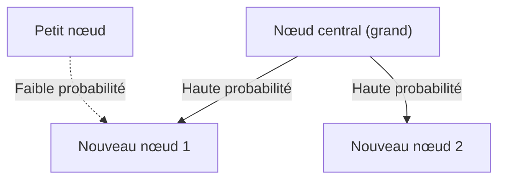

# 1. Introduction : L'ordre caché dans le monde

Dans la nature et la société humaine, des régularités mathématiques d'une beauté étonnante se cachent souvent derrière des phénomènes qui semblent désordonnés à première vue. Les mots que nous utilisons nonchalamment chaque jour, la taille des villes où nous vivons, le nombre de visites sur les sites web, et même l'amplitude des tremblements de terre — et si tous ces phénomènes apparemment sans rapport suivaient en réalité une seule loi mathématique commune ?

Cette loi remarquable est la **loi de Zipf** (Zipf's Law). Cette loi est une règle empirique stipulant que la fréquence d'apparition des éléments dans un ensemble de données donné est inversement proportionnelle à leur rang. L'élément le plus fréquent apparaît environ deux fois plus souvent que le deuxième plus fréquent, et environ trois fois plus souvent que le troisième.

Dans cet article, nous allons explorer en profondeur la **loi de Zipf** — de son contexte historique et sa formulation mathématique à des exemples étonnants du monde réel, en passant par les raisons pour lesquelles cette loi émerge universellement dans les systèmes naturels et sociaux — à l'aide de formules, de code de simulation et d'illustrations. Notre objectif est de fournir un contenu qui serve non seulement de lecture captivante, mais aussi de connaissances fondamentales en science des données et en traitement automatique du langage naturel.

# 2. Découverte et contexte historique de la loi de Zipf

La **loi de Zipf** a été largement popularisée dans les années 1930 par le linguiste américain George Kingsley Zipf. Cependant, il n'était pas le seul découvreur de cette loi. Le sténographe français Jean-Baptiste Estoup et le physicien Felix Auerbach, entre autres, avaient remarqué des phénomènes similaires avant Zipf.

Zipf a méticuleusement analysé la fréquence d'apparition des mots dans les textes anglais. Après avoir laborieusement compté à la main des données textuelles à grande échelle comme le roman *Ulysse* de James Joyce, il a découvert une régularité remarquable : la fréquence du mot le plus utilisé en anglais (« the ») était environ le double de celle du deuxième mot le plus utilisé (« of »), et environ le triple de celle du troisième (« and »).

Zipf a attribué ce phénomène au **principe du moindre effort** (Principle of Least Effort), un principe fondamental du comportement humain. En d'autres termes, les humains ont tendance à utiliser fréquemment un petit nombre de mots simples et à rarement utiliser des mots complexes parce qu'ils essaient de transmettre l'information avec le moins d'effort possible dans la communication. Cette interprétation philosophique a été par la suite confirmée du point de vue de la théorie de l'information et de la mécanique statistique.

# 3. Formulation mathématique : La loi rang-taille

Formalisons maintenant mathématiquement la **loi de Zipf** de manière rigoureuse. Nous classons les éléments (par exemple, les mots) d'un ensemble de données par ordre décroissant de leur fréquence d'apparition.

Le rang de l'élément le plus fréquent est $r = 1$, le deuxième plus fréquent est $r = 2$, et ainsi de suite. Si $f(r)$ désigne la fréquence d'apparition d'un élément de rang $r$, la loi de Zipf s'exprime comme suit :

$$
f(r) \propto \frac{1}{r^\alpha}
$$

Ici, $\alpha$ est une constante qui dépend de l'ensemble de données et est généralement $\alpha \approx 1$. Dans ce cas, la fréquence est exactement inversement proportionnelle au rang.

Pour l'exprimer sous forme d'équation, posons la constante de proportionnalité $C$ :

$$
f(r) = \frac{C}{r^\alpha}
$$

La constante $C$ dépend du nombre total d'éléments dans l'ensemble de données (par exemple, le nombre total de mots). En termes probabilistes, la probabilité $P(r)$ qu'un élément de rang $r$ apparaisse est :

$$
P(r) = \frac{\frac{1}{r^\alpha}}{\sum_{n=1}^{N} \frac{1}{n^\alpha}}
$$

Ici, $N$ est le nombre de types d'éléments distincts (par exemple, la taille du vocabulaire). À la limite où $\alpha > 1$, la série au dénominateur converge vers la fonction zêta de Riemann $\zeta(\alpha)$. Pour cette raison, la **loi de Zipf** est parfois appelée distribution zêta.

En prenant les logarithmes, cette relation peut être visualisée plus clairement :

$$
\log f(r) = \log C - \alpha \log r
$$

Cela signifie que lorsqu'elle est représentée sur un graphique log-log (Log-Log Plot), elle devient une droite de pente $-\alpha$. La méthode la plus simple pour vérifier si un ensemble de données suit la **loi de Zipf** consiste à tracer un graphique log-log et à voir s'il forme une droite. Si c'est le cas, alors une **loi de puissance** (Power Law) existe derrière le phénomène.

# 4. Exemples étonnants du monde réel

La **loi de Zipf** s'étend bien au-delà du domaine de la linguistique et s'applique à une gamme étonnamment diverse de phénomènes. Examinons en détail des exemples provenant de cinq domaines différents.

## 4.1. Linguistique et traitement automatique du langage naturel (TAL)

L'exemple le plus classique est la fréquence des mots dans les corpus textuels. Lors de l'analyse d'un corpus anglais (tel que le texte intégral de Wikipédia), les fréquences des mots les plus courants sont les suivantes :

1. **the** : probabilité d'apparition d'environ 7 %
2. **of** : probabilité d'apparition d'environ 3,5 %
3. **and** : probabilité d'apparition d'environ 2,8 %
4. **to** : probabilité d'apparition d'environ 2,6 %

Ainsi, quelques dizaines de mots à haute fréquence représentent près de la moitié du texte entier, tandis que des centaines de milliers de mots restants apparaissent rarement. Ce phénomène de « longue traîne » (Long Tail) est extrêmement important pour la construction d'index de moteurs de recherche et la conception du vocabulaire des grands modèles de langage (LLMs). Dans le domaine du traitement automatique du langage naturel, les mots qui apparaissent trop fréquemment (mots vides) portent peu d'information, c'est pourquoi des techniques comme le TF-IDF sont utilisées pour réduire leur poids.

## 4.2. Distribution de la population urbaine

La **loi de Zipf** est observée non seulement dans le langage mais aussi dans les domaines de la géographie et de l'urbanisme. Lorsque les populations des villes d'un pays sont classées par ordre décroissant, la population de la deuxième ville est la moitié de celle de la première, et la troisième est un tiers.

Par exemple, examinons les données de population des villes américaines (les chiffres sont approximatifs) :
- 1re New York : environ 8,4 millions d'habitants
- 2e Los Angeles : environ 4 millions d'habitants (environ la moitié de New York)
- 3e Chicago : environ 2,7 millions d'habitants (environ un tiers de New York)

Bien sûr, dans certains pays, la concentration extrême dans la capitale (par exemple, Tokyo au Japon, Paris en France) dévie de la loi, un phénomène connu sous le nom d'effet de « ville primatiale ». Cependant, la tendance générale suit magnifiquement la **loi de puissance**.

## 4.3. Trafic des sites web

Le nombre de visites sur les sites web sur Internet et le nombre d'abonnés sur les réseaux sociaux suivent également la **loi de Zipf**. Une poignée de sites géants comme Google, YouTube et Facebook monopolisent la majeure partie du trafic, tandis que d'innombrables autres sites ne reçoivent qu'une quantité infime. Cela s'explique par le fait que la structure des liens dans les réseaux d'information se forme par « attachement préférentiel », qui est abordé plus loin.

## 4.4. Taille des entreprises et distribution des revenus (loi de Pareto)

Les revenus des entreprises, le nombre d'employés et même la distribution des revenus personnels suivent la **loi de puissance**. La loi relative à la distribution des revenus est appelée **loi de Pareto** (Principe de Pareto), du nom de l'économiste italien Vilfredo Pareto. Elle est également connue sous le nom de « règle 80:20 » — « 80 % de la richesse totale est détenue par 20 % des personnes ». Mathématiquement, la **loi de Zipf** et la **loi de Pareto** ne sont que le même phénomène vu sous des angles différents (rang vs. taille).

## 4.5. Magnitude des tremblements de terre (loi de Gutenberg-Richter)

Une loi similaire existe dans les domaines de la physique et des sciences de la Terre. La **loi de Gutenberg-Richter** décrit la relation entre la magnitude des tremblements de terre et la fréquence d'occurrence. Lorsque la magnitude augmente de 1, la fréquence des tremblements de terre de cette magnitude diminue à environ un dixième. Ici aussi, nous pouvons voir une structure fractale où les événements énormes sont extrêmement rares, tandis que les petits événements sont innombrables.

# 5. Pourquoi la loi de Zipf émerge-t-elle ? (Mécanismes générateurs)

Pourquoi la même structure mathématique apparaît-elle dans des domaines entièrement différents comme le langage, les villes, l'économie et les phénomènes physiques ? Les chercheurs en science des systèmes complexes ont proposé plusieurs mécanismes générateurs.

## 5.1. Attachement préférentiel (Preferential Attachment)

Le modèle le plus célèbre en science des réseaux est le modèle d'**attachement préférentiel** (Preferential Attachment), proposé par Albert-László Barabási et d'autres. Il est familièrement connu sous le nom de phénomène « les riches deviennent plus riches » (Rich-get-richer).

Lorsqu'un nouveau site web crée des liens, il est plus susceptible de créer un lien vers des sites connus qui ont déjà beaucoup de liens. Lorsque de nouveaux résidents déménagent, ils sont plus susceptibles de choisir de grandes villes avec des infrastructures établies. À travers un processus dynamique où de nouveaux éléments sont ajoutés proportionnellement à la taille existante (nombre de liens, population, etc.), la distribution globale résultante devient une loi de puissance suivant la **loi de Zipf**.

Ci-dessous un diagramme conceptuel de ce processus :



## 5.2. Principe du moindre effort (Principle of Least Effort)

C'est l'hypothèse proposée par Zipf lui-même. Dans les systèmes de communication, il existe des désirs conflictuels entre le locuteur et l'auditeur :
- **Désir du locuteur** : Tout exprimer avec un vocabulaire restreint (attribuer de nombreuses significations à un seul mot).
- **Désir de l'auditeur** : Attribuer des mots séparés à chaque concept pour éliminer l'ambiguïté (rechercher un vocabulaire diversifié).

Le compromis entre ces deux « efforts » conflictuels donne naturellement naissance à une distribution de quelques mots polysémiques à haute fréquence et de nombreux mots monosémiques rares — à savoir, la **loi de Zipf**.

## 5.3. Modèle de frappe aléatoire (les singes dactylographes)

Remarquablement, des mathématiciens comme Benoît Mandelbrot ont montré que des distributions ressemblant à la **loi de Zipf** peuvent émerger de processus entièrement aléatoires. Par exemple, supposons qu'un singe appuie aléatoirement sur les touches d'une machine à écrire (26 lettres de l'alphabet et une barre d'espace) pour créer des « mots ». Si la probabilité d'appuyer sur l'espace est $p$, les mots plus courts sont générés avec une probabilité plus élevée. Classés par rang, cela produit une distribution en loi de puissance qui ressemble au langage naturel. Cela suggère que la **loi de Zipf** pourrait provenir non seulement de l'activité intellectuelle humaine sophistiquée, mais aussi des propriétés statistiques inhérentes du système lui-même.

# 6. Simulation et code Python

Écrivons du code Python pour vérifier la **loi de Zipf** à partir de données textuelles. Le code suivant compte les fréquences de mots à partir de texte généré aléatoirement ou d'un corpus existant et les trace sur un graphique log-log.

```python
import matplotlib.pyplot as plt
from collections import Counter
import re
import numpy as np

def plot_zipf_law(text):
    # Convertir le texte en minuscules et le découper en mots
    words = re.findall(r'\b\w+\b', text.lower())
    
    # Compter les fréquences des mots
    word_counts = Counter(words)
    
    # Trier par fréquence en ordre décroissant
    sorted_counts = sorted(word_counts.values(), reverse=True)
    ranks = np.arange(1, len(sorted_counts) + 1)
    
    # Tracer sur un graphique log-log
    plt.figure(figsize=(10, 6))
    plt.loglog(ranks, sorted_counts, marker='o', linestyle='none', color='cyan', alpha=0.7)
    
    # Droite idéale de la loi de Zipf pour comparaison (alpha=1)
    expected_counts = [sorted_counts[0] / r for r in ranks]
    plt.loglog(ranks, expected_counts, color='red', linestyle='--', label="Loi de Zipf idéale (alpha=1)")
    
    plt.title("Vérification de la loi de Zipf")
    plt.xlabel("Rang (échelle logarithmique)")
    plt.ylabel("Fréquence (échelle logarithmique)")
    plt.legend()
    plt.grid(True, which="both", ls="--", alpha=0.5)
    plt.show()

# Utilisation d'un très long texte factice comme exemple
# Dans les projets réels de science des données, utilisez NLTK ou le corpus Gutenberg
dummy_text = "the and of to a in that is was he for it with as his on be at by i this had not are but from or have an they which one you were all her she there would their we him been has when who will no more if out so up said what its about than into them can only other new some could time these two may then do first any my now such like our over man me even most made after also did many before must through back years where much your way well down should because each just those people mr how too little state good very make world still own see men work long get here between both life being under never day same another know while last might great old year off come since against go came right used take three states himself few house use during without again place american around however home small found thought went say part once general high upon school every don't does got united left number course war until always away something fact water though less public put think almost hand enough far took head yet better display modern history area completely specific significant process" * 100

# plot_zipf_law(dummy_text)
```

En exécutant ce code, vous pouvez confirmer que les fréquences réelles des mots se distribuent le long de la ligne pointillée rouge (la loi de Zipf idéale). Dans la pratique de la science des données, une telle analyse de fréquence peut être utilisée pour détecter les biais et les valeurs aberrantes dans les données.

# 7. Applications en informatique

La **loi de Zipf** joue un rôle important non seulement en tant que curiosité théorique, mais aussi dans les algorithmes pratiques de l'informatique.

## 7.1. Optimisation des algorithmes de cache

La **loi de Zipf** est extrêmement importante dans les stratégies de mise en cache pour les serveurs web et les bases de données. Comme un petit nombre de contenus populaires (par exemple, des vidéos virales ou les principales actualités) représentent la majorité des accès, les stocker dans des caches rapides comme la mémoire (RAM) peut améliorer considérablement les performances globales du système. Les algorithmes comme LFU (Least Frequently Used) et LRU (Least Recently Used) sont conçus précisément pour exploiter cette asymétrie des données (loi de puissance).

## 7.2. Compression de données

Dans les techniques de codage entropique comme le codage de Huffman, des chaînes de bits courtes sont attribuées aux motifs de données fréquents, et des chaînes de bits longues aux motifs rares. Lorsque la fréquence des données suit une distribution extrêmement asymétrique comme la **loi de Zipf**, l'utilisation d'un tel codage à longueur variable permet une compression spectaculaire de la taille des données. Cette propriété statistique sous-tend les technologies de compression telles que les fichiers ZIP et les images JPEG.

# 8. Conclusion : Une clé pour comprendre les systèmes complexes

Dans cet article, nous avons fourni une explication détaillée de la **loi de Zipf** (Zipf's Law), de sa définition et son contexte mathématique à des exemples divers et des mécanismes générateurs.

Fréquences de mots, populations de villes, tailles d'entreprises et trafic web. Ceux-ci semblent fonctionner par des mécanismes entièrement différents, mais d'un point de vue macro, ils sont tous gouvernés par la même **loi de puissance**. Cela montre que notre monde n'est pas simplement un assemblage de phénomènes aléatoires, mais possède un ordre mathématique à un niveau plus profond, tel que l'auto-organisation et les structures fractales.

Pour les scientifiques des données et les ingénieurs, comprendre si un ensemble de données suit une distribution normale (courbe en cloche) ou une loi de puissance comme la **loi de Zipf** (s'il a une longue traîne) fait une différence critique dans la conception des systèmes et la construction des modèles. Gardez la **loi de Zipf** à l'esprit comme une lentille puissante pour déchiffrer l'ordre caché du monde.

---
*Cet article a été rédigé dans le but d'explorer la science des données et la science des systèmes complexes. Pour des développements mathématiques détaillés et des théories, nous recommandons de consulter des ouvrages spécialisés en physique statistique et en traitement automatique du langage naturel.*
