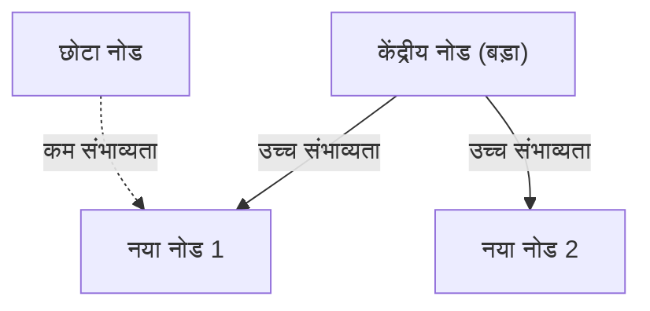

# 1. परिचय: विश्व में छिपी हुई व्यवस्था

प्रकृति और मानव समाज में, उल्लेखनीय रूप से सुंदर गणितीय नियमितताएं अक्सर उन घटनाओं के पीछे छिपी रहती हैं जो पहली नज़र में अव्यवस्थित दिखाई देती हैं। वे शब्द जो हम प्रतिदिन आकस्मिक रूप से उपयोग करते हैं, जिन शहरों में हम रहते हैं उनका आकार, वेबसाइटों पर जाने की संख्या और यहां तक ​​कि भूकंप की तीव्रता - क्या होगा यदि ये सभी असंबंधित प्रतीत होने वाली घटनाएं वास्तव में एक ही सामान्य गणितीय कानून का पालन करती हैं?

वह उल्लेखनीय कानून है **जिपफ का नियम**। यह कानून एक अनुभवजन्य नियम है जो बताता है कि किसी विशेष डेटासेट में तत्वों की घटना की आवृत्ति उनकी रैंक के व्युत्क्रमानुपाती होती है। सबसे अधिक बार होने वाला तत्व दूसरे सबसे अधिक बार आने वाले तत्व से लगभग दोगुना और तीसरे से लगभग तीन गुना अधिक बार प्रकट होता है।

इस लेख में, हम **जिपफ के नियम** में गहराई से उतरेंगे - इसकी ऐतिहासिक पृष्ठभूमि और गणितीय सूत्रीकरण से लेकर आश्चर्यजनक वास्तविक दुनिया के उदाहरणों तक, और क्यों ऐसा कानून सार्वभौमिक रूप से प्राकृतिक और सामाजिक प्रणालियों में उत्पन्न होता है - सूत्रों, सिमुलेशन कोड और चित्रण का उपयोग करके। हमारा लक्ष्य ऐसी सामग्री प्रदान करना है जो न केवल पढ़ने में रुचिकर हो बल्कि डेटा विज्ञान और प्राकृतिक भाषा प्रसंस्करण के लिए मूलभूत ज्ञान के रूप में भी काम आए।

# 2. ज़िप्फ़ के नियम की खोज और ऐतिहासिक पृष्ठभूमि

**जिपफ का नियम** को 1930 के दशक में अमेरिकी भाषाविद् जॉर्ज किंग्सले जिपफ द्वारा व्यापक रूप से लोकप्रिय बनाया गया था। हालाँकि, वह इस कानून के एकमात्र खोजकर्ता नहीं थे। फ़्रांसीसी स्टेनोग्राफर जीन-बैप्टिस्ट एस्टूप और भौतिक विज्ञानी फ़ेलिक्स औएरबैक सहित अन्य लोगों ने जिप्फ़ से पहले इसी तरह की घटना देखी थी।

Zipf ने अंग्रेजी पाठों में शब्द घटित होने की आवृत्ति का सावधानीपूर्वक विश्लेषण किया। जेम्स जॉयस के उपन्यास *यूलिसिस* जैसे बड़े पैमाने पर टेक्स्ट डेटा को हाथ से गिनने के बाद, उन्होंने एक उल्लेखनीय नियमितता की खोज की: अंग्रेजी में सबसे अधिक इस्तेमाल किए जाने वाले शब्द ("द") की आवृत्ति दूसरे सबसे अधिक इस्तेमाल किए जाने वाले शब्द ("ऑफ") से लगभग दोगुनी थी, और तीसरे ("और") से लगभग तीन गुना थी।

ज़िप्फ़ ने इस घटना के लिए **कम से कम प्रयास के सिद्धांत** को जिम्मेदार ठहराया, जो मानव व्यवहार का एक मौलिक सिद्धांत है। दूसरे शब्दों में, मनुष्य अक्सर कम संख्या में सरल शब्दों का उपयोग करते हैं और जटिल शब्दों का उपयोग शायद ही कभी करते हैं क्योंकि वे संचार में यथासंभव कम प्रयास के साथ जानकारी देने का प्रयास करते हैं। इस दार्शनिक व्याख्या को बाद में सूचना सिद्धांत और सांख्यिकीय यांत्रिकी के दृष्टिकोण से भी समर्थन दिया गया।

# 3. गणितीय सूत्रीकरण: रैंक-आकार कानून

आइए अब गणितीय रूप से **जिपफ के नियम** को औपचारिक रूप दें। हम डेटासेट में तत्वों (उदाहरण के लिए, शब्द) को उनकी घटना की आवृत्ति के अवरोही क्रम में व्यवस्थित करते हैं।

सबसे अधिक बार आने वाले तत्व की रैंक $r = 1$ है, दूसरी सबसे अधिक बार आने वाली तत्व की रैंक $r = 2$ है, इत्यादि। यदि $f(r)$ रैंक $r$ वाले तत्व के लिए घटना की आवृत्ति को दर्शाता है, तो Zipf का नियम निम्नानुसार व्यक्त किया गया है:

$$
f(r) \propto \frac{1}{r^\alpha}
$$

यहां, $\alpha$ एक स्थिरांक है जो डेटासेट पर निर्भर करता है और आमतौर पर $\alpha \approx 1$ होता है। इस मामले में, आवृत्ति रैंक के बिल्कुल विपरीत आनुपातिक है।

इसे एक समीकरण के रूप में व्यक्त करने के लिए, मान लीजिए कि आनुपातिकता स्थिरांक $C$ है:

$$
f(r) = \frac{C}{r^\alpha}
$$

स्थिरांक $C$ डेटासेट में तत्वों की कुल संख्या (उदाहरण के लिए, शब्दों की कुल संख्या) पर निर्भर करता है। संभाव्य शब्दों में, प्रायिकता $P(r)$ कि रैंक $r$ का एक तत्व प्रकट होता है:

$$
P(r) = \frac{\frac{1}{r^\alpha}}{\sum_{n=1}^{N} \frac{1}{n^\alpha}}
$$

यहां, $N$ विशिष्ट तत्व प्रकारों की संख्या है (जैसे, शब्दावली आकार)। उस सीमा में जहां $\alpha > 1$, हर में श्रृंखला रीमैन ज़ेटा फ़ंक्शन $\zeta(\alpha)$ में परिवर्तित हो जाती है। इस कारण से, **ज़िप्फ़ का नियम** को कभी-कभी जीटा वितरण भी कहा जाता है।

लघुगणक लेने से, इस संबंध को अधिक स्पष्ट रूप से देखा जा सकता है:

$$
\log f(r) = \log C - \alpha \log r
$$

इसका मतलब यह है कि जब लॉग-लॉग प्लॉट पर प्लॉट किया जाता है, तो यह ढलान $-\alpha$ के साथ एक सीधी रेखा बन जाती है। यह जांचने का सबसे सरल तरीका है कि कोई डेटासेट **ज़िप्फ़़ के नियम** का पालन करता है या नहीं, एक लॉग-लॉग प्लॉट बनाना और देखना है कि क्या यह एक सीधी रेखा बनाता है। यदि ऐसा होता है, तो घटना के पीछे एक **शक्ति कानून** मौजूद है।

# 4. आश्चर्यजनक वास्तविक दुनिया के उदाहरण

**ज़िप्फ़ का नियम** भाषा विज्ञान के दायरे से कहीं आगे तक फैला हुआ है और आश्चर्यजनक रूप से विविध प्रकार की घटनाओं पर लागू होता है। आइए हम पांच अलग-अलग क्षेत्रों के उदाहरणों की विस्तार से जांच करें।

## 4.1. भाषाविज्ञान और प्राकृतिक भाषा प्रसंस्करण (एनएलपी)

सबसे शास्त्रीय उदाहरण टेक्स्ट कॉर्पोरा में शब्द आवृत्ति है। किसी अंग्रेजी कोष (जैसे कि विकिपीडिया का संपूर्ण पाठ) का विश्लेषण करते समय, शीर्ष शब्दों की आवृत्तियाँ इस प्रकार हैं:

1. **the**: लगभग 7% घटना की संभावना
2. **of**: लगभग 3.5% घटना की संभावना
3. **and**: लगभग 2.8% घटना की संभावना
4. **to**: लगभग 2.6% घटना की संभावना

इस प्रकार, केवल कुछ दर्जन उच्च-आवृत्ति शब्द पूरे पाठ का लगभग आधा हिस्सा बनाते हैं, जबकि शेष हजारों शब्द शायद ही कभी दिखाई देते हैं। यह "लॉन्ग टेल" घटना खोज इंजन इंडेक्स बनाने और बड़े भाषा मॉडल (एलएलएम) की शब्दावली को डिजाइन करने में बेहद महत्वपूर्ण है। प्राकृतिक भाषा प्रसंस्करण के क्षेत्र में, जो शब्द बहुत बार दिखाई देते हैं (शब्द रोकें) उनमें बहुत कम जानकारी होती है, इसलिए उनके वजन को कम करने के लिए टीएफ-आईडीएफ जैसी तकनीकों का उपयोग किया जाता है।

## 4.2. शहरी जनसंख्या वितरण

**ज़िप्फ़ का नियम** न केवल भाषा में बल्कि भूगोल और शहरी इंजीनियरिंग के क्षेत्र में भी देखा जाता है। जब किसी देश में शहरों की जनसंख्या को घटते क्रम में सूचीबद्ध किया जाता है, तो दूसरे स्थान वाले शहर की जनसंख्या पहले स्थान वाले शहर की आधी होती है, और तीसरे स्थान वाले शहर की जनसंख्या एक तिहाई होती है।

उदाहरण के लिए, आइए अमेरिकी शहर जनसंख्या डेटा देखें (सांख्यिकी अनुमानित हैं):
- पहला न्यूयॉर्क: लगभग 8.4 मिलियन
- दूसरा लॉस एंजिल्स: लगभग 4 मिलियन (न्यूयॉर्क का लगभग आधा)
- तीसरा शिकागो: लगभग 2.7 मिलियन (न्यूयॉर्क का लगभग एक तिहाई)

बेशक, कुछ देशों में, राजधानी में अत्यधिक एकाग्रता (उदाहरण के लिए, जापान में टोक्यो, फ्रांस में पेरिस) कानून से भटक जाती है, एक घटना जिसे "प्राइमेट सिटी" प्रभाव के रूप में जाना जाता है। हालाँकि, समग्र प्रवृत्ति खूबसूरती से **शक्ति कानून** का पालन करती है।

## 4.3. वेबसाइट ट्रैफ़िक

इंटरनेट पर वेबसाइटों पर विजिट की संख्या और सोशल मीडिया पर फॉलोअर्स की संख्या भी **जिपफ के नियम** का पालन करती है। Google, YouTube और Facebook जैसी मुट्ठी भर विशाल साइटें अधिकांश ट्रैफ़िक पर एकाधिकार रखती हैं, जबकि अनगिनत अन्य साइटें केवल थोड़ी मात्रा में ट्रैफ़िक प्राप्त करती हैं। ऐसा इसलिए है क्योंकि सूचना नेटवर्क में लिंक संरचना "अधिमान्य अनुलग्नक" के माध्यम से बनाई जाती है, जिस पर बाद में चर्चा की गई है।

## 4.4. फर्म का आकार और आय वितरण (पेरेटो का नियम)

कॉर्पोरेट राजस्व, कर्मचारियों की संख्या और यहां तक ​​कि व्यक्तिगत आय वितरण भी **शक्ति कानून** का पालन करते हैं। आय वितरण से संबंधित कानून को **पेरेटो का नियम** (पेरेटो सिद्धांत) कहा जाता है, जिसका नाम इतालवी अर्थशास्त्री विल्फ्रेडो पेरेटो के नाम पर रखा गया है। इसे "80:20 नियम" के रूप में भी जाना जाता है - "कुल संपत्ति का 80% हिस्सा 20% लोगों के पास है।" गणितीय रूप से, **ज़िप्फ़़ का नियम** और **पेरेटो का नियम** केवल एक ही घटना को विभिन्न कोणों (रैंक बनाम आकार) से देख रहे हैं।

## 4.5. भूकंप की तीव्रता (गुटेनबर्ग-रिक्टर कानून)

ऐसा ही एक नियम भौतिकी और पृथ्वी विज्ञान के क्षेत्र में भी मौजूद है। **गुटेनबर्ग-रिक्टर कानून** भूकंप की तीव्रता और घटना की आवृत्ति के बीच संबंध का वर्णन करता है। जब परिमाण 1 से बढ़ जाता है, तो उस परिमाण के भूकंपों की आवृत्ति घटकर लगभग दसवें हिस्से तक रह जाती है। यहां भी, हम एक फ्रैक्टल जैसी संरचना देख सकते हैं जहां बड़ी घटनाएं बेहद दुर्लभ होती हैं, जबकि छोटी घटनाएं अनगिनत होती हैं।

# 5. ज़िप्फ़ का नियम क्यों उत्पन्न होता है? (जनरेटिव मैकेनिज्म)

भाषा, शहर, अर्थशास्त्र और भौतिक घटनाओं जैसे पूरी तरह से अलग-अलग क्षेत्रों में एक ही गणितीय संरचना क्यों दिखाई देती है? जटिल प्रणाली विज्ञान के शोधकर्ताओं ने कई उत्पादक तंत्र प्रस्तावित किए हैं।

## 5.1. अधिमान्य अनुलग्नक

नेटवर्क विज्ञान में सबसे प्रसिद्ध मॉडल **प्रीफरेंशियल अटैचमेंट** मॉडल है, जिसे अल्बर्ट-लास्ज़लो बाराबासी और अन्य द्वारा प्रस्तावित किया गया है। इसे बोलचाल की भाषा में "अमीर-अमीर बनो" घटना के रूप में जाना जाता है।

जब कोई नई वेबसाइट लिंक बनाती है, तो उसके उन प्रसिद्ध साइटों से लिंक होने की अधिक संभावना होती है जिनके पास पहले से ही कई लिंक हैं। जब नए निवासी स्थानांतरित होते हैं, तो उनके स्थापित बुनियादी ढांचे वाले बड़े शहरों को चुनने की अधिक संभावना होती है। ऐसी गतिशील प्रक्रिया के माध्यम से जहां मौजूदा आकार (लिंक की संख्या, जनसंख्या इत्यादि) के अनुपात में नए तत्व जोड़े जाते हैं, परिणामी समग्र वितरण **जिपफ के नियम** के बाद एक शक्ति कानून बन जाता है।

नीचे इस प्रक्रिया का एक वैचारिक चित्र है:



## 5.2. न्यूनतम प्रयास का सिद्धांत

यह स्वयं ज़िप्फ़ द्वारा प्रस्तावित परिकल्पना है। संचार प्रणालियों में, वक्ता और श्रोता के बीच परस्पर विरोधी इच्छाएँ होती हैं:
- **वक्ता की इच्छा**: एक छोटी शब्दावली (एक ही शब्द को कई अर्थ बताना) के साथ सब कुछ व्यक्त करना।
- **श्रोता की इच्छा**: अस्पष्टता (विविध शब्दावली की तलाश) को खत्म करने के लिए प्रत्येक अवधारणा को अलग-अलग शब्द निर्दिष्ट करना।

इन दो परस्पर विरोधी "प्रयासों" के बीच समझौता स्वाभाविक रूप से कुछ पॉलीसेमस उच्च-आवृत्ति शब्दों और कई मोनोसेमस दुर्लभ शब्दों के वितरण को जन्म देता है - अर्थात्, **जिपफ का नियम**।

## 5.3. रैंडम टाइपिंग मॉडल (टाइपराइटर पर बंदर)

उल्लेखनीय रूप से, यह बेनोइट मैंडलब्रॉट जैसे गणितज्ञों द्वारा दिखाया गया है कि **ज़िप्फ़ के नियम** से मिलते-जुलते वितरण पूरी तरह से यादृच्छिक प्रक्रियाओं से उत्पन्न हो सकते हैं। उदाहरण के लिए, मान लीजिए कि एक बंदर "शब्द" बनाने के लिए टाइपराइटर (26 वर्णमाला अक्षर और एक स्पेस बार) पर बेतरतीब ढंग से कुंजियाँ दबाता है। यदि किसी स्थान से टकराने की संभावना $p$ है, तो उच्च संभावना वाले छोटे शब्द उत्पन्न होते हैं। जब रैंक द्वारा व्यवस्थित किया जाता है, तो यह एक शक्ति-कानून वितरण उत्पन्न करता है जो प्राकृतिक भाषा जैसा दिखता है। इससे पता चलता है कि **ज़िप्फ़ का नियम** न केवल परिष्कृत मानव बौद्धिक गतिविधि से बल्कि सिस्टम के अंतर्निहित सांख्यिकीय गुणों से भी उत्पन्न हो सकता है।

# 6. सिमुलेशन और पायथन कोड

आइए वास्तव में टेक्स्ट डेटा से **ज़िप्फ़ के नियम** को सत्यापित करने के लिए पायथन कोड लिखें। निम्नलिखित कोड बेतरतीब ढंग से उत्पन्न पाठ या मौजूदा कॉर्पस से शब्द आवृत्तियों की गणना करता है और उन्हें लॉग-लॉग ग्राफ़ पर प्लॉट करता है।

```python
import matplotlib.pyplot as plt
from collections import Counter
import re
import numpy as np

def plot_zipf_law(text):
    # Convert text to lowercase and split into words
    words = re.findall(r'\b\w+\b', text.lower())
    
    # Count word frequencies
    word_counts = Counter(words)
    
    # Sort by frequency in descending order
    sorted_counts = sorted(word_counts.values(), reverse=True)
    ranks = np.arange(1, len(sorted_counts) + 1)
    
    # Plot on a log-log graph
    plt.figure(figsize=(10, 6))
    plt.loglog(ranks, sorted_counts, marker='o', linestyle='none', color='cyan', alpha=0.7)
    
    # Ideal Zipf's Law line for comparison (alpha=1)
    expected_counts = [sorted_counts[0] / r for r in ranks]
    plt.loglog(ranks, expected_counts, color='red', linestyle='--', label="Ideal Zipf's Law (alpha=1)")
    
    plt.title("Zipf's Law Verification")
    plt.xlabel("Rank (log scale)")
    plt.ylabel("Frequency (log scale)")
    plt.legend()
    plt.grid(True, which="both", ls="--", alpha=0.5)
    plt.show()

# Using a very long dummy text as a sample
# In actual data science projects, use NLTK or Gutenberg corpus
dummy_text = "the and of to a in that is was he for it with as his on be at by i this had not are but from or have an they which one you were all her she there would their we him been has when who will no more if out so up said what its about than into them can only other new some could time these two may then do first any my now such like our over man me even most made after also did many before must through back years where much your way well down should because each just those people mr how too little state good very make world still own see men work long get here between both life being under never day same another know while last might great old year off come since against go came right used take three states himself few house use during without again place american around however home small found thought went say part once general high upon school every don't does got united left number course war until always away something fact water though less public put think almost hand enough far took head yet better display modern history area completely specific significant process" * 100

# plot_zipf_law(dummy_text)
```

जब आप इस कोड को चलाते हैं, तो आप पुष्टि कर सकते हैं कि वास्तविक शब्द आवृत्तियों को लाल धराशायी रेखा (आदर्श जिप्फ़ का नियम) के साथ वितरित किया जाता है। डेटा विज्ञान अभ्यास में, इस तरह की आवृत्ति विश्लेषण का उपयोग डेटा में पूर्वाग्रहों और आउटलेर्स का पता लगाने के लिए किया जा सकता है।

# 7. कंप्यूटर विज्ञान में अनुप्रयोग

**ज़िप्फ़ का नियम** न केवल सैद्धांतिक जिज्ञासा के रूप में बल्कि व्यावहारिक कंप्यूटर विज्ञान एल्गोरिदम में भी महत्वपूर्ण भूमिका निभाता है।

## 7.1. कैश एल्गोरिथम अनुकूलन

**ज़िप्फ़ का नियम** वेब सर्वर और डेटाबेस के लिए कैशिंग रणनीतियों में बेहद महत्वपूर्ण है। चूंकि कम संख्या में लोकप्रिय सामग्री आइटम (उदाहरण के लिए, वायरल वीडियो या शीर्ष समाचार) अधिकांश एक्सेस के लिए जिम्मेदार होते हैं, उन्हें मेमोरी (रैम) जैसे तेज़ कैश में संग्रहीत करने से समग्र सिस्टम प्रदर्शन में नाटकीय रूप से सुधार हो सकता है। एलएफयू (कम से कम बार-बार प्रयुक्त) और एलआरयू (कम से कम हाल ही में प्रयुक्त) जैसे एल्गोरिदम इस डेटा तिरछा (पावर कानून) का फायदा उठाने के लिए सटीक रूप से डिज़ाइन किए गए हैं।

## 7.2. डेटा संपीड़न

हफ़मैन कोडिंग जैसी एन्ट्रापी कोडिंग तकनीकों में, छोटी बिट स्ट्रिंग्स को बार-बार होने वाले डेटा पैटर्न को सौंपा जाता है, और लंबी बिट स्ट्रिंग्स को दुर्लभ पैटर्न को सौंपा जाता है। जब डेटा आवृत्ति **ज़िप्फ़ के नियम** जैसे बेहद विषम वितरण का पालन करती है, तो ऐसी चर-लंबाई कोडिंग का उपयोग करने से डेटा आकार का नाटकीय संपीड़न संभव हो जाता है। यह सांख्यिकीय संपत्ति ज़िप फ़ाइलों और जेपीईजी छवियों जैसी संपीड़न तकनीकों का आधार है।

# 8. निष्कर्ष: जटिल प्रणालियों को समझने की कुंजी

इस लेख में, हमने **जिपफ के नियम** (जिपफ के नियम) की विस्तृत व्याख्या प्रदान की है, इसकी परिभाषा और गणितीय पृष्ठभूमि से लेकर विविध उदाहरण और जेनरेटिव तंत्र तक।

शब्द आवृत्तियाँ, शहर की आबादी, फर्म का आकार और वेब ट्रैफ़िक। ऐसा प्रतीत होता है कि ये पूरी तरह से अलग-अलग तंत्रों के माध्यम से संचालित होते हैं, लेकिन व्यापक परिप्रेक्ष्य से, ये सभी एक ही **शक्ति कानून** द्वारा शासित होते हैं। इससे पता चलता है कि हमारी दुनिया केवल यादृच्छिक घटनाओं का संग्रह नहीं है, बल्कि आत्म-संगठन और भग्न संरचनाओं जैसे गहरे स्तर पर गणितीय क्रम रखती है।

डेटा वैज्ञानिकों और इंजीनियरों के लिए, यह समझना कि क्या डेटासेट सामान्य वितरण (घंटी वक्र) या **ज़िप्फ़ के नियम** (चाहे उसकी लंबी पूंछ हो) जैसे शक्ति कानून का पालन करता है, सिस्टम डिजाइन और मॉडल निर्माण में महत्वपूर्ण अंतर पैदा करता है। कृपया दुनिया के छिपे हुए क्रम को समझने के लिए एक शक्तिशाली लेंस के रूप में **ज़िप्फ़ के नियम** को ध्यान में रखें।

---
*यह लेख डेटा विज्ञान और जटिल सिस्टम विज्ञान की खोज के उद्देश्य से लिखा गया था। विस्तृत गणितीय व्युत्पत्तियों और सिद्धांतों के लिए, हम सांख्यिकीय भौतिकी और प्राकृतिक भाषा प्रसंस्करण पर विशेष ग्रंथों का संदर्भ लेने की सलाह देते हैं।*
