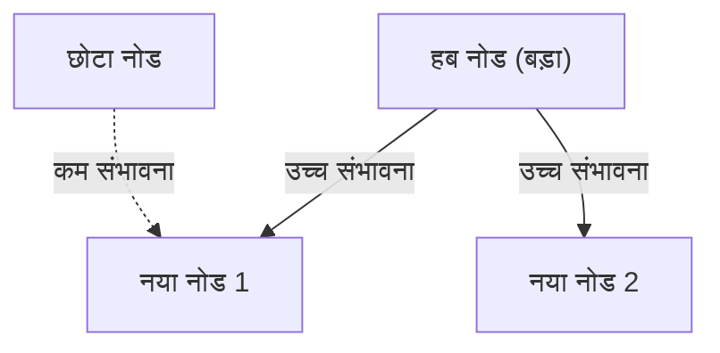

# 1. परिचय: दुनिया में छिपा हुआ क्रम

प्रकृति और मानव समाज में, उन घटनाओं के पीछे जो पहली नज़र में अराजक लगती हैं, अक्सर आश्चर्यजनक रूप से सुंदर गणितीय नियमितता छिपी होती है। जिन शब्दों का हम रोज़मर्रा में लापरवाही से उपयोग करते हैं, जिन शहरों में हम रहते हैं उनका आकार, वेबसाइटों पर आने वालों की संख्या, और यहां तक ​​कि भूकंपों का पैमाना भी — क्या होगा यदि ये सभी प्रतीत होने वाली असंबंधित घटनाएं वास्तव में एक ही सामान्य गणितीय नियम का पालन करती हों?

वह आश्चर्यजनक नियम **ज़िफ़ का नियम** ([Zipf's Law](https://kenji.blog/hi/p/zipfs-law/)) है। यह नियम एक अनुभवजन्य नियम है जिसमें कहा गया है कि किसी विशिष्ट डेटासेट में, किसी तत्व की आवृत्ति उसकी रैंक (स्थान) के व्युत्क्रमानुपाती होती है। सबसे अधिक बार आने वाला तत्व दूसरे सबसे अधिक बार आने वाले तत्व की तुलना में लगभग दोगुना दिखाई देता है, और तीसरे तत्व की तुलना में लगभग तीन गुना दिखाई देता है।

इस लेख में, हम फ़ार्मुलों, सिमुलेशन कोड और आरेखों का उपयोग करते हुए, इसकी ऐतिहासिक पृष्ठभूमि से लेकर इसके गणितीय सूत्रीकरण, अद्भुत वास्तविक दुनिया के उदाहरणों, और प्राकृतिक और सामाजिक प्रणालियों में इस तरह का नियम सार्वभौमिक रूप से क्यों उत्पन्न होता है, इस पर **ज़िफ़ के नियम** की गहराई से जांच करेंगे। हमारा लक्ष्य ऐसी सामग्री प्रदान करना है जिसका उपयोग न केवल मनोरंजक पढ़ने के रूप में किया जा सकता है, बल्कि डेटा विज्ञान और प्राकृतिक भाषा प्रसंस्करण के लिए आधारभूत ज्ञान के रूप में भी किया जा सकता है।

# 2. ज़िफ़ के नियम की खोज और ऐतिहासिक पृष्ठभूमि

**ज़िफ़ का नियम** 1930 के दशक में अमेरिकी भाषाविद् जॉर्ज किंग्सले ज़िफ़ (George Kingsley Zipf) द्वारा व्यापक रूप से लोकप्रिय किया गया था। हालाँकि, वह इस नियम के एकमात्र खोजकर्ता नहीं थे। फ्रांसीसी आशुलिपिक जीन-बैप्टिस्ट एस्टुप और भौतिक विज्ञानी फेलिक्स ऑयरबाक ने भी ज़िफ़ से पहले इसी तरह की घटनाओं पर ध्यान दिया था।

ज़िफ़ ने अंग्रेजी वाक्यों में शब्दों की आवृत्ति का विस्तार से विश्लेषण किया। बड़े पैमाने पर टेक्स्ट डेटा को मैन्युअल रूप से गिनने के परिणामस्वरूप, जैसे जेम्स जॉयस के उपन्यास 'यूलिसिस', उन्होंने एक आश्चर्यजनक नियमितता की खोज की। यह तथ्य था कि सबसे अधिक इस्तेमाल किया जाने वाला शब्द (अंग्रेजी में, 'the') दूसरे सबसे ज्यादा इस्तेमाल किए जाने वाले शब्द ('of') से लगभग दोगुना और तीसरे ('and') से लगभग तीन गुना बार आता है।

ज़िफ़ ने दावा किया कि यह घटना **न्यूनतम प्रयास के सिद्धांत** (Principle of Least Effort) पर आती है, जो मानव व्यवहार का एक मूल सिद्धांत है। दूसरे शब्दों में, संचार में, इंसान कम से कम प्रयास के साथ जानकारी देने की कोशिश करते हैं, इसलिए वे अक्सर कुछ सरल शब्दों का उपयोग करते हैं और शायद ही कभी जटिल शब्दों का उपयोग करते हैं। इस दार्शनिक व्याख्या को बाद में सूचना सिद्धांत और सांख्यिकीय यांत्रिकी के दृष्टिकोण से भी समर्थन मिलेगा।

# 3. गणितीय सूत्रीकरण: रैंक-आकार नियम

यहाँ, आइए **ज़िफ़ के नियम** को गणितीय रूप से सख्ती से तैयार करें। हम डेटासेट में तत्वों (जैसे, शब्द) को उनकी आवृत्ति के अवरोही क्रम में व्यवस्थित करते हैं।

मान लीजिए कि सबसे लगातार तत्व की रैंक $r = 1$ है, और दूसरे की $r = 2$ है। यदि रैंक $r$ के तत्व के लिए आवृत्ति $f(r)$ है, तो ज़िफ़ के नियम को निम्नानुसार व्यक्त किया गया है:

$$
f(r) \propto \frac{1}{r^\alpha}
$$

यहाँ, $\alpha$ एक स्थिरांक है जो डेटासेट पर निर्भर करता है, और आमतौर पर $\alpha \approx 1$ होता है। इस समय, आवृत्ति रैंक के बिल्कुल व्युत्क्रमानुपाती होती है।

आनुपातिकता स्थिरांक को $C$ के रूप में सेट करके इसे एक समीकरण के रूप में व्यक्त करने के लिए,

$$
f(r) = \frac{C}{r^\alpha}
$$

स्थिरांक $C$ पूरे डेटासेट में तत्वों की कुल संख्या (जैसे शब्दों की कुल संख्या) पर निर्भर करता है। प्रायिकता सिद्धांत के संदर्भ में, रैंक $r$ के तत्व के घटित होने की प्रायिकता $P(r)$ इस प्रकार है:

$$
P(r) = \frac{\frac{1}{r^\alpha}}{\sum_{n=1}^{N} \frac{1}{n^\alpha}}
$$

यहाँ, $N$ तत्वों की विविधता (जैसे शब्दावली आकार) है। हर में श्रृंखला सीमा $\alpha > 1$ में रीमैन ज़ेटा फ़ंक्शन $\zeta(\alpha)$ पर अभिसरण करती है। इसलिए, **ज़िफ़ के नियम** को कभी-कभी ज़ेटा वितरण के रूप में भी जाना जाता है।

लघुगणक (logarithm) लेकर, इस संबंध को और अधिक स्पष्ट रूप से देखा जा सकता है।

$$
\log f(r) = \log C - \alpha \log r
$$

इसका मतलब यह है कि जब लॉग-लॉग ग्राफ़ (Log-Log Plot) पर प्लॉट किया जाता है, तो यह $-\alpha$ की ढलान के साथ एक सीधी रेखा बन जाता है। यह जाँचने का सबसे आसान तरीका है कि कोई डेटासेट **ज़िफ़ के नियम** का पालन करता है या नहीं, एक लॉग-लॉग ग्राफ़ बनाना और यह देखना है कि क्या वह एक सीधी रेखा बनाता है। यदि यह एक सीधी रेखा है, तो यह कहा जा सकता है कि उस घटना के पीछे एक **पावर लॉ** (Power Law) मौजूद है।

# 4. अद्भुत वास्तविक दुनिया के उदाहरण

**ज़िफ़ का नियम** भाषा विज्ञान की मात्र सीमाओं से परे जाता है और आश्चर्यजनक रूप से विभिन्न प्रकार की घटनाओं पर लागू होता है। यहाँ, आइए 5 विभिन्न क्षेत्रों के उदाहरणों पर विस्तार से नज़र डालें।

## 4.1. भाषा विज्ञान और प्राकृतिक भाषा प्रसंस्करण (NLP)

सबसे क्लासिक उदाहरण टेक्स्ट कॉर्पोरा में शब्द आवृत्ति है। अंग्रेजी कॉर्पस (उदाहरण के लिए, विकिपीडिया का संपूर्ण पाठ) का विश्लेषण करते समय, शीर्ष कुछ शब्दों की आवृत्ति इस प्रकार है:

1. **the**: घटित होने की लगभग 7% प्रायिकता
2. **of**: घटित होने की लगभग 3.5% प्रायिकता
3. **and**: घटित होने की लगभग 2.8% प्रायिकता
4. **to**: घटित होने की लगभग 2.6% प्रायिकता

इस प्रकार, जहाँ केवल कुछ दर्जन लगातार शब्द पूरे पाठ का लगभग आधा हिस्सा बनाते हैं, वहीं सैकड़ों हजारों अन्य शब्द शायद ही कभी दिखाई देते हैं। खोज इंजन अनुक्रमणिका बनाने और बड़े भाषा मॉडल (LLMs) के लिए शब्दावली डिजाइन करने में यह "लॉन्ग टेल (Long Tail)" घटना अत्यंत महत्वपूर्ण है। प्राकृतिक भाषा प्रसंस्करण के क्षेत्र में, जो शब्द बहुत अधिक बार दिखाई देते हैं (स्टॉप वर्ड), उनमें बहुत कम जानकारी होती है, इसलिए उनके महत्व को कम करने के लिए TF-IDF जैसी तकनीकों का उपयोग किया जाता है।

## 4.2. शहर की जनसंख्या का वितरण

न केवल भाषा विज्ञान में, बल्कि **ज़िफ़ का नियम** भूगोल और शहरी इंजीनियरिंग में भी देखा जाता है। किसी निश्चित देश में शहरों की जनसंख्या को क्रमित करते समय, संबंध दर्शाता है कि दूसरे सबसे बड़े शहर की जनसंख्या पहले की तुलना में आधी है, और तीसरे शहर की एक तिहाई है।

उदाहरण के लिए, संयुक्त राज्य अमेरिका के शहर की जनसंख्या डेटा को देखते हुए (आंकड़े अनुमानित हैं):
- 1ला न्यूयॉर्क: लगभग 84 लाख
- 2रा लॉस एंजिल्स: लगभग 40 लाख (न्यूयॉर्क का लगभग आधा)
- 3रा शिकागो: लगभग 27 लाख (न्यूयॉर्क का लगभग एक तिहाई)

बेशक, देश के आधार पर, राजधानी में अत्यधिक संकेंद्रण (जैसे जापान में टोक्यो, फ्रांस में पेरिस) कानून से विचलित होने वाली "प्राइमेट सिटी घटना" का कारण बन सकता है, लेकिन समग्र प्रवृत्ति उल्लेखनीय रूप से **पावर लॉ** का पालन करती है।

## 4.3. वेबसाइट ट्रैफ़िक

इंटरनेट पर वेबसाइटों तक पहुंच की संख्या और SNS पर अनुयायियों की संख्या भी **ज़िफ़ के नियम** का पालन करती है। Google, YouTube और Facebook जैसी बड़ी साइटों का एक छोटा सा अंश अधिकांश ट्रैफ़िक पर एकाधिकार रखता है, जबकि अनगिनत अन्य साइटों की पहुंच बहुत कम है। इसका कारण यह है कि सूचना नेटवर्क में लिंक की संरचना "प्राथमिकता लगाव" (preferential attachment) द्वारा बनती है, जिस पर आगे चर्चा की जाएगी।

## 4.4. कॉर्पोरेट आकार और आय वितरण (पैरेटो सिद्धांत)

कॉर्पोरेट बिक्री, कर्मचारियों की संख्या और व्यक्तिगत आय वितरण भी **पावर लॉ** का पालन करते हैं। आय वितरण के नियम का नाम इतालवी अर्थशास्त्री विल्फ्रेडो पैरेटो के नाम पर **पैरेटो सिद्धांत** (Pareto Principle) रखा गया है। इसे "80:20 नियम" के रूप में भी जाना जाता है, जिसमें कहा गया है कि "समग्र धन का 80% स्वामित्व 20% लोगों के पास है।" गणितीय रूप से, **ज़िफ़ का नियम** और **पैरेटो सिद्धांत** बस एक ही घटना को अलग-अलग कोणों (रैंक बनाम स्केल) से देख रहे हैं।

## 4.5. भूकंप का पैमाना (गुटेनबर्ग-रिक्टर नियम)

भौतिकी और पृथ्वी विज्ञान में भी इसी तरह के नियम मौजूद हैं। **गुटेनबर्ग-रिक्टर नियम** (Gutenberg-Richter Law) भूकंप की तीव्रता और घटित होने की आवृत्ति के बीच संबंध को दर्शाता है। जैसे ही तीव्रता 1 बढ़ जाती है, उस पैमाने के भूकंपों की आवृत्ति लगभग दसवें हिस्से तक कम हो जाती है। यहां भी, हम एक भग्न (fractal) संरचना देख सकते हैं जहां विशाल घटनाएं अत्यंत दुर्लभ रूप से होती हैं, जबकि छोटी घटनाएं अनगिनत बार होती हैं।

# 5. ज़िफ़ का नियम क्यों उत्पन्न होता है? (सृजन तंत्र)

भाषा, शहरों, अर्थशास्त्र और भौतिक घटनाओं जैसे पूरी तरह से अलग-अलग क्षेत्रों में एक ही गणितीय संरचना क्यों दिखाई देती है? जटिल प्रणाली विज्ञान के शोधकर्ताओं ने कई सृजन तंत्र प्रस्तावित किए हैं।

## 5.1. प्राथमिकता लगाव (Preferential Attachment)

नेटवर्क विज्ञान में सबसे प्रसिद्ध मॉडल **प्राथमिकता लगाव** मॉडल है, जिसे अल्बर्ट-लास्ज़लो बाराबासी और अन्य द्वारा प्रस्तावित किया गया है। इसे आम तौर पर "अमीर और अमीर हो जाता है" (Rich-get-richer) घटना के रूप में जाना जाता है।

जब कोई नई वेबसाइट एक लिंक जोड़ती है, तो यह अत्यधिक संभावित है कि यह एक प्रसिद्ध साइट से लिंक हो जिसके पास पहले से ही कई लिंक हैं। जब कोई नया निवासी चलता है, तो यह अत्यधिक संभावित है कि वे पहले से स्थापित बुनियादी ढांचे वाले बड़े शहर को चुनें। जैसे-जैसे एक गतिशील प्रक्रिया मौजूदा पैमाने (लिंक की संख्या, जनसंख्या, आदि) के अनुपात में नए तत्व जोड़ती है, समग्र वितरण के परिणामस्वरूप **ज़िफ़ के नियम** का पालन करने वाला एक पावर लॉ सामने आता है।

नीचे इस प्रक्रिया का एक वैचारिक आरेख दिया गया है।



## 5.2. न्यूनतम प्रयास का सिद्धांत (Principle of Least Effort)

यह स्वयं ज़िफ़ द्वारा प्रस्तावित परिकल्पना है। संचार प्रणाली में, वक्ता और श्रोता के बीच परस्पर विरोधी इच्छाएँ होती हैं।
- **वक्ता की इच्छा**: सब कुछ एक छोटी शब्दावली के साथ व्यक्त करना चाहता है (एक ही शब्द को कई अर्थ सौंपना)।
- **श्रोता की इच्छा**: अर्थ संबंधी अस्पष्टता को खत्म करने के लिए प्रत्येक अवधारणा को अलग-अलग शब्द सौंपना चाहता है (एक विविध शब्दावली की मांग करना)।

इन दो परस्पर विरोधी "प्रयासों" के बीच एक समझौते के रूप में, कुछ बहुअर्थी लगातार शब्दों और कई स्पष्ट दुर्लभ शब्दों के वितरण को, अर्थात् **ज़िफ़ के नियम** को स्वाभाविक रूप से उत्पन्न होने के रूप में समझाया गया है।

## 5.3. रैंडम टाइपिंग मॉडल (टाइपराइटर पर मारते बंदर)

आश्चर्यजनक रूप से, बेनोइट मैंडलब्रॉट जैसे गणितज्ञों ने दिखाया है कि **ज़िफ़ के नियम** के समान वितरण पूरी तरह से यादृच्छिक (random) प्रक्रियाओं से भी उत्पन्न हो सकते हैं।
उदाहरण के लिए, मान लीजिए कि बंदर "शब्द" बनाने के लिए टाइपराइटर कुंजियों (वर्णमाला के 26 अक्षर और एक खाली स्थान) को पूरी तरह से यादृच्छिक रूप से मारते हैं। मान लीजिए कि $p$ एक स्थान होने की प्रायिकता है; शब्द जितना छोटा होगा, उसके उत्पन्न होने की संभावना उतनी ही अधिक होगी। उन्हें रैंक के अनुसार क्रमबद्ध करने पर प्राकृतिक भाषा की तरह ही एक पावर लॉ वितरण प्राप्त होता है। यह इस संभावना का सुझाव देता है कि **ज़िफ़ का नियम** न केवल जटिल मानवीय बौद्धिक गतिविधि से उत्पन्न होता है, बल्कि स्वयं प्रणाली के सांख्यिकीय गुणों से भी उत्पन्न होता है।

# 6. सिमुलेशन और पायथन (Python) कोड

आइए वास्तव में टेक्स्ट डेटा से **ज़िफ़ के नियम** को सत्यापित करने वाले कोड को लिखने के लिए Python का उपयोग करें। निम्नलिखित कोड यादृच्छिक रूप से उत्पन्न पाठ या मौजूदा कॉर्पस का उपयोग करके शब्द आवृत्तियों की गणना करता है, और उन्हें लॉग-लॉग ग्राफ़ पर प्लॉट करता है।

```python
import matplotlib.pyplot as plt
from collections import Counter
import re
import numpy as np

def plot_zipf_law(text):
    # टेक्स्ट को लोअरकेस में बदलें और शब्दों में विभाजित करें
    words = re.findall(r'\b\w+\b', text.lower())
    
    # शब्दों के प्रकट होने की आवृत्ति की गणना करें
    word_counts = Counter(words)
    
    # आवृत्ति के अवरोही क्रम में क्रमबद्ध करें
    sorted_counts = sorted(word_counts.values(), reverse=True)
    ranks = np.arange(1, len(sorted_counts) + 1)
    
    # लॉग-लॉग ग्राफ़ पर प्लॉट करें
    plt.figure(figsize=(10, 6))
    plt.loglog(ranks, sorted_counts, marker='o', linestyle='none', color='cyan', alpha=0.7)
    
    # तुलना के लिए आदर्श ज़िफ़ का नियम सीधी रेखा (alpha=1)
    expected_counts = [sorted_counts[0] / r for r in ranks]
    plt.loglog(ranks, expected_counts, color='red', linestyle='--', label="Ideal Zipf's Law (alpha=1)")
    
    plt.title("Zipf's Law Verification")
    plt.xlabel("Rank (log scale)")
    plt.ylabel("Frequency (log scale)")
    plt.legend()
    plt.grid(True, which="both", ls="--", alpha=0.5)
    plt.show()

# नमूने के रूप में बहुत लंबे डमी टेक्स्ट का उपयोग करें
# वास्तविक डेटा विज्ञान परियोजनाओं में, NLTK या गुटेनबर्ग कॉर्पस का उपयोग किया जाता है
dummy_text = "the and of to a in that is was he for it with as his on be at by i this had not are but from or have an they which one you were all her she there would their we him been has when who will no more if out so up said what its about than into them can only other new some could time these two may then do first any my now such like our over man me even most made after also did many before must through back years where much your way well down should because each just those people mr how too little state good very make world still own see men work long get here between both life being under never day same another know while last might great old year off come since against go came right used take three states himself few house use during without again place american around however home small found thought went say part once general high upon school every don't does got united left number course war until always away something fact water though less public put think almost hand enough far took head yet better display modern history area completely specific significant process" * 100

# plot_zipf_law(dummy_text)
```

इस कोड को चलाने से यह पुष्टि होती है कि वास्तविक शब्द आवृत्तियों को लाल बिंदीदार रेखा (आदर्श ज़िफ़ का नियम) के साथ वितरित किया जाता है। डेटा विज्ञान अभ्यास में, ऐसे आवृत्ति विश्लेषण के माध्यम से डेटा और विसंगतियों में पूर्वाग्रह का पता लगाया जा सकता है।

# 7. कंप्यूटर विज्ञान में अनुप्रयोग

**ज़िफ़ का नियम** न केवल अपनी सैद्धांतिक रुचि के लिए बल्कि व्यावहारिक कंप्यूटर विज्ञान एल्गोरिदम में भी एक महत्वपूर्ण भूमिका निभाता है।

## 7.1. कैशिंग एल्गोरिदम अनुकूलन

वेब सर्वर और डेटाबेस के लिए कैशिंग रणनीतियों में, **ज़िफ़ का नियम** अत्यंत महत्वपूर्ण है। चूँकि लोकप्रिय सामग्री (जैसे वायरल वीडियो या प्रमुख समाचार) की एक छोटी मात्रा समग्र पहुंच के विशाल बहुमत के लिए जिम्मेदार होती है, इसलिए इन्हें मेमोरी (RAM) जैसे तेज़ कैश में संग्रहीत करने से पूरे सिस्टम के प्रदर्शन में भारी सुधार हो सकता है। LFU (न्यूनतम बार-बार उपयोग किया जाने वाला) और LRU (न्यूनतम हाल ही में उपयोग किया जाने वाला) जैसे एल्गोरिदम विशेष रूप से इस डेटा पूर्वाग्रह (पावर लॉ) का लाभ उठाने के लिए डिज़ाइन किए गए हैं।

## 7.2. डेटा संपीड़न

हफ़मैन कोडिंग (Huffman Coding) जैसे एन्ट्रापी कोडिंग में, अक्सर होने वाले डेटा पैटर्न को छोटे बिट तार (bit strings) सौंपे जाते हैं, जबकि शायद ही कभी होने वाले पैटर्न को लंबे बिट तार सौंपे जाते हैं। यदि डेटा की आवृत्ति **ज़िफ़ के नियम** की तरह अत्यधिक विषम है, तो इस तरह की परिवर्तनीय-लंबाई कोडिंग का उपयोग करके डेटा आकार को भारी रूप से संपीड़ित किया जा सकता है। ज़िप (ZIP) फ़ाइलें और जेपीईजी (JPEG) चित्र जैसी संपीड़न तकनीकों की नींव भी इन सांख्यिकीय गुणों का उपयोग करती है।

# 8. निष्कर्ष: जटिल प्रणालियों को समझने की कुंजी

इस लेख में, हमने **ज़िफ़ के नियम** को इसकी परिभाषा से लेकर गणितीय पृष्ठभूमि, विविध वास्तविक दुनिया के उदाहरणों और सृजन तंत्र तक विस्तार से बताया है।

शब्द की आवृत्ति, शहर की जनसंख्या, कॉर्पोरेट पैमाना, वेब ट्रैफ़िक। ये पूरी तरह से अलग तंत्र के तहत काम करते हुए प्रतीत होते हैं, लेकिन मैक्रो परिप्रेक्ष्य से देखने पर, वे एक ही **पावर लॉ** द्वारा शासित होते हैं। इससे पता चलता है कि हमारी दुनिया केवल यादृच्छिक घटनाओं का संग्रह नहीं है, बल्कि एक गहरे आयाम में गणितीय क्रम रखती है, जैसे स्व-संगठन और भग्न (fractal) संरचनाएं।

डेटा वैज्ञानिकों और इंजीनियरों के लिए, यह समझना कि कोई डेटासेट सामान्य वितरण (घंटी वक्र) का पालन करता है या **ज़िफ़ के नियम** (लॉन्ग टेल वाला) जैसे पावर लॉ का पालन करता है, सिस्टम डिजाइन और मॉडल निर्माण में एक महत्वपूर्ण अंतर बनाता है। कृपया दुनिया के छिपे हुए क्रम को समझने के लिए एक शक्तिशाली लेंस के रूप में **ज़िफ़ के नियम** को ध्यान में रखें।

---
*यह लेख डेटा विज्ञान और जटिल प्रणाली विज्ञान की खोज के उद्देश्य से लिखा गया था। विस्तृत गणितीय सूत्रों और सिद्धांतों के लिए, हम सांख्यिकीय भौतिकी और प्राकृतिक भाषा प्रसंस्करण पर विशेष पुस्तकों का संदर्भ लेने की सलाह देते हैं।*
