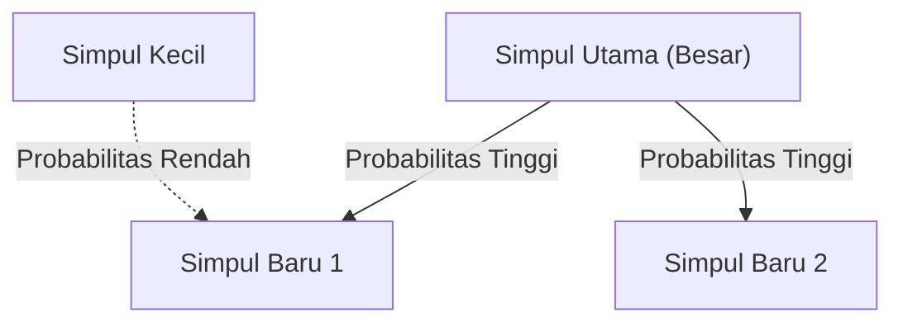

# 1. Pendahuluan: Orde Tersembunyi di Balik Dunia

Di alam dan masyarakat manusia, di balik fenomena yang sekilas tampak kacau, seringkali tersembunyi keteraturan matematis yang sangat indah. Kata-kata yang biasa kita gunakan setiap hari, ukuran kota tempat kita tinggal, jumlah kunjungan ke situs web, dan bahkan skala gempa bumi — bagaimana jika semua fenomena yang tampaknya tidak berhubungan ini sebenarnya mengikuti satu hukum matematika yang sama?

Hukum yang menakjubkan itu adalah **[Hukum Zipf](https://kenji.blog/id/p/zipfs-law/)** ([Zipf's Law](https://kenji.blog/id/p/zipfs-law/)). Hukum ini adalah aturan empiris yang menyatakan bahwa dalam kumpulan data tertentu, frekuensi suatu elemen berbanding terbalik dengan peringkatnya. Elemen yang paling sering muncul akan muncul sekitar dua kali lebih sering daripada elemen paling sering kedua, dan sekitar tiga kali lebih sering daripada yang ketiga.

Dalam artikel ini, kita akan menggali sangat dalam tentang **[Hukum Zipf](https://kenji.blog/id/p/zipfs-law/)**, dari latar belakang sejarahnya hingga perumusan matematisnya, contoh-contoh menakjubkan di dunia nyata, dan mengapa hukum semacam itu muncul secara universal dalam sistem alam dan sosial, dengan menggunakan rumus, kode simulasi, dan diagram. Kami bertujuan untuk menyajikan konten yang dapat dimanfaatkan tidak hanya sebagai bacaan ringan, tetapi juga sebagai pengetahuan dasar untuk ilmu data dan pemrosesan bahasa alami.

# 2. Penemuan [Hukum Zipf](https://kenji.blog/id/p/zipfs-law/) dan Latar Belakang Sejarah

**[Hukum Zipf](https://kenji.blog/id/p/zipfs-law/)** dipopulerkan secara luas pada tahun 1930-an oleh ahli bahasa Amerika, George Kingsley Zipf. Namun, dia bukan satu-satunya penemu hukum ini. Ahli steno Prancis Jean-Baptiste Estoup dan fisikawan Felix Auerbach juga menyadari fenomena serupa sebelum Zipf.

Zipf menganalisis secara detail frekuensi kata-kata dalam kalimat bahasa Inggris. Sebagai hasil dari penghitungan manual data teks berskala besar, seperti novel James Joyce 'Ulysses', ia menemukan keteraturan yang mengejutkan. Fakta tersebut adalah kata yang paling sering digunakan (dalam bahasa Inggris, 'the') muncul sekitar dua kali lebih sering daripada kata kedua yang paling sering digunakan ('of'), dan sekitar tiga kali lebih sering daripada yang ketiga ('and').

Zipf mengklaim bahwa fenomena ini bermuara pada **Prinsip Usaha Terkecil** (Principle of Least Effort), yang merupakan prinsip dasar perilaku manusia. Dengan kata lain, dalam berkomunikasi, manusia mencoba menyampaikan informasi dengan usaha sesedikit mungkin, sehingga mereka sering menggunakan beberapa kata sederhana dan jarang menggunakan kata-kata yang rumit. Interpretasi filosofis ini nantinya akan didukung dari perspektif teori informasi dan mekanika statistik.

# 3. Perumusan Matematis: Aturan Peringkat-Ukuran

Di sini, mari kita rumuskan secara ketat **[Hukum Zipf](https://kenji.blog/id/p/zipfs-law/)** secara matematis. Kita mengatur elemen-elemen dalam kumpulan data (misalnya, kata-kata) dalam urutan menurun dari frekuensinya.

Misalkan peringkat elemen yang paling sering muncul adalah $r = 1$, dan yang kedua adalah $r = 2$. Jika frekuensi untuk elemen dengan peringkat $r$ adalah $f(r)$, [Hukum Zipf](https://kenji.blog/id/p/zipfs-law/) dinyatakan sebagai berikut:

$$
f(r) \propto \frac{1}{r^\alpha}
$$

Di sini, $\alpha$ adalah konstanta yang bergantung pada kumpulan data, dan biasanya $\alpha \approx 1$. Pada kondisi ini, frekuensi benar-benar berbanding terbalik dengan peringkat.

Untuk menyatakannya sebagai persamaan, dengan menetapkan konstanta proporsionalitas sebagai $C$,

$$
f(r) = \frac{C}{r^\alpha}
$$

Konstanta $C$ bergantung pada jumlah total elemen di seluruh kumpulan data (seperti jumlah total kata). Dalam istilah teori probabilitas, probabilitas $P(r)$ terjadinya elemen peringkat $r$ adalah sebagai berikut:

$$
P(r) = \frac{\frac{1}{r^\alpha}}{\sum_{n=1}^{N} \frac{1}{n^\alpha}}
$$

Di sini, $N$ adalah ragam elemen (seperti ukuran kosakata). Deret pada penyebut menyatu ke fungsi zeta Riemann $\zeta(\alpha)$ dalam batas $\alpha > 1$. Oleh karena itu, **[Hukum Zipf](https://kenji.blog/id/p/zipfs-law/)** terkadang disebut sebagai distribusi zeta.

Dengan mengambil logaritma, hubungan ini dapat divisualisasikan dengan lebih jelas.

$$
\log f(r) = \log C - \alpha \log r
$$

Ini berarti bahwa ketika diplot pada grafik log-log, ini menjadi garis lurus dengan kemiringan $-\alpha$. Cara termudah untuk memeriksa apakah sebuah kumpulan data mengikuti **[Hukum Zipf](https://kenji.blog/id/p/zipfs-law/)** adalah dengan menggambar grafik log-log dan melihat apakah grafik tersebut membentuk garis lurus. Jika itu adalah garis lurus, dapat dikatakan bahwa **Hukum Pangkat** (Power Law) ada di balik fenomena tersebut.

# 4. Contoh Menakjubkan di Dunia Nyata

**[Hukum Zipf](https://kenji.blog/id/p/zipfs-law/)** melampaui batas linguistik semata dan berlaku untuk berbagai macam fenomena yang mengejutkan. Di sini, mari kita lihat secara detail contoh-contoh dari 5 bidang yang berbeda.

## 4.1. Linguistik dan Pemrosesan Bahasa Alami (NLP)

Contoh paling klasik adalah frekuensi kata dalam korpus teks. Saat menganalisis korpus bahasa Inggris (misalnya, seluruh teks Wikipedia), frekuensi beberapa kata teratas adalah sebagai berikut:

1. **the**: sekitar 7% probabilitas kemunculan
2. **of**: sekitar 3.5% probabilitas kemunculan
3. **and**: sekitar 2.8% probabilitas kemunculan
4. **to**: sekitar 2.6% probabilitas kemunculan

Jadi, sementara beberapa lusin kata yang sering muncul menyumbang hampir setengah dari keseluruhan teks, ratusan ribu kata lainnya jarang muncul. Fenomena "Ekor Panjang" (Long Tail) ini sangat penting dalam membangun indeks mesin pencari dan merancang kosakata untuk Model Bahasa Besar (LLM). Di bidang pemrosesan bahasa alami, kata-kata yang terlalu sering muncul (kata henti atau *stop words*) memuat sedikit informasi, jadi teknik seperti TF-IDF digunakan untuk menurunkan bobotnya.

## 4.2. Distribusi Populasi Kota

Tidak hanya dalam linguistik, tetapi **[Hukum Zipf](https://kenji.blog/id/p/zipfs-law/)** juga diamati dalam geografi dan teknik perkotaan. Saat mengurutkan populasi kota-kota di negara tertentu, hubungannya menunjukkan bahwa kota terbesar kedua memiliki populasi setengah dari yang pertama, dan yang ketiga memilik sepertiganya.

Misalnya, melihat data populasi kota di Amerika Serikat (angka merupakan perkiraan):
- Ke-1 New York: sekitar 8,4 juta
- Ke-2 Los Angeles: sekitar 4 juta (sekitar setengah dari New York)
- Ke-3 Chicago: sekitar 2,7 juta (sekitar sepertiga dari New York)

Tentu saja, bergantung pada negaranya, konsentrasi ekstrem di ibu kota (seperti Tokyo di Jepang, Paris di Prancis) dapat mengarah pada "fenomena kota primata" yang menyimpang dari hukum, tetapi tren keseluruhannya secara luar biasa mengikuti **Hukum Pangkat**.

## 4.3. Lalu Lintas Situs Web

Jumlah akses ke situs web di internet dan jumlah pengikut di SNS juga mengikuti **[Hukum Zipf](https://kenji.blog/id/p/zipfs-law/)**. Sebagian kecil situs masif seperti Google, YouTube, dan Facebook memonopoli sebagian besar lalu lintas, sementara situs lain yang tak terhitung jumlahnya memiliki akses yang sangat sedikit. Hal ini dikarenakan struktur tautan dalam jaringan informasi dibentuk oleh "keterikatan preferensial", yang akan dibahas nanti.

## 4.4. Ukuran Perusahaan dan Distribusi Pendapatan (Prinsip Pareto)

Penjualan perusahaan, jumlah karyawan, dan distribusi pendapatan individu juga mengikuti **Hukum Pangkat**. Hukum tentang distribusi pendapatan dinamai **Prinsip Pareto** yang diambil dari nama ekonom Italia Vilfredo Pareto. Ini juga dikenal sebagai aturan "80:20", yang menyatakan bahwa "80% kekayaan keseluruhan dimiliki oleh 20% orang." Secara matematis, **[Hukum Zipf](https://kenji.blog/id/p/zipfs-law/)** dan **Prinsip Pareto** hanyalah melihat fenomena yang sama dari sudut yang berbeda (peringkat vs. skala).

## 4.5. Skala Gempa (Hukum Gutenberg-Richter)

Hukum serupa ada dalam fisika dan ilmu bumi. **Hukum Gutenberg-Richter** menunjukkan hubungan antara magnitudo gempa dan frekuensi kemunculannya. Saat magnitudo meningkat 1, frekuensi gempa dengan skala tersebut menurun hingga sekitar sepersepuluh. Di sini juga, kita dapat mengamati struktur fraktal di mana peristiwa raksasa sangat jarang terjadi, sementara peristiwa kecil terjadi tak terhitung jumlahnya.

# 5. Mengapa [Hukum Zipf](https://kenji.blog/id/p/zipfs-law/) Terjadi? (Mekanisme Generasi)

Mengapa struktur matematika yang sama muncul di bidang yang sama sekali berbeda seperti bahasa, kota, ekonomi, dan fenomena fisik? Para peneliti dalam ilmu sistem kompleks telah mengusulkan beberapa mekanisme generasi.

## 5.1. Keterikatan Preferensial (Preferential Attachment)

Model yang paling terkenal dalam ilmu jaringan adalah model **Keterikatan Preferensial**, yang diusulkan oleh Albert-László Barabási dan lainnya. Fenomena ini umumnya dikenal sebagai fenomena "yang kaya semakin kaya" (Rich-get-richer).

Ketika situs web baru menambahkan tautan, sangat mungkin bagi mereka untuk menautkannya ke situs terkenal yang sudah memiliki banyak tautan. Ketika penduduk baru pindah, sangat mungkin mereka memilih kota besar dengan infrastruktur yang sudah mapan. Karena proses dinamis menambahkan elemen baru secara proporsional ke skala yang ada (jumlah tautan, populasi, dll.), distribusi keseluruhan menghasilkan hukum pangkat yang mengikuti **[Hukum Zipf](https://kenji.blog/id/p/zipfs-law/)**.

Di bawah ini adalah diagram konseptual dari proses ini.



## 5.2. Prinsip Usaha Terkecil

Ini adalah hipotesis yang diajukan oleh Zipf sendiri. Dalam sistem komunikasi, terdapat konflik keinginan antara pembicara dan pendengar.
- **Keinginan pembicara**: Ingin mengungkapkan segalanya dengan kosakata kecil (menetapkan banyak makna pada satu kata).
- **Keinginan pendengar**: Ingin menetapkan kata yang berbeda untuk setiap konsep untuk menghilangkan ambiguitas semantik (menuntut kosakata yang beragam).

Sebagai kompromi antara dua "usaha" yang saling bertentangan ini, distribusi beberapa kata yang sering muncul dengan banyak arti dan banyak kata langka yang tidak ambigu, yaitu **[Hukum Zipf](https://kenji.blog/id/p/zipfs-law/)**, dijelaskan terjadi secara alami.

## 5.3. Model Pengetikan Acak (Monyet Memukul Mesin Tik)

Hebatnya, ahli matematika seperti Benoit Mandelbrot telah menunjukkan bahwa distribusi yang mirip dengan **[Hukum Zipf](https://kenji.blog/id/p/zipfs-law/)** dapat muncul bahkan dari proses yang sepenuhnya acak.
Misalnya, anggaplah monyet memukul tuts mesin tik (26 huruf abjad dan satu spasi kosong) secara acak untuk membuat "kata". Misalkan $p$ adalah probabilitas terjadinya spasi; semakin pendek kata, semakin tinggi probabilitas ia dihasilkan. Mengurutkannya berdasarkan peringkat menghasilkan distribusi hukum pangkat seperti halnya bahasa alami. Hal ini menunjukkan kemungkinan bahwa **[Hukum Zipf](https://kenji.blog/id/p/zipfs-law/)** tidak hanya berasal dari aktivitas intelektual manusia yang kompleks, tetapi dari properti statistik dari sistem itu sendiri.

# 6. Simulasi dan Kode Python

Mari kita benar-benar menggunakan Python untuk menulis kode yang memverifikasi **[Hukum Zipf](https://kenji.blog/id/p/zipfs-law/)** dari data teks. Kode berikut menghitung frekuensi kata menggunakan teks yang dihasilkan secara acak atau korpus yang ada, dan memplotnya pada grafik log-log.

```python
import matplotlib.pyplot as plt
from collections import Counter
import re
import numpy as np

def plot_zipf_law(text):
    # Ubah teks menjadi huruf kecil dan bagi menjadi kata-kata
    words = re.findall(r'\b\w+\b', text.lower())
    
    # Hitung frekuensi kemunculan kata
    word_counts = Counter(words)
    
    # Urutkan secara menurun berdasarkan frekuensi
    sorted_counts = sorted(word_counts.values(), reverse=True)
    ranks = np.arange(1, len(sorted_counts) + 1)
    
    # Plot pada grafik log-log
    plt.figure(figsize=(10, 6))
    plt.loglog(ranks, sorted_counts, marker='o', linestyle='none', color='cyan', alpha=0.7)
    
    # Garis lurus hukum Zipf yang ideal untuk perbandingan (alpha=1)
    expected_counts = [sorted_counts[0] / r for r in ranks]
    plt.loglog(ranks, expected_counts, color='red', linestyle='--', label="Ideal Zipf's Law (alpha=1)")
    
    plt.title("Zipf's Law Verification")
    plt.xlabel("Rank (log scale)")
    plt.ylabel("Frequency (log scale)")
    plt.legend()
    plt.grid(True, which="both", ls="--", alpha=0.5)
    plt.show()

# Gunakan teks tiruan yang sangat panjang sebagai sampel
# Dalam proyek ilmu data nyata, NLTK atau korpus Gutenberg digunakan
dummy_text = "the and of to a in that is was he for it with as his on be at by i this had not are but from or have an they which one you were all her she there would their we him been has when who will no more if out so up said what its about than into them can only other new some could time these two may then do first any my now such like our over man me even most made after also did many before must through back years where much your way well down should because each just those people mr how too little state good very make world still own see men work long get here between both life being under never day same another know while last might great old year off come since against go came right used take three states himself few house use during without again place american around however home small found thought went say part once general high upon school every don't does got united left number course war until always away something fact water though less public put think almost hand enough far took head yet better display modern history area completely specific significant process" * 100

# plot_zipf_law(dummy_text)
```

Menjalankan kode ini menegaskan bahwa frekuensi kata aktual didistribusikan di sepanjang garis putus-putus merah (hukum Zipf yang ideal). Dalam praktik ilmu data, bias dalam data dan anomali dapat dideteksi melalui analisis frekuensi tersebut.

# 7. Aplikasi dalam Ilmu Komputer

**[Hukum Zipf](https://kenji.blog/id/p/zipfs-law/)** memainkan peran penting tidak hanya karena minat teoritisnya tetapi juga dalam algoritma ilmu komputer praktis.

## 7.1. Pengoptimalan Algoritma Caching

Dalam strategi caching untuk server web dan basis data, **[Hukum Zipf](https://kenji.blog/id/p/zipfs-law/)** sangatlah krusial. Karena sejumlah kecil konten populer (seperti video viral atau berita teratas) menyumbang sebagian besar akses keseluruhan, menyimpannya dalam caching cepat seperti memori (RAM) dapat meningkatkan kinerja seluruh sistem secara drastis. Algoritma seperti LFU (Least Frequently Used) dan LRU (Least Recently Used) dirancang secara tepat untuk memanfaatkan bias data ini (hukum pangkat).

## 7.2. Kompresi Data

Dalam pengkodean entropi seperti Pengkodean Huffman (Huffman Coding), string bit pendek ditugaskan ke pola data yang sering terjadi, sedangkan string bit panjang ditugaskan ke pola yang jarang terjadi. Jika frekuensi kemunculan data sangat miring seperti dalam **[Hukum Zipf](https://kenji.blog/id/p/zipfs-law/)**, penggunaan pengkodean panjang variabel tersebut memungkinkan ukuran data dikompresi secara drastis. Fondasi teknologi kompresi seperti file ZIP dan gambar JPEG juga memanfaatkan properti statistik ini.

# 8. Kesimpulan: Kunci Memahami Sistem Kompleks

Dalam artikel ini, kami telah merinci **[Hukum Zipf](https://kenji.blog/id/p/zipfs-law/)**, dari definisinya hingga latar belakang matematisnya, beragam contoh nyata, dan mekanisme generasinya.

Frekuensi kata, populasi kota, skala perusahaan, lalu lintas web. Ini tampaknya beroperasi di bawah mekanisme yang sama sekali berbeda, tetapi dilihat dari perspektif makro, mereka diatur oleh **Hukum Pangkat** yang sama. Hal ini menunjukkan bahwa dunia kita tidak sekadar kumpulan fenomena acak, melainkan menyimpan keteraturan matematis dalam dimensi yang lebih dalam, seperti swa-organisasi dan struktur fraktal.

Bagi ilmuwan data dan insinyur, memahami apakah kumpulan data mengikuti distribusi normal (kurva lonceng) atau hukum pangkat seperti **[Hukum Zipf](https://kenji.blog/id/p/zipfs-law/)** (memiliki ekor panjang) membuat perbedaan penting dalam desain sistem dan pembuatan model. Harap ingat **[Hukum Zipf](https://kenji.blog/id/p/zipfs-law/)** sebagai lensa yang kuat untuk memecahkan kode tatanan dunia yang tersembunyi.

---
*Artikel ini ditulis dengan tujuan untuk mengeksplorasi ilmu data dan ilmu sistem kompleks. Untuk perumusan dan teori matematika terperinci, kami menyarankan untuk merujuk pada buku khusus tentang fisika statistik dan pemrosesan bahasa alami.*
