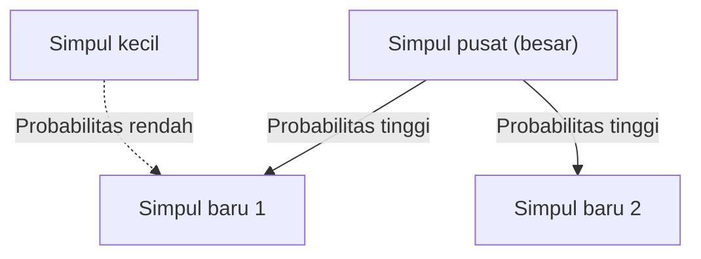

# 1. Pendahuluan: Tatanan Tersembunyi di Dunia

Di alam dan masyarakat manusia, keteraturan matematika yang luar biasa indah sering kali tersembunyi di balik fenomena yang sekilas tampak tidak teratur. Kata-kata yang kita gunakan sehari-hari, ukuran kota tempat kita tinggal, jumlah kunjungan ke situs web, dan bahkan besarnya gempa bumi—bagaimana jika semua fenomena yang tampaknya tidak berhubungan ini sebenarnya mengikuti satu hukum matematika yang umum?

Hukum yang luar biasa itu adalah **Hukum Zipf**. Hukum ini merupakan aturan empiris yang menyatakan bahwa frekuensi kemunculan elemen dalam suatu dataset tertentu berbanding terbalik dengan peringkatnya. Elemen yang paling sering muncul kira-kira dua kali lebih sering daripada elemen kedua yang paling sering muncul, dan kira-kira tiga kali lebih sering daripada elemen ketiga.

Dalam artikel ini, kita akan mendalami **Hukum Zipf**—mulai dari latar belakang sejarah dan rumusan matematisnya hingga contoh nyata yang menakjubkan, dan mengapa hukum tersebut muncul secara universal dalam sistem alam dan sosial—menggunakan rumus, kode simulasi, dan ilustrasi. Tujuan kami adalah menyediakan konten yang tidak hanya berfungsi sebagai bacaan yang menarik tetapi juga sebagai pengetahuan dasar untuk ilmu data dan pemrosesan bahasa alami.

# 2. Penemuan dan Latar Belakang Sejarah Hukum Zipf

**Hukum Zipf** dipopulerkan secara luas pada tahun 1930-an oleh ahli bahasa Amerika George Kingsley Zipf. Namun, dia bukanlah satu-satunya penemu undang-undang ini. Stenografer Perancis Jean-Baptiste Estoup dan fisikawan Felix Auerbach, antara lain, telah memperhatikan fenomena serupa sebelum Zipf.

Zipf dengan cermat menganalisis frekuensi kemunculan kata dalam teks bahasa Inggris. Setelah dengan susah payah menghitung dengan tangan melalui data teks berskala besar seperti novel James Joyce *Ulysses*, ia menemukan keteraturan yang luar biasa: frekuensi kata yang paling umum digunakan dalam bahasa Inggris ("the") kira-kira dua kali lipat dari kata kedua yang paling umum digunakan ("of"), dan kira-kira tiga kali lipat dari kata ketiga ("dan").

Zipf menghubungkan fenomena ini dengan **Principle of Least Effort**, sebuah prinsip dasar perilaku manusia. Dengan kata lain, manusia cenderung sering menggunakan sejumlah kecil kata-kata sederhana dan jarang menggunakan kata-kata rumit karena berusaha menyampaikan informasi dengan upaya sesedikit mungkin dalam berkomunikasi. Interpretasi filosofis ini kemudian didukung dari perspektif teori informasi dan juga mekanika statistik.

# 3. Rumusan Matematika: Hukum Peringkat-Ukuran

Sekarang mari kita memformalkan **Hukum Zipf** secara matematis. Kami menyusun elemen (misalnya, kata-kata) dalam kumpulan data dalam urutan frekuensi kemunculannya.

Rank elemen yang paling sering muncul adalah $r = 1$, elemen kedua yang paling sering muncul adalah $r = 2$, dan seterusnya. Jika $f(r)$ menunjukkan frekuensi kemunculan suatu elemen dengan peringkat $r$, Hukum Zipf dinyatakan sebagai berikut:

$$
f(r) \propto \frac{1}{r^\alpha}
$$

Di sini, $\alpha$ adalah konstanta yang bergantung pada kumpulan data dan biasanya $\alpha \approx 1$. Dalam hal ini, frekuensi berbanding terbalik dengan peringkat.

Untuk menyatakannya sebagai persamaan, misalkan konstanta proporsionalitasnya adalah $C$:

$$
f(r) = \frac{C}{r^\alpha}
$$

Konstanta $C$ bergantung pada jumlah total elemen dalam kumpulan data (misalnya, jumlah total kata). Secara probabilistik, peluang $P(r)$ munculnya elemen dengan peringkat $r$ adalah:

$$
P(r) = \frac{\frac{1}{r^\alpha}}{\sum_{n=1}^{N} \frac{1}{n^\alpha}}
$$

Di sini, $N$ adalah jumlah tipe elemen yang berbeda (misalnya, ukuran kosakata). Pada batas $\alpha > 1$, deret penyebutnya menyatu dengan fungsi Riemann zeta $\zeta(\alpha)$. Karena alasan ini, **Hukum Zipf** terkadang disebut distribusi zeta.

Dengan mengambil logaritma, hubungan ini dapat divisualisasikan dengan lebih jelas:

$$
\log f(r) = \log C - \alpha \log r
$$

Artinya bila diplot pada log-log plot menjadi garis lurus dengan kemiringan $-\alpha$. Cara paling sederhana untuk memeriksa apakah kumpulan data mengikuti **Hukum Zipf** adalah dengan menggambar plot log-log dan melihat apakah kumpulan data tersebut membentuk garis lurus. Jika ya, maka ada **hukum pangkat** di balik fenomena tersebut.

# 4. Contoh Menakjubkan di Dunia Nyata

**Hukum Zipf** jauh melampaui bidang linguistik dan berlaku pada beragam fenomena yang sangat beragam. Mari kita periksa contoh dari lima bidang berbeda secara mendetail.

## 4.1. Linguistik dan Pemrosesan Bahasa Alami (NLP)

Contoh paling klasik adalah frekuensi kata dalam corpora teks. Saat menganalisis korpus bahasa Inggris (seperti keseluruhan teks Wikipedia), frekuensi kata teratas adalah sebagai berikut:

1. **the**: sekitar 7% kemungkinan terjadinya
2. **of**: sekitar 3,5% kemungkinan terjadinya
3. **and**: kemungkinan terjadinya sekitar 2,8%.
4. **to**: kemungkinan terjadinya sekitar 2,6%.

Dengan cara ini, hanya beberapa lusin kata berfrekuensi tinggi yang mencakup hampir setengah dari keseluruhan teks, sementara ratusan ribu kata lainnya jarang muncul. Fenomena "Long Tail" ini sangat penting dalam membangun indeks mesin pencari dan merancang kosakata model bahasa besar (LLM). Di bidang pemrosesan bahasa alami, kata-kata yang muncul terlalu sering (stop word) membawa sedikit informasi, sehingga teknik seperti TF-IDF digunakan untuk mengurangi bobotnya.

## 4.2. Distribusi Penduduk Perkotaan

**Hukum Zipf** diterapkan tidak hanya dalam bahasa tetapi juga di bidang geografi dan teknik perkotaan. Jika jumlah penduduk kota-kota di suatu negara diurutkan dari bawah ke atas, maka jumlah penduduk kota peringkat kedua adalah setengah dari kota peringkat pertama, dan kota peringkat ketiga adalah sepertiganya.

Misalnya, mari kita lihat data populasi kota di AS (angka tersebut merupakan perkiraan):
- New York ke-1: sekitar 8,4 juta
- Los Angeles ke-2: sekitar 4 juta (sekitar setengah dari New York)
- Chicago ke-3: sekitar 2,7 juta (sekitar sepertiga dari New York)

Tentu saja, di beberapa negara, konsentrasi ekstrim di ibu kota (misalnya Tokyo di Jepang, Paris di Perancis) menyimpang dari hukum, sebuah fenomena yang dikenal sebagai efek “kota primata”. Namun, tren keseluruhannya mengikuti **hukum pangkat**.

## 4.3. Lalu Lintas Situs Web

Jumlah kunjungan website di internet dan jumlah pengikut di media sosial juga mengikuti **Hukum Zipf**. Sejumlah situs raksasa seperti Google, YouTube, dan Facebook memonopoli sebagian besar lalu lintas, sementara banyak situs lain hanya menerima sedikit lalu lintas. Hal ini karena struktur tautan dalam jaringan informasi dibentuk melalui “keterikatan preferensial”, yang akan dibahas nanti.

## 4.4. Ukuran Perusahaan dan Distribusi Pendapatan (Hukum Pareto)

Pendapatan perusahaan, jumlah karyawan, dan bahkan distribusi pendapatan pribadi mengikuti **hukum pangkat**. Hukum mengenai distribusi pendapatan disebut **Hukum Pareto** (Prinsip Pareto), diambil dari nama ekonom Italia Vilfredo Pareto. Hal ini juga dikenal sebagai "aturan 80:20"—"80% dari total kekayaan dimiliki oleh 20% orang." Secara matematis, **Hukum Zipf** dan **Hukum Pareto** hanya melihat fenomena yang sama dari sudut yang berbeda (peringkat vs. ukuran).

## 4.5. Besaran Gempa (Hukum Gutenberg-Richter)

Hukum serupa juga terdapat dalam bidang fisika dan ilmu kebumian. **Hukum Gutenberg-Richter** menjelaskan hubungan antara besaran gempa dan frekuensi kejadian. Ketika magnitudonya meningkat sebesar 1, frekuensi gempa bumi sebesar itu berkurang menjadi sekitar sepersepuluh. Di sini juga, kita dapat melihat struktur mirip fraktal di mana peristiwa besar sangat jarang terjadi, sedangkan peristiwa kecil tidak terhitung jumlahnya.

# 5. Mengapa Hukum Zipf Muncul? (Mekanisme Generatif)

Mengapa struktur matematika yang sama muncul di berbagai bidang yang berbeda seperti bahasa, kota, ekonomi, dan fenomena fisik? Para peneliti dalam ilmu sistem yang kompleks telah mengusulkan beberapa mekanisme generatif.

## 5.1. Keterikatan Preferensial

Model paling terkenal dalam ilmu jaringan adalah model **Preferential Attachment**, yang diusulkan oleh Albert-László Barabási dan lainnya. Hal ini dalam bahasa sehari-hari dikenal sebagai fenomena "Kaya-menjadi-kaya".

Saat situs web baru membuat tautan, kemungkinan besar situs tersebut akan tertaut ke situs terkenal yang sudah memiliki banyak tautan. Ketika penduduk baru pindah, mereka cenderung memilih kota-kota besar yang infrastrukturnya sudah mapan. Melalui proses dinamis di mana elemen-elemen baru ditambahkan secara proporsional dengan ukuran yang ada (jumlah tautan, populasi, dll.), distribusi keseluruhan yang dihasilkan menjadi hukum pangkat yang mengikuti **Hukum Zipf**.

Di bawah ini adalah diagram konseptual dari proses ini:



## 5.2. Prinsip Upaya Minimal

Inilah hipotesis yang diajukan oleh Zipf sendiri. Dalam sistem komunikasi, terdapat konflik keinginan antara pembicara dan pendengar:
- **Keinginan pembicara**: Untuk mengungkapkan segala sesuatu dengan kosakata yang sedikit (memberikan banyak arti pada satu kata).
- **Keinginan pendengar**: Untuk menetapkan kata-kata terpisah pada setiap konsep untuk menghilangkan ambiguitas (mencari kosakata yang beragam).

Kompromi antara dua "upaya" yang saling bertentangan ini tentu saja memunculkan distribusi beberapa kata berfrekuensi tinggi yang polisemi dan banyak kata langka yang monosemi—yaitu, **Hukum Zipf**.

## 5.3. Model Pengetikan Acak (Monyet dan Mesin Ketik)

Hebatnya, matematikawan seperti Benoît Mandelbrot telah menunjukkan bahwa distribusi yang menyerupai **Hukum Zipf** dapat muncul dari proses yang sepenuhnya acak. Misalnya, seekor monyet secara acak menekan tombol pada mesin tik (26 huruf alfabet dan spasi) untuk membuat "kata". Jika probabilitas mengenai spasi adalah $p$, kata-kata yang lebih pendek akan dihasilkan dengan probabilitas yang lebih tinggi. Jika disusun berdasarkan peringkat, hal ini menghasilkan distribusi hukum pangkat yang menyerupai bahasa alami. Hal ini menunjukkan bahwa **Hukum Zipf** mungkin berasal tidak hanya dari aktivitas intelektual manusia yang canggih namun juga dari sifat statistik yang melekat pada sistem itu sendiri.

# 6. Simulasi dan Kode Python

Mari kita menulis kode Python untuk memverifikasi **Hukum Zipf** dari data teks. Kode berikut menghitung frekuensi kata dari teks yang dihasilkan secara acak atau korpus yang ada dan memplotnya pada grafik log-log.

```python
import matplotlib.pyplot as plt
from collections import Counter
import re
import numpy as np

def plot_zipf_law(text):
    # Convert text to lowercase and split into words
    words = re.findall(r'\b\w+\b', text.lower())
    
    # Count word frequencies
    word_counts = Counter(words)
    
    # Sort by frequency in descending order
    sorted_counts = sorted(word_counts.values(), reverse=True)
    ranks = np.arange(1, len(sorted_counts) + 1)
    
    # Plot on a log-log graph
    plt.figure(figsize=(10, 6))
    plt.loglog(ranks, sorted_counts, marker='o', linestyle='none', color='cyan', alpha=0.7)
    
    # Ideal Zipf's Law line for comparison (alpha=1)
    expected_counts = [sorted_counts[0] / r for r in ranks]
    plt.loglog(ranks, expected_counts, color='red', linestyle='--', label="Ideal Zipf's Law (alpha=1)")
    
    plt.title("Zipf's Law Verification")
    plt.xlabel("Rank (log scale)")
    plt.ylabel("Frequency (log scale)")
    plt.legend()
    plt.grid(True, which="both", ls="--", alpha=0.5)
    plt.show()

# Using a very long dummy text as a sample
# In actual data science projects, use NLTK or Gutenberg corpus
dummy_text = "the and of to a in that is was he for it with as his on be at by i this had not are but from or have an they which one you were all her she there would their we him been has when who will no more if out so up said what its about than into them can only other new some could time these two may then do first any my now such like our over man me even most made after also did many before must through back years where much your way well down should because each just those people mr how too little state good very make world still own see men work long get here between both life being under never day same another know while last might great old year off come since against go came right used take three states himself few house use during without again place american around however home small found thought went say part once general high upon school every don't does got united left number course war until always away something fact water though less public put think almost hand enough far took head yet better display modern history area completely specific significant process" * 100

# plot_zipf_law(dummy_text)
```

Saat Anda menjalankan kode ini, Anda dapat memastikan bahwa frekuensi kata sebenarnya didistribusikan di sepanjang garis putus-putus merah (Hukum Zipf yang ideal). Dalam praktik ilmu data, analisis frekuensi seperti itu dapat digunakan untuk mendeteksi bias dan outlier dalam data.

# 7. Aplikasi dalam Ilmu Komputer

**Hukum Zipf** memainkan peran penting tidak hanya sebagai keingintahuan teoritis tetapi juga dalam algoritma ilmu komputer praktis.

## 7.1. Optimasi Algoritma Cache

**Hukum Zipf** sangat penting dalam strategi caching untuk server web dan database. Karena sejumlah kecil item konten populer (misalnya, video viral atau berita populer) merupakan mayoritas akses, menyimpannya dalam cache cepat seperti memori (RAM) dapat meningkatkan kinerja sistem secara keseluruhan secara signifikan. Algoritma seperti LFU (Least Sering Digunakan) dan LRU (Least Baru Digunakan) dirancang secara tepat untuk mengeksploitasi ketimpangan data ini (hukum pangkat).

## 7.2. Kompresi Data

Dalam teknik pengkodean entropi seperti Huffman Coding, string bit pendek ditugaskan ke pola data yang sering muncul, dan string bit panjang ditugaskan ke pola yang jarang terjadi. Ketika frekuensi data mengikuti distribusi yang sangat miring seperti **Hukum Zipf**, penggunaan pengkodean panjang variabel seperti itu memungkinkan kompresi ukuran data secara dramatis. Properti statistik ini mendasari teknologi kompresi seperti file ZIP dan gambar JPEG.

# 8. Kesimpulan: Kunci untuk Memahami Sistem yang Kompleks

Pada artikel kali ini kami telah memberikan penjelasan detail tentang **Hukum Zipf** (Hukum Zipf), mulai dari definisi dan latar belakang matematika hingga beragam contoh dan mekanisme generatif.

Frekuensi kata, populasi kota, ukuran perusahaan, dan lalu lintas web. Hal ini tampaknya berjalan melalui mekanisme yang sangat berbeda, namun dari sudut pandang makro, semuanya diatur oleh **hukum pangkat** yang sama. Hal ini menunjukkan bahwa dunia kita bukan sekadar kumpulan fenomena acak tetapi memiliki tatanan matematis pada tingkat yang lebih dalam, seperti pengorganisasian mandiri dan struktur fraktal.

Bagi data scientist dan engineer, memahami apakah kumpulan data mengikuti distribusi normal (kurva lonceng) atau hukum pangkat seperti **Hukum Zipf** (apakah data tersebut memiliki ekor yang panjang) akan membuat perbedaan penting dalam desain sistem dan konstruksi model. Harap ingat **Hukum Zipf** sebagai lensa yang kuat untuk menguraikan tatanan tersembunyi dunia.

---
*Artikel ini ditulis dengan tujuan untuk mengeksplorasi ilmu data dan ilmu sistem yang kompleks. Untuk derivasi dan teori matematika terperinci, kami menyarankan untuk merujuk pada teks khusus tentang fisika statistik dan pemrosesan bahasa alami.*
