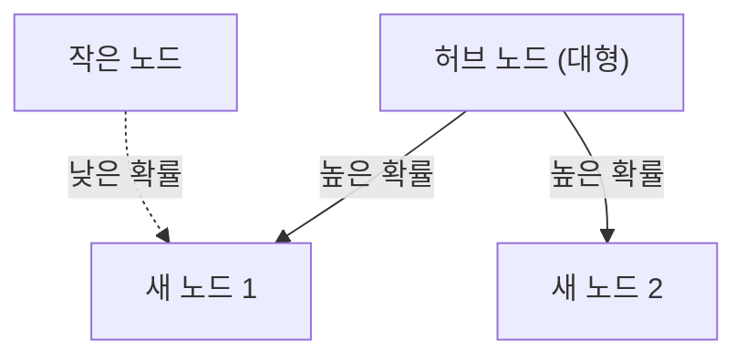

# 1. 서론: 세상에 숨겨진 질서

자연과 인간 사회에서는 얼핏 무질서해 보이는 현상 뒤에는 놀랄 만큼 아름다운 수학적 규칙성이 숨어 있는 경우가 많습니다. 우리가 매일 무심코 사용하는 단어들, 우리가 살고 있는 도시의 크기, 웹사이트 방문 횟수, 심지어 지진의 규모까지, 겉보기에 관련없어 보이는 이 모든 현상이 실제로 하나의 공통 수학 법칙을 따른다면 어떨까요?

그 놀라운 법칙은 **지프의 법칙**입니다. 이 법칙은 특정 데이터 세트에서 요소의 발생 빈도가 순위에 반비례한다는 경험적 규칙입니다. 가장 자주 발생하는 요소는 두 번째로 자주 발생하는 요소보다 약 2배 자주 나타나고, 세 번째 요소보다 약 3배 더 자주 나타납니다.

이 기사에서는 **지프의 법칙**에 대해 역사적 배경과 수학적 공식부터 놀라운 실제 사례에 이르기까지, 그리고 그러한 법칙이 자연 및 사회 시스템에서 보편적으로 발생하는 이유를 공식, 시뮬레이션 코드 및 일러스트레이션을 사용하여 자세히 살펴보겠습니다. 우리의 목표는 흥미로운 읽기 자료일 뿐만 아니라 데이터 과학 및 자연어 처리에 대한 기초 지식이 될 수 있는 콘텐츠를 제공하는 것입니다.

# 2. 지프의 법칙의 발견과 역사적 배경

**지프의 법칙**은 1930년대 미국 언어학자 조지 킹슬리 지프(George Kingsley Zipf)에 의해 널리 대중화되었습니다. 그러나 그는 이 법칙을 발견한 유일한 사람은 아니었습니다. 프랑스 속기사 Jean-Baptiste Estoup와 물리학자 Felix Auerbach는 Zipf 이전에도 비슷한 현상을 발견했습니다.

Zipf는 영어 텍스트에서 단어 출현 빈도를 꼼꼼하게 분석했습니다. 제임스 조이스(James Joyce)의 소설 *Ulysses*와 같은 대규모 텍스트 데이터를 통해 손으로 힘들게 세어본 결과, 그는 놀라운 규칙성을 발견했습니다. 즉, 영어에서 가장 일반적으로 사용되는 단어("the")의 빈도는 두 번째로 가장 많이 사용되는 단어("of")의 약 2배, 세 번째 단어("and")의 약 3배입니다.

Zipf는 이러한 현상을 인간 행동의 기본 원리인 **최소 노력의 원리**에 기인한다고 생각했습니다. 즉, 인간은 의사소통에 있어서 최소한의 노력으로 정보를 전달하려고 하기 때문에 소수의 간단한 단어는 자주 사용하고 복잡한 단어는 거의 사용하지 않는 경향이 있다. 이러한 철학적 해석은 나중에 정보이론과 통계역학의 관점에서도 뒷받침되었습니다.

# 3. 수학적 공식: 순위 크기 법칙

이제 **지프의 법칙**을 수학적으로 공식화해 보겠습니다. 데이터 세트의 요소(예: 단어)를 발생 빈도의 내림차순으로 정렬합니다.

가장 빈번한 요소의 순위는 $r = 1$이고, 두 번째로 빈번한 요소는 $r = 2$ 등입니다. $f(r)$가 순위 $r$를 갖는 요소의 발생 빈도를 나타내는 경우 지프의 법칙은 다음과 같이 표현됩니다.

$$
f(r) \propto \frac{1}{r^\alpha}
$$

여기서 $\alpha$는 데이터 세트에 따라 달라지는 상수이며 일반적으로 $\alpha \approx 1$입니다. 이 경우 빈도는 순위에 정확히 반비례합니다.

방정식으로 표현하려면 비례상수를 $C$로 하면 다음과 같습니다.

$$
f(r) = \frac{C}{r^\alpha}
$$

상수 $C$는 데이터세트의 총 요소 수(예: 총 단어 수)에 따라 달라집니다. 확률론적으로 $r$ 순위의 요소가 나타날 확률 $P(r)$는 다음과 같습니다.

$$
P(r) = \frac{\frac{1}{r^\alpha}}{\sum_{n=1}^{N} \frac{1}{n^\alpha}}
$$

여기서 $N$는 고유 요소 유형의 수(예: 어휘 크기)입니다. $\alpha > 1$의 한계에서 분모의 급수는 리만 제타 함수 $\zeta(\alpha)$로 수렴합니다. 이러한 이유로 **지프의 법칙**을 제타 분포라고도 합니다.

로그를 취하면 이 관계를 더 명확하게 시각화할 수 있습니다.

$$
\log f(r) = \log C - \alpha \log r
$$

즉, 로그-로그 플롯에 표시하면 기울기가 $-\alpha$인 직선이 됩니다. 데이터세트가 **지프의 법칙**을 따르는지 확인하는 가장 간단한 방법은 로그-로그 플롯을 그려 직선을 형성하는지 확인하는 것입니다. 그렇다면 현상 뒤에 **멱법칙**이 존재하는 것입니다.

# 4. 놀라운 실제 사례

**지프의 법칙**은 언어학의 영역을 훨씬 뛰어넘어 놀라울 정도로 다양한 현상에 적용됩니다. 다섯 가지 분야의 사례를 자세히 살펴보겠습니다.

## 4.1. 언어학 및 자연어 처리(NLP)

가장 고전적인 예는 텍스트 말뭉치의 단어 빈도입니다. 영어 말뭉치(위키피디아 전체 텍스트 등)를 분석할 때 상위 단어의 빈도는 다음과 같습니다.

1. **the**: 발생 확률 약 7%
2. **of**: 발생 확률 약 3.5%
3. **and**: 발생 확률 약 2.8%
4. **to**: 발생 확률 약 2.6%

이런 식으로 빈도가 높은 단어 수십 개가 전체 텍스트의 거의 절반을 차지하고 나머지 수십만 단어는 거의 나타나지 않습니다. 이러한 "롱테일" 현상은 검색 엔진 인덱스를 구축하고 LLM(대형 언어 모델)의 어휘를 설계하는 데 매우 중요합니다. 자연어 처리 분야에서는 너무 자주 나타나는 단어(불용어)에는 정보가 거의 없기 때문에 TF-IDF와 같은 기술을 사용하여 가중치를 줄입니다.

## 4.2. 도시 인구 분포

**지프의 법칙**은 언어뿐만 아니라 지리학, 도시공학 분야에서도 준수됩니다. 한 국가의 도시 인구를 내림차순으로 나열하면 2위 도시의 인구는 1위 도시의 절반이고, 3위 도시의 인구는 3분의 1이다.

예를 들어, 미국 도시 인구 데이터를 살펴보겠습니다(수치는 대략적인 수치입니다).
- 1위 뉴욕: 약 840만 명
- 2차 로스앤젤레스: 약 400만 명(뉴욕의 절반 정도)
- 3위 시카고: 약 270만 명(뉴욕의 약 1/3)

물론 일부 국가에서는 수도에 대한 극심한 집중(예: 일본의 도쿄, 프랑스의 파리)이 법에서 벗어나는 현상이 '영장류 도시' 효과로 알려져 있습니다. 그러나 전반적인 추세는 **멱의 법칙**을 아름답게 따릅니다.

## 4.3. 웹사이트 트래픽

인터넷 웹사이트 방문 수와 소셜 미디어 팔로어 수 역시 **지프의 법칙**을 따릅니다. Google, YouTube, Facebook과 같은 소수의 거대 사이트가 대부분의 트래픽을 독점하는 반면, 수많은 다른 사이트는 아주 적은 양만 수신합니다. 정보 네트워크의 링크 구조는 후술하는 '우선 부착'을 통해 형성되기 때문이다.

## 4.4. 기업 규모와 소득 분배(파레토의 법칙)

기업 수익, 직원 수, 심지어 개인 소득 분배까지 **멱의 법칙**을 따릅니다. 소득 분배에 관한 법칙은 이탈리아 경제학자 빌프레도 파레토(Vilfredo Pareto)의 이름을 따서 **파레토의 법칙**(파레토 원리)이라고 합니다. 이는 "80:20 법칙"이라고도 알려져 있습니다. 즉 "총 부의 80%는 20%의 사람들이 소유합니다." 수학적으로 **지프의 법칙**과 **Pareto의 법칙**은 동일한 현상을 다른 각도(순위 대 크기)에서 보는 것일 뿐입니다.

## 4.5. 지진 규모(구텐베르크-리히터 법칙)

물리학과 지구과학 분야에도 비슷한 법칙이 존재합니다. **구텐베르크-리히터 법칙**은 지진 규모와 발생 빈도 사이의 관계를 설명합니다. 규모가 1 증가하면 해당 규모의 지진 발생 빈도는 약 1/10로 감소합니다. 여기에서도 거대한 사건은 극히 드물고 작은 사건은 무수히 많은 프랙탈 구조를 볼 수 있습니다.

# 5. 지프의 법칙은 왜 발생하는가? (생성 메커니즘)

언어, 도시, 경제, 물리현상 등 전혀 다른 분야에 걸쳐 동일한 수학적 구조가 나타나는 이유는 무엇일까? 복잡한 시스템 과학 연구자들은 몇 가지 생성 메커니즘을 제안했습니다.

## 5.1. 선호적 연결

네트워크 과학에서 가장 유명한 모델은 Albert-László Barabási 등이 제안한 **Preferential Attachment** 모델입니다. 이는 흔히 '부자가 늘어나는 현상'으로 알려져 있습니다.

새 웹사이트에서 링크를 만들면 이미 많은 링크가 있는 잘 알려진 사이트로 연결될 가능성이 더 높습니다. 새로운 거주자가 이사할 때 인프라가 확립된 대도시를 선택할 가능성이 더 높습니다. 기존 크기(링크 수, 인구 등)에 비례하여 새로운 요소가 추가되는 이러한 동적 프로세스를 통해 결과적인 전체 분포는 **지프의 법칙**을 따르는 거듭제곱 법칙이 됩니다.

다음은 이 프로세스의 개념 다이어그램입니다.



## 5.2. 최소 노력의 원칙

이것은 Zipf 자신이 제안한 가설이다. 의사소통 시스템에서는 말하는 사람과 듣는 사람 사이에 상충되는 욕구가 있습니다.
- **화자의 욕구**: 작은 어휘로 모든 것을 표현하는 것(단어 하나에 많은 의미를 부여하는 것).
- **청취자의 희망**: 모호함을 없애기 위해 각 개념에 별도의 단어를 할당하는 것(다양한 어휘 찾기).

이 두 가지 상충되는 "노력" 사이의 타협은 자연스럽게 소수의 다의어 빈도가 높은 단어와 많은 단의어 희귀 단어의 분포, 즉 **지프의 법칙**을 발생시킵니다.

## 5.3. 무작위 타이핑 모델(타자기의 원숭이)

놀랍게도 Benoît Mandelbrot와 같은 수학자들은 **지프의 법칙**과 유사한 분포가 완전히 무작위적인 과정에서 발생할 수 있음을 보여주었습니다. 예를 들어, 원숭이가 타자기의 키(알파벳 26자와 스페이스바)를 무작위로 눌러 "단어"를 만든다고 가정해 보겠습니다. 공백이 나올 확률이 $p$이면 짧은 단어가 더 높은 확률로 생성됩니다. 순위별로 정렬하면 자연어와 유사한 거듭제곱 분포가 생성됩니다. 이는 **지프의 법칙**이 인간의 정교한 지적 활동뿐만 아니라 시스템 자체의 고유한 통계적 특성에서도 유래할 수 있음을 시사합니다.

# 6. 시뮬레이션과 Python 코드

텍스트 데이터에서 **지프의 법칙**을 검증하는 Python 코드를 실제로 작성해 보겠습니다. 다음 코드는 무작위로 생성된 텍스트나 기존 말뭉치에서 단어 빈도를 계산하고 이를 로그-로그 그래프에 표시합니다.

```python
import matplotlib.pyplot as plt
from collections import Counter
import re
import numpy as np

def plot_zipf_law(text):
    # Convert text to lowercase and split into words
    words = re.findall(r'\b\w+\b', text.lower())
    
    # Count word frequencies
    word_counts = Counter(words)
    
    # Sort by frequency in descending order
    sorted_counts = sorted(word_counts.values(), reverse=True)
    ranks = np.arange(1, len(sorted_counts) + 1)
    
    # Plot on a log-log graph
    plt.figure(figsize=(10, 6))
    plt.loglog(ranks, sorted_counts, marker='o', linestyle='none', color='cyan', alpha=0.7)
    
    # Ideal Zipf's Law line for comparison (alpha=1)
    expected_counts = [sorted_counts[0] / r for r in ranks]
    plt.loglog(ranks, expected_counts, color='red', linestyle='--', label="Ideal Zipf's Law (alpha=1)")
    
    plt.title("Zipf's Law Verification")
    plt.xlabel("Rank (log scale)")
    plt.ylabel("Frequency (log scale)")
    plt.legend()
    plt.grid(True, which="both", ls="--", alpha=0.5)
    plt.show()

# Using a very long dummy text as a sample
# In actual data science projects, use NLTK or Gutenberg corpus
dummy_text = "the and of to a in that is was he for it with as his on be at by i this had not are but from or have an they which one you were all her she there would their we him been has when who will no more if out so up said what its about than into them can only other new some could time these two may then do first any my now such like our over man me even most made after also did many before must through back years where much your way well down should because each just those people mr how too little state good very make world still own see men work long get here between both life being under never day same another know while last might great old year off come since against go came right used take three states himself few house use during without again place american around however home small found thought went say part once general high upon school every don't does got united left number course war until always away something fact water though less public put think almost hand enough far took head yet better display modern history area completely specific significant process" * 100

# plot_zipf_law(dummy_text)
```

이 코드를 실행하면 실제 단어 빈도가 빨간색 점선(이상적인 지프의 법칙)을 따라 분포되어 있음을 확인할 수 있습니다. 데이터 과학 실무에서 이러한 빈도 분석은 데이터의 편향과 이상치를 탐지하는 데 사용될 수 있습니다.

# 7. 컴퓨터 과학의 응용

**지프의 법칙**은 이론적 호기심뿐만 아니라 실제 컴퓨터 과학 알고리즘에서도 중요한 역할을 합니다.

## 7.1. 캐시 알고리즘 최적화

**지프의 법칙**은 웹 서버 및 데이터베이스의 캐싱 전략에 매우 중요합니다. 소수의 인기 콘텐츠 항목(예: 바이러스성 동영상 또는 주요 뉴스)이 대부분의 액세스를 차지하므로 이를 메모리(RAM)와 같은 빠른 캐시에 저장하면 전체 시스템 성능을 크게 향상시킬 수 있습니다. LFU(최근 사용 빈도가 가장 낮음) 및 LRU(최근 사용 빈도가 가장 낮음)와 같은 알고리즘은 이러한 데이터 왜곡(멱수 법칙)을 활용하도록 정확하게 설계되었습니다.

## 7.2. 데이터 압축

허프만 코딩(Huffman Coding)과 같은 엔트로피 코딩 기법에서는 자주 발생하는 데이터 패턴에는 짧은 비트열을 할당하고, 희귀한 패턴에는 긴 비트열을 할당합니다. 데이터 빈도가 **지프의 법칙**과 같이 극도로 편향된 분포를 따르는 경우 이러한 가변 길이 코딩을 사용하면 데이터 크기를 극적으로 압축할 수 있습니다. 이 통계 속성은 ZIP 파일 및 JPEG 이미지와 같은 압축 기술의 기초가 됩니다.

# 8. 결론: 복잡한 시스템을 이해하는 열쇠

이번 글에서는 **지프의 법칙**(Zipf's Law)에 대한 정의와 수학적 배경부터 다양한 사례와 생성 메커니즘까지 자세히 설명했습니다.

단어 빈도, 도시 인구, 회사 규모 및 웹 트래픽. 이들은 완전히 다른 메커니즘을 통해 작동하는 것처럼 보이지만 거시적 관점에서 보면 모두 동일한 **멱법칙**의 적용을 받습니다. 이는 우리의 세계가 단순히 무작위적인 현상의 집합이 아니라 자기 조직화, 프랙탈 구조와 같은 더 깊은 수준의 수학적 질서를 가지고 있음을 보여줍니다.

데이터 과학자 및 엔지니어의 경우 데이터 세트가 정규 분포(종형 곡선)를 따르는지 아니면 **지프의 법칙**과 같은 거듭제곱 법칙(긴 꼬리가 있는지 여부)을 따르는지 이해하는 것이 시스템 설계 및 모델 구성에 중요한 차이를 만듭니다. 세계의 숨겨진 질서를 해독하는 강력한 렌즈로서 **지프의 법칙**을 명심하시기 바랍니다.

---
*이 글은 데이터 과학과 복합 시스템 과학을 탐구할 목적으로 작성되었습니다. 자세한 수학적 도출 및 이론에 대해서는 통계물리학 및 자연어 처리에 대한 전문 서적을 참조하는 것이 좋습니다.*
