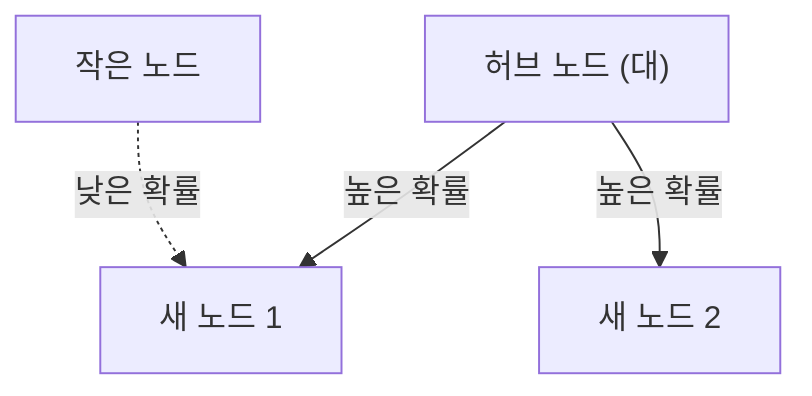

# 1. 서론: 세상에 숨겨진 질서

자연계나 인간 사회에는 언뜻 보기에 무질서해 보이는 현상 이면에 놀랍도록 아름다운 수학적 규칙성이 숨어 있는 경우가 많습니다. 우리가 평소 무심코 사용하는 단어, 살고 있는 도시의 크기, 웹사이트 방문자 수, 나아가 지진의 규모에 이르기까지 전혀 무관해 보이는 이 현상들이 사실은 하나의 공통된 수학적 법칙을 따르고 있다면 어떨까요?

그 놀라운 법칙이 바로 **지프의 법칙** ([Zipf's Law](https://kenji.blog/p/zipfs-law/))입니다. 이 법칙은 특정 데이터 세트에서 요소의 출현 빈도가 그 순위에 반비례한다는 경험 법칙입니다. 가장 빈번하게 출현하는 요소는 두 번째로 빈번하게 출현하는 요소의 약 2배, 세 번째의 약 3배의 빈도로 출현합니다.

본 기사에서는 이 **지프의 법칙** 에 대해 그 역사적 배경부터 수학적 공식화, 현실 세계의 놀라운 사례, 그리고 왜 이러한 법칙이 자연계나 사회 시스템에서 보편적으로 발생하는지에 대해 수식과 시뮬레이션 코드, 도해를 곁들여 극히 상세하고 깊이 있게 파헤쳐 봅니다. 단순한 읽을거리뿐만 아니라 데이터 과학이나 자연어 처리의 기초 지식으로도 활용할 수 있는 내용을 목표로 하고 있습니다.

# 2. 지프의 법칙의 발견과 역사적 배경

**지프의 법칙** 은 1930년대 미국의 언어학자인 조지 킹슬리 지프(George Kingsley Zipf)에 의해 널리 보급되었습니다. 하지만 이 법칙 자체의 발견자는 그뿐만이 아닙니다. 프랑스의 속기사인 장 바티스트 에스투(Jean-Baptiste Estoup)나 물리학자인 펠릭스 아우어바흐(Felix Auerbach) 등도 지프 이전에 비슷한 현상을 눈치채고 있었습니다.

지프는 영어 문장에서 단어의 출현 빈도를 상세히 분석했습니다. 제임스 조이스의 소설 『율리시스』 등 대규모 텍스트 데이터를 수작업으로 세어본 결과, 그는 놀라운 규칙성을 발견했습니다. 그것은 가장 자주 쓰이는 단어(영어에서는 'the')의 출현 빈도가 두 번째로 자주 쓰이는 단어('of')의 약 2배, 세 번째('and')의 약 3배가 된다는 사실이었습니다.

지프는 이 현상을 인간 행동의 기본 원리인 **최소 노력의 법칙** (Principle of Least Effort)으로 귀결된다고 주장했습니다. 즉, 인간은 의사소통에서 가능한 한 적은 노력으로 정보를 전달하려고 하므로 소수의 간단한 단어를 빈번하게 사용하고, 복잡한 단어는 멸타 사용하지 않게 된다는 것입니다. 이 철학적 해석은 훗날 정보이론이나 통계역학적 관점에서도 뒷받침됩니다.

# 3. 수학적 공식화: 순위-규모 법칙

여기서는 **지프의 법칙** 을 수학적으로 엄밀하게 공식화해 보겠습니다. 데이터 세트 내의 요소(예: 단어)를 출현 빈도가 높은 순서대로 나열합니다.

가장 빈도가 높은 요소의 순위(Rank)를 $r = 1$, 두 번째를 $r = 2$라고 합니다. 어떤 요소의 순위 $r$에 대한 출현 빈도(Frequency)를 $f(r)$이라고 하면, 지프의 법칙은 다음과 같이 표현됩니다.

$$
f(r) \propto \frac{1}{r^\alpha}
$$

여기서 $\alpha$는 데이터 세트에 의존하는 상수이며, 일반적으로 $\alpha \approx 1$입니다. 이때 빈도는 순위에 정확히 반비례합니다.

등식으로 표현하기 위해 비례 상수를 $C$라고 두면,

$$
f(r) = \frac{C}{r^\alpha}
$$

가 됩니다. 상수 $C$는 데이터 세트 전체의 총 요소 수(단어의 총수 등)에 의존합니다. 확률론의 언어로 말하자면, 순위 $r$의 요소가 출현할 확률 $P(r)$은 다음과 같습니다.

$$
P(r) = \frac{\frac{1}{r^\alpha}}{\sum_{n=1}^{N} \frac{1}{n^\alpha}}
$$

여기서 $N$은 요소의 종류(어휘 수 등)입니다. 분모의 급수는 $\alpha > 1$의 극한에서 리만 제타 함수 $\zeta(\alpha)$로 수렴합니다. 따라서 **지프의 법칙** 은 제타 분포라고 불리기도 합니다.

로그를 취함으로써 이 관계는 더 명확하게 시각화될 수 있습니다.

$$
\log f(r) = \log C - \alpha \log r
$$

이는 양로그 그래프(Log-Log Plot)에 그리면 기울기가 $-\alpha$인 직선이 됨을 의미합니다. 데이터 세트가 **지프의 법칙** 을 따르고 있는지 확인하는 가장 쉬운 방법은 양로그 그래프를 그려서 직선이 되는지 확인하는 것입니다. 직선이라면 그 현상 이면에는 **멱법칙** (Power Law)이 존재한다고 할 수 있습니다.

# 4. 현실 세계의 놀라운 사례

**지프의 법칙** 은 단순한 언어학의 틀을 넘어 놀랍도록 다양하고 많은 현상에 적용됩니다. 여기서는 5가지 다른 분야의 사례를 자세히 살펴보겠습니다.

## 4.1. 언어학과 자연어 처리(NLP)

가장 고전적인 예는 텍스트 코퍼스에서 단어의 출현 빈도입니다. 영어 코퍼스(예: 위키백과의 전체 텍스트)를 분석하면 상위 몇 개 단어의 빈도는 다음과 같습니다.

1. **the**: 약 7%의 출현 확률
2. **of**: 약 3.5%의 출현 확률
3. **and**: 약 2.8%의 출현 확률
4. **to**: 약 2.6%의 출현 확률

이처럼 불과 수십 개의 빈출 단어가 텍스트 전체의 절반 가까이를 차지하는 반면, 나머지 수십만 개의 단어는 거의 출현하지 않습니다. 이 '롱테일(Long Tail)' 현상은 검색 엔진의 인덱스 구축이나 대규모 언어 모델(LLM)의 어휘 설계에서 매우 중요합니다. 자연어 처리 분야에서는 너무 빈번하게 출현하는 단어(불용어)는 정보량이 적기 때문에 TF-IDF 등의 기법을 사용하여 가중치를 낮추는 처리를 합니다.

## 4.2. 도시의 인구 분포

언어뿐만 아니라 지리학이나 도시공학 분야에서도 **지프의 법칙** 이 관찰됩니다. 어느 국가의 도시 인구를 많은 순서대로 나열하면 2위 도시의 인구는 1위 도시의 절반, 3위는 3분의 1이 되는 관계가 나타납니다.

예를 들어, 미국의 도시 인구 데이터를 살펴보겠습니다(숫자는 개략적).
- 1위 뉴욕: 약 840만 명
- 2위 로스앤젤레스: 약 400만 명(뉴욕의 약 절반)
- 3위 시카고: 약 270만 명(뉴욕의 약 3분의 1)

물론 국가에 따라 수도로의 일극 집중(예: 일본의 도쿄, 프랑스의 파리)이 두드러져 법칙에서 벗어나는 '종주 도시 현상'이 나타나는 경우도 있지만, 전체적인 경향으로는 훌륭하게 **멱법칙** 을 따릅니다.

## 4.3. 웹사이트의 트래픽

인터넷상 웹사이트의 방문자 수나 SNS의 팔로워 수도 **지프의 법칙** 을 따릅니다. Google이나 YouTube, Facebook과 같은 극소수의 거대 사이트가 트래픽의 대부분을 독점하고, 셀 수 없이 많은 무수한 사이트가 아주 적은 접속만을 갖는 구조입니다. 이는 정보 네트워크의 링크 구조가 후술할 '우선적 선택'에 의해 형성되기 때문입니다.

## 4.4. 기업의 규모와 소득 분포(파레토의 법칙)

기업의 매출액이나 종업원 수, 나아가 개인의 소득 분포도 **멱법칙** 을 따릅니다. 소득 분포에 관한 법칙은 이탈리아의 경제학자 빌프레도 파레토의 이름을 따서 **파레토의 법칙** (Pareto Principle)이라고 불립니다. '전체 80%의 부는 20%의 사람이 소유하고 있다'는 '80:20의 법칙'으로도 알려져 있습니다. 수학적으로 **지프의 법칙** 과 **파레토의 법칙** 은 같은 현상을 다른 각도(순위냐, 규모냐)에서 보고 있을 뿐입니다.

## 4.5. 지진의 규모(구텐베르크-릭터 법칙)

물리학이나 지구과학 분야에서도 비슷한 법칙이 존재합니다. 지진의 규모와 발생 빈도의 관계를 보여주는 **구텐베르크-릭터 법칙** (Gutenberg-Richter Law)입니다. 규모가 1 커지면 그 규모의 지진 발생 빈도는 약 10분의 1이 됩니다. 여기서도 거대한 현상은 극히 드물게 발생하고, 작은 현상은 무수히 일어나는 프랙탈적 구조를 엿볼 수 있습니다.

# 5. 왜 지프의 법칙이 발생하는가? (생성 메커니즘)

왜 언어, 도시, 경제, 물리 현상과 같은 전혀 다른 분야에서 같은 수학적 구조가 나타나는 것일까요? 복잡계 과학 연구자들은 몇 가지 생성 메커니즘을 제안하고 있습니다.

## 5.1. 우선적 선택(Preferential Attachment)

네트워크 과학에서 가장 유명한 모델이 알베르트 라슬로 바라바시 등에 의해 제창된 **우선적 선택** (Preferential Attachment) 모델입니다. 흔히 '부익부 현상(Rich-get-richer)'이라고도 불립니다.

새로운 웹사이트가 링크를 걸 때, 이미 많은 링크를 모은 유명한 사이트에 링크를 걸 확률이 높을 것입니다. 새로운 주민이 이사할 때, 이미 인프라가 잘 갖춰진 큰 도시를 선택할 확률이 높을 것입니다. 이처럼 기존의 규모(링크 수, 인구 등)에 비례하여 새로운 요소가 추가되는 동적 과정을 거치면 결과적으로 전체 분포는 **지프의 법칙** 을 따르는 멱법칙이 됩니다.

아래에 이 과정의 개념도를 나타냅니다.



## 5.2. 최소 노력의 법칙(Principle of Least Effort)

지프 자신이 제창한 가설입니다. 커뮤니케이션 시스템에서 화자와 청자 사이에는 상반된 욕구가 있습니다.
- **화자의 욕구**: 적은 어휘로 모든 것을 표현하고 싶다(단일 단어에 많은 의미를 부여한다).
- **청자의 욕구**: 의미의 모호성을 없애기 위해 각각의 개념에 별도의 단어를 할당하고 싶다(다양한 어휘를 요구한다).

이 두 상반된 '노력'의 타협점으로서 소수의 다의적인 빈출어와 다수의 일의적인 희귀어라는 분포, 즉 **지프의 법칙** 이 자연스럽게 생겨난다고 설명됩니다.

## 5.3. 무작위 타이핑 모델(원숭이가 타자기를 친다)

놀랍게도 완전히 무작위적인 과정에서도 **지프의 법칙** 과 비슷한 분포가 생긴다는 사실이 수학자 브누아 망델브로 등에 의해 증명되었습니다.
예를 들어, 원숭이가 타자기의 키(알파벳 26자와 공백)를 완전히 무작위로 두드려 '단어'를 만들었다고 가정합시다. 공백이 나올 확률을 $p$라고 하면, 짧은 단어일수록 생성될 확률이 높아집니다. 이를 순위순으로 나열하면 마치 자연언어와 같은 멱법칙 분포를 얻을 수 있습니다. 이는 **지프의 법칙** 이 인간의 고도의 지적 활동뿐만 아니라 시스템 자체의 통계적 성질에서 유래했을 가능성을 시사합니다.

# 6. 시뮬레이션과 Python 코드

실제로 Python을 사용하여 텍스트 데이터로부터 **지프의 법칙** 을 확인하는 코드를 작성해 봅시다. 아래의 코드는 무작위로 생성된 텍스트 또는 기존 코퍼스를 이용하여 단어의 빈도를 세고 양로그 그래프에 그리는 것입니다.

```python
import matplotlib.pyplot as plt
from collections import Counter
import re
import numpy as np

def plot_zipf_law(text):
    # 텍스트를 소문자화하고 단어로 분할
    words = re.findall(r'\b\w+\b', text.lower())
    
    # 단어의 출현 빈도를 카운트
    word_counts = Counter(words)
    
    # 빈도가 높은 순으로 정렬
    sorted_counts = sorted(word_counts.values(), reverse=True)
    ranks = np.arange(1, len(sorted_counts) + 1)
    
    # 양로그 그래프로 플롯
    plt.figure(figsize=(10, 6))
    plt.loglog(ranks, sorted_counts, marker='o', linestyle='none', color='cyan', alpha=0.7)
    
    # 비교를 위한 이상적인 지프의 법칙 직선 (alpha=1)
    expected_counts = [sorted_counts[0] / r for r in ranks]
    plt.loglog(ranks, expected_counts, color='red', linestyle='--', label="Ideal Zipf's Law (alpha=1)")
    
    plt.title("Zipf's Law Verification")
    plt.xlabel("Rank (log scale)")
    plt.ylabel("Frequency (log scale)")
    plt.legend()
    plt.grid(True, which="both", ls="--", alpha=0.5)
    plt.show()

# 샘플로 매우 긴 더미 텍스트를 사용
# 실제 데이터 과학 프로젝트에서는 NLTK나 Gutenberg 코퍼스를 사용합니다
dummy_text = "the and of to a in that is was he for it with as his on be at by i this had not are but from or have an they which one you were all her she there would their we him been has when who will no more if out so up said what its about than into them can only other new some could time these two may then do first any my now such like our over man me even most made after also did many before must through back years where much your way well down should because each just those people mr how too little state good very make world still own see men work long get here between both life being under never day same another know while last might great old year off come since against go came right used take three states himself few house use during without again place american around however home small found thought went say part once general high upon school every don't does got united left number course war until always away something fact water though less public put think almost hand enough far took head yet better display modern history area completely specific significant process" * 100

# plot_zipf_law(dummy_text)
```

이 코드를 실행하면 실제 단어 빈도가 빨간색 점선(이상적인 지프의 법칙)을 따라 분포하는 것을 확인할 수 있습니다. 데이터 과학 현장에서는 이러한 빈도 분석을 통해 데이터의 편향이나 이상치를 검출할 수 있습니다.

# 7. 컴퓨터 과학으로의 응용

**지프의 법칙** 은 이론적인 흥미로움뿐만 아니라 실용적인 컴퓨터 과학의 알고리즘에서도 중요한 역할을 합니다.

## 7.1. 캐시 알고리즘 최적화

웹 서버나 데이터베이스의 캐시 전략에서 **지프의 법칙** 은 매우 중요합니다. 소수의 인기 콘텐츠(예: 입소문이 난 동영상이나 주요 뉴스)가 전체 접속 수의 대부분을 차지하기 때문에, 이들을 메모리(RAM)와 같은 고속 캐시에 저장함으로써 시스템 전체의 성능을 극적으로 향상시킬 수 있습니다. LFU(Least Frequently Used)나 LRU(Least Recently Used)와 같은 알고리즘은 바로 이 데이터의 편향(멱법칙)을 이용하여 설계되었습니다.

## 7.2. 데이터 압축

허프만 부호화(Huffman Coding) 등의 엔트로피 부호화에서는 빈번하게 출현하는 데이터 패턴에는 짧은 비트열을, 드물게 출현하는 패턴에는 긴 비트열을 할당합니다. 데이터의 출현 빈도가 **지프의 법칙** 처럼 극단적으로 편향되어 있을 경우, 이러한 가변 길이 부호화를 사용함으로써 데이터 크기를 극적으로 압축할 수 있게 됩니다. ZIP 파일이나 JPEG 이미지 등의 압축 기술의 밑바탕에도 이 통계적 성질이 활용되고 있습니다.

# 8. 결론: 복잡계를 이해하기 위한 열쇠

본 기사에서는 **지프의 법칙** ([Zipf's Law](https://kenji.blog/p/zipfs-law/))에 대해 그 정의부터 수학적 배경, 다양한 사례, 그리고 생성 메커니즘까지 자세히 해설했습니다.

단어의 빈도, 도시의 인구, 기업의 규모, 웹의 트래픽. 이들은 전혀 다른 메커니즘으로 움직이는 것처럼 보이지만, 거시적인 관점에서 보면 같은 **멱법칙** 의 지배를 받습니다. 이는 우리 세계가 단순한 무작위 현상의 짜깁기가 아니라 자기조직화(Self-organization)나 프랙탈 구조와 같은 더 깊은 차원의 수학적 질서를 가지고 있음을 보여줍니다.

데이터 과학자나 엔지니어에게 데이터 세트가 정규분포(종형 곡선)를 따르는지 아니면 **지프의 법칙** 과 같은 멱법칙을 따르는지(롱테일을 갖는지)를 이해하는 것은 시스템 설계나 모델 구축에 있어 치명적인 차이를 가져옵니다. 세계의 숨겨진 질서를 읽어내는 강력한 렌즈로서 **지프의 법칙** 을 꼭 마음속에 간직해 두시기 바랍니다.

---
*본 기사는 데이터 과학과 복잡계 과학의 탐구를 목적으로 집필되었습니다. 상세한 수식 전개나 이론에 대해서는 관련된 통계물리학이나 자연어 처리의 전문 서적을 참조할 것을 권장합니다.*
