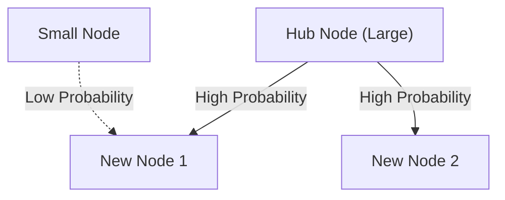

# 1. 序論：世界に潜む隠れた秩序

自然界や人間社会には、一見すると無秩序に見える現象の背後に、驚くほど美しい数学的な規則性が潜んでいることがよくあります。私たちが普段何気なく使っている言葉、住んでいる都市の大きさ、ウェブサイトへのアクセス数、さらには地震の規模に至るまで、全く無関係に見えるこれらの現象が、実は一つの共通した数学的法則に従っているとしたらどうでしょうか。

その驚くべき法則こそが **[ジップの法則](https://kenji.blog/p/zipfs-law/)** （[Zipf's Law](https://kenji.blog/p/zipfs-law/)）です。この法則は、特定のデータセットにおいて、要素の出現頻度がその順位に反比例するという経験則です。最も頻繁に出現する要素は、2番目に頻繁に出現する要素の約2倍、3番目の約3倍の頻度で出現します。

本記事では、この **[ジップの法則](https://kenji.blog/p/zipfs-law/)** について、その歴史的背景から数学的定式化、現実世界における驚くべき実例、そしてなぜこのような法則が自然界や社会システムにおいて普遍的に生じるのかについて、数式やシミュレーションコード、図解を交えながら極めて詳細かつ深く掘り下げていきます。単なる読み物としてだけでなく、データサイエンスや自然言語処理の基礎知識としても活用できる内容を目指しています。

# 2. [ジップの法則](https://kenji.blog/p/zipfs-law/)の発見と歴史的背景

**[ジップの法則](https://kenji.blog/p/zipfs-law/)** は、1930年代にアメリカの言語学者であるジョージ・キングズリー・ジップ（George Kingsley Zipf）によって広く普及しました。しかし、この法則自体の発見者は彼だけではありません。フランスの速記者であるジャン＝バティスト・エストゥー（Jean-Baptiste Estoup）や、物理学者のフェリックス・アウエルバッハ（Felix Auerbach）なども、ジップ以前に同様の現象に気づいていました。

ジップは、英語の文章における単語の出現頻度を詳細に分析しました。ジェイムズ・ジョイスの小説『ユリシーズ』など、大規模なテキストデータを手作業で数え上げた結果、彼はある驚くべき規則性を発見しました。それは、最もよく使われる単語（英語では「the」）の出現頻度が、2番目によく使われる単語（「of」）の約2倍、3番目（「and」）の約3倍になるという事実でした。

ジップはこの現象を、人間の行動の基本原理である **最小努力の法則** （Principle of Least Effort）に帰結すると主張しました。つまり、人間はコミュニケーションにおいて、できるだけ少ない労力で情報を伝えようとするため、少数の簡単な単語を頻繁に使い、複雑な単語は滅多に使わないようになるというのです。この哲学的な解釈は、後に[情報理論](https://kenji.blog/p/information-theory-shannon-entropy/)や統計力学の観点からも裏付けられることになります。

# 3. 数学的定式化：順位-規模法則

ここでは、 **[ジップの法則](https://kenji.blog/p/zipfs-law/)** を数学的に厳密に定式化してみましょう。データセット内の要素（例えば単語）を、その出現頻度が高い順に並べます。

最も頻度が高い要素の順位（Rank）を $r = 1$、2番目を $r = 2$ とします。ある要素の順位 $r$ に対する出現頻度（Frequency）を $f(r)$ とすると、[ジップの法則](https://kenji.blog/p/zipfs-law/)は次のように表されます。

$$
f(r) \propto \frac{1}{r^\alpha}
$$

ここで、$\alpha$ はデータセットに依存する定数であり、通常は $\alpha \approx 1$ です。このとき、頻度は順位に正確に反比例します。

等式として表現するために、比例定数を $C$ と置くと、

$$
f(r) = \frac{C}{r^\alpha}
$$

となります。定数 $C$ は、データセット全体の総要素数（単語の総数など）に依存します。確率論の言葉で言えば、順位 $r$ の要素が出現する確率 $P(r)$ は以下のようになります。

$$
P(r) = \frac{\frac{1}{r^\alpha}}{\sum_{n=1}^{N} \frac{1}{n^\alpha}}
$$

ここで、$N$ は要素の種類（語彙数など）です。分母の級数は、$\alpha > 1$ の極限において[リーマン](https://kenji.blog/p/riemann/)ゼータ関数 $\zeta(\alpha)$ に収束します。そのため、 **[ジップの法則](https://kenji.blog/p/zipfs-law/)** はゼータ分布と呼ばれることもあります。

対数をとることで、この関係はより明確に視覚化できます。

$$
\log f(r) = \log C - \alpha \log r
$$

これは、両対数[グラフ](https://kenji.blog/p/tree-graph-data-structures-search-dfs-bfs-dijkstra/)（Log-Log Plot）上でプロットすると、傾きが $-\alpha$ の直線になることを意味しています。データセットが **[ジップの法則](https://kenji.blog/p/zipfs-law/)** に従っているかどうかを確認する最も簡単な方法は、両対数[グラフ](https://kenji.blog/p/tree-graph-data-structures-search-dfs-bfs-dijkstra/)を描いて直線になるかどうかを見ることです。直線であれば、その現象の背後には **べき乗則** （Power Law）が存在していると言えます。

# 4. 現実世界における驚くべき実例

**[ジップの法則](https://kenji.blog/p/zipfs-law/)** は単なる言語学の枠を超え、驚くほど多種多様な現象に当てはまります。ここでは、5つの異なる分野における実例を詳細に見ていきましょう。

## 4.1. 言語学と自然言語処理（NLP）

最も古典的な例は、テキストコーパスにおける単語の出現頻度です。英語のコーパス（例えばWikipediaの全テキスト）を分析すると、上位数単語の頻度は以下のようになります。

1. **the**: 約 7% の出現確率
2. **of**: 約 3.5% の出現確率
3. **and**: 約 2.8% の出現確率
4. **to**: 約 2.6% の出現確率

このように、わずか数十個の頻出単語がテキスト全体の半分近くを占める一方で、残りの何十万もの単語はほとんど出現しません。この「ロングテール（Long Tail）」現象は、検索エンジンのインデックス構築や、[大規模言語モデル](https://kenji.blog/p/large-language-models-llm-transformer-prompt-engineering/)（[LLM](https://kenji.blog/p/large-language-models-llm-transformer-prompt-engineering/)）の語彙設計において極めて重要です。自然言語処理の分野では、あまりにも頻繁に出現する単語（ストップワード）は情報量が少ないため、TF-IDF などの手法を用いて重みを下げる処理が行われます。

## 4.2. 都市の人口分布

言語だけでなく、地理学や都市工学の分野でも **[ジップの法則](https://kenji.blog/p/zipfs-law/)** は観察されます。ある国における都市の人口を多い順に並べると、第2位の都市の人口は第1位の都市の半分、第3位は3分の1になるという関係が見られます。

例えば、アメリカ合衆国の都市人口データを見てみましょう（数字は概算）。
- 1位 ニューヨーク: 約 840万人
- 2位 ロサンゼルス: 約 400万人（ニューヨークの約半分）
- 3位 シカゴ: 約 270万人（ニューヨークの約3分の1）

もちろん、国によっては首都への一極集中（例えば日本の東京、フランスのパリ）が著しく、法則から外れる「プライメイトシティ（首位都市）現象」が見られることもありますが、全体的な傾向としては見事に **べき乗則** に従います。

## 4.3. ウェブサイトのトラフィック

インターネット上のウェブサイトへのアクセス数や、SNSにおけるフォロワー数も **[ジップの法則](https://kenji.blog/p/zipfs-law/)** に従います。Google や YouTube、Facebook といったごく一部の巨大サイトがトラフィックの大部分を独占し、数え切れないほどの無数のサイトがごくわずかなアクセスしか持たないという構造です。これは、情報ネットワークにおけるリンクの構造が、後述する「優先的選択」によって形成されているためです。

## 4.4. 企業の規模と所得分布（パレートの法則）

企業の売上高や従業員数、さらには個人の所得分布も **べき乗則** に従います。所得分布に関する法則は、イタリアの経済学者ヴィルフレド・パレートにちなんで **パレートの法則** （Pareto Principle）と呼ばれます。「全体の80%の富は、20%の人が所有している」という「80:20の法則」としても知られています。数学的には、 **[ジップの法則](https://kenji.blog/p/zipfs-law/)** と **パレートの法則** は同じ現象を異なる角度（順位か、規模か）から見ているに過ぎません。

## 4.5. 地震の規模（グーテンベルグ・リヒター則）

物理学や地球科学の分野でも同様の法則が存在します。地震のマグニチュードと発生頻度の関係を示す **グーテンベルグ・リヒター則** （Gutenberg-Richter Law）です。マグニチュードが1大きくなると、その規模の地震の発生頻度は約10分の1になります。ここでも、巨大な現象は極めて稀にしか起きず、小さな現象は無数に起きるというフラクタル的な構造が見て取れます。

# 5. なぜ[ジップの法則](https://kenji.blog/p/zipfs-law/)は生じるのか？（生成メカニズム）

なぜ、言語、都市、経済、物理現象といった全く異なる分野で、同じ数学的構造が現れるのでしょうか？複雑系科学の研究者たちは、いくつかの生成メカニズムを提案しています。

## 5.1. 優先的選択（Preferential Attachment）

ネットワーク科学において最も有名なモデルが、アルバート＝ラズロ・バラバシらによって提唱された **優先的選択** （Preferential Attachment）モデルです。俗に「金持ちはより金持ちになる（Rich-get-richer）」現象とも呼ばれます。

新しいウェブサイトがリンクを張る際、すでに多くのリンクを集めている有名なサイトにリンクを張る確率が高いでしょう。新しい住民が引っ越す際、すでにインフラが整っている大きな都市を選ぶ確率が高いでしょう。このように、既存の規模（リンク数、人口など）に比例して新しい要素が追加される動的プロセスを経ると、結果として全体の分布は **[ジップの法則](https://kenji.blog/p/zipfs-law/)** に従うべき乗則になります。

以下に、このプロセスの概念図を示します。



## 5.2. 最小努力の法則（Principle of Least Effort）

ジップ自身が提唱した仮説です。コミュニケーションシステムにおいて、話し手と聞き手の間には相反する欲求があります。
- **話し手の欲求**: 少ない語彙で全てを表現したい（単一の単語に多くの意味を持たせる）。
- **聞き手の欲求**: 意味の曖昧さをなくすため、それぞれの概念に別々の単語を割り当てたい（多様な語彙を求める）。

この2つの相反する「努力」の妥協点として、少数の多義的な頻出語と、多数の一義的な希少語という分布、すなわち **[ジップの法則](https://kenji.blog/p/zipfs-law/)** が自然に生じると説明されます。

## 5.3. ランダムタイピングモデル（サルがタイプライターを叩く）

驚くべきことに、完全にランダムなプロセスからも **[ジップの法則](https://kenji.blog/p/zipfs-law/)** に似た分布が生じることが、数学者のブノワ・マンデルブロらによって示されています。
例えば、サルがタイプライターのキー（アルファベット26文字と空白スペース）を完全にランダムに叩いて「単語」を作ったとします。空白スペースが出る確率を $p$ とすると、短い単語ほど生成される確率が高くなります。これを順位順に並べると、あたかも自然言語のようなべき乗則の分布が得られるのです。これは、 **[ジップの法則](https://kenji.blog/p/zipfs-law/)** が人間の高度な知的活動だけでなく、システムそのものの統計的な性質に由来している可能性を示唆しています。

# 6. シミュレーションとPythonコード

実際に Python を使って、テキストデータから **[ジップの法則](https://kenji.blog/p/zipfs-law/)** を確認するコードを書いてみましょう。以下のコードは、ランダムに生成されたテキスト、または既存のコーパスを用いて単語の頻度をカウントし、両対数[グラフ](https://kenji.blog/p/tree-graph-data-structures-search-dfs-bfs-dijkstra/)にプロットするものです。

```python
import matplotlib.pyplot as plt
from collections import Counter
import re
import numpy as np

def plot_zipf_law(text):
    # テキストを小文字化し、単語に分割
    words = re.findall(r'\b\w+\b', text.lower())
    
    # 単語の出現頻度をカウント
    word_counts = Counter(words)
    
    # 頻度が高い順にソート
    sorted_counts = sorted(word_counts.values(), reverse=True)
    ranks = np.arange(1, len(sorted_counts) + 1)
    
    # 両対数グラフでプロット
    plt.figure(figsize=(10, 6))
    plt.loglog(ranks, sorted_counts, marker='o', linestyle='none', color='cyan', alpha=0.7)
    
    # 比較のための理想的なジップの法則の直線 (alpha=1)
    expected_counts = [sorted_counts[0] / r for r in ranks]
    plt.loglog(ranks, expected_counts, color='red', linestyle='--', label="Ideal Zipf's Law (alpha=1)")
    
    plt.title("Zipf's Law Verification")
    plt.xlabel("Rank (log scale)")
    plt.ylabel("Frequency (log scale)")
    plt.legend()
    plt.grid(True, which="both", ls="--", alpha=0.5)
    plt.show()

# サンプルとして非常に長いダミーテキストを使用
# 実際のデータサイエンスプロジェクトでは、NLTKやGutenbergコーパスを使用します
dummy_text = "the and of to a in that is was he for it with as his on be at by i this had not are but from or have an they which one you were all her she there would their we him been has when who will no more if out so up said what its about than into them can only other new some could time these two may then do first any my now such like our over man me even most made after also did many before must through back years where much your way well down should because each just those people mr how too little state good very make world still own see men work long get here between both life being under never day same another know while last might great old year off come since against go came right used take three states himself few house use during without again place american around however home small found thought went say part once general high upon school every don't does got united left number course war until always away something fact water though less public put think almost hand enough far took head yet better display modern history area completely specific significant process" * 100

# plot_zipf_law(dummy_text)
```

このコードを実行すると、実際の単語頻度が赤い点線（理想的な[ジップの法則](https://kenji.blog/p/zipfs-law/)）に沿って分布することが確認できます。データサイエンスの現場では、このような頻度分析を通じて、データの偏りや異常値を検出することができます。

# 7. コンピュータサイエンスへの応用

**[ジップの法則](https://kenji.blog/p/zipfs-law/)** は、理論的な面白さだけでなく、実用的なコンピュータサイエンスのアルゴリズムにおいても重要な役割を果たしています。

## 7.1. キャッシュアルゴリズム最適化

ウェブサーバーやデータベースのキャッシュ戦略において、 **[ジップの法則](https://kenji.blog/p/zipfs-law/)** は極めて重要です。少数の人気コンテンツ（例えばバズっている動画やトップニュース）が全体のアクセス数の大部分を占めるため、これらをメモリ（RAM）などの高速なキャッシュに保存することで、システム全体のパフォーマンスを劇的に向上させることができます。LFU（Least Frequently Used）やLRU（Least Recently Used）といったアルゴリズムは、まさにこのデータの偏り（べき乗則）を利用して設計されています。

## 7.2. [データ圧縮](https://kenji.blog/p/information-theory-shannon-entropy/)

ハフマン符号化（Huffman Coding）などのエントロピー符号化では、頻繁に出現するデータパターンには短いビット列を、まれに出現するパターンには長いビット列を割り当てます。データの出現頻度が **[ジップの法則](https://kenji.blog/p/zipfs-law/)** のように極端に偏っている場合、このような可変長符号化を用いることで、データサイズを劇的に圧縮することが可能になります。ZIPファイルやJPEG画像などの圧縮技術の根底にも、この統計的性質が活かされています。

# 8. 結論：複雑系を理解するための鍵

本記事では、 **[ジップの法則](https://kenji.blog/p/zipfs-law/)** （[Zipf's Law](https://kenji.blog/p/zipfs-law/)）について、その定義から数学的背景、多様な実例、そして生成メカニズムまでを詳細に解説しました。

単語の頻度、都市の人口、企業の規模、ウェブのトラフィック。これらは全く異なるメカニズムで動いているように見えますが、マクロな視点で見ると同じ **べき乗則** に支配されています。これは、私たちの世界が単なるランダムな現象の寄せ集めではなく、自己組織化（Self-organization）やフラクタル構造といった、より深い次元での数学的秩序を持っていることを示しています。

データサイエンティストやエンジニアにとって、データセットが正規分布（ベルカーブ）に従うのか、それとも **[ジップの法則](https://kenji.blog/p/zipfs-law/)** のようなべき乗則に従うのか（ロングテールを持つのか）を理解することは、システム設計やモデル構築において致命的な違いをもたらします。世界の隠れた秩序を読み解く強力なレンズとして、 **[ジップの法則](https://kenji.blog/p/zipfs-law/)** をぜひ心に留めておいてください。

---
*本記事は、データサイエンスと複雑系科学の探求を目的として執筆されました。詳細な数式展開や理論については、関連する統計物理学や自然言語処理の専門書を参照することをお勧めします。*
