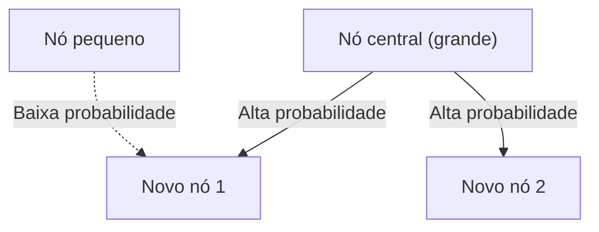

# 1. Introdução: A Ordem Oculta no Mundo

Na natureza e na sociedade humana, regularidades matemáticas notavelmente belas muitas vezes se escondem por trás de fenómenos que parecem desordenados à primeira vista. As palavras que usamos casualmente todos os dias, o tamanho das cidades em que vivemos, o número de visitas a websites e até mesmo a magnitude dos terremotos – e se todos esses fenômenos aparentemente não relacionados realmente seguirem uma única lei matemática comum?

Essa lei notável é a **Lei de Zipf**. Esta lei é uma regra empírica que afirma que a frequência de ocorrência de elementos num determinado conjunto de dados é inversamente proporcional à sua classificação. O elemento que ocorre com mais frequência aparece aproximadamente duas vezes mais que o segundo mais frequente e aproximadamente três vezes mais que o terceiro.

Neste artigo, nos aprofundaremos na **Lei de Zipf** — desde seu contexto histórico e formulação matemática até exemplos surpreendentes do mundo real, e por que tal lei surge universalmente em sistemas naturais e sociais — usando fórmulas, código de simulação e ilustrações. Nosso objetivo é fornecer conteúdo que possa servir não apenas como uma leitura envolvente, mas também como conhecimento fundamental para ciência de dados e processamento de linguagem natural.

# 2. Descoberta e Antecedentes Históricos da Lei de Zipf

**A Lei de Zipf** foi amplamente popularizada na década de 1930 pelo lingüista americano George Kingsley Zipf. No entanto, ele não foi o único descobridor desta lei. O estenógrafo francês Jean-Baptiste Estoup e o físico Felix Auerbach, entre outros, notaram fenômenos semelhantes antes de Zipf.

Zipf analisou meticulosamente a frequência de ocorrências de palavras em textos em inglês. Depois de contar meticulosamente à mão dados de texto em grande escala, como o romance *Ulysses* de James Joyce, ele descobriu uma regularidade notável: a frequência da palavra mais usada em inglês ("o") era aproximadamente o dobro da segunda palavra mais usada ("de") e cerca de três vezes a da terceira ("e").

Zipf atribuiu esse fenômeno ao **Princípio do Mínimo Esforço**, um princípio fundamental do comportamento humano. Em outras palavras, os humanos tendem a usar frequentemente um pequeno número de palavras simples e raramente usam palavras complexas porque tentam transmitir informações com o mínimo esforço possível na comunicação. Esta interpretação filosófica foi posteriormente apoiada nas perspectivas da teoria da informação e também da mecânica estatística.

# 3. Formulação Matemática: A Lei do Tamanho da Classificação

Vamos agora formalizar matematicamente a **Lei de Zipf**. Organizamos os elementos (por exemplo, palavras) em um conjunto de dados em ordem decrescente de frequência de ocorrência.

A classificação do elemento mais frequente é $r = 1$, o segundo mais frequente é $r = 2$ e assim por diante. Se $f(r)$ denota a frequência de ocorrência de um elemento com classificação $r$, a Lei de Zipf é expressa da seguinte forma:

$$
f(r) \propto \frac{1}{r^\alpha}
$$

Aqui, $\alpha$ é uma constante que depende do conjunto de dados e geralmente é $\alpha \approx 1$. Neste caso, a frequência é exatamente inversamente proporcional à classificação.

Para expressá-lo como uma equação, seja a constante de proporcionalidade $C$:

$$
f(r) = \frac{C}{r^\alpha}
$$

A constante $C$ depende do número total de elementos no conjunto de dados (por exemplo, o número total de palavras). Em termos probabilísticos, a probabilidade $P(r)$ de aparecer um elemento de classificação $r$ é:

$$
P(r) = \frac{\frac{1}{r^\alpha}}{\sum_{n=1}^{N} \frac{1}{n^\alpha}}
$$

Aqui, $N$ é o número de tipos de elementos distintos (por exemplo, tamanho do vocabulário). No limite onde $\alpha > 1$, a série no denominador converge para a função zeta de Riemann $\zeta(\alpha)$. Por esse motivo, a **Lei de Zipf** é às vezes chamada de distribuição zeta.

Tomando logaritmos, essa relação pode ser visualizada com mais clareza:

$$
\log f(r) = \log C - \alpha \log r
$$

Isso significa que quando plotado em um gráfico log-log, torna-se uma linha reta com inclinação $-\alpha$. A maneira mais simples de verificar se um conjunto de dados segue a **Lei de Zipf** é desenhar um gráfico log-log e ver se ele forma uma linha reta. Se isso acontecer, então existe uma **lei de potência** por trás do fenômeno.

# 4. Exemplos surpreendentes do mundo real

A **Lei de Zipf** se estende muito além do domínio da linguística e se aplica a uma gama surpreendentemente diversa de fenômenos. Vamos examinar detalhadamente exemplos de cinco campos diferentes.

## 4.1. Lingüística e Processamento de Linguagem Natural (NLP)

O exemplo mais clássico é a frequência das palavras em corpora de texto. Ao analisar um corpus em inglês (como o texto inteiro da Wikipédia), as frequências das palavras principais são as seguintes:

1. **the**: aproximadamente 7% de probabilidade de ocorrência
2. **of**: aproximadamente 3,5% de probabilidade de ocorrência
3. **and**: aproximadamente 2,8% de probabilidade de ocorrência
4. **to**: aproximadamente 2,6% de probabilidade de ocorrência

Desta forma, apenas algumas dezenas de palavras de alta frequência representam quase metade de todo o texto, enquanto centenas de milhares de palavras restantes raramente aparecem. Este fenômeno de "Cauda Longa" é extremamente importante na construção de índices de mecanismos de busca e no design do vocabulário de grandes modelos de linguagem (LLMs). No campo do processamento de linguagem natural, palavras que aparecem com muita frequência (palavras de parada) carregam pouca informação, por isso técnicas como TF-IDF são usadas para reduzir seu peso.

## 4.2. Distribuição da População Urbana

A **Lei de Zipf** é observada não apenas na linguagem, mas também nas áreas de geografia e engenharia urbana. Quando as populações das cidades de um país são listadas em ordem decrescente, a população da cidade em segundo lugar é metade da da cidade em primeiro lugar e a cidade em terceiro lugar é um terço.

Por exemplo, vejamos os dados da população das cidades dos EUA (os números são aproximados):
- 1ª Nova York: aproximadamente 8,4 milhões
- 2º Los Angeles: aproximadamente 4 milhões (cerca de metade de Nova York)
- 3º Chicago: aproximadamente 2,7 milhões (cerca de um terço de Nova York)

É claro que, em alguns países, a concentração extrema na capital (por exemplo, Tóquio no Japão, Paris na França) desvia-se da lei, um fenómeno conhecido como efeito “cidade primata”. No entanto, a tendência geral segue perfeitamente a **lei da potência**.

## 4.3. Tráfego do site

O número de visitas a sites na internet e o número de seguidores nas redes sociais também seguem a **Lei de Zipf**. Alguns sites gigantes como Google, YouTube e Facebook monopolizam a maior parte do tráfego, enquanto inúmeros outros sites recebem apenas uma pequena quantidade. Isso ocorre porque a estrutura de links nas redes de informação é formada por meio de “ligação preferencial”, que será discutida mais adiante.

## 4.4. Tamanho da empresa e distribuição de renda (Lei de Pareto)

As receitas corporativas, o número de funcionários e até mesmo as distribuições de renda pessoal seguem a **lei da potência**. A lei relativa à distribuição de renda é chamada de **Lei de Pareto** (Princípio de Pareto), em homenagem ao economista italiano Vilfredo Pareto. Também é conhecida como “regra 80:20” – “80% da riqueza total pertence a 20% das pessoas”. Matematicamente, a **Lei de Zipf** e a **Lei de Pareto** estão apenas vendo o mesmo fenômeno de ângulos diferentes (classificação versus tamanho).

## 4.5. Magnitude do terremoto (Lei Gutenberg-Richter)

Uma lei semelhante existe nos campos da física e das ciências da terra. A **Lei Gutenberg-Richter** descreve a relação entre a magnitude do terremoto e a frequência de ocorrência. Quando a magnitude aumenta em 1, a frequência de terremotos dessa magnitude diminui para cerca de um décimo. Também aqui podemos ver uma estrutura semelhante a um fractal onde eventos enormes são extremamente raros, enquanto eventos pequenos são incontáveis.

# 5. Por que surge a lei de Zipf? (Mecanismos Gerativos)

Por que a mesma estrutura matemática aparece em campos totalmente diferentes, como linguagem, cidades, economia e fenômenos físicos? Pesquisadores da ciência de sistemas complexos propuseram vários mecanismos geradores.

## 5.1. Anexo Preferencial

O modelo mais famoso na ciência de redes é o modelo **Anexo Preferencial**, proposto por Albert-László Barabási e outros. É coloquialmente conhecido como o fenômeno “Rico fica mais rico”.

Quando um novo site cria links, é mais provável que ele direcione para sites conhecidos que já possuem muitos links. Quando novos residentes se mudam, é mais provável que escolham grandes cidades com infra-estruturas estabelecidas. Através de um processo tão dinâmico, onde novos elementos são adicionados em proporção ao tamanho existente (número de links, população, etc.), a distribuição global resultante torna-se uma lei de potência seguindo a **Lei de Zipf**.

Abaixo está um diagrama conceitual deste processo:



## 5.2. Princípio do Menor Esforço

Esta é a hipótese proposta pelo próprio Zipf. Nos sistemas de comunicação, existem desejos conflitantes entre quem fala e quem ouve:
- **Desejo do locutor**: Expressar tudo com um vocabulário pequeno (atribuindo muitos significados a uma única palavra).
- **Desejo do ouvinte**: Atribuir palavras separadas para cada conceito para eliminar ambiguidade (buscando vocabulário diversificado).

O compromisso entre esses dois "esforços" conflitantes naturalmente dá origem a uma distribuição de algumas palavras polissêmicas de alta frequência e muitas palavras raras monossêmicas - a saber, **Lei de Zipf**.

## 5.3. Modelo de digitação aleatória (macacos em máquinas de escrever)

Notavelmente, matemáticos como Benoît Mandelbrot demonstraram que distribuições semelhantes à **Lei de Zipf** podem surgir de processos completamente aleatórios. Por exemplo, suponha que um macaco pressione aleatoriamente teclas de uma máquina de escrever (26 letras do alfabeto e uma barra de espaço) para criar “palavras”. Se a probabilidade de acertar um espaço for $p$, palavras mais curtas serão geradas com maior probabilidade. Quando organizado por classificação, produz uma distribuição de lei de potência que se assemelha à linguagem natural. Isto sugere que a **Lei de Zipf** pode originar-se não apenas da sofisticada atividade intelectual humana, mas também de propriedades estatísticas inerentes ao próprio sistema.

# 6. Simulação e código Python

Na verdade, vamos escrever código Python para verificar a **Lei de Zipf** a partir de dados de texto. O código a seguir conta frequências de palavras de texto gerado aleatoriamente ou de um corpus existente e as plota em um gráfico log-log.

```python
import matplotlib.pyplot as plt
from collections import Counter
import re
import numpy as np

def plot_zipf_law(text):
    # Convert text to lowercase and split into words
    words = re.findall(r'\b\w+\b', text.lower())
    
    # Count word frequencies
    word_counts = Counter(words)
    
    # Sort by frequency in descending order
    sorted_counts = sorted(word_counts.values(), reverse=True)
    ranks = np.arange(1, len(sorted_counts) + 1)
    
    # Plot on a log-log graph
    plt.figure(figsize=(10, 6))
    plt.loglog(ranks, sorted_counts, marker='o', linestyle='none', color='cyan', alpha=0.7)
    
    # Ideal Zipf's Law line for comparison (alpha=1)
    expected_counts = [sorted_counts[0] / r for r in ranks]
    plt.loglog(ranks, expected_counts, color='red', linestyle='--', label="Ideal Zipf's Law (alpha=1)")
    
    plt.title("Zipf's Law Verification")
    plt.xlabel("Rank (log scale)")
    plt.ylabel("Frequency (log scale)")
    plt.legend()
    plt.grid(True, which="both", ls="--", alpha=0.5)
    plt.show()

# Using a very long dummy text as a sample
# In actual data science projects, use NLTK or Gutenberg corpus
dummy_text = "the and of to a in that is was he for it with as his on be at by i this had not are but from or have an they which one you were all her she there would their we him been has when who will no more if out so up said what its about than into them can only other new some could time these two may then do first any my now such like our over man me even most made after also did many before must through back years where much your way well down should because each just those people mr how too little state good very make world still own see men work long get here between both life being under never day same another know while last might great old year off come since against go came right used take three states himself few house use during without again place american around however home small found thought went say part once general high upon school every don't does got united left number course war until always away something fact water though less public put think almost hand enough far took head yet better display modern history area completely specific significant process" * 100

# plot_zipf_law(dummy_text)
```

Ao executar esse código, você pode confirmar que as frequências reais das palavras estão distribuídas ao longo da linha tracejada vermelha (a Lei de Zipf ideal). Na prática da ciência de dados, essa análise de frequência pode ser usada para detectar vieses e valores discrepantes nos dados.

# 7. Aplicações em Ciência da Computação

A **Lei de Zipf** desempenha um papel importante não apenas como uma curiosidade teórica, mas também em algoritmos práticos da ciência da computação.

## 7.1. Otimização de Algoritmo de Cache

A **Lei de Zipf** é extremamente importante nas estratégias de cache para servidores web e bancos de dados. Como um pequeno número de itens de conteúdo popular (por exemplo, vídeos virais ou notícias importantes) é responsável pela maioria dos acessos, armazená-los em caches rápidos, como memória (RAM), pode melhorar drasticamente o desempenho geral do sistema. Algoritmos como LFU (Least Frequently Used) e LRU (Least Recentemente Used) são projetados precisamente para explorar essa distorção de dados (lei de potência).

## 7.2. Compressão de dados

Nas técnicas de codificação de entropia, como a codificação de Huffman, cadeias de bits curtas são atribuídas a padrões de dados que ocorrem com frequência e cadeias de bits longas são atribuídas a padrões raros. Quando a frequência dos dados segue uma distribuição extremamente distorcida como a **Lei de Zipf**, o uso dessa codificação de comprimento variável permite uma compactação drástica do tamanho dos dados. Essa propriedade estatística está subjacente às tecnologias de compactação, como arquivos ZIP e imagens JPEG.

# 8. Conclusão: uma chave para a compreensão de sistemas complexos

Neste artigo, fornecemos uma explicação detalhada da **Lei de Zipf** (Lei de Zipf), desde sua definição e fundamentos matemáticos até diversos exemplos e mecanismos generativos.

Frequências de palavras, populações de cidades, tamanhos de empresas e tráfego da web. Estes parecem operar através de mecanismos totalmente diferentes, mas de uma perspectiva macro, são todos governados pela mesma **lei de potência**. Isto mostra que o nosso mundo não é apenas uma coleção de fenómenos aleatórios, mas possui uma ordem matemática a um nível mais profundo, como a auto-organização e as estruturas fractais.

Para cientistas e engenheiros de dados, entender se um conjunto de dados segue uma distribuição normal (curva em sino) ou uma lei de potência como a **Lei de Zipf** (se tem cauda longa) faz uma diferença crítica no projeto do sistema e na construção do modelo. Tenha em mente a **Lei de Zipf** como uma lente poderosa para decifrar a ordem oculta do mundo.

---
*Este artigo foi escrito com o propósito de explorar a ciência de dados e a ciência de sistemas complexos. Para derivações e teorias matemáticas detalhadas, recomendamos consultar textos especializados em física estatística e processamento de linguagem natural.*
