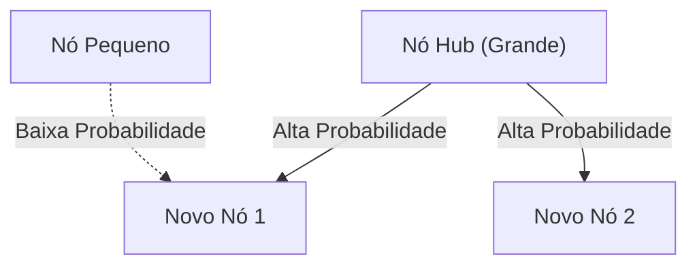

# 1. Introdução: A Ordem Oculta no Mundo

Na natureza e na sociedade humana, por trás de fenômenos que parecem caóticos à primeira vista, muitas vezes esconde-se uma regularidade matemática surpreendentemente bela. As palavras que usamos casualmente todos os dias, o tamanho das cidades em que vivemos, o número de visitas a sites e até mesmo a escala dos terremotos — e se todos esses fenômenos aparentemente não relacionados na verdade seguissem uma única regra matemática comum?

Essa lei surpreendente é a **Lei de Zipf**. Esta lei é uma regra empírica que afirma que, em um conjunto de dados específico, a frequência de um elemento é inversamente proporcional à sua classificação. O elemento que ocorre com mais frequência aparece cerca de duas vezes mais do que o segundo elemento mais frequente, e cerca de três vezes mais do que o terceiro.

Neste artigo, vamos nos aprofundar extremamente na **Lei de Zipf**, desde seu contexto histórico até sua formulação matemática, exemplos incríveis do mundo real e por que essa lei surge universalmente em sistemas naturais e sociais, usando fórmulas, códigos de simulação e diagramas. Nosso objetivo é fornecer um conteúdo que possa ser utilizado não apenas como leitura casual, mas também como conhecimento fundamental para ciência de dados e processamento de linguagem natural.

# 2. Descoberta da Lei de Zipf e Contexto Histórico

A **Lei de Zipf** foi amplamente popularizada na década de 1930 pelo linguista americano George Kingsley Zipf. No entanto, ele não foi o único descobridor desta lei. O estenógrafo francês Jean-Baptiste Estoup e o físico Felix Auerbach também notaram fenômenos semelhantes antes de Zipf.

Zipf analisou detalhadamente a frequência de palavras em frases em inglês. Como resultado da contagem manual de dados de texto em grande escala, como o romance "Ulysses" de James Joyce, ele descobriu uma regularidade surpreendente. Era o fato de que a palavra mais usada (em inglês, "the") ocorre cerca de duas vezes mais do que a segunda palavra mais usada ("of") e cerca de três vezes mais do que a terceira ("and").

Zipf afirmou que este fenômeno se resume ao **Princípio do Menor Esforço**, um princípio básico do comportamento humano. Em outras palavras, na comunicação, os humanos tentam transmitir informações com o menor esforço possível, então eles frequentemente usam algumas palavras simples e raramente usam palavras complexas. Essa interpretação filosófica seria mais tarde apoiada a partir das perspectivas da teoria da informação e da mecânica estatística.

# 3. Formulação Matemática: Regra de Posição-Tamanho

Aqui, vamos formular rigorosamente a **Lei de Zipf** matematicamente. Organizamos os elementos em um conjunto de dados (por exemplo, palavras) em ordem decrescente de sua frequência.

Seja a classificação (Rank) do elemento mais frequente $r = 1$, e a do segundo $r = 2$. Se a frequência de um elemento de classificação $r$ for $f(r)$, a Lei de Zipf é expressa da seguinte forma:

$$
f(r) \propto \frac{1}{r^\alpha}
$$

Aqui, $\alpha$ é uma constante que depende do conjunto de dados e, geralmente, $\alpha \approx 1$. Nesse caso, a frequência é exatamente inversamente proporcional à classificação.

Para expressá-la como uma equação, definindo a constante de proporcionalidade como $C$,

$$
f(r) = \frac{C}{r^\alpha}
$$

A constante $C$ depende do número total de elementos em todo o conjunto de dados (como o número total de palavras). Em termos de teoria das probabilidades, a probabilidade $P(r)$ de um elemento de classificação $r$ ocorrer é a seguinte:

$$
P(r) = \frac{\frac{1}{r^\alpha}}{\sum_{n=1}^{N} \frac{1}{n^\alpha}}
$$

Aqui, $N$ é a variedade de elementos (como o tamanho do vocabulário). A série no denominador converge para a função zeta de [Riemann](https://kenji.blog/pt/p/riemann/) $\zeta(\alpha)$ no limite $\alpha > 1$. Portanto, a **Lei de Zipf** às vezes é chamada de distribuição zeta.

Tomando o logaritmo, essa relação pode ser visualizada de forma mais clara.

$$
\log f(r) = \log C - \alpha \log r
$$

Isso significa que, quando plotado em um gráfico log-log, ele se torna uma linha reta com uma inclinação de $-\alpha$. A maneira mais fácil de verificar se um conjunto de dados segue a **Lei de Zipf** é desenhar um gráfico log-log e ver se ele forma uma linha reta. Se for uma linha reta, pode-se dizer que uma **Lei de Potência** (Power Law) existe por trás desse fenômeno.

# 4. Exemplos Incríveis do Mundo Real

A **Lei de Zipf** vai além dos meros limites da linguística e aplica-se a uma variedade surpreendente de fenômenos. Aqui, vamos analisar detalhadamente exemplos de 5 campos diferentes.

## 4.1. Linguística e Processamento de Linguagem Natural (PLN)

O exemplo mais clássico é a frequência de palavras em corpora de texto. Ao analisar um corpus em inglês (por exemplo, o texto completo da Wikipedia), a frequência das principais palavras é a seguinte:

1. **the**: cerca de 7% de probabilidade de ocorrência
2. **of**: cerca de 3,5% de probabilidade de ocorrência
3. **and**: cerca de 2,8% de probabilidade de ocorrência
4. **to**: cerca de 2,6% de probabilidade de ocorrência

Assim, enquanto apenas algumas dezenas de palavras frequentes representam quase metade de todo o texto, centenas de milhares de outras palavras raramente aparecem. Esse fenômeno de "Cauda Longa" (Long Tail) é extremamente importante na construção de índices de mecanismos de busca e no projeto de vocabulários para Grandes Modelos de Linguagem (LLMs). No campo do processamento de linguagem natural, palavras que aparecem com demasiada frequência (palavras de parada ou *stop words*) carregam pouca informação, portanto, técnicas como TF-IDF são usadas para reduzir seu peso.

## 4.2. Distribuição da População Urbana

Não só na linguística, mas a **Lei de Zipf** também é observada na geografia e engenharia urbana. Ao ordenar a população das cidades de um determinado país, a relação mostra que a segunda maior cidade tem metade da população da primeira e a terceira tem um terço.

Por exemplo, observando os dados da população das cidades dos Estados Unidos (os números são aproximados):
- 1º Nova York: cerca de 8,4 milhões
- 2º Los Angeles: cerca de 4 milhões (cerca de metade de Nova York)
- 3º Chicago: cerca de 2,7 milhões (cerca de um terço de Nova York)

Claro, dependendo do país, a concentração extrema na capital (como Tóquio no Japão, Paris na França) pode levar a um "fenômeno de cidade primaz" desviando-se da lei, mas a tendência geral segue notavelmente a **Lei de Potência**.

## 4.3. Tráfego de Sites

O número de acessos a sites na internet e o número de seguidores em redes sociais também seguem a **Lei de Zipf**. Uma pequena fração de sites massivos como Google, YouTube e Facebook monopoliza a maior parte do tráfego, enquanto inúmeros outros sites têm muito pouco acesso. Isso ocorre porque a estrutura dos links em redes de informação é formada por "ligação preferencial" (preferential attachment), que será discutida mais adiante.

## 4.4. Tamanho Corporativo e Distribuição de Renda (Princípio de Pareto)

As vendas corporativas, o número de funcionários e a distribuição de renda individual também seguem a **Lei de Potência**. A lei sobre a distribuição de renda recebe o nome de **Princípio de Pareto** em homenagem ao economista italiano Vilfredo Pareto. Também é conhecida como a "regra 80:20", afirmando que "80% da riqueza total é de propriedade de 20% das pessoas". Matematicamente, a **Lei de Zipf** e o **Princípio de Pareto** estão simplesmente observando o mesmo fenômeno de ângulos diferentes (classificação vs. escala).

## 4.5. Escala de Terremotos (Lei de Gutenberg-Richter)

Leis semelhantes existem na física e nas ciências da terra. A **Lei de Gutenberg-Richter** mostra a relação entre a magnitude do terremoto e a frequência de ocorrência. À medida que a magnitude aumenta em 1, a frequência de terremotos dessa escala diminui para cerca de um décimo. Aqui, também, podemos observar uma estrutura fractal onde eventos gigantescos ocorrem muito raramente, enquanto eventos minúsculos acontecem inúmeras vezes.

# 5. Por Que a Lei de Zipf Ocorre? (Mecanismo de Geração)

Por que a mesma estrutura matemática aparece em campos totalmente diferentes, como linguagem, cidades, economia e fenômenos físicos? Pesquisadores em ciência de sistemas complexos propuseram vários mecanismos de geração.

## 5.1. Ligação Preferencial (Preferential Attachment)

O modelo mais famoso na ciência de redes é o modelo de **Ligação Preferencial**, proposto por Albert-László Barabási e outros. É comumente conhecido como o fenômeno de "os ricos ficam mais ricos" (Rich-get-richer).

Quando um novo site adiciona um link, é muito provável que crie um link para um site famoso que já tem muitos links. Quando um novo residente se muda, é muito provável que escolha uma cidade grande com infraestrutura já estabelecida. Como um processo dinâmico adiciona novos elementos proporcionalmente à escala existente (número de links, população, etc.), a distribuição geral resulta em uma lei de potência seguindo a **Lei de Zipf**.

Abaixo está um diagrama conceitual deste processo.



## 5.2. Princípio do Menor Esforço

Esta é a hipótese proposta pelo próprio Zipf. Em um sistema de comunicação, existem desejos conflitantes entre o falante e o ouvinte.
- **Desejo do falante**: Deseja expressar tudo com um vocabulário pequeno (atribuir muitos significados a uma única palavra).
- **Desejo do ouvinte**: Deseja atribuir palavras diferentes a cada conceito para eliminar a ambiguidade semântica (exigindo um vocabulário diversificado).

Como um compromisso entre esses dois "esforços" conflitantes, uma distribuição de algumas palavras frequentes polissêmicas e muitas palavras raras inequívocas, ou seja, a **Lei de Zipf**, é explicada como surgindo naturalmente.

## 5.3. Modelo de Digitação Aleatória (Macacos Batendo em Máquinas de Escrever)

Surpreendentemente, matemáticos como Benoit Mandelbrot mostraram que distribuições semelhantes à **Lei de Zipf** podem surgir mesmo a partir de processos completamente aleatórios.
Por exemplo, suponha que macacos batam nas teclas da máquina de escrever (26 letras do alfabeto e um espaço em branco) de forma completamente aleatória para criar "palavras". Seja $p$ a probabilidade de ocorrer um espaço; quanto mais curta a palavra, maior a probabilidade de ser gerada. Ordená-las por classificação produz uma distribuição de lei de potência exatamente como a linguagem natural. Isso sugere a possibilidade de que a **Lei de Zipf** não se origine apenas da complexa atividade intelectual humana, mas das propriedades estatísticas do próprio sistema.

# 6. Simulação e Código Python

Vamos realmente usar Python para escrever um código que verifique a **Lei de Zipf** a partir de dados de texto. O código a seguir conta as frequências de palavras usando texto gerado aleatoriamente ou um corpus existente e plota-as em um gráfico log-log.

```python
import matplotlib.pyplot as plt
from collections import Counter
import re
import numpy as np

def plot_zipf_law(text):
    # Converter o texto em minúsculas e dividi-lo em palavras
    words = re.findall(r'\b\w+\b', text.lower())
    
    # Contar a frequência de ocorrência das palavras
    word_counts = Counter(words)
    
    # Classificar em ordem decrescente de frequência
    sorted_counts = sorted(word_counts.values(), reverse=True)
    ranks = np.arange(1, len(sorted_counts) + 1)
    
    # Plotar em um gráfico log-log
    plt.figure(figsize=(10, 6))
    plt.loglog(ranks, sorted_counts, marker='o', linestyle='none', color='cyan', alpha=0.7)
    
    # Linha reta ideal da lei de Zipf para comparação (alpha=1)
    expected_counts = [sorted_counts[0] / r for r in ranks]
    plt.loglog(ranks, expected_counts, color='red', linestyle='--', label="Ideal Zipf's Law (alpha=1)")
    
    plt.title("Zipf's Law Verification")
    plt.xlabel("Rank (log scale)")
    plt.ylabel("Frequency (log scale)")
    plt.legend()
    plt.grid(True, which="both", ls="--", alpha=0.5)
    plt.show()

# Usar um texto fictício muito longo como amostra
# Em projetos reais de ciência de dados, usa-se o NLTK ou o corpus Gutenberg
dummy_text = "the and of to a in that is was he for it with as his on be at by i this had not are but from or have an they which one you were all her she there would their we him been has when who will no more if out so up said what its about than into them can only other new some could time these two may then do first any my now such like our over man me even most made after also did many before must through back years where much your way well down should because each just those people mr how too little state good very make world still own see men work long get here between both life being under never day same another know while last might great old year off come since against go came right used take three states himself few house use during without again place american around however home small found thought went say part once general high upon school every don't does got united left number course war until always away something fact water though less public put think almost hand enough far took head yet better display modern history area completely specific significant process" * 100

# plot_zipf_law(dummy_text)
```

A execução deste código confirma que as frequências reais de palavras são distribuídas ao longo da linha pontilhada vermelha (lei de Zipf ideal). Na prática da ciência de dados, desvios em dados e anomalias podem ser detectados por meio de tal análise de frequência.

# 7. Aplicação na Ciência da Computação

A **Lei de Zipf** desempenha um papel importante não apenas por seu interesse teórico, mas também em algoritmos práticos da ciência da computação.

## 7.1. Otimização do Algoritmo de Cache

Em estratégias de cache para servidores web e bancos de dados, a **Lei de Zipf** é extremamente crucial. Como uma pequena quantidade de conteúdo popular (como vídeos virais ou notícias importantes) é responsável pela grande maioria do acesso geral, armazená-los em um cache rápido como a memória (RAM) pode melhorar drasticamente o desempenho de todo o sistema. Algoritmos como LFU (Least Frequently Used) e LRU (Least Recently Used) são projetados precisamente para tirar proveito desse viés de dados (lei de potência).

## 7.2. Compressão de Dados

Na codificação entrópica, como a Codificação de Huffman, sequências de bits curtas são atribuídas a padrões de dados que ocorrem com frequência, enquanto sequências de bits longas são atribuídas a padrões que ocorrem raramente. Se as frequências de ocorrência de dados são extremamente distorcidas, como na **Lei de Zipf**, o uso de tal codificação de comprimento variável permite que o tamanho dos dados seja drasticamente compactado. A base de tecnologias de compactação, como arquivos ZIP e imagens JPEG, também utiliza essas propriedades estatísticas.

# 8. Conclusão: A Chave para Compreender Sistemas Complexos

Neste artigo, detalhamos a **Lei de Zipf**, desde sua definição até seu background matemático, diversos exemplos do mundo real e mecanismos de geração.

Frequência de palavras, população das cidades, tamanho corporativo, tráfego na web. Estes parecem operar sob mecanismos completamente diferentes, mas vistos de uma perspectiva macro, são governados pela mesma **Lei de Potência**. Isso mostra que o nosso mundo não é meramente uma coleção de fenômenos aleatórios, mas mantém uma ordem matemática em uma dimensão mais profunda, como a auto-organização e as estruturas fractais.

Para cientistas de dados e engenheiros, entender se um conjunto de dados segue uma distribuição normal (curva de sino) ou uma lei de potência como a **Lei de Zipf** (tendo uma cauda longa) faz uma diferença crítica no design do sistema e na construção do modelo. Por favor, mantenha a **Lei de Zipf** em mente como uma poderosa lente para decifrar a ordem oculta do mundo.

---
*Este artigo foi escrito com o propósito de explorar a ciência de dados e a ciência de sistemas complexos. Para formulações e teorias matemáticas detalhadas, recomendamos consultar livros especializados sobre física estatística e processamento de linguagem natural.*
