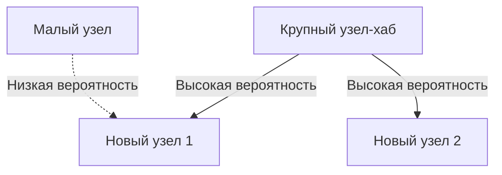

# 1. Введение: Скрытый порядок в мире

В природе и человеческом обществе за явлениями, которые на первый взгляд кажутся беспорядочными, часто скрываются удивительно красивые математические закономерности. Слова, которые мы используем каждый день, размеры городов, в которых мы живем, количество посещений веб-сайтов и даже сила землетрясений — что, если все эти, казалось бы, не связанные друг с другом явления на самом деле подчиняются одному общему математическому закону?

Этот замечательный закон — **Закон Ципфа**. Этот закон представляет собой эмпирическое правило, утверждающее, что частота появления элементов в конкретном наборе данных обратно пропорциональна их рангу. Наиболее часто встречающийся элемент появляется примерно в два раза чаще, чем второй по частоте, и примерно в три раза чаще, чем третий.

В этой статье мы углубимся в **Закон Ципфа** — от его исторической подоплеки и математической формулировки до удивительных примеров из реального мира, а также почему такой закон повсеместно возникает в природных и социальных системах — с использованием формул, кода моделирования и иллюстраций. Наша цель — предоставить контент, который может служить не только увлекательным чтением, но и фундаментальными знаниями в области науки о данных и обработки естественного языка.

# 2. Открытие и историческая подоплека закона Ципфа.

**Закон Ципфа** был широко популяризирован в 1930-х годах американским лингвистом Джорджем Кингсли Зипфом. Однако он не был единственным открывателем этого закона. До Ципфа подобные явления, среди прочих, заметили французский стенографист Жан-Батист Эступ и физик Феликс Ауэрбах.

Зипф тщательно проанализировал частоту встречаемости слов в английских текстах. После кропотливого ручного подсчета крупномасштабных текстовых данных, таких как роман Джеймса Джойса «Улисс», он обнаружил замечательную закономерность: частота наиболее часто используемого слова в английском языке («the») примерно вдвое превышала частоту второго наиболее часто используемого слова («of») и примерно в три раза больше, чем третьего («и»).

Зипф объяснил это явление **принципом наименьшего усилия**, фундаментальным принципом человеческого поведения. Другими словами, люди склонны часто использовать небольшое количество простых слов и редко использовать сложные слова, потому что они стараются передать информацию с как можно меньшими усилиями в общении. Эта философская интерпретация позже была поддержана также с точки зрения теории информации и статистической механики.

# 3. Математическая формулировка: закон рангового размера

Давайте теперь математически формализуем **Закон Ципфа**. Мы располагаем элементы (например, слова) в наборе данных в порядке убывания частоты их появления.

Ранг самого частого элемента — $r = 1$, второй по частоте — $r = 2$ и так далее. Если $f(r)$ обозначает частоту появления элемента с рангом $r$, закон Ципфа выражается следующим образом:

$$
f(r) \propto \frac{1}{r^\alpha}
$$

Здесь $\alpha$ — это константа, которая зависит от набора данных и обычно равна $\alpha \approx 1$. В этом случае частота точно обратно пропорциональна рангу.

Чтобы выразить это в виде уравнения, пусть константа пропорциональности равна $C$:

$$
f(r) = \frac{C}{r^\alpha}
$$

Константа $C$ зависит от общего количества элементов в наборе данных (например, общего количества слов). В вероятностных терминах вероятность $P(r)$ появления элемента ранга $r$ равна:

$$
P(r) = \frac{\frac{1}{r^\alpha}}{\sum_{n=1}^{N} \frac{1}{n^\alpha}}
$$

Здесь $N$ — это количество различных типов элементов (например, размер словаря). В пределе $\alpha > 1$ ряд в знаменателе сходится к дзета-функции Римана $\zeta(\alpha)$. По этой причине **Закон Ципфа** иногда называют дзета-распределением.

Логарифмируя эту зависимость, можно представить ее более наглядно:

$$
\log f(r) = \log C - \alpha \log r
$$

Это означает, что при построении логарифмического графика он становится прямой линией с наклоном $-\alpha$. Самый простой способ проверить, соответствует ли набор данных **закону Ципфа**, — это построить логарифмический график и посмотреть, образует ли он прямую линию. Если это так, то за этим явлением стоит **степенной закон**.

# 4. Удивительные примеры из реальной жизни

**Закон Ципфа** выходит далеко за рамки лингвистики и применим к удивительно разнообразному кругу явлений. Давайте подробно рассмотрим примеры из пяти различных областей.

## 4.1. Лингвистика и обработка естественного языка (НЛП)

Самый классический пример — частота слов в текстовых корпусах. При анализе корпуса английского языка (например, всего текста Википедии) частоты самых популярных слов следующие:

1. **the**: вероятность появления примерно 7%.
2. **of**: вероятность возникновения примерно 3,5%.
3. **and**: вероятность возникновения примерно 2,8%.
4. **to**: вероятность возникновения примерно 2,6%.

Таким образом, всего несколько десятков высокочастотных слов составляют почти половину всего текста, а сотни тысяч остальных слов появляются редко. Этот феномен «длинного хвоста» чрезвычайно важен при построении индексов поисковых систем и разработке словаря больших языковых моделей (LLM). В области обработки естественного языка слова, которые появляются слишком часто (стоп-слова), несут мало информации, поэтому для уменьшения их веса используются такие методы, как TF-IDF.

## 4.2. Распределение городского населения

**Закон Ципфа** соблюдается не только в языке, но и в области географии и градостроительства. Когда население городов страны указано в порядке убывания, население города, занимающего второе место, составляет половину населения города, занимающего первое место, а населения города, занимающего третье место, составляет одну треть.

Для примера посмотрим на данные о населении городов США (цифры приблизительные):
- 1-й Нью-Йорк: примерно 8,4 миллиона.
- 2-й Лос-Анджелес: примерно 4 миллиона (около половины Нью-Йорка)
- 3-й Чикаго: примерно 2,7 миллиона (около трети Нью-Йорка)

Конечно, в некоторых странах чрезмерная концентрация в столице (например, Токио в Японии, Париже во Франции) противоречит закону — явление, известное как эффект «города-примата». Однако общая тенденция прекрасно подчиняется **степенному закону**.

## 4.3. Трафик веб-сайта

Количество посещений веб-сайтов в Интернете и количество подписчиков в социальных сетях также подчиняются **закону Ципфа**. Горстка гигантских сайтов, таких как Google, YouTube и Facebook, монополизирует большую часть трафика, в то время как бесчисленное множество других сайтов получают лишь небольшую часть. Это связано с тем, что структура связей в информационных сетях формируется посредством «предпочтительного прикрепления», о котором речь пойдет позже.

## 4.4. Размер фирмы и распределение доходов (закон Парето)

Корпоративные доходы, количество сотрудников и даже распределение личных доходов подчиняются **степенному закону**. Закон о распределении доходов называется **Закон Парето** (Принцип Парето), названный в честь итальянского экономиста Вильфредо Парето. Оно также известно как «правило 80:20»: «80% общего богатства принадлежит 20% людей». С математической точки зрения **Закон Ципфа** и **Закон Парето** просто рассматривают одно и то же явление под разными углами (ранг и размер).

## 4.5. Магнитуда землетрясения (Закон Гутенберга-Рихтера)

Аналогичный закон существует в области физики и наук о Земле. **Закон Гутенберга-Рихтера** описывает взаимосвязь между магнитудой землетрясений и частотой их возникновения. Когда магнитуда увеличивается на 1, частота землетрясений этой магнитуды уменьшается примерно до одной десятой. Здесь мы также можем видеть фрактальную структуру, в которой огромные события происходят крайне редко, а малые события бесчисленны.

# 5. Почему возникает закон Ципфа? (Генеративные механизмы)

Почему одна и та же математическая структура появляется в совершенно разных областях, таких как язык, города, экономика и физические явления? Исследователи в области наук о сложных системах предложили несколько генеративных механизмов.

## 5.1. Предпочтительное вложение

Самая известная модель в сетевой науке — это модель **Предпочтительного прикрепления**, предложенная Альбертом-Ласло Барабаши и другими. В просторечии это явление известно как феномен «богатые становятся богаче».

Когда новый веб-сайт создает ссылки, он с большей вероятностью будет ссылаться на известные сайты, на которых уже есть много ссылок. При переезде новые жители чаще выбирают крупные города с развитой инфраструктурой. Благодаря такому динамическому процессу, когда новые элементы добавляются пропорционально существующему размеру (количеству связей, численности населения и т. д.), итоговое общее распределение становится степенным законом, соответствующим **Закону Ципфа**.

Ниже представлена ​​концептуальная схема этого процесса:



## 5.2. Принцип наименьшего усилия

Эту гипотезу предложил сам Ципф. В системах коммуникации между говорящим и слушающим возникают противоречивые желания:
- **Желание говорящего**: выразить все с помощью небольшого словарного запаса (придавая одному слову множество значений).
- **Желание слушателя**: К каждому понятию относить отдельные слова, чтобы исключить двусмысленность (стремиться к разнообразию словарного запаса).

Компромисс между этими двумя конфликтующими «усилиями» естественным образом приводит к распределению нескольких многозначных высокочастотных слов и множества однозначных редких слов, а именно, **Закона Ципфа**.

## 5.3. Модель случайного набора текста (обезьяны за пишущими машинками)

Примечательно, что такие математики, как Бенуа Мандельброт, показали, что распределения, напоминающие **Закон Ципфа**, могут возникать в результате совершенно случайных процессов. Например, предположим, что обезьяна случайным образом нажимает клавиши пишущей машинки (26 букв алфавита и пробел), чтобы создать «слова». Если вероятность попадания в пробел равна $p$, более короткие слова генерируются с более высокой вероятностью. При упорядочении по рангу это дает степенное распределение, напоминающее естественный язык. Это предполагает, что **Закон Ципфа** может возникнуть не только в результате сложной интеллектуальной деятельности человека, но также и из присущих статистических свойств самой системы.

# 6. Моделирование и код Python

Давайте напишем код Python для проверки **Закона Ципфа** на основе текстовых данных. Следующий код подсчитывает частоты слов из случайно сгенерированного текста или существующего корпуса и отображает их на логарифмическом графике.

```python
import matplotlib.pyplot as plt
from collections import Counter
import re
import numpy as np

def plot_zipf_law(text):
    # Convert text to lowercase and split into words
    words = re.findall(r'\b\w+\b', text.lower())
    
    # Count word frequencies
    word_counts = Counter(words)
    
    # Sort by frequency in descending order
    sorted_counts = sorted(word_counts.values(), reverse=True)
    ranks = np.arange(1, len(sorted_counts) + 1)
    
    # Plot on a log-log graph
    plt.figure(figsize=(10, 6))
    plt.loglog(ranks, sorted_counts, marker='o', linestyle='none', color='cyan', alpha=0.7)
    
    # Ideal Zipf's Law line for comparison (alpha=1)
    expected_counts = [sorted_counts[0] / r for r in ranks]
    plt.loglog(ranks, expected_counts, color='red', linestyle='--', label="Ideal Zipf's Law (alpha=1)")
    
    plt.title("Zipf's Law Verification")
    plt.xlabel("Rank (log scale)")
    plt.ylabel("Frequency (log scale)")
    plt.legend()
    plt.grid(True, which="both", ls="--", alpha=0.5)
    plt.show()

# Using a very long dummy text as a sample
# In actual data science projects, use NLTK or Gutenberg corpus
dummy_text = "the and of to a in that is was he for it with as his on be at by i this had not are but from or have an they which one you were all her she there would their we him been has when who will no more if out so up said what its about than into them can only other new some could time these two may then do first any my now such like our over man me even most made after also did many before must through back years where much your way well down should because each just those people mr how too little state good very make world still own see men work long get here between both life being under never day same another know while last might great old year off come since against go came right used take three states himself few house use during without again place american around however home small found thought went say part once general high upon school every don't does got united left number course war until always away something fact water though less public put think almost hand enough far took head yet better display modern history area completely specific significant process" * 100

# plot_zipf_law(dummy_text)
```

Запустив этот код, вы можете убедиться, что фактическая частота слов распределена вдоль красной пунктирной линии (идеальный закон Ципфа). В практике науки о данных такой частотный анализ можно использовать для обнаружения систематических ошибок и выбросов в данных.

# 7. Приложения в информатике

**Закон Ципфа** играет важную роль не только как теоретическая диковинка, но и в практических алгоритмах информатики.

## 7.1. Оптимизация алгоритма кэширования

**Закон Ципфа** чрезвычайно важен в стратегиях кэширования веб-серверов и баз данных. Поскольку на долю небольшого количества популярных элементов контента (например, вирусных видеороликов или главных новостей) приходится большая часть обращений, хранение их в быстрых кэшах, таких как память (ОЗУ), может значительно повысить общую производительность системы. Такие алгоритмы, как LFU (наименее часто используемый) и LRU (наименее недавно используемый), разработаны именно для использования этого перекоса данных (степенной закон).

## 7.2. Сжатие данных

В методах энтропийного кодирования, таких как кодирование Хаффмана, короткие битовые строки назначаются часто встречающимся шаблонам данных, а длинные битовые строки назначаются редким шаблонам. Когда частота данных подчиняется чрезвычайно асимметричному распределению, подобному **закону Ципфа**, использование такого кодирования переменной длины позволяет существенно сжать размер данных. Это статистическое свойство лежит в основе технологий сжатия, таких как файлы ZIP и изображения JPEG.

# 8. Заключение: ключ к пониманию сложных систем

В этой статье мы предоставили подробное объяснение **Закона Ципфа** (Закона Ципфа), от его определения и математической основы до разнообразных примеров и порождающих механизмов.

Частота слов, население городов, размеры компаний и веб-трафик. Кажется, что они действуют посредством совершенно разных механизмов, но с макроэкономической точки зрения все они управляются одним и тем же **степенным законом**. Это показывает, что наш мир представляет собой не просто набор случайных явлений, но обладает математическим порядком на более глубоком уровне, таком как самоорганизация и фрактальные структуры.

Для специалистов по данным и инженеров понимание того, следует ли набор данных нормальному распределению (колокольчатой ​​кривой) или степенному закону, такому как **Закон Ципфа** (имеет ли он длинный хвост), имеет решающее значение при проектировании системы и построении модели. Пожалуйста, помните о **Законе Ципфа** как о мощной линзе для расшифровки скрытого порядка мира.

---
*Эта статья была написана с целью изучения науки о данных и науки о сложных системах. Для получения подробных математических выводов и теорий мы рекомендуем обращаться к специализированным текстам по статистической физике и обработке естественного языка.*
