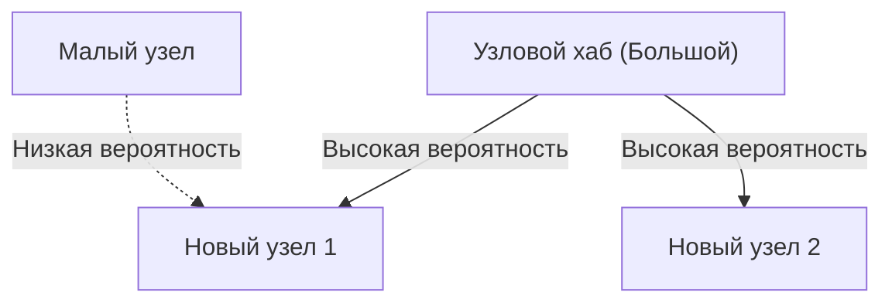

# 1. Введение: Скрытый порядок, таящийся в мире

В природе и человеческом обществе за явлениями, которые на первый взгляд кажутся хаотичными, часто скрывается удивительно красивая математическая закономерность. Слова, которые мы случайно используем каждый день, размер городов, в которых мы живем, количество посещений веб-сайтов и даже масштаб землетрясений — что, если все эти, казалось бы, не связанные между собой явления на самом деле подчиняются одному общему математическому закону?

Этот поразительный закон — **[Закон Ципфа](https://kenji.blog/ru/p/zipfs-law/)**. Этот закон представляет собой эмпирическое правило, утверждающее, что в определенном наборе данных частота элемента обратно пропорциональна его рангу. Наиболее часто встречающийся элемент появляется примерно в два раза чаще, чем второй по частоте элемент, и примерно в три раза чаще, чем третий.

В этой статье мы чрезвычайно глубоко погрузимся в **[Закон Ципфа](https://kenji.blog/ru/p/zipfs-law/)**, от его исторической подоплеки до математической формулировки, поразительных примеров из реального мира и того, почему такой закон повсеместно возникает в природных и социальных системах, используя формулы, коды моделирования и диаграммы. Мы стремимся предоставить контент, который можно использовать не только как легкое чтение, но и как базовые знания для науки о данных и обработки естественного языка.

# 2. Открытие Закона Ципфа и историческая справка

**[Закон Ципфа](https://kenji.blog/ru/p/zipfs-law/)** был широко популяризирован в 1930-х годах американским лингвистом Джорджем Кингсли Ципфом. Однако он был не единственным первооткрывателем этого закона. Французский стенографист Жан-Батист Эсту и физик Феликс Ауэрбах также замечали подобные явления до Ципфа.

Ципф детально проанализировал частоту слов в английских предложениях. В результате ручного подсчета крупномасштабных текстовых данных, таких как роман Джеймса Джойса «Улисс», он обнаружил удивительную закономерность. Дело в том, что наиболее часто используемое слово (в английском языке «the») встречается примерно в два раза чаще, чем второе по частоте слово («of»), и примерно в три раза чаще, чем третье («and»).

Ципф утверждал, что это явление сводится к **Принципу наименьшего усилия** (Principle of Least Effort), базовому принципу человеческого поведения. Другими словами, при общении люди стараются передать информацию с как можно меньшими усилиями, поэтому они часто используют несколько простых слов и редко используют сложные слова. Эта философская интерпретация позже найдет подтверждение с точки зрения теории информации и статистической механики.

# 3. Математическая формулировка: Правило ранг-размер

Здесь давайте строго математически сформулируем **[Закон Ципфа](https://kenji.blog/ru/p/zipfs-law/)**. Мы упорядочиваем элементы в наборе данных (например, слова) в порядке убывания их частоты.

Пусть ранг наиболее частого элемента будет $r = 1$, а второго — $r = 2$. Если частота элемента с рангом $r$ равна $f(r)$, то [Закон Ципфа](https://kenji.blog/ru/p/zipfs-law/) выражается следующим образом:

$$
f(r) \propto \frac{1}{r^\alpha}
$$

Здесь $\alpha$ — это константа, которая зависит от набора данных, и обычно $\alpha \approx 1$. В этом случае частота точно обратно пропорциональна рангу.

Чтобы выразить это в виде уравнения, установив константу пропорциональности как $C$:

$$
f(r) = \frac{C}{r^\alpha}
$$

Константа $C$ зависит от общего количества элементов во всем наборе данных (например, от общего количества слов). В терминах теории вероятностей вероятность $P(r)$ появления элемента ранга $r$ выглядит следующим образом:

$$
P(r) = \frac{\frac{1}{r^\alpha}}{\sum_{n=1}^{N} \frac{1}{n^\alpha}}
$$

Здесь $N$ — разнообразие элементов (например, размер словарного запаса). Ряд в знаменателе сходится к дзета-функции Римана $\zeta(\alpha)$ в пределе $\alpha > 1$. Поэтому **[Закон Ципфа](https://kenji.blog/ru/p/zipfs-law/)** иногда называют дзета-распределением.

Взяв логарифм, эту связь можно визуализировать более четко.

$$
\log f(r) = \log C - \alpha \log r
$$

Это означает, что при построении на двойном логарифмическом графике (Log-Log Plot) это становится прямой линией с наклоном $-\alpha$. Самый простой способ проверить, следует ли набор данных **Закону Ципфа**, — это нарисовать двойной логарифмический график и посмотреть, образует ли он прямую линию. Если это прямая линия, можно сказать, что за этим явлением стоит **Степенной закон** (Power Law).

# 4. Поразительные примеры из реального мира

**[Закон Ципфа](https://kenji.blog/ru/p/zipfs-law/)** выходит за рамки простой лингвистики и применим к удивительно широкому спектру явлений. Здесь мы детально рассмотрим примеры из 5 различных областей.

## 4.1. Лингвистика и обработка естественного языка (NLP)

Самый классический пример — частота слов в текстовых корпусах. При анализе английского корпуса (например, всего текста Википедии) частота первых нескольких слов выглядит следующим образом:

1. **the**: около 7% вероятность появления
2. **of**: около 3.5% вероятность появления
3. **and**: около 2.8% вероятность появления
4. **to**: около 2.6% вероятность появления

Таким образом, в то время как всего пара десятков частотных слов составляют почти половину всего текста, сотни тысяч других слов почти никогда не встречаются. Это явление "Длинного хвоста" (Long Tail) чрезвычайно важно при построении индексов поисковых систем и разработке словарей для Больших Языковых Моделей ([LLM](https://kenji.blog/ru/p/large-language-models-llm-transformer-prompt-engineering/)). В области обработки естественного языка слова, которые появляются слишком часто (стоп-слова), несут мало информации, поэтому используются такие методы, как TF-IDF, для снижения их веса.

## 4.2. Распределение городского населения

Не только в лингвистике, **[Закон Ципфа](https://kenji.blog/ru/p/zipfs-law/)** наблюдается также в географии и урбанистике. При упорядочивании населения городов определенной страны закономерность показывает, что второй по величине город имеет половину населения первого, а третий — треть.

Например, глядя на данные о населении городов США (цифры приблизительные):
- 1-е место Нью-Йорк: около 8,4 млн.
- 2-е место Лос-Анджелес: около 4 млн. (примерно половина от Нью-Йорка)
- 3-е место Чикаго: около 2,7 млн. (примерно треть от Нью-Йорка)

Конечно, в зависимости от страны, крайняя концентрация в столице (как Токио в Японии, Париж во Франции) может привести к "феномену города-примата", отклоняющемуся от закона, но общая тенденция замечательно следует **Степенному закону**.

## 4.3. Трафик веб-сайтов

Количество посещений веб-сайтов в интернете и количество подписчиков в социальных сетях также подчиняются **Закону Ципфа**. Крошечная часть массивных сайтов, таких как Google, YouTube и Facebook, монополизирует большую часть трафика, в то время как бесчисленное множество других сайтов имеют очень мало посещений. Это связано с тем, что структура ссылок в информационных сетях формируется за счет "предпочтительного присоединения", которое будет обсуждаться позже.

## 4.4. Размер корпораций и распределение доходов (Принцип Парето)

Корпоративные продажи, количество сотрудников и распределение индивидуальных доходов также подчиняются **Степенному закону**. Закон о распределении доходов назван **Принципом Парето** в честь итальянского экономиста Вильфредо Парето. Он также известен как правило "80:20", гласящее, что "80% всего богатства принадлежит 20% людей". Математически **[Закон Ципфа](https://kenji.blog/ru/p/zipfs-law/)** и **Принцип Парето** — это просто взгляд на одно и то же явление под разными углами (ранг против масштаба).

## 4.5. Масштаб землетрясений (Закон Гутенберга-Рихтера)

Подобные законы существуют в физике и науках о Земле. **Закон Гутенберга-Рихтера** показывает связь между магнитудой землетрясения и частотой его возникновения. При увеличении магнитуды на 1 частота землетрясений такого масштаба уменьшается примерно до одной десятой. Здесь тоже мы можем наблюдать фрактальную структуру, где гигантские события происходят крайне редко, а крошечные события происходят бесчисленное количество раз.

# 5. Почему возникает [Закон Ципфа](https://kenji.blog/ru/p/zipfs-law/)? (Механизм генерации)

Почему одна и та же математическая структура появляется в совершенно разных областях, таких как язык, города, экономика и физические явления? Исследователи науки о сложных системах предложили несколько механизмов генерации.

## 5.1. Предпочтительное присоединение (Preferential Attachment)

Самой известной моделью в науке о сетях является модель **Предпочтительного присоединения**, предложенная Альбертом-Ласло Барабаши и другими. В просторечии это известно как феномен "богатые становятся богаче" (Rich-get-richer).

Когда новый веб-сайт добавляет ссылку, весьма вероятно, что он сошлется на известный сайт, который уже имеет много ссылок. Когда переезжает новый житель, велика вероятность, что он выберет крупный город с уже налаженной инфраструктурой. Поскольку динамический процесс добавляет новые элементы пропорционально существующему масштабу (количество ссылок, население и т.д.), общее распределение приводит к степенному закону, следуя **Закону Ципфа**.

Ниже представлена концептуальная диаграмма этого процесса.



## 5.2. Принцип наименьшего усилия

Это гипотеза, предложенная самим Ципфом. В системе коммуникации существуют конфликтующие желания между говорящим и слушающим.
- **Желание говорящего**: Хочет выразить все с помощью небольшого словарного запаса (присвоить много значений одному слову).
- **Желание слушающего**: Хочет присвоить разные слова каждому понятию, чтобы устранить семантическую неоднозначность (требуя разнообразного словарного запаса).

Как компромисс между этими двумя конфликтующими "усилиями", объясняется естественное возникновение распределения из нескольких многозначных частотных слов и множества однозначных редких слов, то есть **[Закон Ципфа](https://kenji.blog/ru/p/zipfs-law/)**.

## 5.3. Модель случайного набора текста (Обезьяны бьют по печатным машинкам)

Удивительно, но математики, такие как Бенуа Мандельброт, показали, что распределения, похожие на **[Закон Ципфа](https://kenji.blog/ru/p/zipfs-law/)**, могут возникать даже из совершенно случайных процессов.
Например, предположим, что обезьяны бьют по клавишам печатной машинки (26 букв алфавита и пробел) совершенно случайным образом, создавая "слова". Пусть $p$ будет вероятностью появления пробела; чем короче слово, тем выше вероятность его генерации. Упорядочение их по рангу дает распределение по степенному закону так же, как в естественном языке. Это говорит о возможности того, что **[Закон Ципфа](https://kenji.blog/ru/p/zipfs-law/)** берет начало не только в сложной интеллектуальной деятельности человека, но и в статистических свойствах самой системы.

# 6. Моделирование и код Python

Давайте фактически используем Python, чтобы написать код, проверяющий **[Закон Ципфа](https://kenji.blog/ru/p/zipfs-law/)** на основе текстовых данных. Следующий код подсчитывает частоту слов, используя случайно сгенерированный текст или существующий корпус, и строит их на двойном логарифмическом графике.

```python
import matplotlib.pyplot as plt
from collections import Counter
import re
import numpy as np

def plot_zipf_law(text):
    # Преобразовать текст в нижний регистр и разделить на слова
    words = re.findall(r'\b\w+\b', text.lower())
    
    # Подсчитать частоту появления слов
    word_counts = Counter(words)
    
    # Отсортировать в порядке убывания частоты
    sorted_counts = sorted(word_counts.values(), reverse=True)
    ranks = np.arange(1, len(sorted_counts) + 1)
    
    # Построить на двойном логарифмическом графике
    plt.figure(figsize=(10, 6))
    plt.loglog(ranks, sorted_counts, marker='o', linestyle='none', color='cyan', alpha=0.7)
    
    # Идеальная прямая закона Ципфа для сравнения (alpha=1)
    expected_counts = [sorted_counts[0] / r for r in ranks]
    plt.loglog(ranks, expected_counts, color='red', linestyle='--', label="Ideal Zipf's Law (alpha=1)")
    
    plt.title("Zipf's Law Verification")
    plt.xlabel("Rank (log scale)")
    plt.ylabel("Frequency (log scale)")
    plt.legend()
    plt.grid(True, which="both", ls="--", alpha=0.5)
    plt.show()

# Использование очень длинного фиктивного текста в качестве образца
# В реальных проектах по науке о данных используется NLTK или корпус Gutenberg
dummy_text = "the and of to a in that is was he for it with as his on be at by i this had not are but from or have an they which one you were all her she there would their we him been has when who will no more if out so up said what its about than into them can only other new some could time these two may then do first any my now such like our over man me even most made after also did many before must through back years where much your way well down should because each just those people mr how too little state good very make world still own see men work long get here between both life being under never day same another know while last might great old year off come since against go came right used take three states himself few house use during without again place american around however home small found thought went say part once general high upon school every don't does got united left number course war until always away something fact water though less public put think almost hand enough far took head yet better display modern history area completely specific significant process" * 100

# plot_zipf_law(dummy_text)
```

Запуск этого кода подтверждает, что реальные частоты слов распределяются вдоль красной пунктирной линии (идеальный закон Ципфа). В практике науки о данных с помощью такого частотного анализа можно обнаружить смещения в данных или аномалии.

# 7. Применение в компьютерных науках

**[Закон Ципфа](https://kenji.blog/ru/p/zipfs-law/)** играет важную роль не только из-за теоретического интереса к нему, но и в практических алгоритмах компьютерных наук.

## 7.1. Оптимизация алгоритма кэширования

В стратегиях кэширования для веб-серверов и баз данных **[Закон Ципфа](https://kenji.blog/ru/p/zipfs-law/)** имеет чрезвычайно важное значение. Поскольку небольшой объем популярного контента (например, вирусные видео или главные новости) составляет подавляющее большинство общего числа обращений, их хранение в быстром кэше, таком как оперативная память (RAM), может значительно повысить производительность всей системы. Алгоритмы, такие как LFU (Least Frequently Used) и LRU (Least Recently Used), разработаны именно для того, чтобы использовать это смещение данных (степенной закон).

## 7.2. Сжатие данных

В энтропийном кодировании, таком как кодирование Хаффмана, короткие битовые строки назначаются шаблонам данных, которые встречаются часто, в то время как длинные битовые строки назначаются шаблонам, которые встречаются редко. Если частоты появления данных чрезвычайно искажены, как в **Законе Ципфа**, использование такого кодирования переменной длины позволяет резко сжать размер данных. Основа технологий сжатия, таких как ZIP-файлы и изображения JPEG, также использует эти статистические свойства.

# 8. Заключение: Ключ к пониманию сложных систем

В этой статье мы подробно рассмотрели **[Закон Ципфа](https://kenji.blog/ru/p/zipfs-law/)**, от его определения до математических основ, разнообразных примеров из реального мира и механизмов генерации.

Частота слов, население городов, масштаб корпораций, веб-трафик. Кажется, что они работают по совершенно разным механизмам, но если посмотреть с макроперспективы, они управляются одним и тем же **Степенным законом**. Это показывает, что наш мир — это не просто набор случайных явлений, но имеет математический порядок в более глубоком измерении, такой как самоорганизация и фрактальные структуры.

Для специалистов по данным и инженеров понимание того, следует ли набор данных нормальному распределению (колоколообразной кривой) или степенному закону, такому как **[Закон Ципфа](https://kenji.blog/ru/p/zipfs-law/)** (имеющему длинный хвост), имеет решающее значение при проектировании систем и построении моделей. Пожалуйста, помните о **Законе Ципфа** как о мощной линзе для расшифровки скрытого порядка мира.

---
*Эта статья была написана с целью изучения науки о данных и науки о сложных системах. Для получения подробных математических формулировок и теорий мы рекомендуем обратиться к специализированным книгам по статистической физике и обработке естественного языка.*
