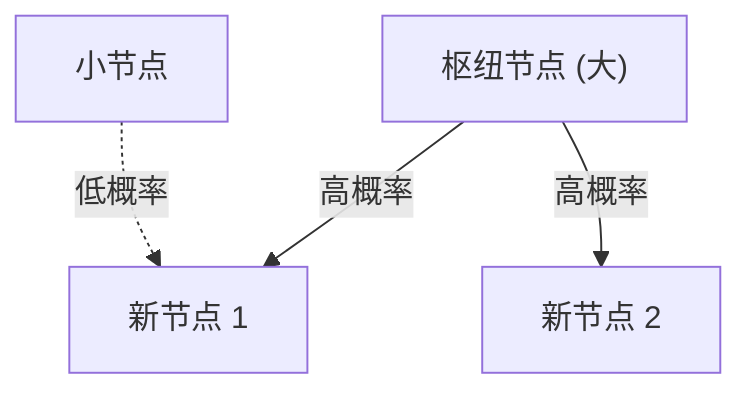

# 1. 引言：隐藏在世界中的秩序

在自然界和人类社会中，那些乍看之下显得杂乱无章的现象背后，往往潜藏着惊人而美丽的数学规律。我们日常不经意间使用的语言、所居住的城市规模、网站的访问量，甚至是地震的强度，这些看似毫不相干的现象，如果实际上都遵循着同一个共同的数学法则，那将是何等奇妙。

这个惊人的法则正是 **齐普夫定律** （Zipf's Law）。该定律是一个经验法则，指出在特定的数据集中，元素的出现频率与其排名成反比。最常出现的元素的频率大约是第二常出现元素的2倍，是第三常出现元素的约3倍。

在本文中，我们将通过数学公式、模拟代码和图解，极度详细且深入地探讨这一 **齐普夫定律** ，内容涵盖其历史背景、数学表述、现实世界中的惊人实例，以及为何这种定律在自然界和社会系统中普遍存在。这不仅是一篇通俗读物，也旨在成为数据科学和自然语言处理领域中可被活用的基础知识。

# 2. 齐普夫定律的发现与历史背景

**齐普夫定律** 是在20世纪30年代由美国语言学家乔治·金斯利·齐普夫（George Kingsley Zipf）广泛推广的。然而，这一定律的发现者并非只有他一人。法国速记员让-巴蒂斯特·埃斯图（Jean-Baptiste Estoup）和物理学家费利克斯·奥尔巴赫（Felix Auerbach）等人在齐普夫之前也注意到了类似的现象。

齐普夫详细分析了英语句子中单词的出现频率。通过对诸如詹姆斯·乔伊斯的小说《尤利西斯》等大规模文本数据进行手工统计，他发现了一个惊人的规律。那就是，最常用的单词（在英语中是“the”）的出现频率，大约是第二常用单词（“of”）的2倍，是第三常用单词（“and”）的约3倍。

齐普夫主张，这一现象可以归结为人类行为的基本原理—— **省力原则** （Principle of Least Effort）。也就是说，人类在交流时总是试图用尽可能少的努力来传递信息，因此会频繁使用少数简单的单词，而极少使用复杂的单词。这种哲学解释，后来也得到了信息论和统计力学视角的印证。

# 3. 数学表述：位序-规模法则

在这里，让我们对 **齐普夫定律** 进行严格的数学表述。将数据集中的元素（例如单词）按其出现频率从高到低排列。

设出现频率最高的元素排名（Rank）为 $r = 1$，排名第二的为 $r = 2$。若排名 $r$ 的元素对应的出现频率（Frequency）为 $f(r)$，则齐普夫定律可表示如下：

$$
f(r) \propto \frac{1}{r^\alpha}
$$

这里，$\alpha$ 是依赖于数据集的常数，通常 $\alpha \approx 1$。在这种情况下，频率与排名严格成反比。

为了用等式表示，设比例常数为 $C$，则有：

$$
f(r) = \frac{C}{r^\alpha}
$$

常数 $C$ 依赖于整个数据集的总元素数（如单词总数等）。用概率论的语言来说，排名 $r$ 的元素出现的概率 $P(r)$ 如下：

$$
P(r) = \frac{\frac{1}{r^\alpha}}{\sum_{n=1}^{N} \frac{1}{n^\alpha}}
$$

这里，$N$ 是元素的种类（如词汇量等）。分母的级数在 $\alpha > 1$ 的极限下收敛于黎曼 zeta 函数 $\zeta(\alpha)$。因此， **齐普夫定律** 有时也被称为 zeta 分布。

通过取对数，这种关系可以更加清晰地可视化：

$$
\log f(r) = \log C - \alpha \log r
$$

这意味着，如果在双对数图（Log-Log Plot）上进行绘制，它将变成一条斜率为 $-\alpha$ 的直线。确认数据集是否遵循 **齐普夫定律** 的最简单方法，就是绘制双对数图并观察其是否成一直线。如果是直线，就可以说该现象的背后存在着 **幂律** （Power Law）。

# 4. 现实世界中的惊人实例

**齐普夫定律** 超越了单纯语言学的范畴，适用于出乎意料地多样的现象。在这里，我们来详细看看5个不同领域的实例。

## 4.1. 语言学与自然语言处理（NLP）

最经典的例子就是文本语料库中单词的出现频率。当我们分析英语语料库（例如维基百科的全文）时，排名前几的单词频率如下：

1. **the**: 约 7% 的出现概率
2. **of**: 约 3.5% 的出现概率
3. **and**: 约 2.8% 的出现概率
4. **to**: 约 2.6% 的出现概率

如此这般，仅仅几十个高频词汇占据了整个文本近一半的比例，而剩下的几十万个单词却几乎从未出现。这种“长尾（Long Tail）”现象，在搜索引擎的索引构建以及大型语言模型（LLM）的词汇设计中极其重要。在自然语言处理领域，由于频繁出现的单词（停用词）信息量太低，通常会使用 TF-IDF 等方法来降低其权重。

## 4.2. 城市人口分布

不仅在语言学，在地理学和城市工程领域也能观察到 **齐普夫定律** 。若将某国的城市人口按从多到少排列，排名第二的城市人口往往是第一的一半，排名第三的则是三分之一。

例如，让我们看看美国的城市人口数据（数字为近似值）。
- 第1名 纽约：约 840万人
- 第2名 洛杉矶：约 400万人（约为纽约的一半）
- 第3名 芝加哥：约 270万人（约为纽约的三分之一）

当然，在某些国家，向首都过度集中的情况十分显著（如日本的东京、法国的巴黎），从而会出现偏离该定律的“首位城市现象”，但总体趋势却完美地遵循了 **幂律** 。

## 4.3. 网站流量

互联网上网站的访问量，以及社交网络上的粉丝数，也都遵循 **齐普夫定律** 。Google、YouTube、Facebook 等极少数的巨大网站垄断了绝大部分流量，而数不胜数的无数网站却只有少得可怜的访问量。这是因为信息网络中的链接结构是通过后文将提到的“优先连接”机制形成的。

## 4.4. 企业规模与收入分布（帕累托法则）

企业的营业额、员工数量乃至个人的收入分布，也都遵循 **幂律** 。关于收入分布的法则因意大利经济学家维尔弗雷多·帕累托而得名，被称为 **帕累托法则** （Pareto Principle）。它也作为“80/20法则”广为人知，即“80% 的财富被 20% 的人所拥有”。在数学上， **齐普夫定律** 和 **帕累托法则** 不过是从不同角度（排名或规模）看待同一个现象罢了。

## 4.5. 地震强度（古登堡-里克特定律）

在物理学和地球科学领域，也存在类似的定律。展示地震震级与其发生频率关系的 **古登堡-里克特定律** （Gutenberg-Richter Law）就是如此。当震级增加 1 时，该规模地震的发生频率会降至约十分之一。在这里，同样可以看出宏大事件极少发生，而微小事件频发的这种分形结构。

# 5. 为什么会产生齐普夫定律？（生成机制）

为什么在语言、城市、经济、物理现象等完全不同的领域中，会出现同样的数学结构呢？复杂系统科学的研究者们提出了几种生成机制。

## 5.1. 优先连接（Preferential Attachment）

网络科学中最著名的模型，就是由阿尔伯特-拉斯洛·巴拉巴西等人提出的 **优先连接** （Preferential Attachment）模型。通俗地说，这也叫“富者愈富（Rich-get-richer）”现象。

当新网站要添加链接时，很可能倾向于链接到已经拥有大量链接的著名网站。当新居民搬家时，也很可能会选择基础设施已经很完善的大城市。通过这样一种新元素按现有规模（链接数、人口等）成比例增加的动态过程，其最终结果必然导致整体分布遵循 **齐普夫定律** 这样的幂律。

下面是该过程的概念图。



## 5.2. 省力原则（Principle of Least Effort）

这是齐普夫本人提出的假说。在交流系统中，说话者与听话者之间存在着相互冲突的欲望。
- **说话者的欲望**: 希望用较少的词汇表达一切（赋予单个单词多种含义）。
- **听话者的欲望**: 为了消除语义上的歧义，希望为每一个概念分配不同的单词（追求多样化的词汇）。

这两种相互冲突的“努力”相互妥协，自然就形成了少数多义的高频词和大量单一含义的罕见词的分布，也就是 **齐普夫定律** 。

## 5.3. 随机打字模型（猴子敲击打字机）

令人惊讶的是，即使是完全随机的过程也能产生类似于 **齐普夫定律** 的分布，数学家本华·曼德博等人已经证明了这一点。
例如，假设一只猴子完全随机地敲击打字机的按键（26个英文字母和空格键）来组成“单词”。设打出空格的概率为 $p$，则越短的单词生成的概率就越高。将这些单词按排名排列，就能得到一种仿佛像自然语言一样的幂律分布。这暗示着， **齐普夫定律** 可能不仅仅源于人类高级的智力活动，还可能来源于系统本身的统计特性。

# 6. 模拟与 Python 代码

让我们实际用 Python 编写代码，来通过文本数据验证 **齐普夫定律** 。下面的代码会使用随机生成的文本或已有的语料库来统计单词频率，并将其绘制在双对数图上。

```python
import matplotlib.pyplot as plt
from collections import Counter
import re
import numpy as np

def plot_zipf_law(text):
    # 将文本转换为小写，并按单词分割
    words = re.findall(r'\b\w+\b', text.lower())
    
    # 统计单词出现频率
    word_counts = Counter(words)
    
    # 按频率从高到低排序
    sorted_counts = sorted(word_counts.values(), reverse=True)
    ranks = np.arange(1, len(sorted_counts) + 1)
    
    # 绘制双对数图
    plt.figure(figsize=(10, 6))
    plt.loglog(ranks, sorted_counts, marker='o', linestyle='none', color='cyan', alpha=0.7)
    
    # 用于比较的理想齐普夫定律直线 (alpha=1)
    expected_counts = [sorted_counts[0] / r for r in ranks]
    plt.loglog(ranks, expected_counts, color='red', linestyle='--', label="Ideal Zipf's Law (alpha=1)")
    
    plt.title("Zipf's Law Verification")
    plt.xlabel("Rank (log scale)")
    plt.ylabel("Frequency (log scale)")
    plt.legend()
    plt.grid(True, which="both", ls="--", alpha=0.5)
    plt.show()

# 使用非常长的伪文本作为示例
# 在实际的数据科学项目中，会使用 NLTK 或 Gutenberg 语料库
dummy_text = "the and of to a in that is was he for it with as his on be at by i this had not are but from or have an they which one you were all her she there would their we him been has when who will no more if out so up said what its about than into them can only other new some could time these two may then do first any my now such like our over man me even most made after also did many before must through back years where much your way well down should because each just those people mr how too little state good very make world still own see men work long get here between both life being under never day same another know while last might great old year off come since against go came right used take three states himself few house use during without again place american around however home small found thought went say part once general high upon school every don't does got united left number course war until always away something fact water though less public put think almost hand enough far took head yet better display modern history area completely specific significant process" * 100

# plot_zipf_law(dummy_text)
```

运行这段代码，可以确认实际的单词频率分布正好沿着红色的虚线（理想的齐普夫定律）排列。在数据科学实践中，通过这样的频率分析，可以检测到数据的偏度或异常值。

# 7. 在计算机科学中的应用

**齐普夫定律** 不仅具有理论上的趣味性，在实用的计算机科学算法中也发挥着重要作用。

## 7.1. 缓存算法优化

在Web服务器或数据库的缓存策略中， **齐普夫定律** 极其重要。因为少量的热门内容（例如爆款视频或头条新闻）占据了整体访问量的绝大部分，所以将这些内容保存在内存（RAM）等高速缓存中，可以极大地提升整个系统的性能。LFU（最不经常使用）和 LRU（最近最少使用）等算法，正是利用了这种数据的偏度（幂律）来设计的。

## 7.2. 数据压缩

在霍夫曼编码（Huffman Coding）等熵编码中，对于频繁出现的数据模式分配较短的位串，而对极少出现的模式分配较长的位串。如果数据的出现频率像 **齐普夫定律** 那样极度倾斜，使用这种可变长编码就可以极大地压缩数据大小。ZIP文件和JPEG图像等压缩技术底层也利用了这种统计特性。

# 8. 结论：理解复杂系统的钥匙

在本文中，我们详细讲解了 **齐普夫定律** （Zipf's Law），从其定义到数学背景，再到多样的实例以及生成机制。

单词的频率、城市的人口、企业的规模、Web流量。这些现象看似是在完全不同的机制下运行的，但从宏观视角来看，它们受相同的 **幂律** 所支配。这表明我们的世界并不仅仅是随机现象的大杂烩，而是在更深层次上有着自组织（Self-organization）和分形结构等数学秩序。

对于数据科学家或工程师来说，了解数据集是服从正态分布（钟形曲线）还是服从像 **齐普夫定律** 这样的幂律（具有长尾），这在系统设计与模型构建上有着致命的区别。请务必将 **齐普夫定律** 铭记于心，它将是你解读世界隐藏秩序的一面强力透镜。

---
*本文旨在探索数据科学和复杂系统科学而撰写。关于详细的数学推导及理论，建议参考统计物理学和自然语言处理的相关专业书籍。*
