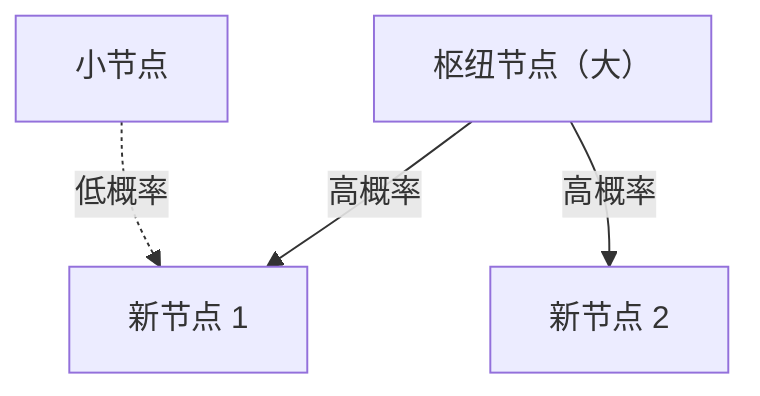

# 1. 简介：世界上隐藏的秩序

在自然界和人类社会中，乍一看无序的现象背后往往隐藏着极其美丽的数学规律。我们每天随意使用的词语、我们居住的城市的大小、网站的访问量，甚至地震的强度——如果所有这些看似无关的现象实际上都遵循一个共同的数学定律呢？

这个非凡的定律就是**齐普夫定律**。该定律是一条经验规则，指出特定数据集中元素出现的频率与其排名成反比。最常出现的元素出现的频率大约是第二出现频率的元素的两倍，大约是第三出现频率的元素的三倍。

在本文中，我们将使用公式、模拟代码和插图，深入探讨**齐普夫定律**——从其历史背景和数学公式到令人惊叹的现实世界例子，以及为什么这样的定律普遍出现在自然和社会系统中。我们的目标是提供的内容不仅可以作为引人入胜的阅读，而且可以作为数据科学和自然语言处理的基础知识。

# 2.齐普夫定律的发现和历史背景

**齐普夫定律** 在 20 世纪 30 年代由美国语言学家乔治·金斯利·齐夫 (George Kingsley Zipf) 广泛推广。然而，他并不是这条定律的唯一发现者。法国速记员让-巴蒂斯特·埃斯托（Jean-Baptiste Estoup）和物理学家费利克斯·奥尔巴赫（Felix Auerbach）等​​人在齐普夫之前就注意到了类似的现象。

齐普夫仔细分析了英语文本中单词出现的频率。在对詹姆斯·乔伊斯的小说《尤利西斯》等大规模文本数据进行辛苦手工计数后，他发现了一个显着的规律：英语中最常用单词（“the”）的频率大约是第二个最常用单词（“of”）的两倍，大约是第三个最常用单词（“and”）的三倍。

齐普夫将这种现象归因于“最省力原则”，这是人类行为的基本原则。换句话说，人类倾向于经常使用少量的简单单词，而很少使用复杂的单词，因为他们在交流中试图以尽可能少的努力来传达信息。这种哲学解释后来也得到了信息论和统计力学的支持。

# 3. 数学公式：等级大小定律

现在让我们用数学形式化**齐普夫定律**。我们按照出现频率的降序排列数据集中的元素（例如单词）。

最频繁元素的排名是 $r = 1$，第二频繁的元素是 $r = 2$，依此类推。如果 $f(r)$ 表示秩为 $r$ 的元素的出现频率，齐普夫定律表示如下：

$$
f(r) \propto \frac{1}{r^\alpha}
$$

这里，$\alpha$ 是一个常量，取决于数据集，通常是 $\alpha \approx 1$。在这种情况下，频率与排名正好成反比。

为了将其表达为方程，令比例常数为 $C$：

$$
f(r) = \frac{C}{r^\alpha}
$$

常数 $C$ 取决于数据集中的元素总数（例如单词总数）。用概率术语来说，秩为 $r$ 的元素出现的概率为 $P(r)$：

$$
P(r) = \frac{\frac{1}{r^\alpha}}{\sum_{n=1}^{N} \frac{1}{n^\alpha}}
$$

这里，$N$ 是不同元素类型的数量（例如，词汇量）。在 $\alpha > 1$ 的极限下，分母中的级数收敛于黎曼 zeta 函数 $\zeta(\alpha)$。因此，**齐普夫定律**有时称为 zeta 分布。

通过取对数，可以更清楚地显示这种关系：

$$
\log f(r) = \log C - \alpha \log r
$$

这意味着当绘制在双对数图上时，它变成一条斜率为 $-\alpha$ 的直线。检查数据集是否遵循 **齐普夫定律** 的最简单方法是绘制双对数图并查看它是否形成一条直线。如果确实如此，那么该现象背后就存在**幂律**。

# 4. 令人惊讶的现实例子

**齐普夫定律**远远超出了语言学领域，适用于范围极其广泛的现象。让我们详细研究五个不同领域的例子。

## 4.1.语言学和自然语言处理（NLP）

最经典的例子就是文本语料库中的词频。在分析英语语料库（例如维基百科的整个文本）时，排名靠前的单词的频率如下：

1. **the**：大约7%的发生概率
2. **of**：发生概率约为 3.5%
3. **and**：发生概率约为 2.8%
4. **to**：发生概率约为 2.6%

这样一来，仅仅几十个高频词就占了整个文本的近一半，而剩下的几十万词却很少出现。这种“长尾”现象对于构建搜索引擎索引和设计大型语言模型（LLM）的词汇表极其重要。在自然语言处理领域，出现频率过高的单词（停用词）携带的信息很少，因此使用TF-IDF等技术来降低其权重。

## 4.2.城市人口分布

**齐普夫定律**不仅在语言中得到遵守，而且在地理和城市工程领域也得到遵守。当一个国家的城市人口按降序排列时，排名第二的城市的人口是排名第一的城市的一半，排名第三的城市的人口是三分之一。

例如，让我们看一下美国城市人口数据（数字为近似值）：
- 第一纽约：约840万
- 第二洛杉矶：约400万（约纽约的一半）
- 第三芝加哥：约270万（约纽约的三分之一）

当然，在一些国家，首都的极度集中（例如日本的东京、法国的巴黎）偏离了规律，这种现象被称为“首要城市”效应。然而，总体趋势完美地遵循**幂律**。

## 4.3.网站流量

互联网上网站的访问量和社交媒体上的关注者数量也遵循**齐普夫定律**。谷歌、YouTube 和 Facebook 等少数几个巨头网站垄断了大部分流量，而无数其他网站只获得极少的流量。这是因为信息网络中的链接结构是通过“优先连接”形成的，这将在后面讨论。

## 4.4.公司规模和收入分配（帕累托定律）

企业收入、员工数量，甚至个人收入分配都遵循**幂律**。有关收入分配的规律称为“帕累托法则”（帕累托原理），以意大利经济学家维尔弗雷多·帕累托的名字命名。它也被称为“80:20规则”——“80%的财富由20%的人拥有”。从数学上讲，**齐普夫定律**和**帕累托定律**只是从不同的角度（等级与大小）观察同一现象。

## 4.5.地震震级（古腾堡-里希特定律）

物理学和地球科学领域也存在类似的规律。 **古腾堡-里希特定律**描述了地震震级和发生频率之间的关系。当震级增加1时，该震级的地震发生频率就会降低到十分之一左右。在这里，我们也可以看到类似分形的结构，其中巨大的事件极其罕见，而小事件却无数。

# 5.为什么会出现齐普夫定律？ （生成机制）

为什么相同的数学结构会出现在语言、城市、经济和物理现象等完全不同的领域？复杂系统科学研究人员提出了几种生成机制。

## 5.1.优先连接

网络科学中最著名的模型是由 Albert-László Barabási 等人提出的 **优先连接** 模型。它通俗地称为“富者愈富”现象。

当一个新网站创建链接时，它更有可能链接到已经有很多链接的知名网站。新居民搬迁时，更有可能选择基础设施完善的大城市。通过这样一个动态过程，新元素按现有规模（链接数量、人口等）的比例添加，最终的总体分布成为遵循**齐普夫定律**的幂律。

下面是这个过程的概念图：



## 5.2.最省力原则

这是齐普夫本人提出的假设。在通信系统中，说话者和听者之间存在相互冲突的愿望：
- **说话者的愿望**：用少量的词汇表达一切（为一个词赋予多种含义）。
- **听众的愿望**：为每个概念分配单独的单词以消除歧义（寻求多样化的词汇）。

这两种相互冲突的“努力”之间的妥协自然会产生一些多义高频词和许多单义稀有词的分布，即**齐普夫定律**。

## 5.3.随机打字模型（打字机前的猴子）

值得注意的是，伯努瓦·曼德尔布罗特 (Benoît Mandelbrot) 等数学家已经证明，类似 **齐夫定律** 的分布可以由完全随机的过程产生。例如，假设一只猴子随机按下打字机上的按键（26 个字母和一个空格键）来创建“单词”。如果击中空格的概率为 $p$，则生成较短单词的概率较高。当按等级排列时，这会产生类似于自然语言的幂律分布。这表明**齐普夫定律**可能不仅源于复杂的人类智力活动，而且还源于系统本身固有的统计特性。

# 6. 模拟和Python代码

让我们实际编写 Python 代码来从文本数据验证 **齐普夫定律**。以下代码计算随机生成的文本或现有语料库中的词频，并将它们绘制在双对数图上。

```python
import matplotlib.pyplot as plt
from collections import Counter
import re
import numpy as np

def plot_zipf_law(text):
    # Convert text to lowercase and split into words
    words = re.findall(r'\b\w+\b', text.lower())
    
    # Count word frequencies
    word_counts = Counter(words)
    
    # Sort by frequency in descending order
    sorted_counts = sorted(word_counts.values(), reverse=True)
    ranks = np.arange(1, len(sorted_counts) + 1)
    
    # Plot on a log-log graph
    plt.figure(figsize=(10, 6))
    plt.loglog(ranks, sorted_counts, marker='o', linestyle='none', color='cyan', alpha=0.7)
    
    # Ideal Zipf's Law line for comparison (alpha=1)
    expected_counts = [sorted_counts[0] / r for r in ranks]
    plt.loglog(ranks, expected_counts, color='red', linestyle='--', label="Ideal Zipf's Law (alpha=1)")
    
    plt.title("Zipf's Law Verification")
    plt.xlabel("Rank (log scale)")
    plt.ylabel("Frequency (log scale)")
    plt.legend()
    plt.grid(True, which="both", ls="--", alpha=0.5)
    plt.show()

# Using a very long dummy text as a sample
# In actual data science projects, use NLTK or Gutenberg corpus
dummy_text = "the and of to a in that is was he for it with as his on be at by i this had not are but from or have an they which one you were all her she there would their we him been has when who will no more if out so up said what its about than into them can only other new some could time these two may then do first any my now such like our over man me even most made after also did many before must through back years where much your way well down should because each just those people mr how too little state good very make world still own see men work long get here between both life being under never day same another know while last might great old year off come since against go came right used take three states himself few house use during without again place american around however home small found thought went say part once general high upon school every don't does got united left number course war until always away something fact water though less public put think almost hand enough far took head yet better display modern history area completely specific significant process" * 100

# plot_zipf_law(dummy_text)
```

当您运行此代码时，您可以确认实际词频沿着红色虚线分布（理想的齐普夫定律）。在数据科学实践中，这种频率分析可用于检测数据中的偏差和异常值。

# 7. 计算机科学中的应用

**齐普夫定律**不仅在理论上发挥着重要作用，而且在实用的计算机科学算法中也发挥着重要作用。

## 7.1.缓存算法优化

**齐普夫定律**对于 Web 服务器和数据库的缓存策略极其重要。由于少数流行内容项（例如病毒视频或热门新闻）占据了大部分访问量，因此将它们存储在内存 (RAM) 等快速缓存中可以显着提高整体系统性能。 LFU（最不常用）和 LRU（最近最少使用）等算法正是为了利用这种数据偏差（幂律）而设计的。

## 7.2.数据压缩

在诸如霍夫曼编码之类的熵编码技术中，短位串被分配给频繁出现的数据模式，而长位串被分配给罕见的模式。当数据频率遵循**齐普夫定律**这样的极度倾斜分布时，使用这种可变长度编码可以显着压缩数据大小。这种统计特性是 ZIP 文件和 JPEG 图像等压缩技术的基础。

# 8. 结论：理解复杂系统的关键

在本文中，我们详细解释了**齐普夫定律**（Zipf's Law），从其定义和数学背景到各种示例和生成机制。

词频、城市人口、公司规模和网络流量。这些似乎通过完全不同的机制运作，但从宏观角度来看，它们都受相同的**幂律**支配。这表明我们的世界不仅仅是随机现象的集合，而且具有更深层次的数学秩序，例如自组织和分形结构。

对于数据科学家和工程师来说，了解数据集是否遵循正态分布（钟形曲线）或幂律（如 **齐普夫定律**）（是否具有长尾）对于系统设计和模型构建至关重要。请牢记**齐普夫定律**，它是破译世界隐藏秩序的强大镜头。

---
*本文是为了探索数据科学和复杂系统科学而写的。对于详细的数学推导和理论，我们建议参考统计物理学和自然语言处理方面的专业书籍。*
