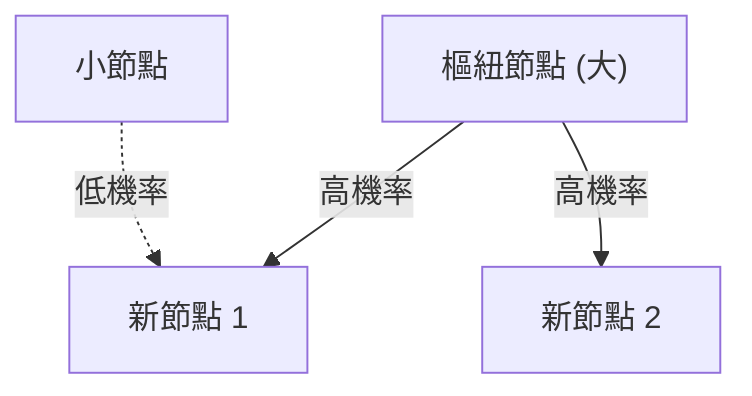

# 1. 導論：潛藏在世界中的隱藏秩序

在自然界與人類社會中，那些乍看之下顯得雜亂無章的現象背後，往往潛藏著驚人且美麗的數學規律。我們日常不經意間使用的語言、居住的城市規模、網站的瀏覽量，甚至是地震的規模，這些看似毫不相干的現象，如果實際上都遵循著同一個共通的數學法則，那將會是多麼奇妙。

這個驚人的法則正是 **齊普夫定律** （[Zipf's Law](https://kenji.blog/zh-tw/p/zipfs-law/)）。該定律是一個經驗法則，指出在特定的資料集中，元素的出現頻率與其排名成反比。最常出現元素的頻率大約是第二常出現元素的2倍，更是第三常出現元素的約3倍。

在本文中，我們將透過數學公式、模擬程式碼與圖解，極度詳細且深入地探討這一 **齊普夫定律** ，內容涵蓋其歷史背景、數學公式化、現實世界中的驚人實例，以及為何這種定律在自然界與社會系統中會普遍存在。這不僅是一篇通俗讀物，也旨在成為資料科學與自然語言處理領域中可被活用的基礎知識。

# 2. 齊普夫定律的發現與歷史背景

**齊普夫定律** 是在1930年代由美國語言學家喬治·金斯利·齊普夫（George Kingsley Zipf）廣泛推廣的。然而，這一定律的發現者並非只有他一人。法國速記員讓-巴蒂斯特·埃斯圖（Jean-Baptiste Estoup）和物理學家費利克斯·奧爾巴赫（Felix Auerbach）等人在齊普夫之前也注意到了類似的現象。

齊普夫詳細分析了英語句子中單詞的出現頻率。透過對諸如詹姆斯·喬伊斯的小說《尤利西斯》等大規模文本資料進行人工統計，他發現了一個驚人的規律。那就是，最常用的單詞（在英語中是「the」）的出現頻率，大約是第二常用單詞（「of」）的2倍，是第三常用單詞（「and」）的約3倍。

齊普夫主張，這一現象可以歸結為人類行為的基本原理—— **省力原則** （Principle of Least Effort）。也就是說，人類在溝通時總是試圖用盡可能少的努力來傳遞資訊，因此會頻繁使用少數簡單的單詞，而極少使用複雜的單詞。這種哲學解釋，後來也得到了資訊理論和統計力學視角的印證。

# 3. 數學公式化：等級-規模法則

在這裡，讓我們對 **齊普夫定律** 進行嚴格的數學公式化。將資料集中的元素（例如單詞）按其出現頻率從高到低排列。

設出現頻率最高的元素排名（Rank）為 $r = 1$，排名第二的為 $r = 2$。若排名 $r$ 的元素對應的出現頻率（Frequency）為 $f(r)$，則齊普夫定律可表示如下：

$$
f(r) \propto \frac{1}{r^\alpha}
$$

這裡，$\alpha$ 是依賴於資料集的常數，通常 $\alpha \approx 1$。在這種情況下，頻率與排名嚴格成反比。

為了用等式表示，設比例常數為 $C$，則有：

$$
f(r) = \frac{C}{r^\alpha}
$$

常數 $C$ 依賴於整個資料集的總元素數（如單詞總數等）。用機率論的語言來說，排名 $r$ 的元素出現的機率 $P(r)$ 如下：

$$
P(r) = \frac{\frac{1}{r^\alpha}}{\sum_{n=1}^{N} \frac{1}{n^\alpha}}
$$

這裡，$N$ 是元素的種類（如詞彙量等）。分母的級數在 $\alpha > 1$ 的極限下收斂於黎曼 zeta 函數 $\zeta(\alpha)$。因此， **齊普夫定律** 有時也被稱為 zeta 分佈。

透過取對數，這種關係可以更加清晰地視覺化：

$$
\log f(r) = \log C - \alpha \log r
$$

這意味著，如果在雙對數圖（Log-Log Plot）上進行繪製，它將變成一條斜率為 $-\alpha$ 的直線。確認資料集是否遵循 **齊普夫定律** 的最簡單方法，就是繪製雙對數圖並觀察其是否呈一直線。如果是直線，就可以說該現象的背後存在著 **冪律** （Power Law）。

# 4. 現實世界中的驚人實例

**齊普夫定律** 超越了單純語言學的範疇，適用於出乎意料地多樣的現象。在這裡，我們來詳細看看5個不同領域的實例。

## 4.1. 語言學與自然語言處理（NLP）

最經典的例子就是文本語料庫中單詞的出現頻率。當我們分析英語語料庫（例如維基百科的全文）時，排名前幾名的單詞頻率如下：

1. **the**: 約 7% 的出現機率
2. **of**: 約 3.5% 的出現機率
3. **and**: 約 2.8% 的出現機率
4. **to**: 約 2.6% 的出現機率

如此這般，僅僅幾十個高頻詞彙佔據了整個文本近一半的比例，而剩下的幾十萬個單詞卻幾乎從未出現。這種「長尾（Long Tail）」現象，在搜尋引擎的索引建置以及大型語言模型（[LLM](https://kenji.blog/zh-tw/p/large-language-models-llm-transformer-prompt-engineering/)）的詞彙設計中極其重要。在自然語言處理領域，由於頻繁出現的單詞（停用詞）資訊量太低，通常會使用 TF-IDF 等方法來降低其權重。

## 4.2. 城市人口分佈

不僅在語言學，在地理學和都市工程領域也能觀察到 **齊普夫定律** 。若將某國的城市人口按從多到少排列，排名第二的城市人口往往是第一的一半，排名第三的則是三分之一。

例如，讓我們看看美國的城市人口數據（數字為近似值）。
- 第1名 紐約：約 840萬人
- 第2名 洛杉磯：約 400萬人（約為紐約的一半）
- 第3名 芝加哥：約 270萬人（約為紐約的三分之一）

當然，在某些國家，向首都過度集中的情況十分顯著（如日本的東京、法國的巴黎），從而會出現偏離該定律的「首要型都市現象」，但總體趨勢卻完美地遵循了 **冪律** 。

## 4.3. 網站流量

網際網路上網站的瀏覽量，以及社群網路上的粉絲數，也都遵循 **齊普夫定律** 。Google、YouTube、Facebook 等極少數的巨大網站壟斷了絕大部分流量，而數不勝數的無數網站卻只有少得可憐的瀏覽量。這是因為資訊網路中的連結結構是透過後文將提到的「優先連結」機制形成的。

## 4.4. 企業規模與所得分佈（帕雷托法則）

企業的營業額、員工數量乃至個人的所得分佈，也都遵循 **冪律** 。關於所得分佈的法則因義大利經濟學家維爾弗雷多·帕雷托而得名，被稱為 **帕雷托法則** （Pareto Principle）。它也作為「80/20法則」廣為人知，即「80% 的財富被 20% 的人所擁有」。在數學上， **齊普夫定律** 和 **帕雷托法則** 不過是從不同角度（排名或規模）看待同一個現象罷了。

## 4.5. 地震規模（古登堡-芮希特定律）

在物理學和地球科學領域，也存在類似的定律。展示地震規模與其發生頻率關係的 **古登堡-芮希特定律** （Gutenberg-Richter Law）就是如此。當規模增加 1 時，該規模地震的發生頻率會降至約十分之一。在這裡，同樣可以看出宏大事件極少發生，而微小事件頻發的這種碎形結構。

# 5. 為什麼會產生齊普夫定律？（生成機制）

為什麼在語言、城市、經濟、物理現象等完全不同的領域中，會出現同樣的數學結構呢？複雜系統科學的研究者們提出了幾種生成機制。

## 5.1. 優先連結（Preferential Attachment）

網路科學中最著名的模型，就是由阿爾伯特-拉斯洛·巴拉巴西等人提出的 **優先連結** （Preferential Attachment）模型。通俗地說，這也叫「富者愈富（Rich-get-richer）」現象。

當新網站要添加連結時，很可能傾向於連結到已經擁有大量連結的著名網站。當新居民搬家時，也很可能會選擇基礎設施已經很完善的大城市。透過這樣一種新元素按現有規模（連結數、人口等）成比例增加的動態過程，其最終結果必然導致整體分佈遵循 **齊普夫定律** 這樣的冪律。

下面是該過程的概念圖。



## 5.2. 省力原則（Principle of Least Effort）

這是齊普夫本人提出的假說。在溝通系統中，說話者與聽話者之間存在著相互衝突的慾望。
- **說話者的慾望**: 希望用較少的詞彙表達一切（賦予單一單詞多種含義）。
- **聽話者的慾望**: 為了消除語義上的歧義，希望為每一個概念分配不同的單詞（追求多樣化的詞彙）。

這兩種相互衝突的「努力」相互妥協，自然就形成了少數多義的高頻詞和大量單一含義的罕見詞的分佈，也就是 **齊普夫定律** 。

## 5.3. 隨機打字模型（猴子敲擊打字機）

令人驚訝的是，即使是完全隨機的過程也能產生類似於 **齊普夫定律** 的分佈，數學家本華·曼德博等人已經證明了這一點。
例如，假設一隻猴子完全隨機地敲擊打字機的按鍵（26個英文字母和空白鍵）來組成「單詞」。設打出空白的機率為 $p$，則越短的單詞生成的機率就越高。將這些單詞按排名排列，就能得到一種彷彿像自然語言一樣的冪律分佈。這暗示著， **齊普夫定律** 可能不僅僅源於人類高級的智力活動，還可能來源於系統本身的統計特性。

# 6. 模擬與 Python 程式碼

讓我們實際用 Python 撰寫程式碼，來透過文本資料驗證 **齊普夫定律** 。下面的程式碼會使用隨機生成的文本或已有的語料庫來統計單詞頻率，並將其繪製在雙對數圖上。

```python
import matplotlib.pyplot as plt
from collections import Counter
import re
import numpy as np

def plot_zipf_law(text):
    # 將文本轉換為小寫，並按單詞分割
    words = re.findall(r'\b\w+\b', text.lower())
    
    # 統計單詞出現頻率
    word_counts = Counter(words)
    
    # 按頻率從高到低排序
    sorted_counts = sorted(word_counts.values(), reverse=True)
    ranks = np.arange(1, len(sorted_counts) + 1)
    
    # 繪製雙對數圖
    plt.figure(figsize=(10, 6))
    plt.loglog(ranks, sorted_counts, marker='o', linestyle='none', color='cyan', alpha=0.7)
    
    # 用於比較的理想齊普夫定律直線 (alpha=1)
    expected_counts = [sorted_counts[0] / r for r in ranks]
    plt.loglog(ranks, expected_counts, color='red', linestyle='--', label="Ideal Zipf's Law (alpha=1)")
    
    plt.title("Zipf's Law Verification")
    plt.xlabel("Rank (log scale)")
    plt.ylabel("Frequency (log scale)")
    plt.legend()
    plt.grid(True, which="both", ls="--", alpha=0.5)
    plt.show()

# 使用非常長的假文本作為範例
# 在實際的資料科學專案中，會使用 NLTK 或 Gutenberg 語料庫
dummy_text = "the and of to a in that is was he for it with as his on be at by i this had not are but from or have an they which one you were all her she there would their we him been has when who will no more if out so up said what its about than into them can only other new some could time these two may then do first any my now such like our over man me even most made after also did many before must through back years where much your way well down should because each just those people mr how too little state good very make world still own see men work long get here between both life being under never day same another know while last might great old year off come since against go came right used take three states himself few house use during without again place american around however home small found thought went say part once general high upon school every don't does got united left number course war until always away something fact water though less public put think almost hand enough far took head yet better display modern history area completely specific significant process" * 100

# plot_zipf_law(dummy_text)
```

執行這段程式碼，可以確認實際的單詞頻率分佈正好沿著紅色的虛線（理想的齊普夫定律）排列。在資料科學實踐中，透過這樣的頻率分析，可以檢測到資料的偏態或異常值。

# 7. 在計算機科學中的應用

**齊普夫定律** 不僅具有理論上的趣味性，在實用的計算機科學演算法中也發揮著重要作用。

## 7.1. 快取演算法最佳化

在Web伺服器或資料庫的快取策略中， **齊普夫定律** 極其重要。因為少量的熱門內容（例如爆紅影片或頭條新聞）佔據了整體瀏覽量的絕大部分，所以將這些內容保存在記憶體（RAM）等高速快取中，可以極大地提升整個系統的效能。LFU（最不經常使用）和 LRU（最近最少使用）等演算法，正是利用了這種資料的偏態（冪律）來設計的。

## 7.2. 資料壓縮

在霍夫曼編碼（Huffman Coding）等熵編碼中，對於頻繁出現的資料模式分配較短的位元串，而對極少出現的模式分配較長的位元串。如果資料的出現頻率像 **齊普夫定律** 那樣極度傾斜，使用這種可變長編碼就可以極大地壓縮資料大小。ZIP檔案和JPEG圖像等壓縮技術底層也利用了這種統計特性。

# 8. 結論：理解複雜系統的鑰匙

在本文中，我們詳細解說了 **齊普夫定律** （[Zipf's Law](https://kenji.blog/zh-tw/p/zipfs-law/)），從其定義到數學背景，再到多樣的實例以及生成機制。

單詞的頻率、城市的人口、企業的規模、網頁流量。這些現象看似是在完全不同的機制下運作的，但從巨觀視角來看，它們受相同的 **冪律** 所支配。這表明我們的世界並不僅僅是隨機現象的大雜燴，而是在更深層次上有著自組織（Self-organization）和碎形結構等數學秩序。

對於資料科學家或工程師來說，了解資料集是服從常態分佈（鐘形曲線）還是服從像 **齊普夫定律** 這樣的冪律（具有長尾），這在系統設計與模型建置上有著致命的差異。請務必將 **齊普夫定律** 銘記於心，它將是你解讀世界隱藏秩序的一面強力透鏡。

---
*本文旨在探索資料科學和複雜系統科學而撰寫。關於詳細的數學推導及理論，建議參考統計物理學和自然語言處理的相關專業書籍。*
