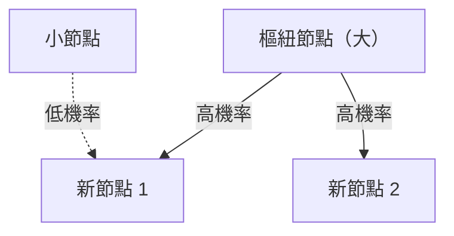

# 1. 簡介：世界上隱藏的秩序

在自然界和人類社會中，乍看之下無序的現象背後往往隱藏著極其美麗的數學規律。我們每天隨意使用的詞彙、我們居住的城市的大小、網站的訪問量，甚至地震的強度——如果所有這些看似無關的現象實際上都遵循一個共同的數學定律呢？

這個非凡的定律就是**齊普夫定律**。該定律是經驗規則，指出特定資料集中元素出現的頻率與其排名成反比。最常出現的元素出現的頻率大約是第二出現頻率的元素的兩倍，大約是第三個出現頻率的元素的三倍。

在本文中，我們將使用公式、模擬程式碼和插圖，深入探討**齊普夫定律**——從其歷史背景和數學公式到令人驚嘆的現實世界例子，以及為什麼這樣的定律普遍出現在自然和社會系統中。我們的目標是提供的內容不僅可以作為引人入勝的閱讀，而且可以作為數據科學和自然語言處理的基礎知識。

# 2.齊普夫定律的發現與歷史背景

**齊普夫定律** 在 20 世紀 30 年代由美國語言學家喬治·金斯利·齊夫 (George Kingsley Zipf) 廣泛推廣。然而，他並不是這條定律的唯一發現者。法國速記員讓-巴蒂斯特·埃斯托（Jean-Baptiste Estoup）和物理學家費利克斯·奧爾巴赫（Felix Auerbach）等​​人在齊普夫之前就注意到了類似的現象。

齊普夫仔細分析了英語文本中單字出現的頻率。在對詹姆斯喬伊斯的小說《尤利西斯》等大規模文本數據進行辛苦手工計數後，他發現了一個顯著的規律：英語中最常用單詞（“the”）的頻率大約是第二個最常用單詞（“of”）的兩倍，大約是第三個最常用單詞（“and”）的三倍。

齊普夫將這種現象歸因於“最省力原則”，這是人類行為的基本原則。換句話說，人類傾向於經常使用少量的簡單單詞，而很少使用複雜的單詞，因為他們在交流中試圖以盡可能少的努力來傳達訊息。這種哲學解釋後來也得到了資訊理論和統計力學的支持。

# 3. 數學公式：等級大小定律

現在讓我們用數學形式化**齊普夫定律**。我們按照出現頻率的降序排列資料集中的元素（例如單字）。

最頻繁元素的排名是 $r = 1$，第二頻繁的元素是 $r = 2$，依此類推。如果 $f(r)$ 表示秩為 $r$ 的元素的出現頻率，則齊普夫定律表示如下：

$$
f(r) \propto \frac{1}{r^\alpha}
$$

這裡，$\alpha$ 是一個常數，取決於資料集，通常是 $\alpha \approx 1$。在這種情況下，頻率與排名正好成反比。

為了將其表達為方程，令比例常數為 $C$：

$$
f(r) = \frac{C}{r^\alpha}
$$

常數 $C$ 取決於資料集中的元素總數（例如單字總數）。用機率術語來說，秩為 $r$ 的元素出現的機率為 $P(r)$：

$$
P(r) = \frac{\frac{1}{r^\alpha}}{\sum_{n=1}^{N} \frac{1}{n^\alpha}}
$$

這裡，$N$ 是不同元素類型的數量（例如，詞彙量）。在 $\alpha > 1$ 的極限下，分母中的級數收斂於黎曼 zeta 函數 $\zeta(\alpha)$。因此，**齊普夫定律**有時稱為 zeta 分佈。

透過取對數，可以更清楚地顯示這種關係：

$$
\log f(r) = \log C - \alpha \log r
$$

這意味著當繪製在雙對數圖上時，它變成一條斜率為 $-\alpha$ 的直線。檢查資料集是否遵循 **齊普夫定律** 的最簡單方法是繪製雙對數圖並查看它是否形成一條直線。如果確實如此，那麼該現象背後就存在**冪律**。

# 4. 令人驚訝的現實例子

**齊普夫定律**遠遠超出了語言學領域，適用於範圍極其廣泛的現象。讓我們詳細研究五個不同領域的例子。

## 4.1.語言學與自然語言處理（NLP）

最經典的例子就是文字語料庫中的詞頻。在分析英語語料庫（例如維基百科的整個文本）時，排名靠前的單字的頻率如下：

1. **the**：大約7%的發生機率
2. **of**：發生機率約為 3.5%
3. **and**：發生機率約為 2.8%
4. **to**：發生機率約 2.6%

這樣一來，僅僅幾十個高頻詞就佔了整個文本的近一半，而剩下的幾十萬詞卻很少出現。這種「長尾」現象對於建立搜尋引擎索引和設計大型語言模型（LLM）的詞彙表極為重要。在自然語言處理領域，出現頻率過高的單字（停用詞）攜帶的資訊很少，因此使用TF-IDF等技術來降低其權重。

## 4.2.城市人口分佈

**齊普夫定律**不僅在語言中得到遵守，而且在地理和城市工程領域也得到遵守。當一個國家的城市人口按降序排列時，排名第二的城市的人口是排名第一的城市的一半，排名第三的城市的人口是三分之一。

例如，讓我們來看看美國城市人口數據（數字為近似值）：
- 第一紐約：約840萬
- 第二洛杉磯：約400萬（約紐約的一半）
- 第三芝加哥：約270萬（約紐約的三分之一）

當然，在某些國家，首都的極度集中（例如日本的東京、法國的巴黎）偏離了規律，這種現像被稱為「首要城市」效應。然而，整體趨勢完美地遵循**冪律**。

## 4.3.網站流量

網站上網站的訪問量和社交媒體上的追蹤者數量也遵循**齊普夫定律**。 Google、YouTube 和 Facebook 等少數巨頭網站壟斷了大部分流量，而無數其他網站只獲得極少的流量。這是因為資訊網路中的連結結構是透過「優先連結」形成的，這將在後面討論。

## 4.4.公司規模與所得分配（帕累托定律）

企業收入、員工數量，甚至個人收入分配都遵循**冪律**。有關所得分配的法則稱為「帕累託法則」（帕累托原理），以義大利經濟學家維爾弗雷多‧帕累託的名字命名。它也被稱為“80:20規則”——“80%的財富由20%的人擁有”。從數學上講，**齊普夫定律**和**帕累托定律**只是從不同的角度（等級與大小）觀察同一現象。

## 4.5.地震震級（古騰堡-里希特定律）

物理學和地球科學領域也存在類似的規律。 **古騰堡-里希特定律**描述了地震震級和發生頻率之間的關係。當震級增加1時，此震級的地震發生頻率就會降到十分之一左右。在這裡，我們也可以看到類似分形的結構，其中巨大的事件極為罕見，而小事件卻無數。

# 5.為什麼會出現齊普夫定律？ （生成機制）

為什麼相同的數學結構會出現在語言、城市、經濟和物理現像等完全不同的領域？複雜系統科學研究人員提出了幾種生成機制。

## 5.1.優先連結

網路科學中最著名的模型是由 Albert-László Barabási 等人提出的 **優先連結** 模型。它通俗地稱為「富者愈富」現象。

當一個新網站創建連結時，它更有可能連結到已經有很多連結的知名網站。新居民搬遷時，更有可能選擇基礎設施完善的大城市。透過這樣一個動態過程，新元素按現有規模（連結數量、人口等）的比例添加，最終的總體分佈成為遵循**齊普夫定律**的冪律。

下面是這個過程的概念圖：



## 5.2.最省力原則

這是齊普夫本人提出的假設。在溝通系統中，說話者和聽者之間存在著相互衝突的願望：
- **說話者的願望**：用少量的詞彙表達一切（為一個字賦予多種意義）。
- **聽眾的願望**：為每個概念分配單獨的單字以消除歧義（尋求多樣化的詞彙）。

這兩種相互衝突的「努力」之間的妥協自然會產生一些多義高頻詞和許多單義稀有詞的分佈，即**齊普夫定律**。

## 5.3.隨機打字模型（打字機前的猴子）

值得注意的是，伯努瓦·曼德爾布羅特 (Benoît Mandelbrot) 等數學家已經證明，類似 **齊夫定律** 的分佈可以由完全隨機的過程產生。例如，假設一隻猴子隨機按下打字機上的按鍵（26 個字母和一個空白鍵）來創建「單字」。如果擊中空格的機率為 $p$，則產生較短單字的機率較高。當按等級排列時，這會產生類似於自然語言的冪律分佈。這顯示**齊普夫定律**可能不僅源自於複雜的人類智力活動，也源自於系統本身固有的統計特性。

# 6. 模擬與 Python 程式碼

讓我們實際編寫 Python 程式碼來從文字資料驗證 **齊普夫定律**。以下程式碼計算隨機產生的文字或現有語料庫中的詞頻，並將它們繪製在雙對數圖上。

```python
import matplotlib.pyplot as plt
from collections import Counter
import re
import numpy as np

def plot_zipf_law(text):
    # Convert text to lowercase and split into words
    words = re.findall(r'\b\w+\b', text.lower())
    
    # Count word frequencies
    word_counts = Counter(words)
    
    # Sort by frequency in descending order
    sorted_counts = sorted(word_counts.values(), reverse=True)
    ranks = np.arange(1, len(sorted_counts) + 1)
    
    # Plot on a log-log graph
    plt.figure(figsize=(10, 6))
    plt.loglog(ranks, sorted_counts, marker='o', linestyle='none', color='cyan', alpha=0.7)
    
    # Ideal Zipf's Law line for comparison (alpha=1)
    expected_counts = [sorted_counts[0] / r for r in ranks]
    plt.loglog(ranks, expected_counts, color='red', linestyle='--', label="Ideal Zipf's Law (alpha=1)")
    
    plt.title("Zipf's Law Verification")
    plt.xlabel("Rank (log scale)")
    plt.ylabel("Frequency (log scale)")
    plt.legend()
    plt.grid(True, which="both", ls="--", alpha=0.5)
    plt.show()

# Using a very long dummy text as a sample
# In actual data science projects, use NLTK or Gutenberg corpus
dummy_text = "the and of to a in that is was he for it with as his on be at by i this had not are but from or have an they which one you were all her she there would their we him been has when who will no more if out so up said what its about than into them can only other new some could time these two may then do first any my now such like our over man me even most made after also did many before must through back years where much your way well down should because each just those people mr how too little state good very make world still own see men work long get here between both life being under never day same another know while last might great old year off come since against go came right used take three states himself few house use during without again place american around however home small found thought went say part once general high upon school every don't does got united left number course war until always away something fact water though less public put think almost hand enough far took head yet better display modern history area completely specific significant process" * 100

# plot_zipf_law(dummy_text)
```

當您執行此程式碼時，您可以確認實際詞頻沿著紅色虛線分佈（理想的齊普夫定律）。在資料科學實踐中，這種頻率分析可用於檢測資料中的偏差和異常值。

# 7. 計算機科學中的應用

**齊普夫定律**不僅在理論上發揮重要作用，而且在實用的電腦科學演算法中也發揮著重要作用。

## 7.1. 快取演算法最佳化

**齊普夫定律**對於 Web 伺服器和資料庫的快取策略極為重要。由於少數流行內容項目（例如病毒影片或熱門新聞）佔據了大部分訪問量，因此將它們儲存在記憶體 (RAM) 等快速快取中可以顯著提高整體系統效能。 LFU（最不常用）和 LRU（最近最少使用）等演算法正是為了利用這種資料偏差（冪律）而設計的。

## 7.2. 資料壓縮

在諸如霍夫曼編碼之類的熵編碼技術中，短位元串被分配給頻繁出現的資料模式，而長位元串被分配給罕見的模式。當資料頻率遵循**齊普夫定律**這樣的極度傾斜分佈時，使用這種可變長度編碼可以顯著壓縮資料大小。這種統計特性是 ZIP 檔案和 JPEG 影像等壓縮技術的基礎。

# 8. 結論：理解複雜系統的關鍵

在本文中，我們詳細解釋了**齊普夫定律**（Zipf's Law），從其定義和數學背景到各種範例和生成機制。

詞頻、城市人口、公司規模和網路流量。這些似乎透過完全不同的機制運作，但從宏觀角度來看，它們都受相同的**冪律**支配。這表明我們的世界不僅僅是隨機現象的集合，而且具有更深層的數學秩序，例如自組織和分形結構。

對於資料科學家和工程師來說，了解資料集是否遵循常態分佈（鐘形曲線）或冪律（如 **齊普夫定律**）（是否具有長尾）對於系統設計和模型建構至關重要。請牢記**齊普夫定律**，它是破解世界隱藏秩序的強大鏡頭。

---
*本文是為了探索資料科學和複雜系統科學而寫的。對於詳細的數學推導和理論，我們建議參考統計物理學和自然語言處理的專業書籍。 *
