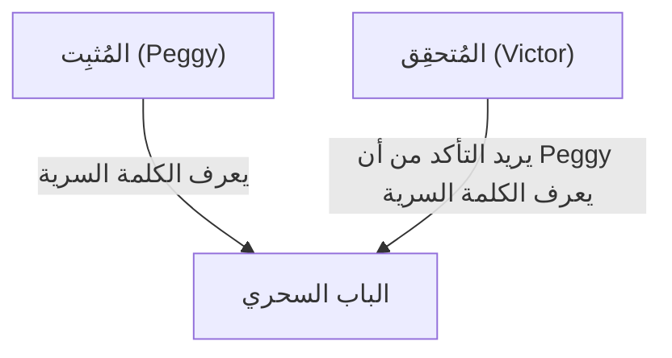
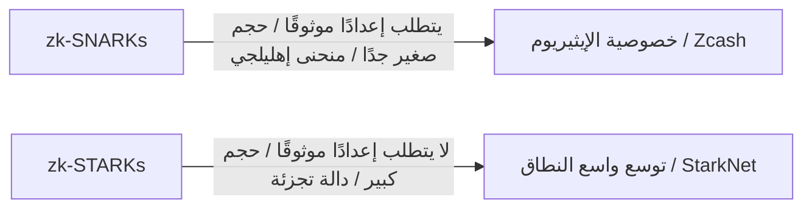

# أساسيات إثبات المعرفة الصفرية (zk-SNARKs/zk-STARKs): تقنية التشفير التي تدعم مستقبل Web3

في المجتمع الرقمي الحديث، طالما وقفت الخصوصية والأمان كقضايا متعارضة. إنها معضلة "الاضطرار إلى الكشف عن المعلومات الشخصية لإثبات هويتك". ومع ذلك، فإن "إثبات المعرفة الصفرية (Zero-Knowledge Proof: ZKP)"، وهو اختراق في علم التشفير، يقلب هذا النموذج من جذوره.

في هذه المقالة، سنتعمق في الشرح بدءًا من الفهم البديهي لإثبات المعرفة الصفرية، مرورًا بالآليات الرياضية المتطورة مثل zk-SNARKs و zk-STARKs، وصولاً إلى تطبيقاتها في توسيع نطاق البلوكتشين (ZK-Rollup) وحماية الخصوصية.

## 1. ما هو إثبات المعرفة الصفرية؟ استعارة "كهف علي بابا"

إثبات المعرفة الصفرية هو تقنية تشفيرية تسمح لك بـ "إثبات صحة ادعاء معين دون تسريب أي معلومات باستثناء حقيقة أن الادعاء صحيح".

لفهم هذا المفهوم المعقد بشكل بديهي، دعونا نشرحه باستخدام "كهف علي بابا (استعارة الكهف)" الشهير الذي ابتكره جان جاك كيسكويتر وآخرون.

**القصة:**
يوجد كهف على شكل حلقة، وفي أعمق جزء منه يوجد "باب سحري". لن يُفتح هذا الباب إلا إذا تم نطق الكلمة السرية. تعرف المُثبِتة Peggy الكلمة السرية، وتريد أن تثبت للمُتحقِق Victor: "أنا أعرف الكلمة السرية". ومع ذلك، لا تريد Peggy إخبار Victor بالكلمة السرية نفسها.

**عملية الإثبات:**
1. بينما ينتظر Victor خارج الكهف، تدخل Peggy الكهف وتتجه إما إلى الممر الأيمن أو الأيسر.
2. يتقدم Victor إلى مدخل الكهف ويعطي تعليمات عشوائية، "اخرجي من اليمين" أو "اخرجي من اليسار".
3. إذا كانت Peggy تعرف الكلمة السرية حقًا، فبغض النظر عن التعليمات المعطاة، يمكنها فتح الباب السحري إذا لزم الأمر والخروج من الجانب المحدد.
4. إذا تم ذلك مرة واحدة فقط، فقد تكون Peggy في الجانب الصحيح بالصدفة (بنسبة 50٪). ولكن إذا تكررت هذه العملية 20 مرة وأجابت Peggy بشكل صحيح في جميع المرات، فإن احتمال نجاحها بالصدفة يصبح 1 / 2^20 (حوالي 1 في المليون).
5. نتيجة لذلك، يقتنع Victor تمامًا بأن "Peggy تعرف الكلمة السرية بالتأكيد"، ولكن لم يتم إخباره بالكلمة السرية نفسها على الإطلاق.

هذا هو المبدأ الأساسي لإثبات المعرفة الصفرية. في العالم الرقمي، يتم تحقيق ذلك باستخدام رياضيات متقدمة (متعددات الحدود، تشفير المنحنى الإهليلجي، إلخ).

## 2. الآلية الرياضية لـ zk-SNARKs

التطبيق التمثيلي لوضع إثبات المعرفة الصفرية قيد الاستخدام العملي في البلوكتشين والبرمجيات هو **zk-SNARKs (Zero-Knowledge Succinct Non-Interactive Argument of Knowledge)**.

كل حرف في SNARKs له معنى مهم.
- **Succinct (موجز)**: حجم الإثبات صغير جدًا ويمكن التحقق منه في أجزاء من الألف من الثانية.
- **Non-Interactive (غير تفاعلي)**: ليست هناك حاجة لتفاعلات متعددة بين المُثبِت والمُتحقِق (كما في كهف علي بابا)، ويكتمل الإثبات بإرسال بيانات لمرة واحدة.
- **Argument of Knowledge (حجة المعرفة)**: تضمن حسابيًا أن المُثبِت يمتلك المعلومات حقًا.

### التحويل إلى متعددات الحدود (Arithmetization)
يبدأ zk-SNARKs بتحويل "برنامج الحساب" أو "المنطق" المراد إثباته إلى "متعددات حدود (Polynomials)" رياضية.

يتم تحويل منطق البرنامج إلى نظام قيود يسمى R1CS (Rank-1 Constraint System)، ويتم تحويله بشكل أكبر إلى شكل مشكلة متعددة الحدود تسمى QAP (Quadratic Arithmetic Program).
باستخدام تمهيدية شوارتز-زيبل (Schwartz-Zippel Lemma)، التي تنص على "إذا كانت متعددتا حدود تتطابقان في نقاط متعددة، فمن المؤكد تقريبًا أنهما نفس متعددة الحدود"، يصبح من الممكن التحقق فورًا من صحة الحسابات الضخمة بمجرد تقييم عدد قليل من النقاط.

### الالتزام التشفيري واقتران المنحنى الإهليلجي
لإثبات نتيجة الحساب، يُنشئ المُثبِت "التزامًا تشفيريًا" لقيمة متعددة الحدود. يشبه هذا "قفل صندوق وتقديمه بحيث لا يمكن تغيير محتوياته لاحقًا".
في zk-SNARKs، تُستخدم تقنية تشفير متقدمة تسمى اقتران المنحنى الإهليلجي (Elliptic Curve Pairing) للتحقق مما إذا كان حساب متعددة الحدود قد تم إجراؤه بشكل صحيح مع الحفاظ على تشفير الحالة. يتيح هذا "إثبات صحة الحساب مع إخفاء المعلومات".

### الإعداد الموثوق (Trusted Setup)
أكبر نقطة ضعف في zk-SNARKs هي الحاجة إلى "الإعداد الموثوق (Trusted Setup)".
عند إعداد النظام، من الضروري إنشاء معلمات تشفيرية تسمى "سلسلة المرجع المشتركة (CRS: Common Reference String)" للإثبات والتحقق. خلال عملية الإنشاء هذه، يتم استخدام بيانات عشوائية سرية تسمى "النفايات السامة (Toxic Waste)"، وإذا تم تسريبها دون إتلافها، فهناك خطر يتمثل في أن أي شخص يمكنه إنشاء إثباتات مزيفة (مما يؤدي إلى انهيار النظام).
لهذا السبب، من خلال طقوس تسمى "Ceremony" باستخدام الحوسبة متعددة الأطراف (MPC) التي يشارك فيها عدة أشخاص، يتم اعتماد آلية يتم فيها الحفاظ على الأمان إذا قام شخص واحد على الأقل من المشاركين بإتلاف البيانات بأمانة.

## 3. zk-STARKs: الشفافية وقابلية التوسع

تم تطوير **zk-STARKs (Zero-Knowledge Scalable Transparent Argument of Knowledge)** لحل تحديات zk-SNARKs (الحاجة إلى الإعداد الموثوق ونقاط الضعف ضد أجهزة الكمبيوتر الكمومية).

### الشفافية (Transparent)
الميزة الأبرز في STARKs هي "T (Transparent = شفاف)". لا تستخدم STARKs تقنيات تشفير معقدة مثل اقتران المنحنى الإهليلجي، بل تعتمد فقط على دوال التجزئة المقاومة للتصادم.
لذلك، لا توجد حاجة إلى إعداد موثوق مثل SNARKs، ويتم بناء النظام بشفافية وأمان منذ البداية.

### المقاومة الكمومية وقابلية التوسع
نظرًا لاعتماده فقط على دوال التجزئة، فإن STARKs يقاوم نظريًا الهجمات المستقبلية بواسطة أجهزة الكمبيوتر الكمومية (تشفير ما بعد الكم).
بالإضافة إلى ذلك، غالبًا ما يتفوق STARKs على SNARKs في وقت إنشاء الإثبات، مما يجعله مناسبًا جدًا لإثبات العمليات الحسابية واسعة النطاق. ومع ذلك، هناك مفاضلة وهي أن حجم بيانات الإثبات أكبر بكثير (عشرات إلى مئات الكيلوبايت) مقارنة بـ SNARKs (مئات البايتات).

## 4. التطبيقات في Web3: التوسع والخصوصية

يُتوقع أن يكون إثبات المعرفة الصفرية بمثابة عصا سحرية تحل في وقت واحد التحديين الرئيسيين للبلوكتشين: "قابلية التوسع" و "الخصوصية".

### التوسع من خلال ZK-Rollup
في سلاسل البلوكتشين العامة مثل الإيثيريوم، يتحقق الجميع من جميع المعاملات، مما يؤدي إلى بطء سرعة المعالجة (TPS) وارتفاع الرسوم (رسوم الغاز).
يعالج ZK-Rollup آلاف إلى عشرات الآلاف من المعاملات معًا (Rollup) خارج السلسلة الرئيسية (Layer 2) ويقدم فقط "إثبات المعرفة الصفرية بأن الحساب قد تم إجراؤه بشكل صحيح (SNARK/STARK)" إلى السلسلة الرئيسية.
تحتاج السلسلة الرئيسية فقط إلى التحقق من الإثبات الصغير المُقدم في أجزاء من الألف من الثانية دون إعادة تنفيذ الحسابات الثقيلة. يتيح هذا تحسينًا هائلاً في قدرة معالجة الشبكة دون التضحية بالأمان.

### حماية خصوصية المعاملات
في سلاسل البلوكتشين العامة، يتم الكشف عن سجل المعاملات بالكامل، مما يشكل عائقًا كبيرًا أمام استخدامها من قبل الشركات والأفراد.
في الأصول المشفرة مثل Zcash وبروتوكولات مثل Tornado Cash، يُستخدم إثبات المعرفة الصفرية لإثبات للشبكة "أنك تمتلك حقًا الرموز الصحيحة ولم تقم بالإنفاق المزدوج" بينما يتم تشفير وإخفاء "المرسل" و "المستلم" و "المبلغ"، مما يسمح بالموافقة على المعاملة.
بالإضافة إلى ذلك، في الآونة الأخيرة، أصبحت تقنية استخدام المعرفات اللامركزية (zk-DID) التي تعتمد على إثبات المعرفة الصفرية لإثبات أشياء مثل "أكبر من 18 عامًا" أو "يحمل جنسية معينة" دون الكشف عن تاريخ الميلاد أو معلومات جواز السفر أقرب إلى الاستخدام العملي.

## الخلاصة

إثبات المعرفة الصفرية (zk-SNARKs/zk-STARKs) ليس مجرد تقنية للعملات المشفرة؛ بل لديه القدرة على تغيير كيفية تعامل الإنترنت بأكمله مع المعلومات من جذوره.
من المتوقع أن تصبح خاصية "إثبات الثقة مع حماية الخصوصية" بنية تحتية لا غنى عنها في عصر الذكاء الاصطناعي للتحقق من صحة البيانات، والمعاملات المالية الآمنة، والإدارة الذاتية للمعلومات الشخصية (Self-Sovereign Identity).
لا يمكننا أن نرفع أعيننا عن تطور هذه التقنية، التي يمكن تسميتها سحر الرياضيات، وكيف ستعيد تعريف الثقة (Trust) في المجتمع.
