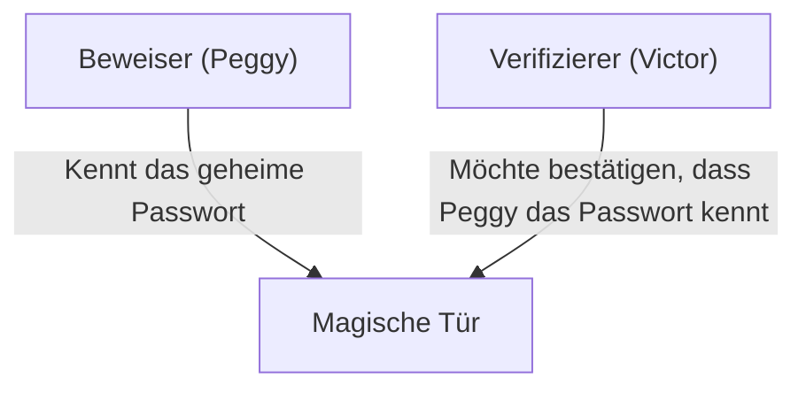
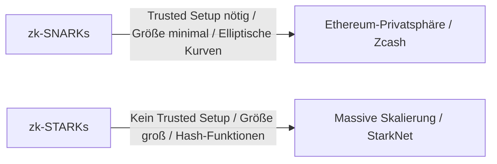

# Grundlagen von Zero-Knowledge-Proofs (zk-SNARKs/zk-STARKs): Die Kryptographie, die die Zukunft von Web3 unterstützt

In der modernen digitalen Gesellschaft stehen sich Privatsphäre und Sicherheit oft als widersprüchliche Herausforderungen gegenüber. Es ist das Dilemma, dass „man persönliche Informationen offenlegen muss, um seine Identität zu beweisen“. Ein Durchbruch in der Kryptographie, der „Zero-Knowledge-Proof (ZKP)“, dreht dieses Paradigma jedoch grundlegend um.

In diesem Artikel werden wir tief in das Thema eintauchen, vom intuitiven Verständnis von Zero-Knowledge-Proofs über modernste mathematische Mechanismen wie zk-SNARKs und zk-STARKs bis hin zu deren Anwendung in der Blockchain-Skalierung (ZK-Rollup) und dem Schutz der Privatsphäre.

## 1. Was ist ein Zero-Knowledge-Proof? Die Metapher von "Alibabas Höhle"

Ein Zero-Knowledge-Proof ist eine kryptographische Methode, um „zu beweisen, dass eine bestimmte Aussage wahr ist, ohne dabei irgendwelche Informationen preiszugeben, außer der Tatsache, dass die Aussage wahr ist“.

Um dieses komplexe Konzept intuitiv zu verstehen, lassen Sie uns die berühmte „Alibabas Höhle (Höhlen-Metapher)“ verwenden, die von Jean-Jacques Quisquater und anderen erdacht wurde.

**Geschichte:**
Es gibt eine ringförmige Höhle, an deren tiefster Stelle sich eine „magische Tür“ befindet. Diese Tür öffnet sich nur, wenn das geheime Passwort gesprochen wird. Die Beweiserin Peggy kennt das Passwort und möchte dem Verifizierer Victor beweisen: „Ich kenne das Passwort“. Peggy möchte Victor das Passwort selbst jedoch nicht verraten.

**Der Beweisprozess:**
1. Während Victor außerhalb der Höhle wartet, betritt Peggy die Höhle und geht entweder den rechten oder den linken Gang hinunter.
2. Victor geht zum Eingang der Höhle und gibt zufällig die Anweisung: „Komm von rechts heraus“ oder „Komm von links heraus“.
3. Wenn Peggy das Passwort wirklich kennt, kann sie bei jeder Anweisung die magische Tür bei Bedarf öffnen und auf der angegebenen Seite herauskommen.
4. Wenn dies nur einmal gemacht wird, war Peggy vielleicht nur zufällig auf der richtigen Seite (50 % Wahrscheinlichkeit). Wenn dieser Prozess jedoch 20 Mal wiederholt wird und Peggy jedes Mal richtig liegt, beträgt die Wahrscheinlichkeit, dass sie durch Zufall erfolgreich war, 1 / 2^20 (etwa 1 zu 1 Million).
5. Als Ergebnis ist Victor überzeugt, dass „Peggy zweifellos das Passwort kennt“, aber ihm wird das Passwort selbst überhaupt nicht mitgeteilt.

Dies ist das Grundprinzip von Zero-Knowledge-Proofs. In der digitalen Welt wird dies durch fortschrittliche Mathematik (Polynome, elliptische Kurvenkryptographie usw.) realisiert.

## 2. Der mathematische Mechanismus von zk-SNARKs

Eine repräsentative Implementierung für die praktische Anwendung von Zero-Knowledge-Proofs in Blockchains und Software sind **zk-SNARKs (Zero-Knowledge Succinct Non-Interactive Argument of Knowledge)**.

Jeder Buchstabe in SNARKs hat eine wichtige Bedeutung:
- **Succinct (Prägnant)**: Die Größe des Beweises ist sehr klein und kann in wenigen Millisekunden verifiziert werden.
- **Non-Interactive (Nicht-interaktiv)**: Es ist kein mehrfacher Austausch zwischen Beweiser und Verifizierer erforderlich (wie in Alibabas Höhle), und es wird mit einer einzigen Datenübertragung abgeschlossen.
- **Argument of Knowledge (Wissensargument)**: Stellt rechnerisch sicher, dass der Beweiser die Informationen wirklich besitzt.

### Umwandlung in Polynome (Arithmetisierung)
zk-SNARKs beginnen mit der Umwandlung des „Rechenprogramms“ oder der „Logik“, die bewiesen werden soll, in mathematische „Polynome“.

Die Logik des Programms wird in ein Constraint-System namens R1CS (Rank-1 Constraint System) umgewandelt und weiter in ein Polynomproblem im Format QAP (Quadratic Arithmetic Program) überführt.
Unter Verwendung des Schwartz-Zippel-Lemmas, welches besagt, dass „wenn zwei Polynome an vielen Punkten übereinstimmen, sie fast sicher dasselbe Polynom sind“, kann die Richtigkeit riesiger Berechnungen sofort durch die Auswertung weniger Punkte verifiziert werden.

### Kryptographisches Commitment und Elliptic Curve Pairing
Um das Berechnungsergebnis zu beweisen, erstellt der Beweiser ein „kryptographisches Commitment“ für die Werte des Polynoms. Dies ist vergleichbar mit „dem Einreichen einer Kiste mit einem Schloss, damit der Inhalt später nicht geändert werden kann“.
zk-SNARKs verwenden eine fortschrittliche kryptographische Technik namens Elliptic Curve Pairing, um zu verifizieren, dass die Berechnung der Polynome im verschlüsselten Zustand korrekt durchgeführt wurde. Dies ermöglicht es, „die Richtigkeit der Berechnung zu beweisen, während die Informationen verborgen bleiben“.

### Trusted Setup (Vertrauenswürdige Ersteinrichtung)
Die wohl größte Schwäche von zk-SNARKs ist die Notwendigkeit eines „Trusted Setups“.
Beim Starten des Systems müssen kryptographische Parameter generiert werden, die als „Common Reference String (CRS)“ für Beweis und Verifizierung bezeichnet werden. Bei diesem Generierungsprozess werden geheime Zufallsdaten, sogenannter „Toxic Waste (Giftmüll)“, verwendet. Wenn diese nicht zerstört werden und durchsickern, könnte jeder gefälschte Beweise erstellen (das System würde zusammenbrechen).
Aus diesem Grund wird ein Mechanismus angewendet, bei dem die Sicherheit durch ein „Ceremony“ genanntes Ritual mittels MPC (Multi-Party Computation) mit mehreren Teilnehmern gewährleistet wird, solange mindestens ein Teilnehmer die Daten ehrlich vernichtet.

## 3. zk-STARKs: Transparenz und Skalierbarkeit

Um die Probleme von zk-SNARKs (Notwendigkeit eines Trusted Setups und Anfälligkeit gegenüber Quantencomputern) zu lösen, wurden **zk-STARKs (Zero-Knowledge Scalable Transparent Argument of Knowledge)** entwickelt.

### Transparenz (Transparent)
Das Hauptmerkmal von STARKs ist das „T (Transparent)“. STARKs stützen sich nur auf kollisionsresistente Hash-Funktionen, ohne komplexe kryptographische Techniken wie Elliptic Curve Pairing zu verwenden.
Daher ist im Gegensatz zu SNARKs überhaupt kein Trusted Setup erforderlich, und das System wird von Anfang an transparent und sicher aufgebaut.

### Quantenresistenz und Skalierbarkeit
Da sie sich nur auf Hash-Funktionen stützen, sind STARKs theoretisch resistent gegen Angriffe durch zukünftige Quantencomputer (Post-Quanten-Kryptographie).
Darüber hinaus sind STARKs in Bezug auf die Beweisgenerierungszeit oft besser als SNARKs und eignen sich für Beweise von sehr groß angelegten Berechnungen. Es gibt jedoch den Kompromiss, dass die Datengröße des Beweises (Zehner- bis Hunderte von Kilobytes) deutlich größer ist als bei SNARKs (einige hundert Bytes).

## 4. Anwendungen in Web3: Skalierung und Privatsphäre

Zero-Knowledge-Proofs gelten als Zauberstab, der die beiden großen Herausforderungen von Blockchains, „Skalierbarkeit“ und „Privatsphäre“, gleichzeitig löst.

### Skalierung durch ZK-Rollup
Öffentliche Blockchains wie Ethereum haben das Problem, dass die Verarbeitungsgeschwindigkeit (TPS) langsam ist und die Gebühren (Gas-Kosten) in die Höhe schnellen, weil jeder jede Transaktion verifiziert.
ZK-Rollup bündelt (Rollup) Tausende bis Zehntausende von Transaktionen außerhalb der Mainchain (Layer 1) auf Layer 2 zur Verarbeitung und reicht der Mainchain nur den „Zero-Knowledge-Proof (SNARK/STARK), dass die Berechnung korrekt durchgeführt wurde“ ein.
Die Mainchain muss lediglich den eingereichten kleinen Beweis in wenigen Millisekunden verifizieren, ohne die aufwendigen Berechnungen erneut auszuführen. Dies kann die Verarbeitungskapazität des Netzwerks drastisch erhöhen, ohne die Sicherheit zu beeinträchtigen.

### Schutz der Privatsphäre bei Transaktionen
Auf öffentlichen Blockchains werden alle Transaktionsverläufe veröffentlicht, was für Unternehmen und Privatpersonen ein großes Hindernis bei der Nutzung darstellt.
Krypto-Assets wie Zcash und Protokolle wie Tornado Cash verwenden Zero-Knowledge-Proofs, um den „Absender“, den „Empfänger“ und den „Betrag“ verschlüsselt zu verbergen und beweisen dem Netzwerk nur, dass sie „sicherlich die richtigen Token besitzen und keine Doppelausgaben getätigt haben“, um die Transaktion zu genehmigen.
Darüber hinaus wird in letzter Zeit eine Technologie praktisch nutzbar, die dezentrale Identitäten (zk-DID) mithilfe von Zero-Knowledge-Proofs verwendet, um Dinge wie „über 18 Jahre alt zu sein“ oder „eine bestimmte Staatsangehörigkeit zu besitzen“ zu beweisen, ohne das Geburtsdatum oder Passinformationen preiszugeben.

## Fazit

Zero-Knowledge-Proofs (zk-SNARKs/zk-STARKs) sind nicht nur eine Technologie für Kryptowährungen, sondern haben das Potenzial, die Art und Weise, wie Informationen im gesamten Internet gehandhabt werden, grundlegend zu verändern.
Die Eigenschaft, „Vertrauen zu beweisen, während die Privatsphäre gewahrt wird“, wird im Zeitalter der KI zu einer unverzichtbaren Infrastruktur für die Bestimmung der Echtheit von Daten, sichere Finanztransaktionen und die selbstsouveräne Verwaltung persönlicher Informationen (Self-Sovereign Identity).
Wir sollten im Auge behalten, wie diese Technologie, die als Magie der Mathematik bezeichnet werden kann, Vertrauen (Trust) in der Gesellschaft neu definieren wird.
