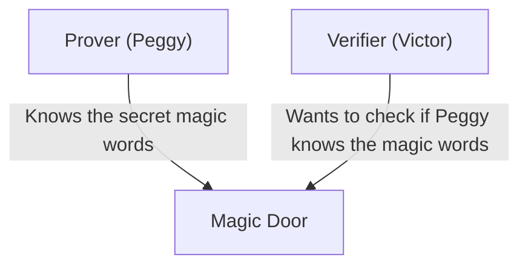
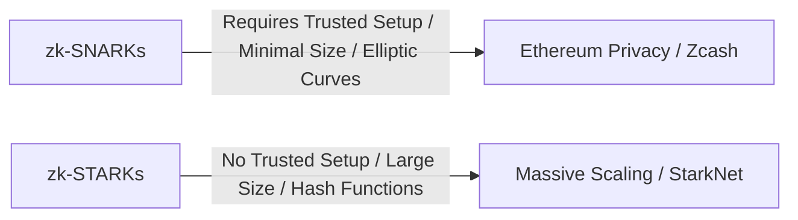

# The Basics of Zero-Knowledge Proofs (zk-SNARKs/zk-STARKs): The Cryptography Supporting the Future of Web3

In modern digital society, privacy and security have emerged as conflicting challenges. The dilemma is that "to prove your identity, you must disclose your personal information." However, a breakthrough in cryptography called "Zero-Knowledge Proof (ZKP)" fundamentally overturns this paradigm.

This article delves deep, explaining everything from an intuitive understanding of zero-knowledge proofs to the cutting-edge mathematical mechanisms like zk-SNARKs and zk-STARKs, as well as their applications in blockchain scaling (ZK-Rollup) and privacy protection.

## 1. What is a Zero-Knowledge Proof? The "Ali Baba's Cave" Metaphor

A zero-knowledge proof is a cryptographic method that "proves a given proposition is true without leaking any information other than the fact that the proposition is true."

To intuitively understand this complex concept, let's explain it using the famous "Ali Baba's Cave (Cave Metaphor)" devised by Jean-Jacques Quisquater and others.

**Story:**
There is a ring-shaped cave, and at the deepest part is a "Magic Door." This door will not open unless the secret magic words are spoken. Peggy, the prover, knows the magic words and wants to prove to Victor, the verifier, that "I know the magic words." However, Peggy does not want to tell Victor the magic words themselves.

**Proof Process:**
1. While Victor waits outside the cave, Peggy enters the cave and goes down either the right path or the left path.
2. Victor proceeds to the cave's entrance and randomly calls out, "Come out from the right!" or "Come out from the left!"
3. If Peggy truly knows the magic words, she can open the magic door as needed and come out from the specified side, regardless of which instruction was given.
4. If this is done only once, Peggy might have just coincidentally been on the correct side (a 50% probability). However, if this process is repeated 20 times and Peggy gets it right every time, the probability of her succeeding by chance is 1 / 2^20 (about 1 in 1 million).
5. As a result, Victor is convinced that "Peggy undoubtedly knows the magic words," but he has not been told the magic words at all.

This is the basic principle of zero-knowledge proofs. In the digital world, this is realized using advanced mathematics (polynomials, elliptic curve cryptography, etc.).

## 2. The Mathematical Mechanism of zk-SNARKs

A representative implementation for putting zero-knowledge proofs into practical use in blockchains and software is **zk-SNARKs (Zero-Knowledge Succinct Non-Interactive Argument of Knowledge)**.

Each letter in SNARKs has an important meaning:
- **Succinct**: The proof size is extremely small and can be verified in a few milliseconds.
- **Non-Interactive**: There is no need for repeated exchanges between the prover and verifier (like in Ali Baba's cave); it is completed with a single data transmission.
- **Argument of Knowledge**: Computationally guarantees that the prover genuinely holds the information.

### Conversion to Polynomials (Arithmetization)
zk-SNARKs start by converting the "computational program" or "logic" you want to prove into mathematical "polynomials."

The program's logic is converted into a constraint system called R1CS (Rank-1 Constraint System), and then further reduced to a polynomial problem format called QAP (Quadratic Arithmetic Program).
It utilizes the Schwartz-Zippel Lemma, which states that "if two polynomials agree at many points, the two polynomials are almost certainly identical," allowing the correctness of massive computations to be verified instantly by evaluating just a few points.

### Cryptographic Commitments and Elliptic Curve Pairing
To prove the computational results, the prover creates a "cryptographic commitment" to the values of the polynomials. This is akin to "putting it in a locked box and submitting it so the contents cannot be changed later."
zk-SNARKs use advanced cryptography called Elliptic Curve Pairing to verify that the polynomial calculation was performed correctly while still in an encrypted state. This makes it possible to "prove the correctness of a computation while keeping the information hidden."

### Trusted Setup
What could be called the biggest weakness of zk-SNARKs is the need for a "Trusted Setup."
When launching the system, it is necessary to generate cryptographic parameters called a "Common Reference String (CRS)" for proving and verifying. This generation process uses secret random data called "Toxic Waste," and if this is not destroyed and leaks, anyone could create fake proofs (causing the system to collapse).
For this reason, a mechanism is employed where a ceremony using MPC (Multi-Party Computation) involving multiple people takes place, ensuring that safety is maintained if at least one participant honestly destroys their data.

## 3. zk-STARKs: Transparency and Scalability

Developed to solve the challenges of zk-SNARKs (the need for a Trusted Setup and vulnerability to quantum computers) is **zk-STARKs (Zero-Knowledge Scalable Transparent Argument of Knowledge)**.

### Transparency (Transparent)
The biggest feature of STARKs is "T (Transparent)." STARKs do not use complex cryptography like elliptic curve pairing, relying solely on collision-resistant hash functions.
Therefore, unlike SNARKs, a Trusted Setup is completely unnecessary, and the system is built transparently and securely from the start.

### Quantum Resistance and Scalability
Because they rely only on hash functions, STARKs are theoretically resistant to attacks by future quantum computers (post-quantum cryptography).
Additionally, STARKs often have better proof generation times than SNARKs and are suited for proving very large-scale computations. However, there is a tradeoff in that the proof data size is significantly larger (tens to hundreds of kilobytes) compared to SNARKs (a few hundred bytes).

## 4. Applications in Web3: Scaling and Privacy

Zero-knowledge proofs are anticipated to be the magic wand that simultaneously solves the two major challenges blockchains face: "scalability" and "privacy."

### Scaling via ZK-Rollups
Public blockchains like Ethereum have everyone verify all transactions, which leads to slow processing speeds (TPS) and soaring fees (Gas).
ZK-Rollups bundle (rollup) thousands to tens of thousands of transactions outside the main chain (Layer 2) and submit only the "zero-knowledge proof (SNARK/STARK) that the computation was performed correctly" to the main chain.
The main chain only needs to verify the small submitted proof in a few milliseconds without re-executing heavy computations. This allows network processing capacity to be dramatically improved without sacrificing security.

### Transaction Privacy Protection
On public blockchains, all transaction history is public, which is a major barrier for corporate and personal use.
Cryptocurrencies like Zcash and protocols like Tornado Cash use zero-knowledge proofs to encrypt and hide the "sender," "recipient," and "amount," proving to the network only that "they indeed own the correct tokens and have not double-spent," getting the transaction approved.
Furthermore, recently, decentralized IDs (zk-DIDs) using zero-knowledge proofs are being put into practical use, allowing people to prove things like "being over 18 years old" or "holding a specific nationality" without revealing their date of birth or passport information.

## Conclusion

Zero-knowledge proofs (zk-SNARKs/zk-STARKs) are not just technology for cryptocurrency; they hold the potential to fundamentally change how information is handled across the entire internet.
The characteristic of "proving trust while protecting privacy" will become essential infrastructure for assessing data authenticity in the AI era, secure financial transactions, and self-sovereign identity (Self-Sovereign Identity) for managing personal information.
We must keep our eyes on the evolution of this technology, which could be called mathematical magic, to see how it will redefine societal trust.
