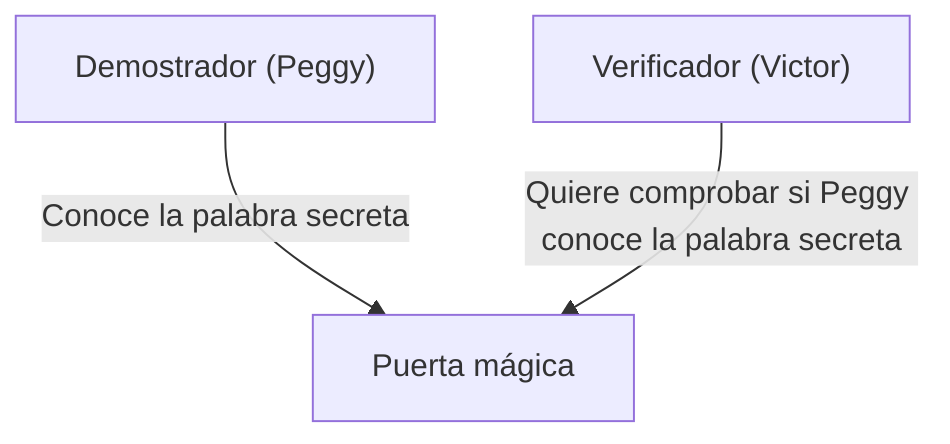
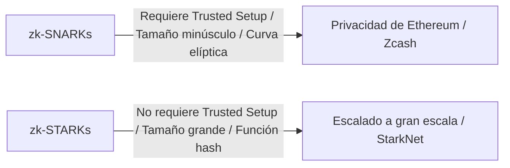

# Fundamentos de las Pruebas de Conocimiento Cero (zk-SNARKs/zk-STARKs): La tecnología criptográfica que sustenta el futuro de Web3

En la sociedad digital actual, la privacidad y la seguridad se han presentado como desafíos contradictorios. Existe el dilema de que 'para demostrar la identidad, se debe revelar información personal'. Sin embargo, el avance criptográfico de la 'Prueba de Conocimiento Cero (Zero-Knowledge Proof: ZKP)' revierte este paradigma desde su raíz.

En este artículo, profundizaremos desde una comprensión intuitiva de las pruebas de conocimiento cero, hasta los mecanismos matemáticos más avanzados como zk-SNARKs y zk-STARKs, y sus aplicaciones en la escalabilidad de blockchain (ZK-Rollup) y la protección de la privacidad.

## 1. ¿Qué es una Prueba de Conocimiento Cero? La metáfora de la 'Cueva de Alí Babá'

La prueba de conocimiento cero es una técnica criptográfica mediante la cual 'se demuestra que una proposición es cierta, sin filtrar ninguna otra información que no sea el hecho de que la proposición es cierta'.

Para entender intuitivamente este concepto complejo, explicaremos utilizando la famosa metáfora de la 'Cueva de Alí Babá' (la metáfora de la cueva) ideada por Jean-Jacques Quisquater y otros.

**Historia:**
Hay una cueva en forma de anillo, y en lo más profundo se encuentra una 'puerta mágica'. Esta puerta no se abrirá a menos que se recite la palabra secreta. La demostradora, Peggy, conoce la palabra secreta y quiere demostrarle al verificador, Victor, que 'yo conozco la palabra secreta'. Sin embargo, Peggy no quiere revelarle a Victor la palabra en sí.

**Proceso de demostración:**
1. Mientras Victor espera fuera de la cueva, Peggy entra y avanza por el pasaje derecho o el izquierdo.
2. Victor se acerca a la entrada de la cueva y le da una instrucción al azar: 'Sal por la derecha' o 'Sal por la izquierda'.
3. Si Peggy realmente conoce la palabra secreta, sin importar la instrucción dada, puede abrir la puerta mágica según sea necesario y salir por el lado especificado.
4. Si esto se hace solo una vez, Peggy podría haber estado en el lado correcto por casualidad (50% de probabilidad). Sin embargo, si este proceso se repite 20 veces y Peggy acierta todas, la probabilidad de que haya tenido éxito por casualidad es de 1 / 2^20 (aproximadamente 1 en un millón).
5. Como resultado, Victor está convencido de que 'Peggy definitivamente conoce la palabra secreta', pero no se le ha revelado la palabra en sí.

Este es el principio básico de las pruebas de conocimiento cero. En el mundo digital, esto se logra utilizando matemáticas avanzadas (polinomios, criptografía de curva elíptica, etc.).

## 2. Mecanismos matemáticos de zk-SNARKs

Una implementación representativa para poner en uso práctico las pruebas de conocimiento cero en blockchain y software es **zk-SNARKs (Zero-Knowledge Succinct Non-Interactive Argument of Knowledge)**.

Cada letra de SNARKs tiene un significado importante.
- **Succinct (Sucinto)**: El tamaño de la prueba es muy pequeño y se puede verificar en unos pocos milisegundos.
- **Non-Interactive (No interactivo)**: No hay necesidad de múltiples intercambios entre el demostrador y el verificador (como en la cueva de Alí Babá), y se completa con una sola transmisión de datos.
- **Argument of Knowledge (Argumento de conocimiento)**: Garantiza computacionalmente que el demostrador realmente tiene la información.

### Transformación en polinomios (Arithmetization)
zk-SNARKs comienza transformando el 'programa computacional' o 'lógica' que se quiere demostrar en 'polinomios (Polynomials)' matemáticos.

La lógica del programa se convierte en un sistema de restricciones llamado R1CS (Rank-1 Constraint System), y luego se reduce a un problema polinómico en forma de QAP (Quadratic Arithmetic Program).
Utilizando el Lema de Schwartz-Zippel, que establece que 'si dos polinomios coinciden en muchos puntos, es casi seguro que son el mismo polinomio', se permite que la corrección de un cálculo masivo se verifique instantáneamente evaluando solo unos pocos puntos.

### Compromiso criptográfico y emparejamiento de curvas elípticas
Para demostrar los resultados del cálculo, el demostrador crea un 'compromiso criptográfico' para los valores polinómicos. Esto es como 'poner la información en una caja con llave para enviarla, de modo que el contenido no pueda ser alterado después'.
En zk-SNARKs, se utiliza una técnica criptográfica avanzada llamada emparejamiento de curvas elípticas (Elliptic Curve Pairing) para verificar si el cálculo de los polinomios se realizó correctamente mientras permanece encriptado. Esto hace posible 'demostrar la exactitud de un cálculo manteniendo la información oculta'.

### Trusted Setup (Configuración inicial de confianza)
Lo que se puede llamar la mayor debilidad de zk-SNARKs es la necesidad de un 'Trusted Setup' (Configuración inicial de confianza).
Al iniciar el sistema, es necesario generar parámetros criptográficos llamados 'Cadena de Referencia Común' (CRS: Common Reference String) para la prueba y verificación. Durante este proceso de generación se utilizan datos aleatorios secretos conocidos como 'residuos tóxicos (Toxic Waste)', y si esto se filtra en lugar de ser destruido, existe el riesgo de que cualquiera pueda crear pruebas falsas (el sistema colapsaría).
Por esta razón, se adopta un mecanismo mediante un ritual llamado 'Ceremony' que utiliza MPC (Computación Multipartita) donde participan varias personas, asegurando que si al menos uno de los participantes destruye honestamente los datos, la seguridad se mantiene.

## 3. zk-STARKs: Transparencia y Escalabilidad

Desarrollado para resolver los problemas de zk-SNARKs (la necesidad del Trusted Setup y la vulnerabilidad a las computadoras cuánticas) es **zk-STARKs (Zero-Knowledge Scalable Transparent Argument of Knowledge)**.

### Transparencia (Transparent)
La mayor característica de STARKs es la 'T (Transparent = Transparencia)'. STARKs no utiliza técnicas criptográficas complejas como el emparejamiento de curvas elípticas, sino que depende únicamente de funciones hash resistentes a colisiones.
Por lo tanto, no se requiere ningún Trusted Setup como en SNARKs, y el sistema se construye transparente y seguro desde el principio.

### Resistencia cuántica y escalabilidad
Al depender únicamente de funciones hash, STARKs es teóricamente resistente a los ataques de futuras computadoras cuánticas (criptografía poscuántica).
Además, el tiempo de generación de pruebas en STARKs es a menudo superior al de SNARKs, lo que lo hace muy adecuado para demostrar cálculos a gran escala. Sin embargo, existe una compensación en el sentido de que el tamaño de los datos de la prueba es significativamente mayor (decenas a cientos de kilobytes) en comparación con SNARKs (cientos de bytes).

## 4. Aplicaciones en Web3: Escalabilidad y Privacidad

Se espera que las pruebas de conocimiento cero sean una varita mágica que resuelva simultáneamente los dos grandes problemas que enfrentan las blockchains: 'escalabilidad' y 'privacidad'.

### Escalado a través de ZK-Rollup
Las blockchains públicas como Ethereum tienen el problema de que las velocidades de procesamiento (TPS) son lentas y las tarifas (gas) se disparan debido a que todos verifican todas las transacciones.
ZK-Rollup agrupa (rollup) miles a decenas de miles de transacciones fuera (Capa 2) de la cadena principal (Capa 1) para su procesamiento, y solo envía la 'prueba de conocimiento cero de que el cálculo se realizó correctamente (SNARK/STARK)' a la cadena principal.
La cadena principal solo necesita verificar la pequeña prueba enviada en unos pocos milisegundos sin volver a ejecutar los cálculos pesados. Esto permite mejorar drásticamente la capacidad de procesamiento de la red sin sacrificar la seguridad.

### Protección de la privacidad de las transacciones
Las blockchains públicas hacen público todo el historial de transacciones, lo cual es una gran barrera para el uso corporativo y personal.
Con criptoactivos como Zcash o protocolos como Tornado Cash, se utilizan pruebas de conocimiento cero para mantener ocultos y encriptados al 'remitente', 'destinatario' y la 'cantidad', mientras se demuestra a la red únicamente que 'efectivamente se poseen los tokens correctos y no se ha realizado un doble gasto', permitiendo que la transacción sea aprobada.
Además, más recientemente, se están poniendo en uso práctico tecnologías que utilizan identidades descentralizadas (zk-DID) basadas en pruebas de conocimiento cero para demostrar cosas como 'ser mayor de 18 años' o 'tener una nacionalidad específica' sin revelar la fecha de nacimiento ni la información del pasaporte.

## Conclusión

Las pruebas de conocimiento cero (zk-SNARKs/zk-STARKs) no son solo una tecnología para las criptomonedas, sino que tienen el potencial de cambiar fundamentalmente cómo se maneja la información en todo internet.
La característica de 'demostrar la confianza mientras se protege la privacidad' se convertirá en una infraestructura indispensable para la verificación de la autenticidad de los datos en la era de la IA, las transacciones financieras seguras y la gestión soberana de la identidad personal (Self-Sovereign Identity).
No podemos apartar la mirada de la evolución de cómo esta tecnología, que bien podría llamarse magia matemática, redefinirá la confianza (trust) en la sociedad.
