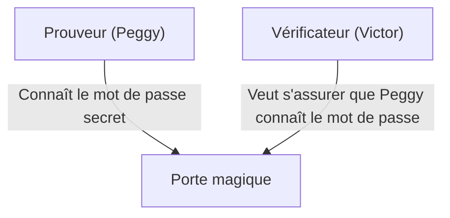
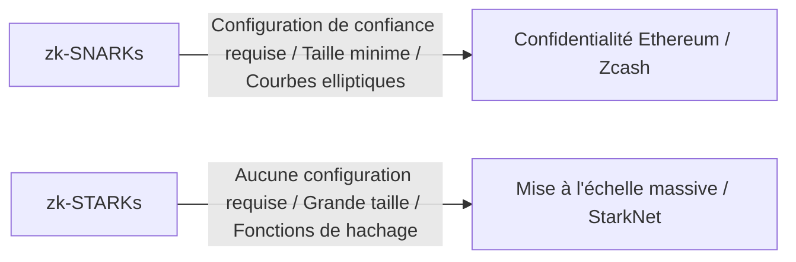

# Les bases des preuves à divulgation nulle de connaissance (zk-SNARKs/zk-STARKs) : La technologie cryptographique qui soutient l'avenir du Web3

Dans notre société numérique moderne, la vie privée et la sécurité se sont imposées comme des défis contradictoires. C'est le dilemme qui consiste à devoir divulguer des informations personnelles pour prouver son identité. Cependant, une percée cryptographique appelée « preuve à divulgation nulle de connaissance » (Zero-Knowledge Proof : ZKP) bouleverse fondamentalement ce paradigme.

Cet article explique en profondeur les preuves à divulgation nulle de connaissance, depuis une compréhension intuitive jusqu'aux mécanismes mathématiques de pointe comme les zk-SNARKs et les zk-STARKs, en passant par leurs applications dans la mise à l'échelle des blockchains (ZK-Rollup) et la protection de la vie privée.

## 1. Qu'est-ce qu'une preuve à divulgation nulle de connaissance ? La métaphore de la « caverne d'Ali Baba »

Une preuve à divulgation nulle de connaissance est une méthode cryptographique qui permet de « prouver qu'une proposition donnée est vraie, sans révéler aucune autre information que le fait que cette proposition soit vraie ».

Pour comprendre intuitivement ce concept complexe, expliquons-le à l'aide de la célèbre métaphore de la « caverne d'Ali Baba » imaginée par Jean-Jacques Quisquater et d'autres.

**L'histoire :**
Il existe une caverne en forme d'anneau avec une « porte magique » tout au fond. Cette porte ne s'ouvre qu'en prononçant un mot de passe secret. Le prouveur, Peggy, connaît ce mot de passe et souhaite prouver au vérificateur, Victor, qu'elle le connaît. Cependant, Peggy ne veut pas révéler le mot de passe lui-même à Victor.

**Le processus de preuve :**
1. Pendant que Victor attend à l'extérieur de la caverne, Peggy entre et s'engage dans le passage de droite ou de gauche.
2. Victor s'avance vers l'entrée de la caverne et demande au hasard : « Sors par la droite » ou « Sors par la gauche ».
3. Si Peggy connaît vraiment le mot de passe, elle peut, quelle que soit l'instruction donnée, ouvrir la porte magique si nécessaire et sortir du côté spécifié.
4. Si cela n'est fait qu'une seule fois, Peggy pourrait simplement avoir été par hasard du bon côté (50 % de probabilité). Mais si ce processus est répété 20 fois et que Peggy réussit à chaque fois, la probabilité qu'elle ait réussi par hasard devient de 1 / 2^20 (environ un sur un million).
5. En fin de compte, Victor est convaincu que « Peggy connaît sans aucun doute le mot de passe », mais le mot de passe lui-même n'a jamais été révélé.

C'est le principe de base des preuves à divulgation nulle de connaissance. Dans le monde numérique, cela est réalisé à l'aide de mathématiques avancées (polynômes, cryptographie sur les courbes elliptiques, etc.).

## 2. Le mécanisme mathématique des zk-SNARKs

L'une des implémentations les plus courantes pour rendre les preuves à divulgation nulle de connaissance pratiques dans la blockchain et les logiciels est les **zk-SNARKs (Zero-Knowledge Succinct Non-Interactive Argument of Knowledge)**.

Chaque lettre de SNARKs a une signification importante :
- **Succinct (Concis)** : La taille de la preuve est extrêmement petite et peut être vérifiée en quelques millisecondes.
- **Non-Interactive (Non interactif)** : Il n'y a pas besoin de multiples échanges entre le prouveur et le vérificateur (comme dans la caverne d'Ali Baba), l'opération est complétée par une seule transmission de données.
- **Argument of Knowledge (Argument de connaissance)** : Garantit informatiquement que le prouveur possède réellement l'information.

### Conversion en polynômes (Arithmétisation)
Les zk-SNARKs commencent par convertir le « programme de calcul » ou la « logique » à prouver en « polynômes » mathématiques (Polynomials).

La logique du programme est transformée en un système de contraintes appelé R1CS (Rank-1 Constraint System), puis réduite à un problème polynomial sous forme de QAP (Quadratic Arithmetic Program).
En utilisant le lemme de Schwartz-Zippel, qui stipule que « si deux polynômes correspondent sur un grand nombre de points, alors ces deux polynômes sont presque certainement identiques », on peut vérifier instantanément l'exactitude d'un énorme calcul en évaluant seulement quelques points.

### Engagements cryptographiques et couplage sur les courbes elliptiques
Pour prouver le résultat du calcul, le prouveur crée un « engagement cryptographique » sur la valeur du polynôme. C'est comme « soumettre une boîte verrouillée pour que son contenu ne puisse pas être modifié ultérieurement ».
Dans les zk-SNARKs, une technologie cryptographique avancée appelée couplage sur les courbes elliptiques (Elliptic Curve Pairing) est utilisée pour vérifier que le calcul du polynôme a été effectué correctement tout en gardant l'état chiffré. Cela permet de « prouver l'exactitude du calcul tout en gardant les informations cachées ».

### Configuration de confiance (Trusted Setup)
La plus grande faiblesse des zk-SNARKs est sans doute la nécessité d'une « configuration de confiance » (Trusted Setup).
Lors du lancement du système, il est nécessaire de générer des paramètres cryptographiques appelés « chaîne de référence commune » (CRS : Common Reference String) pour la preuve et la vérification. Au cours de ce processus de génération, des données aléatoires secrètes appelées « déchets toxiques » (Toxic Waste) sont utilisées, et si elles ne sont pas détruites et fuitent, n'importe qui peut créer de fausses preuves (le système s'effondre).
Pour cette raison, on utilise un processus appelé « Cérémonie », impliquant un calcul multiparti (MPC), garantissant que si au moins un des participants détruit honnêtement les données, la sécurité est préservée.

## 3. zk-STARKs : Transparence et scalabilité

Les **zk-STARKs (Zero-Knowledge Scalable Transparent Argument of Knowledge)** ont été développés pour résoudre les problèmes des zk-SNARKs (nécessité d'une configuration de confiance et vulnérabilité face aux ordinateurs quantiques).

### Transparence (Transparent)
La caractéristique principale des STARKs est le « T » (Transparent). Les STARKs ne reposent pas sur des technologies cryptographiques complexes comme le couplage sur les courbes elliptiques, mais uniquement sur des fonctions de hachage résistantes aux collisions.
Par conséquent, contrairement aux SNARKs, aucune configuration de confiance n'est nécessaire, et le système est construit de manière transparente et sécurisée dès le départ.

### Résistance quantique et scalabilité
Comme ils ne dépendent que des fonctions de hachage, les STARKs sont théoriquement résistants aux futures attaques par des ordinateurs quantiques (cryptographie post-quantique).
De plus, les STARKs ont souvent des temps de génération de preuve supérieurs à ceux des SNARKs, ce qui les rend idéaux pour prouver des calculs à très grande échelle. Cependant, il y a un compromis : la taille des données de la preuve est nettement plus importante (des dizaines à des centaines de kilo-octets) par rapport aux SNARKs (quelques centaines d'octets).

## 4. Applications dans le Web3 : Mise à l'échelle et confidentialité

Les preuves à divulgation nulle de connaissance sont attendues comme la baguette magique qui résoudra simultanément deux problèmes majeurs des blockchains : la « scalabilité » et la « confidentialité ».

### Mise à l'échelle via ZK-Rollup
Les blockchains publiques comme Ethereum ont un problème de vitesse de traitement (TPS) lente et de frais élevés (Gas) car tout le monde vérifie chaque transaction.
Les ZK-Rollups traitent (Rollup) des milliers à des dizaines de milliers de transactions ensemble en dehors de la chaîne principale (Layer 2) et ne soumettent à la chaîne principale (Layer 1) que la « preuve à divulgation nulle de connaissance que le calcul a été effectué correctement » (SNARK/STARK).
La chaîne principale n'a besoin que de vérifier la petite preuve soumise en quelques millisecondes, sans avoir à réexécuter les lourds calculs. Cela permet d'améliorer considérablement la capacité de traitement du réseau sans sacrifier la sécurité.

### Protection de la confidentialité des transactions
Les blockchains publiques exposent tout l'historique des transactions, ce qui constitue un obstacle majeur pour une utilisation par les entreprises et les particuliers.
Des crypto-actifs comme Zcash et des protocoles comme Tornado Cash utilisent des preuves à divulgation nulle de connaissance pour approuver les transactions en chiffrant et en cachant « l'expéditeur », « le destinataire » et « le montant », tout en prouvant uniquement au réseau qu'ils « possèdent bel et bien les bons tokens et n'ont pas fait de double dépense ».
Plus récemment, la technologie des identités décentralisées (zk-DID) utilisant des preuves à divulgation nulle de connaissance se démocratise pour prouver des choses comme « avoir plus de 18 ans » ou « posséder une certaine nationalité » sans révéler sa date de naissance ou les informations de son passeport.

## Conclusion

Les preuves à divulgation nulle de connaissance (zk-SNARKs/zk-STARKs) ne sont pas seulement une technologie pour les cryptomonnaies, elles ont le potentiel de changer fondamentalement la façon dont l'information est gérée sur l'ensemble d'Internet.
La caractéristique de « prouver la confiance tout en protégeant la vie privée » deviendra une infrastructure essentielle pour l'authentification des données à l'ère de l'IA, les transactions financières sécurisées et la gestion auto-souveraine des informations personnelles (Self-Sovereign Identity).
Il convient de suivre de près l'évolution de cette technologie, que l'on pourrait qualifier de magie mathématique, et la façon dont elle redéfinira la confiance (trust) dans notre société.
