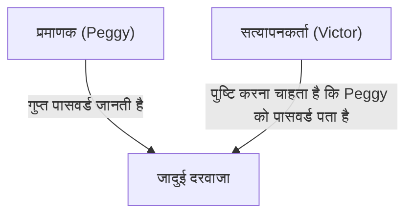
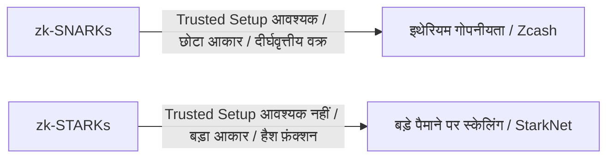

# जीरो-नॉलेज प्रूफ़ (zk-SNARKs/zk-STARKs) के मूल सिद्धांत: Web3 के भविष्य का समर्थन करने वाली क्रिप्टोग्राफिक तकनीक

आधुनिक डिजिटल समाज में, गोपनीयता और सुरक्षा अक्सर परस्पर विरोधी चुनौतियों के रूप में खड़ी होती हैं। यह "अपनी पहचान साबित करने के लिए व्यक्तिगत जानकारी का खुलासा करने की आवश्यकता" की दुविधा है। हालांकि, "जीरो-नॉलेज प्रूफ़ (Zero-Knowledge Proof: ZKP)" नामक क्रिप्टोग्राफिक सफलता इस प्रतिमान को मौलिक रूप से बदल देती है।

इस लेख में, हम जीरो-नॉलेज प्रूफ़ की सहज समझ से लेकर zk-SNARKs और zk-STARKs जैसे अत्याधुनिक गणितीय तंत्रों, और ब्लॉकचेन स्केलिंग (ZK-Rollup) और गोपनीयता सुरक्षा में उनके अनुप्रयोगों तक गहराई से चर्चा करेंगे।

## 1. जीरो-नॉलेज प्रूफ़ क्या है? "अलीबाबा की गुफा" का रूपक

जीरो-नॉलेज प्रूफ़ एक क्रिप्टोग्राफ़िक तकनीक है जिसमें "किसी कथन के सत्य होने के अलावा कोई अन्य जानकारी लीक किए बिना यह साबित किया जाता है कि वह कथन सत्य है।"

इस जटिल अवधारणा को सहज रूप से समझने के लिए, आइए ज्यां-जैक्स क्विस्क्वाटर और अन्य द्वारा तैयार की गई प्रसिद्ध "अलीबाबा की गुफा (गुफा रूपक)" का उपयोग करके इसे समझाएं।

**कहानी:**
एक अंगूठी के आकार की गुफा है, जिसके सबसे गहरे हिस्से में एक "जादुई दरवाजा" है। जब तक कोई गुप्त पासवर्ड नहीं बोलता, यह दरवाजा नहीं खुलता। प्रमाणक, Peggy, पासवर्ड जानती है, और सत्यापनकर्ता, Victor को यह साबित करना चाहती है कि "मैं पासवर्ड जानती हूँ।" लेकिन, Peggy, Victor को वास्तविक पासवर्ड नहीं बताना चाहती।

**प्रमाण की प्रक्रिया:**
1. जब Victor गुफा के बाहर प्रतीक्षा करता है, Peggy गुफा में प्रवेश करती है और दाएँ या बाएँ रास्ते में से किसी एक पर जाती है।
2. Victor गुफा के प्रवेश द्वार पर जाता है और यादृच्छिक रूप से "दाएँ से बाहर आओ" या "बाएँ से बाहर आओ" का निर्देश देता है।
3. यदि Peggy वास्तव में पासवर्ड जानती है, तो चाहे उसे कोई भी निर्देश दिया जाए, वह आवश्यकतानुसार जादुई दरवाजा खोल सकती है और निर्दिष्ट तरफ से बाहर आ सकती है।
4. यदि यह केवल एक बार किया जाता है, तो हो सकता है कि Peggy संयोग से सही तरफ रही हो (50% संभावना)। हालाँकि, यदि यह प्रक्रिया 20 बार दोहराई जाती है और Peggy हर बार सही होती है, तो उसके संयोग से सफल होने की संभावना 1 / 2^20 (लगभग 1 मिलियन में 1) है।
5. परिणामस्वरूप, Victor आश्वस्त हो जाता है कि "Peggy निश्चित रूप से पासवर्ड जानती है," बिना वास्तविक पासवर्ड जाने।

यही जीरो-नॉलेज प्रूफ़ का मूल सिद्धांत है। डिजिटल दुनिया में, इसे उन्नत गणित (बहुपद, दीर्घवृत्तीय वक्र क्रिप्टोग्राफी आदि) का उपयोग करके प्राप्त किया जाता है।

## 2. zk-SNARKs का गणितीय तंत्र

ब्लॉकचेन और सॉफ्टवेयर में जीरो-नॉलेज प्रूफ़ को व्यावहारिक बनाने के लिए सबसे प्रमुख कार्यान्वयन **zk-SNARKs (Zero-Knowledge Succinct Non-Interactive Argument of Knowledge)** है।

SNARKs के प्रत्येक अक्षर का महत्वपूर्ण अर्थ है।
- **Succinct (संक्षिप्त)**: प्रमाण का आकार बहुत छोटा है और इसे कुछ मिलीसेकंड में सत्यापित किया जा सकता है।
- **Non-Interactive (गैर-संवादात्मक)**: प्रमाणक और सत्यापनकर्ता (जैसे अलीबाबा की गुफा में) के बीच कई इंटरैक्शन की कोई आवश्यकता नहीं है, और यह एक ही डेटा ट्रांसमिशन के साथ पूरा हो जाता है।
- **Argument of Knowledge (ज्ञान का तर्क)**: यह कम्प्यूटेशनल रूप से गारंटी देता है कि प्रमाणक के पास वास्तव में जानकारी है।

### बहुपद में परिवर्तन (Arithmetization)
zk-SNARKs उस "गणना कार्यक्रम" या "तर्क" को गणितीय "बहुपदों (Polynomials)" में परिवर्तित करके शुरू होता है जिसे आप साबित करना चाहते हैं।

प्रोग्राम लॉजिक को एक बाधा प्रणाली में परिवर्तित किया जाता है जिसे R1CS (Rank-1 Constraint System) कहा जाता है, और फिर इसे QAP (Quadratic Arithmetic Program) नामक बहुपद समस्या प्रारूप में बदल दिया जाता है।
श्वार्ट्ज-ज़िपेल लेम्मा (Schwartz-Zippel Lemma) का उपयोग करते हुए, जो बताता है कि "यदि दो बहुपद कई बिंदुओं पर सहमत हैं, तो वे लगभग निश्चित रूप से समान बहुपद हैं," यह केवल कुछ बिंदुओं का मूल्यांकन करके विशाल गणनाओं की शुद्धता के त्वरित सत्यापन की अनुमति देता है।

### क्रिप्टोग्राफ़िक प्रतिबद्धता और दीर्घवृत्तीय वक्र पेयरिंग
गणना परिणामों को साबित करने के लिए, प्रमाणक बहुपद के मान के प्रति "क्रिप्टोग्राफ़िक प्रतिबद्धता" बनाता है। यह "एक बॉक्स को लॉक करने और उसे सबमिट करने जैसा है ताकि बाद में सामग्री को बदला न जा सके।"
zk-SNARKs एक उन्नत क्रिप्टोग्राफ़िक तकनीक का उपयोग करते हैं जिसे एलिप्टिक कर्व पेयरिंग (Elliptic Curve Pairing) कहा जाता है, ताकि यह सत्यापित किया जा सके कि बहुपद गणनाओं को एन्क्रिप्टेड स्थिति में सही ढंग से किया गया था। यह "जानकारी छुपाते हुए गणना की शुद्धता साबित करना" संभव बनाता है।

### Trusted Setup (विश्वसनीय प्रारंभिक सेटअप)
zk-SNARKs की शायद सबसे बड़ी कमजोरी "Trusted Setup (विश्वसनीय प्रारंभिक सेटअप)" की आवश्यकता है।
सिस्टम स्थापित करते समय, প্রমাণ और सत्यापन के लिए "कॉमन रेफरेंस स्ट्रिंग (CRS: Common Reference String)" नामक क्रिप्टोग्राफ़िक पैरामीटर उत्पन्न करना आवश्यक है। इस पीढ़ी की प्रक्रिया के दौरान, गुप्त यादृच्छिक डेटा जिसे "विषाक्त अपशिष्ट (Toxic Waste)" कहा जाता है, का उपयोग किया जाता है। यदि इसे नष्ट नहीं किया जाता है और यह लीक हो जाता है, तो कोई भी नकली प्रमाण बना सकता है (जिससे सिस्टम ढह जाता है)।
इस कारण से, एमपीसी (मल्टी-पार्टी कंप्यूटेशन) का उपयोग करके "सेरेमनी (Ceremony)" नामक एक अनुष्ठान आयोजित किया जाता है। जब तक प्रतिभागियों में से कम से कम एक व्यक्ति ईमानदारी से अपना डेटा नष्ट कर देता है, तब तक सिस्टम सुरक्षित रहता है।

## 3. zk-STARKs: पारदर्शिता और स्केलेबिलिटी

**zk-STARKs (Zero-Knowledge Scalable Transparent Argument of Knowledge)** को zk-SNARKs (विश्वसनीय सेटअप की आवश्यकता और क्वांटम कंप्यूटरों की भेद्यता) की समस्याओं को हल करने ক্যামे लिए विकसित किया गया था।

### पारदर्शिता (Transparent)
STARKs की सबसे बड़ी विशेषता "T (Transparent = पारदर्शी)" है। STARKs जटिल क्रिप्टोग्राफ़िक तकनीकों जैसे कि दीर्घवृत्तीय वक्र पेयरिंग का उपयोग नहीं करते हैं, बल्कि केवल कोलिजन-रेसिस्टेंट हैश फ़ंक्शंस पर निर्भर करते हैं।
इसलिए, SNARKs की तरह किसी भी विश्वसनीय सेटअप की आवश्यकता नहीं है, और सिस्टम शुरू से ही पारदर्शी और सुरक्षित रूप से बनाया गया है।

### क्वांटम प्रतिरोध और स्केलेबिलिटी
चूंकि वे केवल हैश फ़ंक्शंस पर निर्भर करते हैं, सैद्धांतिक रूप से STARKs भविष्य के क्वांटम कंप्यूटर (क्वांटम-प्रतिरोधी क्रिप्टोग्राफी) द्वारा हमलों के प्रतिरोधी हैं।
इसके अलावा, STARKs के पास अक्सर SNARKs की तुलना में बेहतर प्रमाण सृजन समय होता है, जो उन्हें बहुत बड़े पैमाने की गणनाओं को साबित करने के लिए उपयुक्त बनाता है। हालांकि, एक ट्रेड-ऑफ है कि प्रमाण डेटा का आकार SNARKs (सैकड़ों बाइट्स) की तुलना में काफी बड़ा (दसियों से सैकड़ों किलोबाइट) है।

## 4. Web3 में अनुप्रयोग: स्केलिंग और गोपनीयता

जीरो-नॉलेज प्रूफ़ से ब्लॉकचेन के सामने आने वाली दो प्रमुख चुनौतियों: "स्केलेबिलिटी" और "गोपनीयता" को एक साथ हल करने के लिए एक जादू की छड़ी होने की उम्मीद है।

### ZK-Rollup के माध्यम से स्केलिंग
इथेरियम जैसे सार्वजनिक ब्लॉकचेन में धीमी प्रोसेसिंग गति (TPS) और उच्च लेनदेन शुल्क (गैस शुल्क) की समस्या है क्योंकि हर कोई सभी लेनदेन को सत्यापित करता है।
ZK-Rollup मुख्य श्रृंखला (Layer 1) के बाहर (Layer 2) हजारों से दसियों हज़ार लेनदेन (Rollup) को एक साथ संसाधित करता है, और केवल मुख्य श्रृंखला में "जीरो-नॉलेज प्रूफ़ (SNARK/STARK) कि गणना सही ढंग से की गई थी" सबमिट करता है।
मुख्य श्रृंखला को भारी गणनाओं को फिर से निष्पादित किए बिना, कुछ मिलीसेकंड में प्रस्तुत छोटे प्रमाण को सत्यापित करने की आवश्यकता होती है। यह सुरक्षा का त्याग किए बिना नेटवर्क की प्रसंस्करण शक्ति में नाटकीय रूप से सुधार कर सकता है।

### लेनदेन की गोपनीयता सुरक्षा
सार्वजनिक ब्लॉकचेन सभी लेनदेन इतिहास को प्रकाशित करते हैं, जो कॉर्पोरेट और व्यक्तिगत उपयोग के लिए एक बड़ी बाधा है।
Zcash जैसी क्रिप्टोकरेंसी या Tornado Cash जैसे प्रोटोकॉल के साथ, जीरो-नॉलेज प्रूफ़ का उपयोग करके "प्रेषक," "प्राप्तकर्ता," और "राशि" को एन्क्रिप्ट और छुपाया जाता है, और यह केवल नेटवर्क को साबित किया जाता है कि "आप निश्चित रूप से सही टोकन के मालिक हैं और आपने डबल-स्पेंडिंग नहीं की है," जिससे लेनदेन स्वीकृत हो जाता है।
हाल ही में, जीरो-नॉलेज प्रूफ़ (zk-DID) का उपयोग करके विकेंद्रीकृत आईडी ने जन्मतिथि या पासपोर्ट जानकारी का खुलासा किए बिना "18 वर्ष या उससे अधिक आयु का होने" या "एक विशिष्ट राष्ट्रीयता होने" को साबित करने वाली तकनीक का व्यावसायीकरण करना शुरू कर दिया है।

## निष्कर्ष

जीरो-नॉलेज प्रूफ़ (zk-SNARKs/zk-STARKs) केवल क्रिप्टोकरेंसी के लिए तकनीकें नहीं हैं; उनमें संपूर्ण इंटरनेट पर जानकारी को संभालने के तरीके को मौलिक रूप से बदलने की क्षमता है।
"गोपनीयता की रक्षा करते हुए विश्वास साबित करने" की विशेषता एआई युग में डेटा प्रामाणिकता, सुरक्षित वित्तीय लेनदेन, और व्यक्तिगत जानकारी के स्व-संप्रभु पहचान प्रबंधन (Self-Sovereign Identity) के लिए एक आवश्यक बुनियादी ढांचा बन जाएगी।
इस तकनीक का विकास, जिसे गणित के जादू के रूप में वर्णित किया जा सकता है, यह देखने लायक है कि यह समाज में विश्वास को कैसे फिर से परिभाषित करता है।
