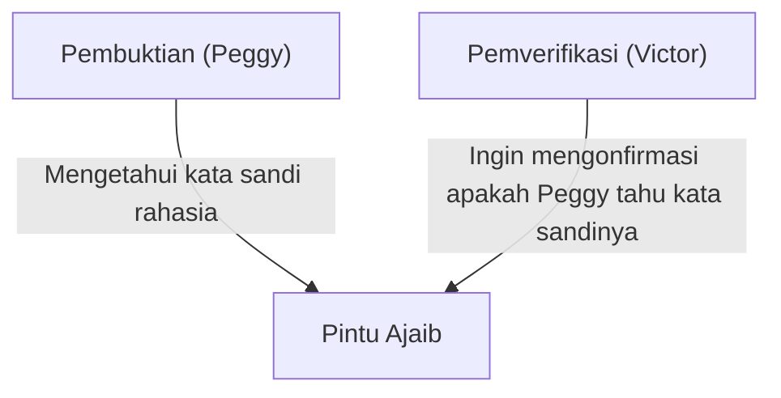
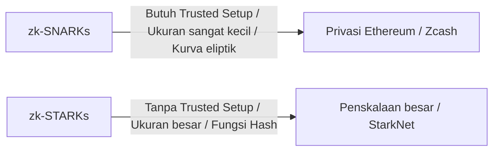

# Dasar-dasar Bukti Pengetahuan Nol (zk-SNARKs/zk-STARKs): Teknologi Kriptografi yang Mendukung Masa Depan Web3

Dalam masyarakat digital modern, privasi dan keamanan telah menjadi tantangan yang saling bertentangan. Dilemanya adalah: "Untuk membuktikan identitas saya, saya harus mengungkapkan informasi pribadi." Namun, terobosan kriptografi yaitu "Bukti Pengetahuan Nol" (Zero-Knowledge Proof: ZKP) secara fundamental mengubah paradigma ini.

Artikel ini akan mengupas tuntas bukti pengetahuan nol, mulai dari pemahaman intuitif, mekanisme matematis mutakhir seperti zk-SNARKs dan zk-STARKs, hingga penerapannya dalam penskalaan blockchain (ZK-Rollup) dan perlindungan privasi.

## 1. Apa itu Bukti Pengetahuan Nol? Metafora "Gua Ali Baba"

Bukti Pengetahuan Nol adalah metode kriptografi yang "membuktikan bahwa suatu proposisi adalah benar, tanpa membocorkan informasi apa pun selain fakta bahwa proposisi tersebut benar."

Untuk memahami konsep yang sulit ini secara intuitif, mari kita jelaskan menggunakan "Gua Ali Baba" (metafora gua) yang terkenal, yang diciptakan oleh Jean-Jacques Quisquater dan rekan-rekannya.

**Cerita:**
Terdapat sebuah gua berbentuk cincin, dan di bagian terdalamnya terdapat "Pintu Ajaib". Pintu ini tidak akan terbuka kecuali kata sandi rahasia diucapkan. Peggy si pembuktian mengetahui kata sandi tersebut, dan ingin membuktikan kepada Victor si pemverifikasi dengan berkata "Saya tahu kata sandinya". Namun, Peggy tidak ingin memberitahu kata sandi itu sendiri kepada Victor.

**Proses Pembuktian:**
1. Sementara Victor menunggu di luar gua, Peggy masuk ke dalam gua dan berjalan ke jalur kanan atau jalur kiri.
2. Victor maju ke pintu masuk gua dan secara acak memberikan instruksi "Keluarlah dari kanan" atau "Keluarlah dari kiri".
3. Jika Peggy benar-benar mengetahui kata sandinya, instruksi mana pun yang diberikan, ia dapat membuka pintu ajaib jika diperlukan dan keluar dari sisi yang ditentukan.
4. Jika ini hanya dilakukan 1 kali, Peggy mungkin saja berada di sisi yang benar secara kebetulan (probabilitas 50%). Namun, jika proses ini diulang 20 kali dan Peggy menjawab semuanya dengan benar, probabilitas dia berhasil karena kebetulan adalah 1 / 2^20 (sekitar 1 per 1 juta).
5. Hasilnya, Victor yakin bahwa "Peggy pasti mengetahui kata sandinya", tanpa mengetahui kata sandi itu sendiri.

Ini adalah prinsip dasar bukti pengetahuan nol. Di dunia digital, hal ini diwujudkan menggunakan matematika tingkat lanjut (polinomial, kriptografi kurva eliptik, dll.).

## 2. Mekanisme Matematis zk-SNARKs

Implementasi representatif untuk mempraktikkan bukti pengetahuan nol pada blockchain atau perangkat lunak adalah **zk-SNARKs (Zero-Knowledge Succinct Non-Interactive Argument of Knowledge)**.

Setiap huruf dalam SNARKs memiliki arti penting:
- **Succinct (Ringkas)**: Ukuran buktinya sangat kecil dan dapat diverifikasi dalam beberapa milidetik.
- **Non-Interactive (Non-Interaktif)**: Tidak perlu bolak-balik antara pembuktian dan pemverifikasi (seperti dalam Gua Ali Baba), dan selesai dengan satu kali pengiriman data.
- **Argument of Knowledge (Argumen Pengetahuan)**: Menjamin secara komputasional bahwa pembuktian benar-benar memiliki informasinya.

### Konversi ke Polinomial (Arithmetization)
zk-SNARKs dimulai dengan mengubah "program perhitungan" atau "logika" yang ingin dibuktikan ke dalam "polinomial (Polynomials)" matematis.

Logika program dikonversi ke dalam sistem batasan yang disebut R1CS (Rank-1 Constraint System), dan selanjutnya dipecah menjadi bentuk masalah polinomial QAP (Quadratic Arithmetic Program).
Dengan memanfaatkan Lemma Schwartz-Zippel, yang menyatakan bahwa "Jika dua polinomial cocok di banyak titik, maka kedua polinomial tersebut hampir pasti sama," kebenaran dari perhitungan yang sangat besar dapat diverifikasi secara instan hanya dengan mengevaluasi beberapa titik.

### Komitmen Kriptografi dan Pasangan Kurva Eliptik
Untuk membuktikan hasil perhitungan, pembuktian membuat "komitmen kriptografi" pada nilai polinomial. Ini seperti "menyerahkan sebuah kotak yang terkunci sehingga isinya tidak dapat diubah kemudian."
Dalam zk-SNARKs, teknologi kriptografi canggih yang disebut pasangan kurva eliptik (Elliptic Curve Pairing) digunakan untuk memverifikasi apakah perhitungan polinomial dilakukan dengan benar saat masih dalam keadaan terenkripsi. Hal ini memungkinkan untuk "membuktikan kebenaran perhitungan sambil menyembunyikan informasi."

### Trusted Setup (Pengaturan Awal Terpercaya)
Kelemahan terbesar zk-SNARKs adalah perlunya "Trusted Setup (Pengaturan Awal Terpercaya)".
Saat mendirikan sistem, perlu menghasilkan parameter kriptografi yang disebut "Common Reference String (CRS)" untuk pembuktian dan verifikasi. Dalam proses pembuatan ini, data acak rahasia yang disebut "Limbah Beracun (Toxic Waste)" digunakan. Jika ini bocor tanpa dihancurkan, ada risiko bahwa siapa pun dapat membuat bukti palsu (sistem akan runtuh).
Oleh karena itu, mekanisme diterapkan melalui ritual yang disebut "Ceremony" menggunakan MPC (Komputasi Multi-Partai) di mana banyak orang berpartisipasi, sehingga selama setidaknya satu peserta secara jujur menghancurkan datanya, keamanan tetap terjaga.

## 3. zk-STARKs: Transparansi dan Skalabilitas

**zk-STARKs (Zero-Knowledge Scalable Transparent Argument of Knowledge)** dikembangkan untuk menyelesaikan masalah pada zk-SNARKs (perlunya Trusted Setup dan kerentanan terhadap komputer kuantum).

### Transparansi (Transparent)
Fitur terbesar dari STARKs adalah "T (Transparent = Transparan)". STARKs tidak menggunakan teknologi kriptografi yang kompleks seperti pasangan kurva eliptik, melainkan hanya bergantung pada fungsi hash yang tahan benturan.
Oleh karena itu, Trusted Setup seperti pada SNARKs sama sekali tidak diperlukan, dan sistem dibangun secara transparan dan aman sejak awal.

### Ketahanan Kuantum dan Skalabilitas
Karena hanya bergantung pada fungsi hash, STARKs secara teori tahan terhadap serangan oleh komputer kuantum di masa depan (Kriptografi pasca-kuantum).
Selain itu, waktu pembuatan bukti untuk STARKs seringkali lebih unggul daripada SNARKs, membuatnya cocok untuk pembuktian perhitungan skala sangat besar. Namun, terdapat pertukaran (trade-off) di mana ukuran data bukti jauh lebih besar (puluhan hingga ratusan kilobyte) dibandingkan dengan SNARKs (ratusan byte).

## 4. Penerapan di Web3: Penskalaan dan Privasi

Bukti pengetahuan nol diharapkan menjadi tongkat ajaib yang secara bersamaan memecahkan dua masalah besar yang dihadapi oleh blockchain: "skalabilitas" dan "privasi".

### Penskalaan dengan ZK-Rollup
Blockchain publik seperti Ethereum memiliki masalah kecepatan pemrosesan (TPS) yang lambat dan biaya transaksi (Gas fee) yang melonjak karena semua orang memverifikasi semua transaksi.
ZK-Rollup memproses ribuan hingga puluhan ribu transaksi secara bersamaan (Rollup) di luar rantai utama (Layer 2), dan hanya menyerahkan "bukti pengetahuan nol (SNARK/STARK) bahwa perhitungan telah dilakukan dengan benar" ke rantai utama (Layer 1).
Rantai utama hanya perlu memverifikasi bukti kecil yang dikirimkan dalam beberapa milidetik tanpa harus mengeksekusi ulang perhitungan yang berat. Ini secara dramatis meningkatkan kapasitas pemrosesan jaringan tanpa mengorbankan keamanan.

### Perlindungan Privasi Transaksi
Pada blockchain publik, semua riwayat transaksi dipublikasikan, yang mana merupakan hambatan besar bagi penggunaan oleh perusahaan dan individu.
Protokol seperti Tornado Cash dan aset kripto seperti Zcash menggunakan bukti pengetahuan nol untuk memvalidasi transaksi ke jaringan dengan hanya membuktikan "Saya memang memiliki token yang benar dan tidak melakukan pengeluaran ganda (double-spending)" sementara "Pengirim", "Penerima", dan "Jumlah" dienkripsi dan disembunyikan.
Lebih baru lagi, ID terdesentralisasi (zk-DID) menggunakan bukti pengetahuan nol mulai dipraktikkan, memungkinkan seseorang membuktikan bahwa "Saya berusia di atas 18 tahun" atau "Saya memiliki kewarganegaraan tertentu" tanpa mengungkapkan tanggal lahir atau informasi paspor.

## Kesimpulan

Bukti pengetahuan nol (zk-SNARKs/zk-STARKs) bukan sekadar teknologi untuk mata uang kripto, tetapi memiliki potensi untuk secara fundamental mengubah cara seluruh internet menangani informasi.
Karakteristik "membuktikan kepercayaan sambil melindungi privasi" akan menjadi infrastruktur esensial di era AI untuk menilai keaslian data, transaksi keuangan yang aman, dan pengelolaan informasi pribadi secara berdaulat sendiri (Self-Sovereign Identity).
Kita tidak boleh melepaskan pandangan dari evolusinya tentang bagaimana teknologi ini, yang bisa disebut sihir matematika, akan mendefinisikan ulang kepercayaan (trust) di masyarakat.
