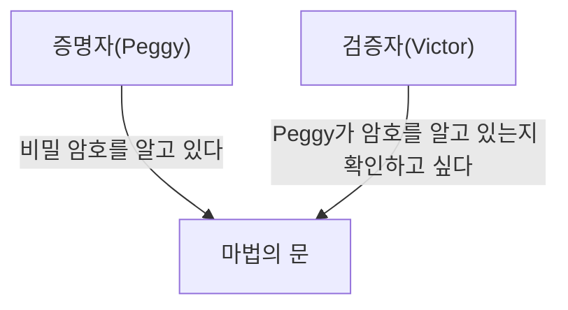
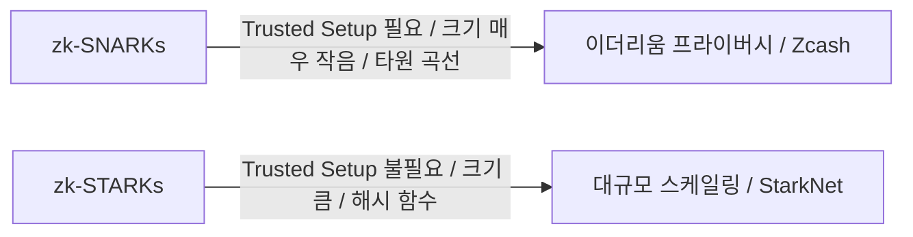

# 영지식 증명(zk-SNARKs/zk-STARKs)의 기초: Web3의 미래를 지탱하는 암호 기술

현대 디지털 사회에서 프라이버시와 보안은 상충하는 과제로 가로막혀 왔습니다. "자신의 신원을 증명하기 위해 개인 정보를 공개해야 한다"는 딜레마입니다. 그러나 암호학의 돌파구인 "영지식 증명(Zero-Knowledge Proof: ZKP)"은 이 패러다임을 근본부터 뒤집습니다.

본 기사에서는 영지식 증명에 대한 직관적인 이해부터 zk-SNARKs나 zk-STARKs 같은 최첨단 수학적 메커니즘, 그리고 블록체인의 스케일링(ZK-Rollup)과 프라이버시 보호로의 응용까지 깊이 파고들어 해설합니다.

## 1. 영지식 증명이란 무엇인가? '알리바바의 동굴' 메타포

영지식 증명이란, "어떤 명제가 참이라는 것을, 그 명제가 참이라는 것 이외의 어떠한 정보도 누설하지 않고 증명하는" 암호학적 기법입니다.

이 난해한 개념을 직관적으로 이해하기 위해, 장 자크 키스케이터(Jean-Jacques Quisquater) 등이 고안한 유명한 '알리바바의 동굴(동굴의 메타포)'을 사용하여 설명해보겠습니다.

**스토리:**
고리 모양의 동굴이 있고, 가장 안쪽에는 '마법의 문'이 있습니다. 이 문은 비밀 암호를 말하지 않으면 열리지 않습니다. 증명자인 Peggy는 암호를 알고 있으며, 검증자인 Victor에게 "나는 암호를 알고 있다"고 증명하고 싶어 합니다. 하지만 Peggy는 Victor에게 암호 자체를 알려주고 싶지 않습니다.

**증명 프로세스:**
1. Victor가 동굴 밖에서 기다리는 동안, Peggy는 동굴에 들어가 오른쪽 통로 또는 왼쪽 통로 중 하나로 나아갑니다.
2. Victor는 동굴 입구로 나아가 "오른쪽에서 나와라" 또는 "왼쪽에서 나와라"라고 무작위로 지시를 내립니다.
3. Peggy가 정말로 암호를 알고 있다면, 어떤 지시를 받더라도 필요에 따라 마법의 문을 열고 지정된 쪽으로 나올 수 있습니다.
4. 이것을 1번만 했을 경우, Peggy가 우연히 올바른 쪽에 있었을 뿐(50%의 확률)일 수도 있습니다. 하지만 이 과정을 20번 반복하여 Peggy가 모두 정답을 맞힌다면, 그녀가 우연히 성공할 확률은 1 / 2^20 (약 100만 분의 1)이 됩니다.
5. 결과적으로 Victor는 "Peggy는 틀림없이 암호를 알고 있다"고 확신하지만, 암호 자체는 전혀 알지 못합니다.

이것이 영지식 증명의 기본 원리입니다. 디지털 세계에서는 이를 고도의 수학(다항식, 타원 곡선 암호 등)을 사용하여 구현합니다.

## 2. zk-SNARKs의 수학적 메커니즘

영지식 증명을 블록체인이나 소프트웨어에서 실용화하기 위한 대표적인 구현이 **zk-SNARKs (Zero-Knowledge Succinct Non-Interactive Argument of Knowledge)** 입니다.

SNARKs의 각 글자에는 중요한 의미가 있습니다.
- **Succinct(간결함)**: 증명 크기가 매우 작아 수 밀리초 만에 검증할 수 있다.
- **Non-Interactive(비대화형)**: 증명자와 검증자 사이에 여러 번 상호작용(알리바바의 동굴처럼)을 할 필요가 없으며, 한 번의 데이터 전송으로 완결된다.
- **Argument of Knowledge(지식의 논증)**: 증명자가 정말로 정보를 가지고 있다는 것을 계산량적으로 보증한다.

### 다항식으로의 변환 (Arithmetization)
zk-SNARKs는 증명하고자 하는 '계산 프로그램'이나 '로직'을 수학적인 '다항식(Polynomials)'으로 변환하는 것에서 시작합니다.

프로그램의 로직은 R1CS(Rank-1 Constraint System)라 불리는 제약 시스템으로 변환되고, 다시 QAP(Quadratic Arithmetic Program)라는 형식의 다항식 문제로 귀결됩니다.
"두 다항식이 다수의 점에서 일치한다면, 그 두 다항식은 거의 확실히 같은 것이다"라는 슈워츠-지펠 보조정리(Schwartz-Zippel Lemma)를 활용하여, 방대한 계산의 정확성을 소수의 점을 평가하는 것만으로 순식간에 검증할 수 있도록 합니다.

### 암호학적 커밋먼트와 타원 곡선 페어링
계산 결과를 증명하기 위해, 증명자는 다항식의 값에 대해 '암호학적 커밋먼트'를 생성합니다. 이는 "나중에 내용을 변경할 수 없도록, 상자에 자물쇠를 채워 제출하는" 것과 같습니다.
zk-SNARKs에서는 타원 곡선 페어링(Elliptic Curve Pairing)이라는 고도의 암호 기술을 사용하여, 암호화된 상태 그대로 다항식의 계산이 올바르게 이루어졌는지 검증합니다. 이를 통해 "정보를 숨긴 채 계산의 정확성을 증명하는" 것이 가능해집니다.

### Trusted Setup (신뢰할 수 있는 초기 설정)
zk-SNARKs의 가장 큰 약점이라고도 할 수 있는 것이 'Trusted Setup(신뢰할 수 있는 초기 설정)'의 필요성입니다.
시스템을 시작할 때, 증명과 검증을 위한 '공통 참조 문자열(CRS: Common Reference String)'이라 불리는 암호론적 매개변수를 생성해야 합니다. 이 생성 과정에서 '독성 폐기물(Toxic Waste)'이라 불리는 비밀 무작위 데이터가 사용되며, 이것이 파기되지 않고 유출되면 누구나 가짜 증명을 만들 수 있는(시스템이 붕괴되는) 위험이 있습니다.
따라서 여러 사람이 참여하는 MPC(다자간 연산)를 활용한 'Ceremony'라는 의식을 통해, 참여자 중 최소 1명이라도 정직하게 데이터를 파기하면 안전이 유지되는 방식을 취하고 있습니다.

## 3. zk-STARKs: 투명성과 확장성

zk-SNARKs의 과제(Trusted Setup의 필요성과 양자 컴퓨터에 대한 취약성)를 해결하기 위해 개발된 것이 **zk-STARKs (Zero-Knowledge Scalable Transparent Argument of Knowledge)** 입니다.

### 투명성 (Transparent)
STARKs의 가장 큰 특징은 'T (Transparent = 투명성)'입니다. STARKs는 타원 곡선 페어링 등 복잡한 암호 기술을 사용하지 않고, 충돌 저항성이 있는 해시 함수에만 의존합니다.
그렇기 때문에 SNARKs 같은 Trusted Setup이 전혀 필요 없으며, 시스템이 처음부터 투명하고 안전하게 구축됩니다.

### 양자 내성과 확장성
해시 함수에만 의존하고 있기 때문에, STARKs는 이론상 미래의 양자 컴퓨터 공격에 대해서도 내성이 있습니다(양자 내성 암호).
또한 STARKs는 증명 생성 시간이 SNARKs보다 뛰어난 경우가 많아, 매우 대규모 계산 증명에 적합합니다. 다만 증명의 데이터 크기가 SNARKs(수백 바이트)에 비해 크게 크다(수십~수백 킬로바이트)는 트레이드오프가 있습니다.

## 4. Web3에서의 응용: 스케일링과 프라이버시

영지식 증명은 블록체인이 안고 있는 두 가지 큰 과제인 '확장성'과 '프라이버시'를 동시에 해결할 마법의 지팡이로 기대받고 있습니다.

### ZK-Rollup을 통한 스케일링
이더리움 등 퍼블릭 블록체인은 모든 사람이 모든 트랜잭션을 검증하기 때문에, 처리 속도(TPS)가 느리고 수수료(가스비)가 급등하는 문제가 있습니다.
ZK-Rollup은 메인 체인(Layer 1)의 바깥(Layer 2)에서 수천~수만 건의 트랜잭션을 묶어(Rollup) 처리하고, 그 "계산이 올바르게 수행되었다는 영지식 증명(SNARK/STARK)"만을 메인 체인에 제출합니다.
메인 체인은 무거운 계산을 다시 실행할 필요 없이, 제출된 작은 증명을 수 밀리초 안에 검증하기만 하면 됩니다. 이로써 보안을 희생하지 않고도 네트워크 처리 능력을 극적으로 향상시킬 수 있습니다.

### 트랜잭션 프라이버시 보호
퍼블릭 블록체인은 모든 거래 내역이 공개되지만, 이는 기업이나 개인 이용에 있어 큰 장벽이 됩니다.
Zcash 같은 암호화폐나 Tornado Cash 같은 프로토콜에서는 영지식 증명을 사용해 '송금자', '수취인', '금액'을 암호화하여 숨긴 채, "확실히 올바른 토큰을 소유하고 있으며, 이중 지불을 하지 않았다"는 사실만을 네트워크에 증명하여 거래를 승인받습니다.
더 나아가 최근에는 영지식 증명을 사용한 분산형 ID(zk-DID)를 통해, 생년월일이나 여권 정보를 밝히지 않고도 "18세 이상이라는 것"이나 "특정 국적을 가지고 있다는 것"을 증명하는 기술도 상용화되고 있습니다.

## 결론

영지식 증명(zk-SNARKs/zk-STARKs)은 단순한 암호화폐만을 위한 기술이 아니라, 인터넷 전체의 정보 취급 방식을 근본적으로 바꿀 잠재력을 지니고 있습니다.
"프라이버시를 보호하면서 신뢰를 증명한다"는 특성은 AI 시대의 데이터 진위 판별이나 안전한 금융 거래, 개인정보의 자기 주권형 관리(Self-Sovereign Identity)에 필수적인 인프라가 될 것입니다.
수학의 마법이라고도 할 수 있는 이 기술이, 어떻게 사회의 트러스트(신뢰)를 재정의해 나갈지 그 진화에서 눈을 뗄 수 없습니다.
