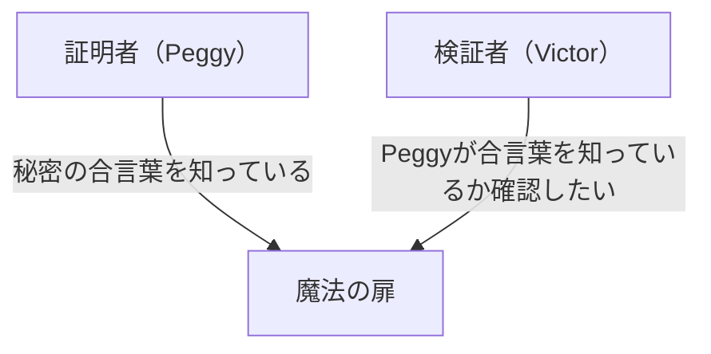
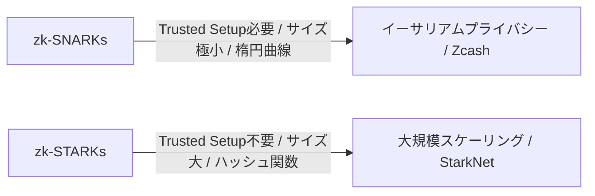

# ゼロ知識証明（zk-SNARKs/zk-STARKs）の基礎：Web3の未来を支える暗号技術

現代のデジタル社会において、プライバシーとセキュリティは相反する課題として立ちはだかってきました。「自分の身元を証明するために、個人情報を開示しなければならない」というジレンマです。しかし、暗号学のブレークスルーである「ゼロ知識証明（Zero-Knowledge Proof: ZKP）」は、このパラダイムを根本から覆します。

本記事では、ゼロ知識証明の直感的な理解から、zk-SNARKsやzk-STARKsといった最先端の数学的メカニズム、そしてブロックチェーンのスケーリング（ZK-Rollup）やプライバシー保護への応用まで、深く掘り下げて解説します。

## 1. ゼロ知識証明とは何か？「アリババの洞窟」のメタファー

ゼロ知識証明とは、「ある命題が真であることを、その命題が真であること以外のいかなる情報も漏らすことなく証明する」暗号学的な手法です。

この難解な概念を直感的に理解するために、ジャン＝ジャック・キスケーターらが考案した有名な「アリババの洞窟（洞窟のメタファー）」を用いて説明しましょう。

**ストーリー:**
リング状の洞窟があり、最奥部には「魔法の扉」があります。この扉は、秘密の合言葉を唱えなければ開きません。証明者のPeggyは合言葉を知っており、検証者のVictorに「私は合言葉を知っている」と証明したいと考えます。しかし、PeggyはVictorに合言葉そのものを教えたくありません。

**証明のプロセス:**
1. Victorが洞窟の外で待っている間、Peggyは洞窟に入り、右の通路か左の通路のどちらかに進みます。
2. Victorは洞窟の入り口に進み、「右から出てこい」または「左から出てこい」とランダムに指示を出します。
3. Peggyが本当に合言葉を知っていれば、どちらの指示を出されても、必要に応じて魔法の扉を開けて指定された側から出てくることができます。
4. これを1回だけ行った場合、Peggyが偶然正しい側にいただけ（50%の確率）かもしれません。しかし、このプロセスを20回繰り返してPeggyがすべて正解した場合、彼女が偶然成功する確率は 1 / 2^20（約100万分の1）となります。
5. 結果として、Victorは「Peggyは間違いなく合言葉を知っている」と確信しますが、合言葉自体は一切知らされていません。

これがゼロ知識証明の基本原理です。デジタル世界では、これを高度な数学（多項式、楕円曲線暗号など）を用いて実現します。

## 2. zk-SNARKsの数学的メカニズム

ゼロ知識証明をブロックチェーンやソフトウェアで実用化するための代表的な実装が **zk-SNARKs (Zero-Knowledge Succinct Non-Interactive Argument of Knowledge)** です。

SNARKsの各文字には重要な意味があります。
- **Succinct（簡潔）**: 証明のサイズが非常に小さく、数ミリ秒で検証できる。
- **Non-Interactive（非対話型）**: 証明者と検証者の間で何度もやり取り（アリババの洞窟のように）をする必要がなく、一度のデータ送信で完結する。
- **Argument of Knowledge（知識の論証）**: 証明者が本当に情報を持っていることを計算量的に保証する。

### 多項式への変換 (Arithmetization)
zk-SNARKsは、証明したい「計算プログラム」や「ロジック」を、数学的な「多項式（Polynomials）」に変換することから始まります。

プログラムのロジックは、R1CS（Rank-1 Constraint System）と呼ばれる制約システムに変換され、さらにQAP（Quadratic Arithmetic Program）という形式の多項式問題に落とし込まれます。
「2つの多項式が多数の点で一致するなら、その2つの多項式はほぼ確実に同じものである」というシュワルツ・ジッペルの補題（Schwartz-Zippel Lemma）を利用し、膨大な計算の正しさを、少数の点の評価だけで瞬時に検証できるようにします。

### 暗号学的コミットメントと楕円曲線ペアリング
計算結果を証明するために、証明者は多項式の値に対して「暗号学的コミットメント」を作成します。これは、「後で内容を変更できないように、箱に鍵をかけて提出する」ようなものです。
zk-SNARKsでは、楕円曲線ペアリング（Elliptic Curve Pairing）という高度な暗号技術を用いて、暗号化された状態のまま多項式の計算が正しく行われたかを検証します。これにより、「情報を隠したまま、計算の正しさを証明する」ことが可能になります。

### Trusted Setup（信頼された初期設定）
zk-SNARKsの最大の弱点とも言えるのが、「Trusted Setup（信頼された初期設定）」の必要性です。
システムを立ち上げる際に、証明と検証のための「共通参照文字列（CRS: Common Reference String）」と呼ばれる暗号論的なパラメータを生成する必要があります。この生成過程で「有毒な廃棄物（Toxic Waste）」と呼ばれる秘密のランダムデータが使われ、これが破棄されずに漏洩すると、誰でも偽の証明を作れてしまう（システムが崩壊する）というリスクがあります。
このため、複数人が参加するMPC（マルチパーティ計算）を用いた「Ceremony」と呼ばれる儀式を通じて、参加者のうち少なくとも1人が正直にデータを破棄すれば安全が保たれる仕組みが取られています。

## 3. zk-STARKs：透明性とスケーラビリティ

zk-SNARKsの課題（Trusted Setupの必要性と、量子コンピュータに対する脆弱性）を解決するために開発されたのが、**zk-STARKs (Zero-Knowledge Scalable Transparent Argument of Knowledge)** です。

### 透明性 (Transparent)
STARKsの最大の特徴は「T (Transparent = 透明)」です。STARKsは、楕円曲線ペアリングなどの複雑な暗号技術を使わず、衝突耐性のあるハッシュ関数のみに依存しています。
そのため、SNARKsのようなTrusted Setupが一切不要であり、システムが最初から透明で安全に構築されます。

### 量子耐性とスケーラビリティ
ハッシュ関数にのみ依存しているため、STARKsは理論上、将来の量子コンピュータによる攻撃に対しても耐性があります（耐量子計算機暗号）。
また、STARKsは証明の生成時間はSNARKsより優れている場合が多く、非常に大規模な計算の証明に向いています。ただし、証明のデータサイズがSNARKs（数百バイト）に比べて大幅に大きい（数十〜数百キロバイト）というトレードオフがあります。

## 4. Web3における応用：スケーリングとプライバシー

ゼロ知識証明は、ブロックチェーンが抱える2つの大きな課題、「スケーラビリティ」と「プライバシー」を同時に解決する魔法の杖として期待されています。

### ZK-Rollupによるスケーリング
イーサリアムなどのパブリックブロックチェーンは、全員がすべてのトランザクションを検証するため、処理速度（TPS）が遅く、手数料（Gas代）が高騰する問題があります。
ZK-Rollupは、メインチェーン（Layer 1）の外側（Layer 2）で数千〜数万件のトランザクションをまとめて（Rollup）処理し、その「計算が正しく行われたことのゼロ知識証明（SNARK/STARK）」だけをメインチェーンに提出します。
メインチェーンは、重い計算を再実行することなく、提出された小さな証明を数ミリ秒で検証するだけで済みます。これにより、セキュリティを犠牲にすることなく、ネットワークの処理能力を劇的に向上させることができます。

### トランザクションのプライバシー保護
パブリックブロックチェーンはすべての取引履歴が公開されますが、これは企業や個人の利用において大きな障壁となります。
Zcashのような暗号資産や、Tornado Cashのようなプロトコルでは、ゼロ知識証明を用いて「送金者」「受取人」「金額」を暗号化して隠したまま、「確かに正しいトークンを所有しており、二重支払いをしていない」ことだけをネットワークに証明し、取引を承認させます。
さらに最近では、ゼロ知識証明を用いた分散型ID（zk-DID）により、「18歳以上であること」や「特定の国籍を持っていること」を、生年月日やパスポート情報を明かすことなく証明する技術も実用化されつつあります。

## 結論

ゼロ知識証明（zk-SNARKs/zk-STARKs）は、単なる暗号通貨のための技術ではなく、インターネット全体の情報の扱い方を根本から変えるポテンシャルを秘めています。
「プライバシーを守りながら、信頼を証明する」という特性は、AIの時代のデータの真贋判定や、セキュアな金融取引、個人情報の自己主権型管理（Self-Sovereign Identity）において不可欠なインフラとなるでしょう。
数学の魔法とも言えるこの技術が、どのように社会のトラスト（信用）を再定義していくのか、その進化から目が離せません。
