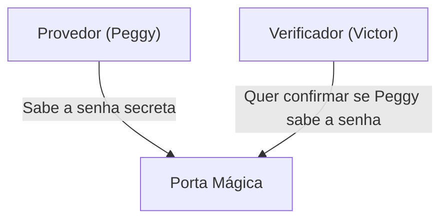
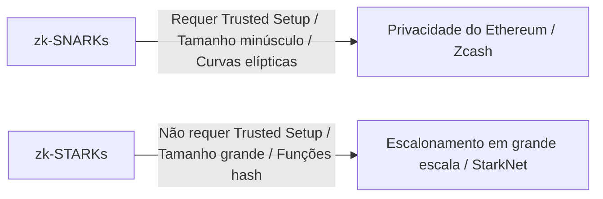

# Fundamentos das Provas de Conhecimento Zero (zk-SNARKs/zk-STARKs): A Tecnologia Criptográfica que Sustenta o Futuro da Web3

Na sociedade digital moderna, privacidade e segurança têm se destacado como questões conflitantes. É o dilema de "ter que revelar informações pessoais para provar a sua identidade". No entanto, a "Prova de Conhecimento Zero (Zero-Knowledge Proof: ZKP)", um grande avanço na criptografia, subverte fundamentalmente este paradigma.

Neste artigo, aprofundaremos desde o entendimento intuitivo das provas de conhecimento zero até os mecanismos matemáticos de ponta, como zk-SNARKs e zk-STARKs, e sua aplicação em escalonamento de blockchain (ZK-Rollup) e proteção de privacidade.

## 1. O que é uma Prova de Conhecimento Zero? A Metáfora da "Caverna de Ali Babá"

A prova de conhecimento zero é um método criptográfico para "provar que uma determinada proposição é verdadeira sem vazar nenhuma outra informação além do fato de que a proposição é verdadeira".

Para entender esse conceito complexo intuitivamente, vamos usar a famosa "Caverna de Ali Babá (a metáfora da caverna)", inventada por Jean-Jacques Quisquater e outros.

**A História:**
Existe uma caverna em formato de anel, e na parte mais profunda há uma "Porta Mágica". Esta porta não se abrirá a menos que você diga a senha secreta. A provadora Peggy conhece a senha e quer provar ao verificador Victor: "Eu sei a senha". No entanto, Peggy não quer revelar a senha em si para Victor.

**O Processo de Prova:**
1. Enquanto Victor espera do lado de fora da caverna, Peggy entra na caverna e segue pelo caminho da direita ou da esquerda.
2. Victor vai até a entrada da caverna e aleatoriamente dá a instrução: "Saia pela direita" ou "Saia pela esquerda".
3. Se Peggy realmente souber a senha, não importa qual instrução lhe seja dada, ela poderá abrir a porta mágica se necessário e sair pelo lado especificado.
4. Se isso for feito apenas uma vez, Peggy pode simplesmente ter estado no lado certo por acaso (50% de probabilidade). No entanto, se esse processo for repetido 20 vezes e Peggy acertar todas elas, a probabilidade de ela ter sucesso por acaso é de 1 / 2^20 (cerca de 1 em um milhão).
5. Como resultado, Victor fica convencido de que "Peggy definitivamente conhece a senha", mas não aprende a senha em si em nenhum momento.

Este é o princípio básico da prova de conhecimento zero. No mundo digital, isso é realizado usando matemática avançada (polinômios, criptografia de curva elíptica, etc.).

## 2. O Mecanismo Matemático dos zk-SNARKs

Uma das implementações mais proeminentes para o uso prático de provas de conhecimento zero em blockchains e softwares são os **zk-SNARKs (Zero-Knowledge Succinct Non-Interactive Argument of Knowledge)**.

Cada letra de SNARKs tem um significado importante.
- **Succinct (Sucinto)**: O tamanho da prova é muito pequeno e pode ser verificado em milissegundos.
- **Non-Interactive (Não-Interativo)**: Não há necessidade de múltiplas interações entre o provador e o verificador (como na caverna de Ali Babá); tudo é concluído com uma única transmissão de dados.
- **Argument of Knowledge (Argumento de Conhecimento)**: Garante computacionalmente que o provador realmente possui a informação.

### Transformação em Polinômios (Arithmetization)
Os zk-SNARKs começam transformando o "programa computacional" ou a "lógica" que você deseja provar em "polinômios" matemáticos.

A lógica do programa é convertida em um sistema de restrições chamado R1CS (Rank-1 Constraint System) e, em seguida, reduzida a um problema polinomial na forma de um QAP (Quadratic Arithmetic Program).
Ao utilizar o Lema de Schwartz-Zippel, que afirma que "se dois polinômios concordam em muitos pontos, eles são quase certamente o mesmo polinômio", a correção de cálculos massivos pode ser verificada instantaneamente avaliando-os em apenas um pequeno número de pontos.

### Comprometimento Criptográfico e Emparelhamento de Curvas Elípticas
Para provar o resultado do cálculo, o provador cria um "comprometimento criptográfico" para o valor do polinômio. Isso é como "colocar a informação em uma caixa trancada e enviá-la para que o conteúdo não possa ser alterado depois".
Nos zk-SNARKs, uma técnica criptográfica avançada chamada emparelhamento de curvas elípticas (Elliptic Curve Pairing) é usada para verificar se o cálculo do polinômio foi executado corretamente enquanto permanece criptografado. Isso torna possível "provar a correção de um cálculo mantendo a informação oculta".

### Trusted Setup (Configuração Confiável)
Talvez a maior fraqueza dos zk-SNARKs seja a necessidade de um "Trusted Setup (Configuração Confiável)".
Ao iniciar o sistema, parâmetros criptográficos chamados de "String de Referência Comum (CRS: Common Reference String)" devem ser gerados para a prova e verificação. Esse processo de geração usa dados aleatórios secretos chamados de "Lixo Tóxico (Toxic Waste)". Se isso não for destruído e vazar, existe o risco de que qualquer pessoa possa criar provas falsas (o sistema entraria em colapso).
Por esse motivo, é utilizado um mecanismo através de um ritual chamado "Ceremony (Cerimônia)", que emprega computação multipartida (MPC) com múltiplos participantes, onde a segurança é mantida se pelo menos um dos participantes descartar honestamente os dados.

## 3. zk-STARKs: Transparência e Escalabilidade

Os **zk-STARKs (Zero-Knowledge Scalable Transparent Argument of Knowledge)** foram desenvolvidos para resolver os problemas dos zk-SNARKs (a necessidade de um Trusted Setup e a vulnerabilidade a computadores quânticos).

### Transparência (Transparent)
A maior característica dos STARKs é o "T (Transparent = Transparente)". Os STARKs não utilizam técnicas criptográficas complexas, como emparelhamento de curvas elípticas, mas dependem apenas de funções hash resistentes a colisões.
Como resultado, não há a menor necessidade de um Trusted Setup como nos SNARKs, e o sistema é construído de forma transparente e segura desde o início.

### Resistência Quântica e Escalabilidade
Por dependerem apenas de funções hash, os STARKs são, teoricamente, resistentes até mesmo a ataques de futuros computadores quânticos (criptografia pós-quântica).
Além disso, os STARKs frequentemente têm tempos de geração de provas melhores que os SNARKs, tornando-os adequados para provar cálculos de altíssima escala. No entanto, há um compromisso: o tamanho dos dados da prova é significativamente maior (dezenas a centenas de kilobytes) comparado aos SNARKs (centenas de bytes).

## 4. Aplicações na Web3: Escalonamento e Privacidade

Espera-se que as provas de conhecimento zero sejam a varinha mágica que resolverá simultaneamente dois grandes problemas enfrentados pelas blockchains: "escalabilidade" e "privacidade".

### Escalonamento via ZK-Rollup
Blockchains públicas como o Ethereum sofrem com velocidades de processamento lentas (TPS) e taxas elevadas (Gas), porque todos devem verificar todas as transações.
O ZK-Rollup agrupa (rollup) e processa milhares a dezenas de milhares de transações fora (Camada 2) da cadeia principal (Camada 1), e envia apenas a "prova de conhecimento zero (SNARK/STARK) de que o cálculo foi realizado corretamente" para a cadeia principal.
A cadeia principal só precisa verificar a pequena prova submetida em alguns milissegundos, sem ter que reexecutar cálculos pesados. Isso pode aumentar drasticamente a capacidade de processamento da rede sem sacrificar a segurança.

### Proteção de Privacidade das Transações
Nas blockchains públicas, o histórico de todas as transações é público, o que representa uma grande barreira para o uso por empresas e indivíduos.
Criptoativos como o Zcash e protocolos como o Tornado Cash usam provas de conhecimento zero para criptografar e ocultar o "remetente", o "destinatário" e o "valor", enquanto provam à rede apenas que "o token correto é realmente de propriedade do indivíduo e não houve gasto duplo", permitindo que a transação seja aprovada.
Mais recentemente, por meio de identidades descentralizadas usando provas de conhecimento zero (zk-DID), tecnologias que provam coisas como "ter mais de 18 anos" ou "ter uma nacionalidade específica" sem revelar a data de nascimento ou os dados do passaporte estão se tornando viáveis na prática.

## Conclusão

As provas de conhecimento zero (zk-SNARKs/zk-STARKs) não são apenas uma tecnologia para criptomoedas, mas têm o potencial de mudar fundamentalmente a maneira como a informação é tratada em toda a Internet.
A característica de "provar a confiança enquanto protege a privacidade" se tornará uma infraestrutura essencial para a verificação de autenticidade de dados na era da IA, transações financeiras seguras e gestão auto-soberana de informações pessoais (Self-Sovereign Identity).
Não podemos tirar os olhos de como essa tecnologia, que pode ser chamada de mágica matemática, redefinirá a confiança (trust) na sociedade enquanto evolui.
