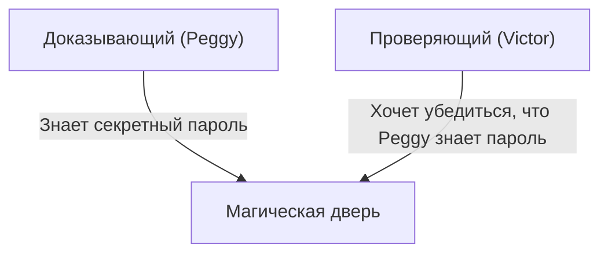
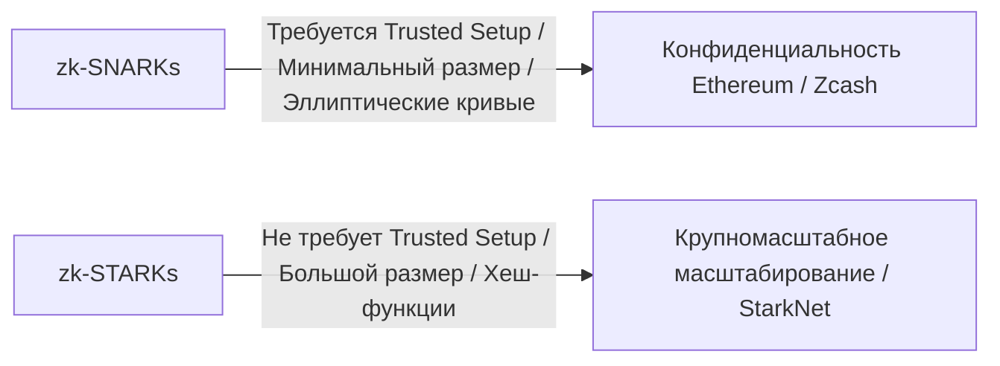

# Основы доказательств с нулевым разглашением (zk-SNARKs/zk-STARKs): Криптографическая технология, поддерживающая будущее Web3

В современном цифровом обществе конфиденциальность и безопасность всегда выступали в роли противоречащих друг другу проблем. Дилемма заключается в том, что «для подтверждения своей личности необходимо раскрывать личную информацию». Однако криптографический прорыв под названием «Доказательство с нулевым разглашением» (Zero-Knowledge Proof: ZKP) в корне меняет эту парадигму.

В этой статье мы подробно рассмотрим концепцию доказательств с нулевым разглашением, начиная от интуитивного понимания и заканчивая передовыми математическими механизмами, такими как zk-SNARKs и zk-STARKs, а также их применением для масштабирования блокчейнов (ZK-Rollup) и защиты конфиденциальности.

## 1. Что такое доказательство с нулевым разглашением? Метафора «Пещеры Али-Бабы»

Доказательство с нулевым разглашением — это криптографический метод, который позволяет «доказать, что определенное утверждение истинно, не раскрывая при этом никакой другой информации, кроме самого факта истинности этого утверждения».

Чтобы интуитивно понять эту сложную концепцию, давайте используем знаменитую метафору «Пещеры Али-Бабы» (или метафору пещеры), придуманную Жан-Жаком Кискатером и его коллегами.

**История:**
Представьте себе пещеру в форме кольца, в глубине которой находится «Магическая дверь». Эта дверь открывается только в том случае, если произнести секретный пароль. Доказывающая сторона, Peggy, знает пароль и хочет доказать проверяющей стороне, Victor'у: «Я знаю пароль». Однако Peggy не хочет раскрывать сам пароль Victor'у.

**Процесс доказательства:**
1. Пока Victor ждет снаружи пещеры, Peggy входит внутрь и идет либо по правому, либо по левому проходу.
2. Victor подходит ко входу в пещеру и случайным образом приказывает: «Выйди справа» или «Выйди слева».
3. Если Peggy действительно знает пароль, она сможет, при необходимости открыв магическую дверь, выйти с той стороны, которую указал Victor, независимо от его выбора.
4. Если проделать это всего один раз, то, возможно, Peggy просто повезло оказаться на правильной стороне (вероятность 50%). Но если повторить этот процесс 20 раз и Peggy каждый раз выйдет правильно, вероятность того, что она преуспеет случайно, составит 1 / 2^20 (примерно 1 шанс на миллион).
5. В результате Victor будет уверен, что «Peggy несомненно знает пароль», но при этом сам пароль так и останется ему неизвестен.

Это и есть базовый принцип доказательства с нулевым разглашением. В цифровом мире это реализуется с использованием высшей математики (полиномы, криптография на эллиптических кривых и т. д.).

## 2. Математический механизм zk-SNARKs

Одним из ведущих внедрений, позволяющих применять доказательства с нулевым разглашением на практике в блокчейнах и программном обеспечении, является **zk-SNARKs (Zero-Knowledge Succinct Non-Interactive Argument of Knowledge)**.

Каждая буква в аббревиатуре SNARKs имеет важное значение:
- **Succinct (Краткий)**: Размер доказательства чрезвычайно мал, и его можно проверить за несколько миллисекунд.
- **Non-Interactive (Неинтерактивный)**: Нет необходимости в многократном обмене сообщениями между доказывающим и проверяющим (как в пещере Али-Бабы); весь процесс завершается одной передачей данных.
- **Argument of Knowledge (Аргумент знания)**: Вычислительно гарантирует, что доказывающая сторона действительно обладает информацией.

### Преобразование в полиномы (Арифметизация)
zk-SNARKs начинается с преобразования «вычислительной программы» или «логики», которую нужно доказать, в математические «полиномы» (многочлены).

Логика программы преобразуется в систему ограничений, называемую R1CS (Rank-1 Constraint System), а затем сводится к полиномиальной проблеме в форме QAP (Quadratic Arithmetic Program).
Используя лемму Шварца-Зиппеля, которая гласит, что «если два полинома совпадают в большом количестве точек, то они почти наверняка идентичны», правильность огромного количества вычислений можно мгновенно проверить, оценив лишь небольшое количество точек.

### Криптографическое обязательство и спаривание на эллиптических кривых
Чтобы доказать результаты вычислений, доказывающая сторона создает «криптографическое обязательство» (commitment) для значений полинома. Это похоже на то, как если бы вы «положили данные в ящик, заперли его на ключ и передали, чтобы их нельзя было потом изменить».
В zk-SNARKs используется сложная криптографическая техника, называемая спариванием на эллиптических кривых (Elliptic Curve Pairing), для проверки правильности вычислений полиномов, пока они остаются в зашифрованном виде. Это позволяет «доказать правильность вычислений, скрывая саму информацию».

### Trusted Setup (Доверенная начальная настройка)
Пожалуй, самой большой слабостью zk-SNARKs является необходимость в «Доверенной начальной настройке» (Trusted Setup).
При запуске системы необходимо сгенерировать криптографические параметры, называемые «Общей ссылочной строкой» (CRS: Common Reference String), для доказательства и проверки. В процессе этой генерации используются секретные случайные данные, называемые «токсичными отходами» (Toxic Waste), и если они не будут уничтожены и произойдет утечка, любой сможет создать фальшивые доказательства (что приведет к краху системы).
По этой причине используется механизм под названием «Церемония» (Ceremony) с применением многосторонних вычислений (MPC), в котором участвуют несколько человек; система остается безопасной, если хотя бы один из участников честно уничтожит свои данные.

## 3. zk-STARKs: Прозрачность и масштабируемость

Для решения проблем zk-SNARKs (необходимость Trusted Setup и уязвимость перед квантовыми компьютерами) были разработаны **zk-STARKs (Zero-Knowledge Scalable Transparent Argument of Knowledge)**.

### Прозрачность (Transparent)
Самая важная особенность STARKs — это буква «T» (Transparent = Прозрачный). STARKs не используют сложные криптографические методы, такие как спаривание на эллиптических кривых, а полагаются исключительно на устойчивые к коллизиям хеш-функции.
Поэтому Trusted Setup, как в SNARKs, совершенно не требуется, и система изначально строится прозрачной и безопасной.

### Квантовая устойчивость и масштабируемость
Поскольку STARKs полагаются только на хеш-функции, теоретически они устойчивы к атакам со стороны будущих квантовых компьютеров (постквантовая криптография).
Кроме того, время генерации доказательств в STARKs часто превосходит показатели SNARKs, что делает их идеальными для доказательства крупномасштабных вычислений. Однако есть и компромисс: размер данных доказательства (от десятков до сотен килобайт) значительно больше по сравнению со SNARKs (сотни байт).

## 4. Применение в Web3: Масштабирование и конфиденциальность

Ожидается, что доказательства с нулевым разглашением станут «волшебной палочкой», которая одновременно решит две основные проблемы блокчейна: «масштабируемость» и «конфиденциальность».

### Масштабирование с помощью ZK-Rollup
Публичные блокчейны, такие как Ethereum, страдают от низкой скорости обработки (TPS) и высоких комиссий (Gas), поскольку каждый участник проверяет все транзакции.
ZK-Rollup объединяет (Rollup) и обрабатывает тысячи или десятки тысяч транзакций вне основной цепи (Layer 2) и отправляет в основную цепь (Layer 1) только «доказательство с нулевым разглашением (SNARK/STARK) правильности выполнения вычислений».
Основной цепи не нужно повторно выполнять тяжелые вычисления, достаточно за несколько миллисекунд проверить представленное небольшое доказательство. Это позволяет радикально повысить пропускную способность сети без ущерба для безопасности.

### Защита конфиденциальности транзакций
В публичных блокчейнах история всех транзакций открыта, что является серьезным препятствием для корпоративного и личного использования.
В криптоактивах, таких как Zcash, или протоколах, таких как Tornado Cash, доказательства с нулевым разглашением используются для шифрования и сокрытия «отправителя», «получателя» и «суммы», доказывая сети только то, что «человек действительно владеет правильными токенами и не совершает двойную трату», позволяя одобрить транзакцию.
Более того, в последнее время благодаря децентрализованным идентификаторам (zk-DID) на основе доказательств с нулевым разглашением технологии позволяют доказать, что вы «старше 18 лет» или «имеете гражданство определенной страны», без раскрытия даты рождения или паспортных данных, и эти технологии уже начинают применяться на практике.

## Заключение

Доказательства с нулевым разглашением (zk-SNARKs/zk-STARKs) — это не просто технология для криптовалют, они обладают потенциалом в корне изменить то, как мы обращаемся с информацией во всем интернете.
Свойство «доказывать доверие, сохраняя при этом конфиденциальность» станет незаменимой инфраструктурой для проверки подлинности данных в эпоху ИИ, безопасных финансовых транзакций и суверенного управления личной информацией (Self-Sovereign Identity).
Невозможно оторвать взгляд от того, как эта технология, которую можно назвать математической магией, продолжит развиваться и переопределять доверие в обществе.
