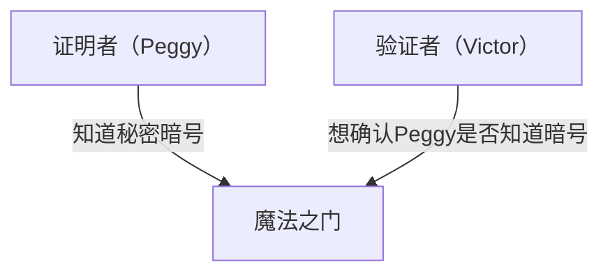
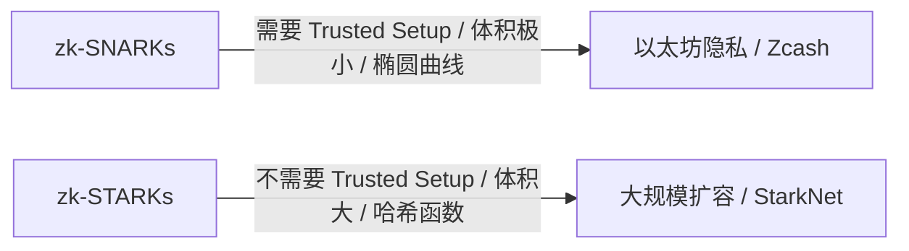

# 零知识证明（zk-SNARKs/zk-STARKs）基础：支撑 Web3 未来的密码学技术

在现代数字社会中，隐私和安全一直是一对相互矛盾的挑战。这是一种困境：“为了证明自己的身份，必须披露个人信息”。然而，作为密码学的一项重大突破，“零知识证明（Zero-Knowledge Proof: ZKP）”正在从根本上颠覆这一范式。

本文将从直观理解零知识证明开始，深入探讨 zk-SNARKs 和 zk-STARKs 等最前沿的数学机制，并详细解析它们在区块链扩容（ZK-Rollup）和隐私保护等方面的应用。

## 1. 什么是零知识证明？“阿里巴巴山洞”的比喻

零知识证明是一种密码学方法，它指的是“证明某个命题为真，但除了该命题为真之外，不泄露任何其他信息”。

为了直观地理解这个深奥的概念，我们将使用让-雅克·基斯克特（Jean-Jacques Quisquater）等人提出的著名的“阿里巴巴山洞（山洞的比喻）”来进行解释。

**故事背景:**
有一个环形的山洞，最深处有一扇“魔法之门”。这扇门只有在念出秘密暗号时才会打开。证明者 Peggy 知道这个暗号，她想向验证者 Victor 证明“我知道暗号”。但是，Peggy 不想把暗号本身告诉 Victor。

**证明过程:**
1. 当 Victor 在山洞外等待时，Peggy 走进山洞，并选择进入右边或左边的通道。
2. Victor 走到山洞入口，随机发出指示：“从右边出来”或“从左边出来”。
3. 如果 Peggy 真的知道暗号，无论 Victor 给出什么指示，她都可以根据需要打开魔法之门，并从指定的方向出来。
4. 如果只进行 1 次，Peggy 可能只是碰巧选对了方向（50% 的概率）。但是，如果将这个过程重复 20 次，并且 Peggy 每次都答对，那么她仅凭运气的成功概率只有 1 / 2^20（约一百万分之一）。
5. 结果，Victor 确信“Peggy 肯定知道暗号”，但他始终不知道暗号本身。

这就是零知识证明的基本原理。在数字世界中，这是通过高级数学（多项式、椭圆曲线密码学等）来实现的。

## 2. zk-SNARKs 的数学机制

**zk-SNARKs (Zero-Knowledge Succinct Non-Interactive Argument of Knowledge)** 是将零知识证明在区块链和软件中实用化的代表性实现。

SNARKs 的每个字母都具有重要意义：
- **Succinct（简洁的）**: 证明的体积非常小，只需几毫秒即可完成验证。
- **Non-Interactive（非交互式）**: 证明者和验证者之间不需要进行多次交互（不像阿里巴巴山洞那样），只需一次数据发送即可完成。
- **Argument of Knowledge（知识的论证）**: 在计算复杂度上保证证明者确实拥有该信息。

### 转化为多项式 (Arithmetization)
zk-SNARKs 首先将需要证明的“计算程序”或“逻辑”转换为数学上的“多项式（Polynomials）”。

程序的逻辑被转换为称为 R1CS（Rank-1 Constraint System，一阶约束系统）的约束系统，然后进一步映射为称为 QAP（Quadratic Arithmetic Program，二次算术程序）形式的多项式问题。
利用施瓦茨-齐佩尔引理（Schwartz-Zippel Lemma）——即“如果两个多项式在许多点上重合，那么这两个多项式几乎肯定是同一个多项式”，从而仅通过评估少数几个点，就能瞬间验证庞大计算的正确性。

### 密码学承诺与椭圆曲线配对
为了证明计算结果，证明者对多项式的值创建一个“密码学承诺”。这就像是“为了防止以后篡改内容，把它锁在一个盒子里提交”。
zk-SNARKs 使用一种叫做椭圆曲线配对（Elliptic Curve Pairing）的高级密码学技术，在保持加密状态的情况下，验证多项式的计算是否被正确执行。这使得“在隐藏信息的同时，证明计算的正确性”成为可能。

### Trusted Setup（可信初始化）
zk-SNARKs 最大的弱点可以说是需要“Trusted Setup（可信初始化）”。
在启动系统时，需要生成用于证明和验证的密码学参数，称为“公共参考字符串（CRS: Common Reference String）”。在这个生成过程中，会使用一种被称为“有毒废料（Toxic Waste）”的秘密随机数据。如果这些数据没有被销毁而遭到泄露，任何人都可以伪造证明（从而导致系统崩溃）。
因此，通常采用基于 MPC（多方计算）的称为“Ceremony（仪式）”的过程，只要参与者中至少有一人诚实地销毁了数据，系统的安全就能得到保障。

## 3. zk-STARKs：透明性与可扩展性

为了解决 zk-SNARKs 的问题（对 Trusted Setup 的需求以及对量子计算机的脆弱性），**zk-STARKs (Zero-Knowledge Scalable Transparent Argument of Knowledge)** 应运而生。

### 透明性 (Transparent)
STARKs 最大的特点是“T (Transparent = 透明)”。STARKs 不使用椭圆曲线配对等复杂的密码学技术，而是仅依赖于具有抗碰撞性的哈希函数。
因此，它完全不需要像 SNARKs 那样的 Trusted Setup，系统从一开始就是透明且安全构建的。

### 抗量子性与可扩展性
由于仅依赖哈希函数，STARKs 在理论上能够抵抗未来量子计算机的攻击（抗量子密码学）。
此外，STARKs 的证明生成时间通常优于 SNARKs，非常适合极大体量计算的证明。然而，随之而来的权衡是，其证明的数据大小（几十到几百 KB）比 SNARKs（几百字节）要大得多。

## 4. Web3 中的应用：扩容与隐私

零知识证明被寄予厚望，被视为能够同时解决区块链面临的两大难题——“可扩展性”和“隐私”——的魔杖。

### 通过 ZK-Rollup 进行扩容
像以太坊这样的公有链，由于每个人都要验证所有的交易，因此存在处理速度（TPS）慢、手续费（Gas费）高昂的问题。
ZK-Rollup 在主链（Layer 1）之外（Layer 2）将数千到数万笔交易打包（Rollup）处理，并且只向主链提交“计算已正确执行的零知识证明（SNARK/STARK）”。
主链无需重新执行繁重的计算，只需在几毫秒内验证提交的小巧证明即可。这在不牺牲安全性的前提下，极大地提升了网络的处理能力。

### 交易的隐私保护
公有链上的所有交易记录都是公开的，这成为了企业和个人用户使用的一大障碍。
在诸如 Zcash 这样的加密资产或 Tornado Cash 这样的协议中，使用零知识证明对“发送者”、“接收者”和“金额”进行加密隐藏，只向网络证明“确实拥有正确的代币且没有进行双花”，从而让交易获得批准。
此外，最近利用基于零知识证明的去中心化身份（zk-DID），可以在不泄露出生日期或护照信息的情况下，证明“已满18岁”或“拥有特定国籍”的技术也正在投入实际应用。

## 结论

零知识证明（zk-SNARKs/zk-STARKs）不仅仅是用于加密货币的技术，它还蕴含着从根本上改变整个互联网信息处理方式的潜力。
“在保护隐私的同时证明信任”这一特性，将成为人工智能时代数据真伪判定、安全的金融交易以及个人信息自主身份管理（Self-Sovereign Identity）不可或缺的基础设施。
这项被称为数学魔法的技术将如何重新定义社会的信任，其演进过程绝对不容错过。
