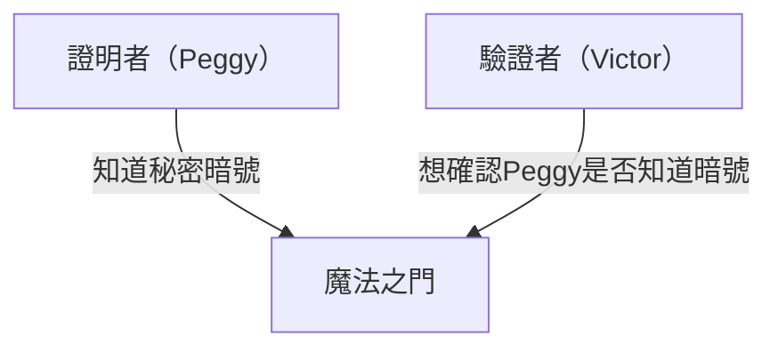
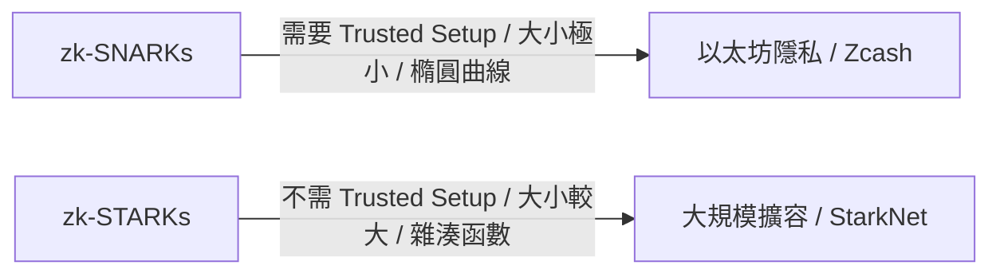

# 零知識證明（zk-SNARKs/zk-STARKs）的基礎：支撐 Web3 未來的密碼學技術

在現代數位社會中，隱私與安全一直是一對相互矛盾的難題。這是一種「為了證明自己的身份，必須公開個人資訊」的困境。然而，密碼學的重大突破——「零知識證明（Zero-Knowledge Proof: ZKP）」從根本上顛覆了這個範式。

本文將從零知識證明的直觀理解開始，深入探討 zk-SNARKs 與 zk-STARKs 等最尖端的數學機制，以及其在區塊鏈擴容（ZK-Rollup）與隱私保護上的應用。

## 1. 什麼是零知識證明？「阿里巴巴的洞穴」的比喻

零知識證明是一種密碼學方法，其定義為：「在不洩露除了『該命題為真』之外的任何資訊的情況下，證明某個命題是真實的」。

為直觀地理解這個艱澀的概念，我們來使用 Jean-Jacques Quisquater 等人構想的著名「阿里巴巴的洞穴（洞穴的比喻）」進行說明。

**故事:**
有一個環形的洞穴，最深處有一扇「魔法之門」。這扇門必須唸出秘密暗號才會打開。證明者 Peggy 知道暗號，並想向驗證者 Victor 證明「我知道暗號」。但是，Peggy 不想把暗號本身告訴 Victor。

**證明過程:**
1. 當 Victor 在洞穴外等待時，Peggy 進入洞穴，並走向右側或左側的通道。
2. Victor 走到洞穴入口，隨機發出指示：「從右邊出來」或「從左邊出來」。
3. 如果 Peggy 真的知道暗號，無論收到哪種指示，她都能在必要時打開魔法之門，並從指定的另一側出來。
4. 如果只進行 1 次，Peggy 可能只是碰巧在正確的一側（50% 的機率）。但是，如果重複這個過程 20 次，而 Peggy 全都答對了，她憑運氣連續成功的機率將是 1 / 2^20（約百萬分之一）。
5. 結果，Victor 將確信「Peggy 毫無疑問地知道暗號」，但他完全沒有得知暗號本身。

這就是零知識證明的基本原理。在數位世界中，這是透過高等數學（多項式、橢圓曲線密碼學等）來實現的。

## 2. zk-SNARKs 的數學機制

為了將零知識證明實際應用於區塊鏈與軟體中，最具代表性的實作便是 **zk-SNARKs (Zero-Knowledge Succinct Non-Interactive Argument of Knowledge)**。

SNARKs 的每個字母都有其重要含義。
- **Succinct（簡潔）**: 證明的大小非常小，且能在幾毫秒內完成驗證。
- **Non-Interactive（非互動式）**: 證明者與驗證者之間不需要（像阿里巴巴的洞穴那樣）進行多次往返溝通，只需一次資料傳輸即可完成。
- **Argument of Knowledge（知識的論證）**: 在運算複雜度上保證證明者確實擁有該資訊。

### 轉換為多項式 (Arithmetization)
zk-SNARKs 的第一步，是將想要證明的「運算程式」或「邏輯」轉換為數學上的「多項式（Polynomials）」。

程式的邏輯會被轉換為稱為 R1CS（Rank-1 Constraint System）的約束系統，接著再轉化為名為 QAP（Quadratic Arithmetic Program）形式的多項式問題。
利用「如果兩個多項式在許多點上都一致，那麼這兩個多項式幾乎可以肯定就是同一個」的 Schwartz-Zippel 引理（Schwartz-Zippel Lemma），將龐大的運算正確性，簡化為只需驗證少數幾個點即可瞬間確認。

### 密碼學承諾與橢圓曲線配對
為了證明運算結果，證明者會針對多項式的值建立「密碼學承諾」。這就像是「把東西放進箱子裡上鎖後再提交，以確保事後無法更改內容」。
在 zk-SNARKs 中，使用了稱為橢圓曲線配對（Elliptic Curve Pairing）的高階密碼學技術，在保持加密狀態下驗證多項式運算是否正確執行。這使得「在隱藏資訊的同時，證明運算的正確性」成為可能。

### Trusted Setup（可信的初始設定）
zk-SNARKs 最大的弱點，可以說是需要進行「Trusted Setup（可信的初始設定）」。
在啟動系統時，需要產生用於證明與驗證的密碼學參數，稱為「共同參考字串（CRS: Common Reference String）」。在這個產生過程中會使用到稱為「有毒廢棄物（Toxic Waste）」的秘密隨機資料，如果這些資料沒有被銷毀而遭到洩露，任何人都可以偽造證明（導致系統崩潰）。
因此，通常會透過稱為「Ceremony（儀式）」的多方安全運算（MPC）來進行，只要參與者中至少有一人誠實地銷毀了資料，系統的安全就能獲得保障。

## 3. zk-STARKs：透明性與可擴展性

為了解決 zk-SNARKs 的問題（需要 Trusted Setup 以及面對量子電腦的脆弱性）而開發出來的，就是 **zk-STARKs (Zero-Knowledge Scalable Transparent Argument of Knowledge)**。

### 透明性 (Transparent)
STARKs 最大的特徵在於「T (Transparent = 透明)」。STARKs 不使用橢圓曲線配對等複雜的密碼學技術，而是僅依賴具有抗碰撞性的雜湊函數。
因此，它完全不需要像 SNARKs 那樣的 Trusted Setup，系統從一開始就是以透明且安全的方式建構的。

### 抗量子性與可擴展性
由於僅依賴雜湊函數，STARKs 在理論上能夠抵抗未來量子電腦的攻擊（後量子密碼學）。
此外，STARKs 產生證明的時間通常優於 SNARKs，非常適合用於極大規模運算的證明。不過，其代價是證明的資料大小（數十至數百 KB）比起 SNARKs（數百 Bytes）要大得多。

## 4. Web3 中的應用：擴容與隱私

零知識證明被寄予厚望，被視為能同時解決區塊鏈面臨的兩大難題——「可擴展性」與「隱私」的魔法棒。

### 透過 ZK-Rollup 進行擴容
以太坊等公有鏈因為需要所有人驗證每一筆交易，存在著處理速度（TPS）緩慢且手續費（Gas 費）高昂的問題。
ZK-Rollup 會在主鏈（Layer 1）之外（Layer 2）將數千至數萬筆交易打包（Rollup）處理，並將「運算已正確執行的零知識證明（SNARK/STARK）」提交到主鏈上。
主鏈無需重新執行繁重的運算，只需花費幾毫秒驗證所提交的微小證明即可。這樣一來，就能在不犧牲安全性的情況下，大幅提升網路的處理能力。

### 交易的隱私保護
公有鏈會公開所有的交易紀錄，這對於企業或個人的使用來說是個巨大的障礙。
像 Zcash 這樣的加密資產，或是 Tornado Cash 這樣的協定，利用零知識證明將「發送者」、「接收者」和「金額」加密隱藏，同時向網路證明「確實擁有正確的代幣，且沒有雙重支付」，讓交易獲得批准。
此外，最近利用零知識證明的去中心化身分（zk-DID）技術也逐漸實用化，讓人們可以在不洩露出生年月日或護照資訊的情況下，證明自己「年滿 18 歲」或「擁有特定國籍」。

## 結論

零知識證明（zk-SNARKs/zk-STARKs）不僅僅是加密貨幣的專屬技術，更蘊藏著從根本上改變整個網際網路資訊處理方式的潛力。
「在保護隱私的同時證明信任」的特性，將成為 AI 時代中資料真偽判定、安全金融交易以及個人資訊的自主權身分管理（Self-Sovereign Identity）不可或缺的基礎設施。
這項宛如數學魔法的技術將如何重新定義社會的信任（Trust），其未來的發展令人拭目以待。
