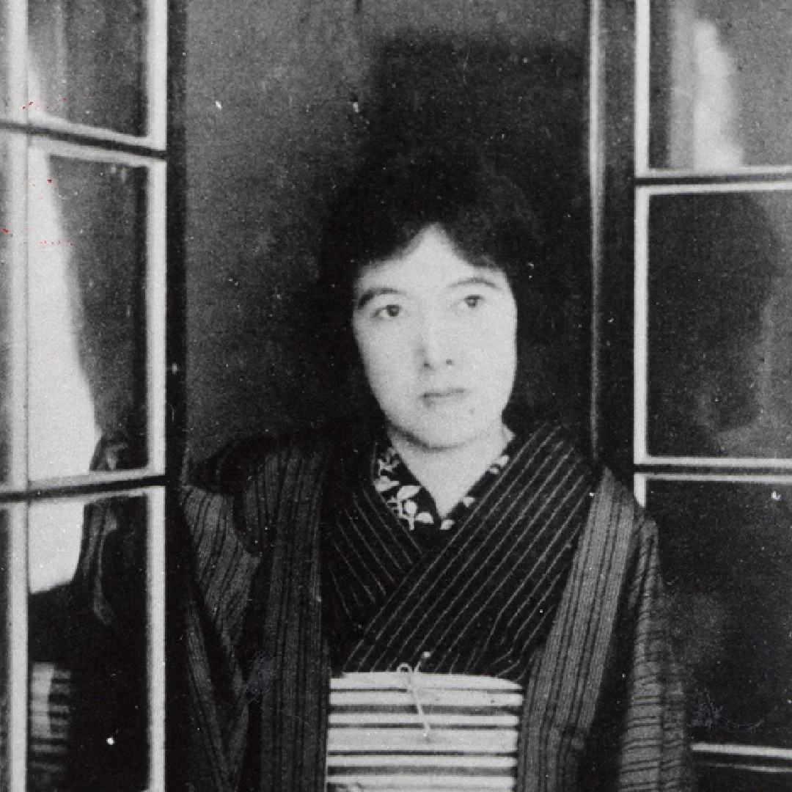

# Akiko Yosano

**"Thou Shalt Not Die"**
  
―― Grieving for my younger brother in the besieging army at Port Arthur
  
Ah, my brother, I weep for you,  
Thou shalt not die,  
Being the youngest born,  
You received the most of our parents' love.  
Did they place a blade in your hand  
And teach you to kill?  
Did they raise you to twenty-four  
Just to tell you to kill and die?  
  
As the master of an old and proud  
Merchant house in the town of Sakai,  
Since you are the one to inherit our parents' name,  
Thou shalt not die.  
Whether the fortress of Port Arthur falls,  
Or whether it does not, what does it matter?  
You surely know, such things  
Are not the way of a merchant's house.  
  
Thou shalt not die.  
The Emperor himself  
Does not go out to battle.  
To shed one another's blood,  
To die the death of beasts,  
And call such death human glory,  
With his great and deep heart,  
How could the Emperor possibly desire this?  
  
Ah, my brother, in battle  
Thou shalt not die.  
Our mother, who lost our father  
Last autumn,  
In the midst of her sorrow, pitifully  
Having her son summoned, she guards our home.  
Even in this great reign heard to be peaceful,  
Our mother's white hairs have grown.  
  
Weeping behind the shop curtains  
Is your fragile, young bride,  
Have you forgotten her, do you think of her?  
Parted before being together for even ten months,  
Think of the young girl's heart.  
In this world, with only you,  
Ah, whom else is she to rely upon?  
Thou shalt not die.
