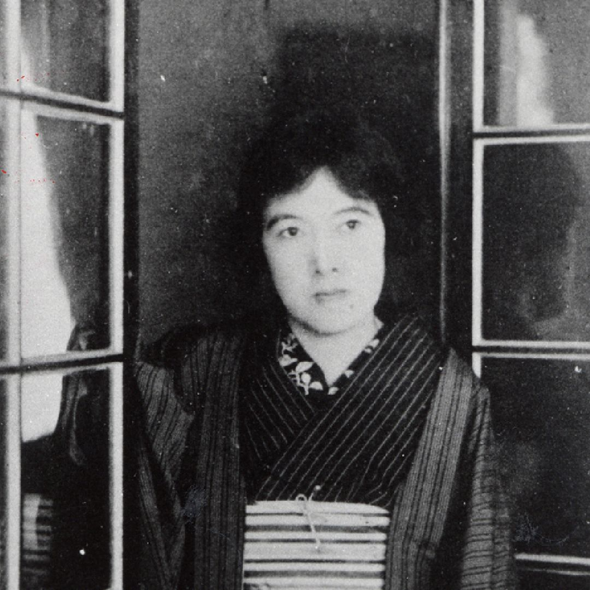

# अकिको योसानो

 ** "तुम मत मरना" ** 
  
―― पोर्ट आर्थर की घेराबंदी करने वाली सेना में अपने छोटे भाई के लिए विलाप  
  
आह, मेरे भाई, मैं तुम्हारे लिए रोती हूँ,  
तुम मत मरना,  
सबसे छोटे होने के नाते  
माता-पिता का प्यार तुम्हारे लिए सबसे बढ़कर था,  
क्या माता-पिता ने तुम्हें हथियार पकड़ना  
और लोगों को मारना सिखाया था?  
क्या उन्होंने तुम्हें चौबीस साल तक इसलिए पाला  
ताकि तुम लोगों को मारो और मर जाओ?  
  
सकाई शहर के व्यापारियों के  
एक पुराने घर के अभिमानी मुखिया के रूप में  
चूँकि तुम माता-पिता का नाम आगे बढ़ा रहे हो,  
तुम मत मरना,  
चाहे पोर्ट आर्थर का किला गिरे,  
या न गिरे, इससे क्या फर्क पड़ता है?  
शायद तुम नहीं जानते, लेकिन व्यापारियों के  
घर के नियमों में ऐसा कुछ नहीं है।  
  
तुम मत मरना,  
सम्राट स्वयं युद्ध में  
नहीं जाते हैं,  
लोगों को एक-दूसरे का खून बहाने,  
जानवरों के रास्ते पर मरने के लिए छोड़ना,  
और मरने को मनुष्य का गौरव मानना,  
चूँकि सम्राट का हृदय गहरा है,  
वे स्वाभाविक रूप से ऐसा कैसे सोच सकते हैं?  
  
आह, मेरे भाई, युद्ध में  
तुम मत मरना,  
हमारी माँ, जिन्होंने पिछले पतझड़ में  
हमारे पिता को खो दिया था,  
अपने दुख के बीच, दर्दनाक रूप से  
अपने बेटे को बुलाए जाने के बाद घर की रखवाली कर रही हैं,  
और इस शांति के महान युग में भी जिसके बारे में हम सुनते हैं,  
माँ के सफेद बाल और भी बढ़ गए हैं।  
  
पर्दे के पीछे लेटकर रोने वाली  
कमजोर, युवा नई पत्नी को,  
क्या तुम भूल गए हो? क्या तुम उसके बारे में सोचते हो?  
उस युवती के दिल के बारे में सोचो  
जो दस महीने साथ रहने से पहले ही अलग हो गई,  
इस दुनिया में तुम्हारे अलावा,  
आह, वह और किस पर भरोसा कर सकती है?  
तुम मत मरना।
